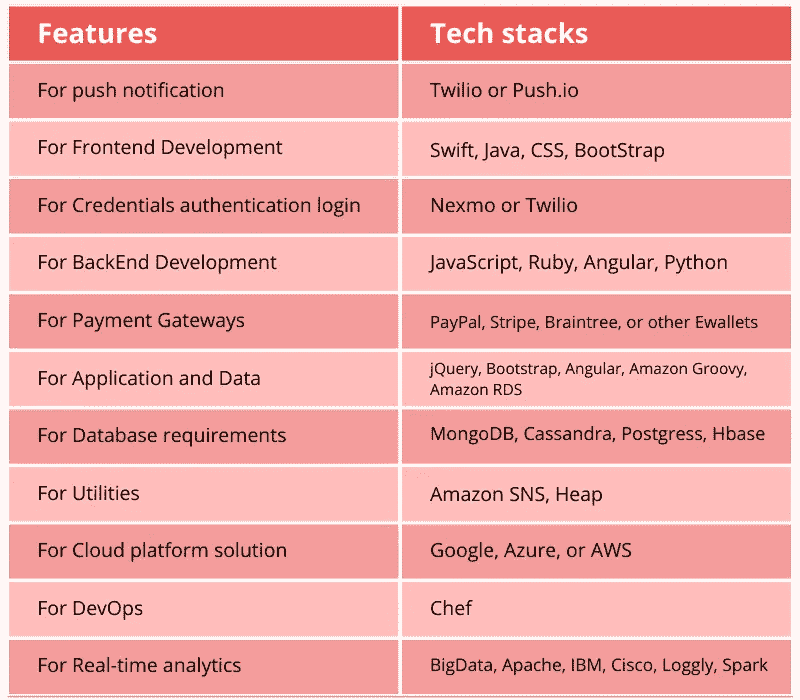

# 物流移动 App 开发有哪些不同的阶段？

> 原文：<https://javascript.plainenglish.io/which-are-the-different-stages-of-logistic-mobile-app-development-e635b48b29a0?source=collection_archive---------14----------------------->

## 解释物流移动应用程序开发不同阶段的简要指南。

以前，同时持续关注所有管理流程是极其困难的。例如，很难看到司机过去花了多少时间检查负载板，或者他们休息了多长时间。除此之外，跟踪没有装载任何货物的卡车也是一项挑战。由于物流行业的结构非常分散，包括多个部门，如仓库、车队和交付管理，类似的情况过去经常出现。

然而，随着智能手机应用的出现，一切都变得容易多了。这方面最著名的例子是交通应用程序的[优步。它改变了后勤常规任务，并在同时跟踪所有行动方面发挥了关键作用。如果你有获得物流应用程序的计划，你必须去物流应用程序开发服务获得更好的帮助。](https://www.peppyocean.com/uber-clone-app/)

# 物流移动应用开发优势

## 集成 GPS 技术

您可以使用 GPS 技术通知您的客户他们的货物何时到达。这也有助于管理人员随时监视他们的卡车。

## 消除文书工作

移动应用消除了人们过去非常忙碌的文书工作。纸上的一个小错误会导致严重的误解。物流应用消除了错误，或者至少降低了出错的几率。

## 提高客户满意度

它大大增强了客户体验，因为它预先确定了安排运输的成本和平均燃料成本。除此之外，还消除了空英里。

## 仓库管理变得简单

仓库管理应用程序中内置的信息和条形码扫描功能提高了库存和货物配送。

## 高效的车队管理

物流应用的另一个好处是高效的车队管理。报告和图表允许您跟踪车辆和驾驶员的详细信息。除此之外，使用移动应用程序计算油耗、优化路线和测量整体车队性能也变得很容易。

# 如何做一个物流 App？

移动应用程序的创建是一个快节奏的过程。不保证应用程序会成功，除非它已经通过了涵盖移动应用程序开发所有要素的计划开发阶段。让我们来讨论如何开发物流应用程序的关键阶段:

## **选择 App 类型**

物流应用程序因公司目标、要求、最终用户和功能而异，因为物流包含不同的领域，这些领域分为三个部分。此时，您必须选择您想要的应用程序类型。这可能是按需物流、车队物流或仓库物流。

*   按需应用:按需应用可能会帮助你的企业赚更多的钱。卡车通常不会满载，所以如果司机有一些额外的空间，司机将能够在路上装载一些额外的货物。
*   **车队**:车队物流应用的目标是车队所有者可以轻松跟踪他们车辆的信息，并保持车辆准时运行。它将帮助您跟踪、管理和存储有关您的卡车的信息。
*   **仓库应用**:当你拥有一个仓库时，你必须确保你的货物会准时到达那里。一个仓库应用程序可以让你轻松地检查细节和跟踪国内和国际货运，从而简化仓库管理。

## **设置目标受众**

为了确保你的物流应用在市场上取得成功，你需要采取的第一步是确定和定义目标受众。这也会帮助你理解为什么你的顾客会选择你的品牌而不是你的竞争对手。这是几乎每个移动应用程序开发过程中遵循的第一个阶段。

## **选择平台**

然后到了你必须为你的应用选择一个平台的阶段。根据你的目标受众选择合适的 app 平台非常重要。如果你想瞄准一个大的用户群，你可以用安卓，如果你想把你的应用作为应用内购买来运行，你应该用 iOS。这是因为，与 android 用户群相比，使用 iOS 设备的人愿意花更多的钱。最后，如果你想瞄准更多的人，你必须和他们两个一起去。

## **选择 App 的类型**

为移动设备设计的应用程序使用广泛的编程语言和框架。虽然 iOS 和 Android 是最知名的操作系统，因为它们在标准化软件专业人员可用的便携式应用程序开发类型方面做得很好。以下是一些可以在各种情况下使用的应用程序类型示例:

**·本地应用:-** 这些是使用软件开发工具和操作系统支持的方言为特定平台开发的应用。Android 依赖于 Eclipse 和 Java，而 iOS 使用 Xcode 和 Objective- C 来增强用户体验。由于能够充分利用设备的功能，原生应用通常是设计师的首选。

随着智能家居设备变得越来越普遍，设计师们正在创建非凡的程序，这些程序融入了可穿戴设备、物联网相关传感器和智能屏幕等技术，以实现个性化体验。平台升级需要花费大量的时间和金钱，这对于许多组织来说是行不通的。

*   **混合应用:** -这些应用需要在原生系统中创建一个容器，允许 HTML5 应用插入其中。这个应用程序可以利用每个本机系统的独特功能。考虑利用现有的应用程序，并在创建自己的应用程序之前彻底分析其功能。例如，你可以利用脸书和谷歌地图等网站上的移动定位营销，让访问者同时访问你的网站和你的实际位置。

## **找一家靠谱的 App 开发公司**

找一家经验丰富、声誉良好、符合你预算的移动应用开发公司。一旦你找到了合适的开发团队，你的那一半工作就完成了。许多开发企业提供全周期开发方法，将您的物流应用从概念发展到市场就绪状态。考察诸如 Clutch 或 GoodFirms、LinkedIn 和技术博客等平台，找出最优秀的开发人员。

一旦你选择了一个开发团队，解释你期望在最终产品中看到什么和最后期限。不要忘记签署一份保密协议(NDA ),因为这将使你的申请细节保密。

## **为你的物流软件创建一个最小可行产品(MVP)并部署它**

创建一个 MVP(最小可行产品)将是开发功能丰富的应用程序的第一步。MVP 可以是应用程序的虚拟蓝图，因为它描述了应用程序的功能和公司的想法。开发团队必须执行以下操作来创建 MVP:

**为应用程序的 MVP 开发制定计划** —根据规范，团队对应用程序的功能进行优先排序，并为 MVP 制定路线图。每个 MVP 用户故事都记录在项目路线图中，以及它的实现迭代。

**开始开发过程** —为了开始开发过程，团队开始在开发策略下将用户故事付诸实施。每个月，团队将进行一次演示，在迭代结束时展示应用程序的现成部分。

**在 marketplaces 上发布应用程序的最低可行产品(MVP)**—一旦你的物流应用程序的 MVP 完成，开发团队将运行最终演示，并将应用程序发布到 Apple Store 或 Google Play，以所选者为准。在这个阶段，您可以完全访问您的应用程序、数据库、应用程序代码和另一组与项目相关的文档。

## **营销**

最后，如果你要在这个竞争激烈的市场中生存，营销因素是最重要的。移动应用市场支撑着移动商务。今天，人们已经依赖于他们的手机，因此他们开始利用在线服务。手机已经成为人们生活中不可或缺的一部分。从预约医生到在家购物，移动应用正在彻底改变一切。移动应用正以这种方式促进移动电子商务，它们在提高公司增长机会方面发挥着关键作用。然而，为了达到预期的人口统计，应用程序必须有良好的营销。

# 物流手机 App 如何变现？

在规划应用开发阶段时，你必须考虑应用的盈利策略。因为如果一个应用不赚钱，那么它上市就没有意义。这里有一些货币化的选择供你考虑:-

**·佣金:**应用程序所有者可以向使用你的移动物流平台的司机收取一定的佣金。这是物流应用程序所有者遵循的最常见的盈利策略。

**广告:**除了佣金，你还可以用你的 app 展示第三方的广告。你可以将这一策略应用于使用你的应用程序免费版本的用户。然而，避免显示不必要的和众多的广告；这让消费者感到沮丧，而且他们有可能会停止使用你的应用。

**免费增值商业模式:**用户被这种盈利模式所吸引。因为基本功能是免费使用的，而客户必须为高级功能付费。

**·付费应用:**这种创收模式在市场上也非常有名。在这种模式下，用户可以根据这种货币化策略，为使用软件的终身许可支付一次性费用。

**付费增值模式:**如果你的软件非常有用，有很强的 USP，人们会为应用本身和可访问的额外功能付费。

# 开发一个物流 App 要多少钱？

有几个因素会影响物流应用程序开发的成本，包括:

## **平台选择**

一般来说，为单一平台开发的应用程序的成本要低于为多个平台开发的成本。这是因为所有平台都有不同的编码和不同的规则，这就是为什么应用程序开发公司必须与两个团队合作，为一个以上的平台开发应用程序。

## **App 开发地点**

根据您选择的国家，您的应用程序开发成本会有所不同。开发者的时薪根据你选择开发应用的国家而有所不同。例如，与亚洲国家相比，欧洲国家通常收取更高的应用程序开发费用。所以，记住你的预算，明智地选择国家。

## **特点&设计**

一个简单的设计和一套基本的功能将比一个复杂的高级功能应用程序花费更少。决定成本的最后一个因素是应用程序的复杂性。总的来说，如果你使用亚洲地区的[物流应用程序开发服务](https://www.peppyocean.com/logistics-transportation-app-development/)，一个具有最少功能的基本应用程序的价格大约在 8000 美元到 15000 美元之间。而具有复杂功能的应用程序价格约为 15000 美元至 30000 美元。这适用于 Android 和 iOS。

# 物流应用程序开发的技术堆栈

# 结论

由于物流应用程序提供的多种好处，未来许多类型的按需物流应用程序的出现将最终使物流行业蓬勃发展。现在可能是投资交通应用开发服务的最佳时机。从一个有信誉的物流应用开发公司雇佣一个忠诚的团队。我们很乐意帮助你。

*更多内容看* [***说白了就是***](https://plainenglish.io/) *。报名参加我们的* [***免费周报***](http://newsletter.plainenglish.io/) *。关注我们关于*[***Twitter***](https://twitter.com/inPlainEngHQ)*和*[***LinkedIn***](https://www.linkedin.com/company/inplainenglish/)*。加入我们的**[***社区不和谐***](https://discord.gg/GtDtUAvyhW) *。**