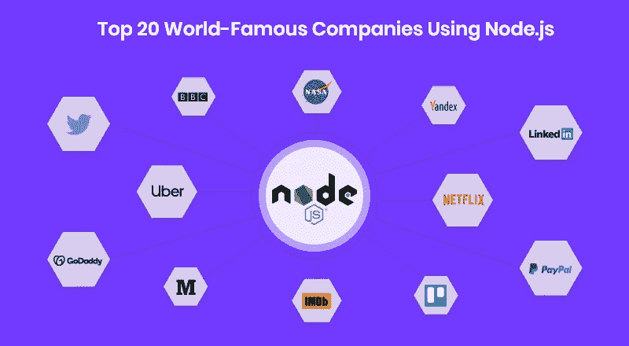

# 哪些大型科技公司使用 JavaScript，如何使用

> 原文：<https://javascript.plainenglish.io/which-big-tech-companies-use-javascript-and-how-5194a64cd0ab?source=collection_archive---------8----------------------->

根据 Stack Overflow 2021 开发者调查，如今，JavaScript 是世界上最受欢迎的编程语言。因此，相信有许多大公司使用这种语言来开发他们的基础设施并不是一件非常困难的事情。

在这篇文章中，我们将发现最重要的，以及他们如何使用 JavaScript。让我们开始…

Company

# 谷歌

当你想到一家大型科技公司时，你会想到谷歌。谷歌经常在其代码库中使用 JavaScript。即使不是最常用的，也有很多用 JavaScript 编写的服务和功能。比如 Google 文档界面是用 JavaScript 写的，也是 Gmail 的客户端。但这还不是全部。AngularJS 显然是用 JavaScript 写的(而 Angular2 是用 TypeScript 写的)。

然后，Google 也给了 JavaScript 一些东西:其实它开发了 V8 引擎，这是让 Node.js 在你自己的机器上正常工作的基础。如果没有谷歌，JavaScript 将是一种纯粹的浏览器语言，它的许多功能也不会存在。

# **梅塔(原脸书)**

脸书使用 JavaScript。尽管它的第一种主要语言是 PHP，但它在很短的时间内就被 JavaScript 打败了。现在，如果你想在禁用脚本的同时运行网站，它几乎是不可用的，而且图形也很糟糕。这是因为这种特定语言的代码库基础很强。因此，很难说脸书在这里或那里使用 JavaScript，因为几乎所有的可能性都是真的。

Meta 给了语言一些东西。它创建并维护 React，这是用于前端开发的最流行、最常用的 JavaScript 库。这个库在脸书、Instagram、WhatsApp 等网站上使用。但是，有成千上万的其他大型科技公司使用这套特殊的指令，使它非常受欢迎。

如果你有兴趣了解 Angular 和 React 的区别，可以看看这篇文章:[*https://JavaScript . plain English . io/React-vs-Angular-clash-of-the-frontend-giants-89289038 e5e 2*](/react-vs-angular-clash-of-the-frontend-giants-89289038e5e2)

# **微软**

这里是非 FAANG 公司。你可能知道，微软拥有 Edge，一个重要的浏览器。像每个浏览器一样，它需要以一种很好的方式与 JavaScript 集成，因此微软工程师已经做了大量的工作。

Edge 也有自己的引擎，用来运行微软 Node.js 版本。这个版本类似于 Google one，稍微慢一点，但是有很多开发者使用这项技术来开发物联网。事实上，通过将这项服务与 Azure 集成，物联网体验增强了很多。

# **网飞**

在其发展之初，网飞到处都在使用 Java，但是这种语言引起了很多问题，因为它的规模和开发时间相当长。因此，他们决定转向 JavaScript，更准确地说是 Node.js。事实上，Node 更轻便，开发速度也更快。所以，网飞提供的所有后台服务(确切地说，是它自己的服务)都是用 JavaScript 编写的。这对服务器来说也是一件好事，因为他们有更轻的工作要做，让整个系统更好、更容易地扩展。

# **PayPal**

它完全像网飞一样开始，使用 Java。但是，出于同样的原因，它移到了 Node。说实话，Paypal 是 Node 的早期采用者之一，几乎所有的后端都是用这种技术编写的。此外，它的前端是使用 JavaScript 构建的。

还有一种快捷的替代方式，叫做北海巨妖，由 Paypal 自己开发和维护。所以，你很容易理解，这家由埃隆·马斯克(Elon Musk)创立的公司是 JavaScript 的超级粉丝和上瘾用户。

# **优步**

如果有一家公司需要实时处理大量数据，那就是优步。他们需要检查实时驱动程序、检查运动、查看所有客户等等。因此，它需要一种易于扩展的语言。它在 Node 找到了它。此外，乘客的数据几乎很难用其他编程语言处理，但 Node 除外。因此，处理数据的简单性在这种语言的采用中发挥了重要作用，并且他的异步功能以最佳方式集成了整个生态系统。

# **沃尔玛**

最后但并非最不重要的是，这份名单上可能还有科技含量较低的公司。这是沃尔玛。但是这家公司可以在哪里使用 JavaScript 呢？显然对他们的网上商店和业务。像许多其他公司一样，他们从 Java 开始。但是，他们发现 Node 是开发在线服务的一种更方便的方式。现在，在线业务更加灵活，可伸缩，易于开发。所以，严格来说，非科技公司倾向于使用大量 JavaScript 来创建他们公司的科技部分。

# **其他重要公司**

还有其他公司在前端和后端开发中使用 JavaScript，所以这里有一些值得一提的地方:

*   商务化人际关系网
*   通过易趣网购买
*   Groupon
*   互联网电影资料库
*   美国国家航空航天局
*   推特
*   英国广播公司(British Broadcasting Corporation)
*   特雷罗

…等等。

# **结论**

本文分析了使用 JavaScript 最多的最重要的公司，但是没有很多公司完全不使用这种语言。其实不用它来实现前端很难，但是对于后端来说也是非常灵活强大的。因此，JavaScript 对于每个包含网站的堆栈和项目来说几乎是必不可少的。你能从中推断出什么？学习 JavaScript 肯定对每个人都非常有用。

感谢阅读。如果你对技术相关的文章感兴趣，请订阅。

如果你对其他 JavaScript 相关的文章感兴趣:
**Java VS JavaScript**:[*https://JavaScript . plain English . io/Java-VS-JavaScript-is-the-same-88 bbacd 03386*](/java-vs-javascript-are-they-the-same-88bbacd03386)

**Brendan Eich**:*[*https://JavaScript . plain English . io/Brendan-Eich-the-father-of-JavaScript-F5 baaae 43 a 60*](/brendan-eich-the-father-of-javascript-f5baaae43a60)*

***全栈 JavaScript**:[*https://JavaScript . plain English . io/is-JavaScript-suffith-to-make-yourself-a-Full stack-developer-c2ba 0 f1 E8 f 07*](/is-javascript-enough-to-make-yourself-a-fullstack-developer-c2ba0f1e8f07)*

***Python VS JavaScript**:[*https://JavaScript . plain English . io/Python-VS-JavaScript-e 8590d 346 c3b*](/python-vs-javascript-e8590d346c3b)*

**更多内容请看*[***plain English . io***](http://plainenglish.io/)*。报名参加我们的* [***免费每周简讯***](http://newsletter.plainenglish.io/) *。在我们的* [***社区***](https://discord.gg/GtDtUAvyhW) *获得独家获得写作机会和建议。**

## *进一步阅读*

* [## 2023 年科技公司将面临的 5 大组织挑战

### 人工智能/人工智能进步，知识共享和管理，供应链中断，处理远程团队，增加…

javascript.plainenglish.io](/5-organizational-challenges-tech-companies-will-face-in-2023-ef42e76c2030)*