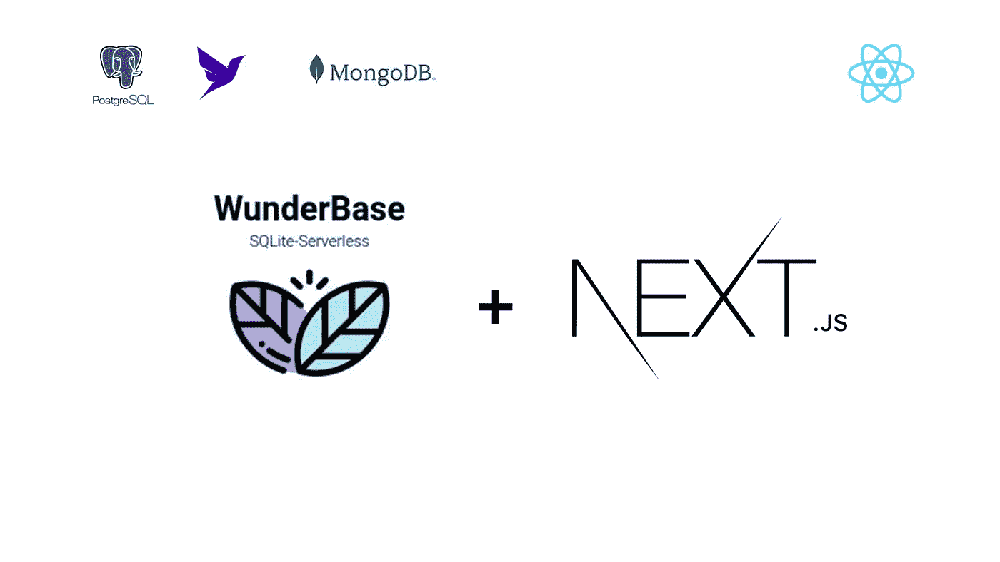

# 您的 Next.js 应用程序应该使用哪个数据库？

> 原文：<https://javascript.plainenglish.io/which-database-should-you-use-for-your-next-js-app-f667e63677ce?source=collection_archive---------0----------------------->

## *PostgreSQL，动物群，MongoDB，WunderBase。外面有很多选择。如何根据性能、价格、可伸缩性和开发人员体验选择合适的数据库。*

如果你打算在 2022 年开发一个全栈应用，那么选择流行的 Next.js 将会让你实现 95%的目标，并带来非常好的开发者体验。Next.js 混合了静态和服务器端的渲染，结果从好到好，并且您可以随时为 UI、auth 和任何其他您可能需要的东西添加第三方库。

但是你还没有完成。

即使是一个简单的 ToDo 应用程序也需要一个数据库来保存信息，为您的项目选择正确的数据库将取决于许多变量。简单地采用最流行的选择可能会降低你的应用程序的性能和增长。

那么应该选择哪个数据库呢？

尽我所能，我将按**划分一些选项，它们是什么**、**你如何**开始，以及——最重要的是——它是什么 ***实际上*** 喜欢作为脚踏实地的开发人员与他们一起工作。

# 1.一种数据库系统

## PostgreSQL 是什么？

啊，是的。网络开发世界的香草冰淇淋。

一个[免费和开源的](https://www.postgresql.org/)企业级关系数据库，自 1996 年问世，被广泛认为是世界上最可靠、性能最好的 RDBMS，支持 JSON(非关系)和 SQL(关系)数据。

## 我如何开始？

如果你已经拥有一台服务器，你也可以在那里运行 Postgres——几乎每台主机都从第一层开始提供 PostgreSQL。

## DevEx 怎么样？

我总是可以在几乎任何规格的盒子上运行 Postgres，而且设置起来也很简单。它在操作上是否复杂，是否有性能基础？你打赌。但是 footguns 不是 bug，如果事情真的变糟了，你很可能会在网上找到一些东西来帮助你回到正轨。Postgres 开源社区经验丰富、专注且充满激情。

## **发展需要了解的事情**

**优点**

*   高并发性能和巨大的特性集(您可以在任意 JSON 字段上进行连接…这意味着您对 REST API 数据的提取-转换-加载循环可以完全在数据库中完成！那辆有多酷？！)
*   如果您有 CRUD 应用程序之外的特定需求(例如递归查询、窗口函数、部分索引、可扩展数据类型)，没有更好的选择。
*   很棒的文档。

**缺点**

*   善于编写优化的查询来准确接收您需要的数据是至关重要的。
*   每个连接一个进程的架构意味着维护 TCP 连接将是昂贵的操作(尽管我使用了一个 [postgREST](https://github.com/PostgREST/postgrest) 服务器来创建 REST APIs)
*   像 EC2 这样的自助 Postgres 将很快变得过于昂贵。

# 无服务器数据库

## 什么是无服务器数据库？

如果像 PostgreSQL 这样的完整 RDBMS 势不可挡或成本过高，那么作为服务提供的托管无服务器数据库可能会符合您的要求。这些关系数据库将使您能够自动扩展以满足不断变化的需求，并保证正常运行时间+容错能力，而无需您使用任何服务器。**你带来的只是你的代码，你付出的只是你使用的东西。**

## 我如何开始？

**所有这些的操作方法**都是一样的。注册，选择一个计划(都有免费层)，提供一个数据库，获得连接字符串，你就可以开始了。

用那种方式；先说一些无服务器的数据库。

# 2.神童基地

## 什么是 Wunderbase？

老实说。满足您所有数据库需求的“简单模式”。这是 TL。博士:

*   免费开源的无服务器 SQLite(！)数据库，
*   …使用 Prisma ORM 进行使用模式的迁移，
*   …使用 GraphQL API(这样您就可以立即获得实时订阅)，
*   …在一个[飞行器](https://fly.io/docs/reference/machines/)(带 REST API 的鞭炮虚拟机)上运行，
*   …这一切都是在一个用 Golang 编写的优雅、轻量级代理的背后，该代理在收到网络请求时启动虚拟机(冷 lambda 启动时间为 300-500 毫秒),并在最后一个请求后 10 秒(可配置)自动关闭虚拟机。

## 我如何开始？

非常简单。部署一个 Docker 映像(从技术上讲，您甚至不需要自己构建它；把它[在这里](https://hub.docker.com/r/wundergraph/wunderbase)拿到一个 [fly.io](https://fly.io/) 机器上，附带一个卷，就大功告成了！在本地试用的说明是[这里是](https://github.com/wundergraph/wunderbase/)。

但是请记住:WunderBase 确实给了您一个 GraphQL API，但是将其公开可能会有安全/性能方面的问题。请改用 API 网关。(如前所述，来自同一个开发团队的 [Wundergraph](https://wundergraph.com/) 工作起来非常完美。)

## DevEx 怎么样？

首先，坦白说:我对使用 SQLite 进行全栈开发持怀疑态度。但是在尝试 WunderBase 和阅读 LiteStream 创作者 [@benbjohnson](https://twitter.com/benbjohnson) 的这篇文章之间，我已经改变了看法。大多数 web 应用程序都是读负载而不是写负载，SQLite——通过扩展，WunderBase——就像手套中的手一样适合这些应用程序，作为一个独立的、零配置的进程内 SQL“服务器”运行。

我发现 WunderBase 非常适合原型创意，或者(最后！)启动并运行个人周末项目(存储需要<1 GB; with low traffic). It’s quick and easy to set up both locally *和*用于生产。

然而，最让我兴奋的是 WunderBase 如何利用 Fly Machines + SQLite 作为唯一真正的“无服务器”数据库。几乎每一个无服务器关系数据库都有一个最低月成本，即使您从未使用过它…但是由于 SQLite 数据库实际上只是一个位于卷中的二进制文件， **WunderBase 可以通过在不服务请求时简单地关闭 Fly.io VM 来扩展到 0。成本总是一个因素，这样你就可以让 Wunderbase 支持的应用程序尽可能接近免费。**

## **发展中需要了解的事情**

**优点**

*   快速设置；专注于需要比写入多几个数量级的读取的用例。
*   运行在 fly.io 上的鞭炮虚拟机上，因此您可以处理无状态 HTTP，而不是维护 TCP 连接——可以将 WunderBase 支持的应用部署到世界各地的多个 [edge](https://www.netlify.com/blog/edge-functions-explained/) 位置，延迟为< 100 毫秒。
*   可以真正扩展到零——fly . io 定价意味着如果您不使用它，您无需支付任何费用。
*   原生 GraphQL API。
*   Wunderbase 使用 Prisma 作为 ORM，所以您可以通过编辑 prisma.schema 文件将 SQLite 替换为任何其他关系数据库。

**缺点**

*   SQLite 的单写多读模型对于有多个用户交互和执行更改的 web 应用程序来说并不理想。
*   如果您的需求涉及大量数据或高流量，将不再便宜。
*   目前还没有现成的备份，但你可以随时使用 [LiteStream](https://litestream.io/) 将 SQLite 更改传输到 AWS S3、Azure Blob 存储、谷歌云存储、SFTP 或 NFS。

# 3.行星尺度

[PlanetScale](https://planetscale.com/) 是一个使用 MySQL 的关系数据库，久经考验的 Vitess (YouTube 使用它通过分片来扩展)，以及一种叫做[数据库分支](https://docs.planetscale.com/concepts/branching)的创新技术——将 Git 风格的分支和合并引入模式迁移。不要为 MySQL 和 PostgreSQL 的争论而烦恼:任何一个都很适合你。

## DevEx 怎么样？

作为一名开发者，PlanetScale 的黑仔特色显然是分支。如果我能像对待代码一样对待我的数据库；改变它，创建特性/测试分支，像我做代码一样进行推广，你引起了我的注意。它一开始会让你有点头疼，但是如果你曾经使用过 Git 工作流，你会很快感觉如鱼得水。

然而，外键约束的缺乏是令人惊讶的和限制性的，即使他们确实有指南来绕过它。更大的问题是只有 TCP 连接，由于 PlanetScale 是 MySQL，我也不能使用 postgREST 来生成 RESTful APIs。那是令人失望的。

## **发展须知**

**优点**

*   非常有表现力，非常有弹性。我可以专注于我的应用程序代码，忘记缩放。
*   有了分支机制，对我的模式进行版本控制就像我对代码进行版本控制一样直观。

**缺点**

*   没有外键。像，*一点都不像。*
*   仅 TCP 连接，因此无法从 Cloudflare Workers/Vercel Edge 平台使用。
*   超出有限免费层的最低月价格，即使您从未进行任何读/写操作。

# 4.动物群

[Fauna](https://fauna.com/) 是一个分布式[文档关系数据库](https://docs.fauna.com/fauna/current/learn/introduction/document_relational)，旨在提供 SQL(关系建模)和 NoSQL(灵活性、速度)世界的精华。它提供了开箱即用的 GraphQL 和专有的查询语言(FQL ),可以一次性完成复杂的条件事务/读取。

## DevEx 怎么样？

FQL 本身(作为特定语言的 DSL)让我想起了 RethinkDB(我曾经很喜欢它，RIP 🖤)，但我发现关于 fauna 最有趣的事实是它是一个地理上分布的数据库*——我可以自动分区并将我的数据分布到多个地区，这意味着我的数据将像我的应用程序一样接近我的用户——这使它**成为适合 Vercel 和 Netlify 的无服务器/边缘时代**的一只手。*

总的来说，使用起来非常有趣，但是从仍然编写查询的人的角度来看，我会再三考虑是否将它集成到任何非绿地项目中，因为它不使用任何标准 SQL。

## **发展须知**

首先:虽然 Fauna 确实给了你一个原生的 GraphQL API，但是从性能/安全性的角度来看，让它面向客户端可能不是一个好主意。请改用 API 网关。(类似于 [Wundergraph](https://wundergraph.com/) 的东西很适合这个，并且可以很好地与任何 RDBMS、PlanetScale、Fauna、MongoDB 和 [more](https://docs.wundergraph.com/docs/supported-data-sources) 配对。)

**优点**

*   原生的 GraphQL API 意味着如果你是一个 JAMStack 开发者，那么动物群是很棒的，因为许多 SSG 使用 GraphQL 作为它们的数据层(Gatsby，RedwoodJS)
*   分布式数据库+针对 Vercel 和 Netlify 的本地集成使 Fauna 成为无服务器/边缘时代的数据库*快乐之路*。

**缺点**

*   如果您的项目已经使用 SQL，集成可能会很困难，因为 Fauna 使用专有的查询语言 FQL(带有 GraphQL 选项)来代替。如果您使用 WunderGraph，这是一个解决的问题——因为它可以将所有数据源整合到一个虚拟图形层中，然后您可以通过一个安全的、类型安全的 JSON-over-RPC API 访问客户端。
*   同样，免费层之外的最低月价格。

# 5.SupaBase

[SupaBase](https://supabase.com/) 旨在成为“开源 Firebase 替代方案”，是一整套开发工具——Postgres 作为数据存储库，postgREST 在后台用于 RESTful APIs，GoTrue(来自 Netlify)用于 Auth，一个开源[服务器](https://github.com/supabase/realtime)用于通过 websockets 进行实时更新，一个 S3 兼容的[对象存储](https://github.com/supabase/storage-api)，以及通过 Deno 服务器提供的 edge 功能——所有这些都在一个统一的仪表板式体验中呈现给你。

## DevEx 怎么样？

作为 Firebase 的替代方案，它工作得很好，尽管功能奇偶性有点差，而且 Firebase 和 SupaBase 数据之间没有交叉兼容性。原生 REST API 对我非常有用，因为我托管了我在 Vercel/Netlify 上构建的大部分内容。

不幸的是，类型安全是 JS 客户机的一个问题；从架构生成类型需要第三方 CLI 工具。在原生 typegen 之前，我建议将它与 Prisma + tRPC 一起使用，以实现端到端的类型安全。

## **发展需要了解的事情**

**优点**

*   除了数据库之外还有很多功能。
*   提供了一个使用 postgREST 的 RESTful API，如果你想从无服务器/云函数中使用 SupaBase 的话非常有用。
*   可以自行托管—目前有些困难(文档不清楚)。

**缺点**

*   类型安全是一个问题。(未来的 v2 客户端可能会更好)
*   同样，每月最低定价超出了有限的免费层。

# 6.MongoDB

## 什么是 MongoDB？

大多数人事实上的 NoSQL 选择——MERN 堆栈是大多数人开始 web 开发的方式。无处不在的 M — [MongoDB](https://www.mongodb.com/) —是一个跨平台、源代码可用的*数据库，它将其数据保存为(本质上)JSON 文档，而不是相互关联的表。

## 我如何开始？

在 VPS 上自我托管，或者选择他们管理的 [MongoDB Atlas](https://www.mongodb.com/atlas/database) 选项。

## DevEx 怎么样？

我使用 MongoDB 已经有几年了，它*实际上*比关系数据库更快，如果(且仅当)你知道你的数据总是可以被表示为 CSV 文件，并且你需要的只是额外的特性——比如理论上无限扩展的能力。

它还很好地集成了 Javascript 和 JSON——web 开发人员的必备工具。个人喜好，但是我发现语法，比如— db.collection()。find({}) —非常适合在测试时在 IDE 和 Shell 之间复制粘贴。我甚至不需要用猫鼬。

## **发展中需要了解的事情**

**优点**

*   当您将它用于预期目的时，它是完美的选择—作为非关系数据的文档存储。
*   它有一个活跃的社区，大量的教程和资源，如果你需要的话，甚至还有一个 ORM([mongose](https://mongoosejs.com/docs/))。
*   管理选项 Atlas 有一个按操作付费的无服务器计划，所以如果你不使用它，你可以扩展到零，永远不用支付任何费用。
*   即时可用的实时更新、日志记录和自动化。

**缺点**

*   不是亲属关系。
*   Atlas 在某些区域可能会变慢。
*   不是真正的开源；除了私人的非商业用途，你必须完全发布你的源代码——包括你使用的其他服务的代码，这可能会使它失败。

# 7.redis/工人 KV

## 什么是 Redis 和 Workers KV？

这些是特殊的数据库，虽然很小，但存储速度惊人，只能存储键/值数据。本质上:网络连接的非常大的哈希表，其额外的优点是它们可以完全存在于内存中(但是如果需要的话，可以保存到连接的卷中)。

## 我如何开始？

对于 Cloudflare 工作人员 KV，[在这里报名](https://www.cloudflare.com/products/workers-kv/)。对于 Redis，你的选择包括 DigitalOcean/Vultr/Upstash 的托管 Redis 即服务，或者只是将官方的 [Redis docker 镜像](https://hub.docker.com/_/redis)放在 VPS 上，自己托管。

## DevEx 怎么样？

非常适合将低延迟放在首位的特定用例。如果您的数据可以用 1:1 数据映射的哈希表来表示(例如，userID 到社交媒体配置文件 URL)，请使用它们。如果有，恭喜你！**现在你的查找变成了 O(log(n))甚至 O(1)运算而不是 O(N)。**那是*的野生*。

想快速知道 Bob 有没有跟着 Alice？想在你的网站上保留一个最新帖子的列表，而不是每次都从 API/RSS 提要中查询吗？想要在 Paypal/Stripe 的 IPN 确认到来之前，将您的电子商务网站的订单作为 customerID → itemID 映射来保存吗？

这些高性能+低延迟的关键价值商店(尤其是在边缘位置提供 it 即服务的供应商)非常适合您的需求。

## **发展须知**

由于 K/V 商店非常简单，所以这里将跳过利弊，但这里有一个常见的问题:如果您正在使用托管 Redis 即服务，首先要确保它们与您将需要的 Redis API 部分兼容(例如，许多提供商还不支持 Geo core)。

# 结论

阅读本文有望帮助您克服决策疲劳，因为您认识到问题不在于“哪个数据库是最好的？”如是“哪个数据库能解决 ***这个具体问题我有*** 最好？”。

考虑到这种方法，下面是概要:

*   **“我需要快速、简单且经济高效的产品，可以扩展到> 1 *和*0】**→Wunderbase。
*   **“我需要模拟真实世界的数据。”你需要一个关系数据库。使用 planet scale/fantasy/SupaBase，或者如果你已经有了专业知识/资源，就主持 Postgres。**
*   **“我需要实时更新。”** → WunderBase(通过 GraphQL 订阅)、SupaBase、Fauna(通过事件流)、MongoDB 都提供这个。如果只需要键值对，Redis 内置了 pub/sub。
*   **“低延迟对我的使用案例至关重要。”** →像 [Upstash](https://upstash.com/) (Redis)或 Cloudflare Workers KV 等提供在边缘的 KV 商店。
*   “我在 GraphQL 上投入了大量资金。” →动物群或 WunderBase —最好使用使用 WunderGraph 的 API 网关，而不是公开公共 GraphQL 端点。

*发表代表* [*普里什蒂纳*](https://medium.com/u/b795eb6620e2?source=post_page-----f667e63677ce--------------------------------) *。*

## 进一步阅读

 [## 使用 Next.js 13 的前沿特性获取数据——入门

### NextJS 13 中的数据获取使用了应用程序目录、流、暂挂以及混合服务器和客户端组件。

javascript.plainenglish.io](/data-fetching-with-next-js-13s-bleeding-edge-features-a-primer-a60ddd3f7570)