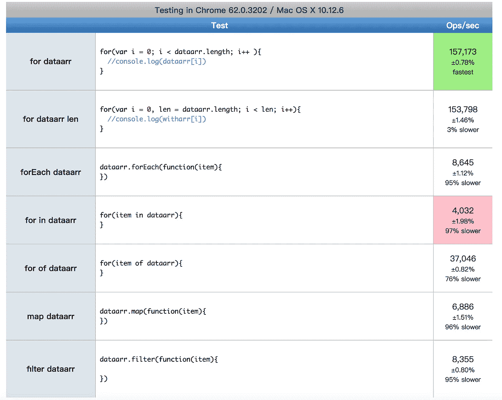

# JavaScript 中哪个循环遍历最快？

> 原文：<https://javascript.plainenglish.io/which-loop-traversal-is-the-fastest-in-javascript-c196311337d6?source=collection_archive---------3----------------------->

## JavaScript 数组遍历方法的比较


# 介绍

到目前为止，JavaScript 已经开发了多种数组循环遍历方法。在这些场景中使用不同的循环方法。今天他们将被比较。

# for 语句

代码:

```
var arr = [1,2,4,6]
for(var i = 0, len = arr.length; i < len; i++){
 console.log(arr[i])
}
```

这是循环的标准，也是最传统的说法。也支持字符串。定义一个变量`i`作为索引来跟踪访问的位置。`len`是数组的长度，条件是`i`不能超过`len`。

# forEach 语句

`forEach`为数组的每个元素执行一次回调函数。`forEach`是一个数组方法，可以用来对数组中的每个元素应用一个函数。`forEach`仅对数组执行每个数组元素的回调函数。遍历数组，让数组中的每个元素做一件事。已删除的项目(使用删除方法等。)或未初始化的会被跳过(但不包括那些值未定义的)(比如上面稀疏数组中)；与 map()或 reduce()不同，它总是返回 undefined，并且不能被链接。一个典型的用例是在一个链的末端执行副作用。

代码:

```
var arr = [1,5,8,9]
arr.forEach(function(item) {
 console.log(item);
})
```

# for-in 语句

一般用`for-in`来遍历对象的属性，但是属性需要可枚举才可以读取。

`for-in` 循环只遍历可枚举的属性。一般用来遍历对象，包括非整数类型的名字，原型链上继承的属性也可以遍历。

代码:

```
var obj = {
 name: ‘test’,
 color: ‘red’,
 day: ‘sunday’,
 number: 5
}
for (var key in obj) {
 console.log(obj[key])
}
```

# for-of 语句(ES 6)

`for-of`在可迭代对象(包括数组、映射、集合、字符串、类型数组、参数对象等)上创建迭代循环。)，调用自定义迭代挂钩，并针对每个不同属性的值执行该语句。只要是可迭代对象，就可以用`for-of`迭代。

## 代码:

```
var arr = [{name:’bb’},5,’test’]
for (item of arr) {
 console.log(item)
}
```

# for-of 和 for-in 的区别

`for-in`按照原始插入顺序遍历对象的可枚举属性。`for-in`将遍历继承链的对象属性，因此将花费更多时间。

`for-`只是迭代 iterable 对象的数据。

# 比较遍历速度

我用了`jsPerf`来对比。

我创建了两个数组进行比较，不同类型的数组在 javascript 内存中存储的地址格式不同，编辑器在遍历时会根据数组元素的类型和长度进行计算，比如数组全是数字，会比包含数字、字符串、对象混合类型的数组快，所以创建了两个数组，一个是全未定义数组，一个是混合类型数组。

```
// an empty array
var nullarr = new Array(10000) // [undefined,undefined,…undefined]// different type in array
var dataarr = []
for(var i = 0; i < 10000; i++){
 if (i % 2 ===0) {
 dataarr[i] = i.toString()
 } else {
 dataarr[i = i
 }
}
dataarr // [1,’2',3…,10000]
```

测试后发现有点奇怪，直接检索空数组还是比数据数组慢。这有什么奇怪的？为了比较循环的一致性，我只选择有数据的数组`dataarr`进行测试。

然后我们比较一下`for` `for len` `forEach` `for-in` `for-of`的速度



可以看出`for`循环的速度最快，是最老的循环，也是优化最好的，其次是`for-of`，这是 es6 中的新循环。非常好用，最慢的是 for-in。我们可以按速度排序

`for`> `for-of`>`forEach`>`filter`>`for-in`

这显然是处理大量循环数据时使用古`for`循环的最佳效率，但并不是说不使用`for-in`。其实很多情况下，根据实际场景，`for-in`更多的是用于遍历对象属性，`for-in`在遍历过程中也会遍历继承链，所以这也是它比较慢的原因，比如 map 在性能上比较慢，但是处理在 ES6 中非常容易使用实现数组功能，很容易影射新数组的创建。或者比如用迭代器属性也可以，这样每个循环都有用武之地。

# 最后

**感谢阅读。**期待期待您的关注和阅读更多高质量的文章。

[](https://levelup.gitconnected.com/the-story-of-clip-path-and-endangered-animals-in-css-8af987927fc6) [## CSS 中剪辑路径和濒危动物的故事

### 使用 CSS 剪辑路径创建奇妙的动画

levelup.gitconnected.com](https://levelup.gitconnected.com/the-story-of-clip-path-and-endangered-animals-in-css-8af987927fc6) [](/regexp-is-hard-to-write-easy-to-use-2cd94236e48d) [## 正则表达式很难写，很容易使用

### 10 个有用的正则表达式。

javascript.plainenglish.io](/regexp-is-hard-to-write-easy-to-use-2cd94236e48d) 

*更多内容请看*[***plain English . io***](https://plainenglish.io/)*。报名参加我们的* [***免费周报***](http://newsletter.plainenglish.io/) *。关注我们关于*[***Twitter***](https://twitter.com/inPlainEngHQ)*和*[***LinkedIn***](https://www.linkedin.com/company/inplainenglish/)*。查看我们的* [***社区不和谐***](https://discord.gg/GtDtUAvyhW) *加入我们的* [***人才集体***](https://inplainenglish.pallet.com/talent/welcome) *。*