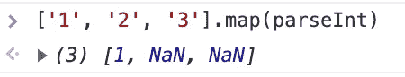
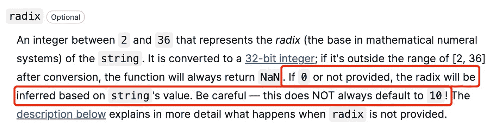
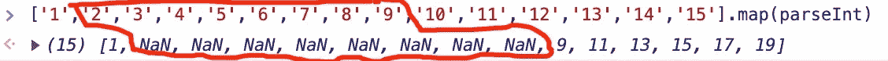
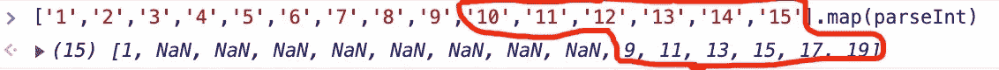
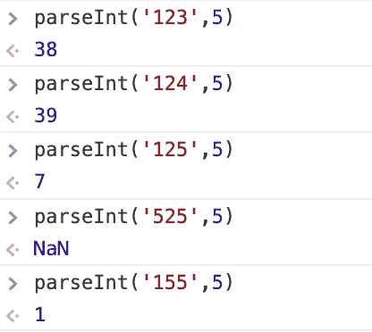

# 为什么['1 '，' 2 '，' 3']。map(parseInt)返回[1，NaN，NaN]？

> 原文：<https://javascript.plainenglish.io/why-1-2-3-map-parseint-returns-1-nan-nan-67202bb472be?source=collection_archive---------2----------------------->


# 问题

```
 ['1', '2', '3'].map(parseInt)
```

产量是多少？可能有人会想出答案:**【1，2，3】**，其实是个错误答案。让我们在控制台打印输出下查看正确答案:



它其实是:`[1, NaN, NaN],`有些人很好奇为什么它输出的是`[1, NaN, NaN]`而不是`[1, 2, 3]`。

# 让我们来看看这个问题

```
['1', '2', '3'].map(parseInt)
```

你可能对`map(parseInt)`有很多疑问，为什么要这样编码？实际上，这是速记，完整的代码如下

```
['1', '2', '3'].map((v, i, arr) => parseInt(v, i))
```

`map():`它是一个回调函数，有三个参数:当前值`(v)`，下标`(i)`，原数组`(arr)`。执行顺序:`[‘1’, ‘2’, ‘3’].map((v, i, arr) => parseInt(v, i))`，按顺序输出

*   `parseInt('1', 0) // 1`
*   `parseInt('2', 1) // NaN`
*   `parseInt('3', 2) // NaN`

所以问题来了`pareInt`，为什么会产生这些答案？

# **parseInt**

有人疑惑为什么第一个输出是`1`，第二第三个是`NaN`，那就正式进入今天的话题吧。

## parseInt 是什么？

> `parseInt()`函数解析字符串参数并返回指定[基数](https://en.wikipedia.org/wiki/Radix)(数学数字系统中的基数)的整数。
> 
> 基数:介于`2`和`36`之间的整数，代表`string`的*基数*(数学数系中的基数)
> 
> 链接:[developer.mozilla.org](https://developer.mozilla.org/en-US/docs/Web/JavaScript/Reference/Global_Objects/parseInt)

所以第二个参数`parseInt`是数学数制，但它也表示系统中 2 到 36 之间的数。

**为什么** `**parseInt(‘1’, 0)**` **等于 1？**

`parseInt`上 MDN 截图



所以 0 会算作十进制，所以`parseInt(‘1’, 0)`等于 1

**为什么** `**parseInt(‘2’, 1)**` **等于南？**

parseInt 的第一个参数字符串小于第二个参数 radix

**为什么** `**parseInt(‘3’, 2)**` **等于南？**

原因同上。

# 关于 parseInt 的更多信息

根据推论，我们给数组添加更多的字符串，我们来看看:



数组`‘2’,…’9`之间对应的下标值是`1~8`，第一个参数大于第二个，所以都是`NaN`



那为什么在第一个参数为‘10’，系统为 9 的情况下，`parseInt(‘10’, 9)`输出的是`9`而不是 NaN。

根据前面对系统的描述，9 系统代表的实数在 0 到 8 之间。第一个参数不管传入的是字符串还是数字都将被逐个解析成字符串，所以`‘1’`和`‘0’`在 9 系统中属于 0 到 8 的实数。

计算如下:

```
parseInt('10', 9) = 0 * Math.pow(9, 0) + 1 * Math.pow(9, 1) = 9
parseInt('11', 10) = 1* Math.pow(10, 0) + 1 * Math.pow(10, 1) = 11
parseInt('12', 11) = 2* Math.pow(11, 0) + 1* Math.pow(11, 1) = 13
parseInt('13', 12) = 3* Math.pow(12, 0) + 1* Math.pow(12, 1) = 15
parseInt('14', 13) = 4* Math.pow(13, 0) + 1* Math.pow(13, 1) = 17
parseInt('15', 14) = 5* Math.pow(14, 0) + 1* Math.pow(14, 1) = 19
```

让我们再多尝试几次，

```
parseInt('4123', 5); // 538
4*Math.pow(5, 3) + 1*Math.pow(5, 2) + 2*Math.pow(5, 1) + 3*Math.pow(5, 0) // 538

parseInt('764', 8); // 500
7*Math.pow(8, 2) + 6*Math.pow(8, 1) + 4*Math.pow(8, 0); // 500
```

# 关于 parseInt 的更多信息

`parseInt`第一个参数串的实数一定要小于系统号吗？



1.  前两个解析是正常的。为什么第三个`parseInt(‘125’, 5) = 7`的输出。我发现它自动删除了最后一个`5`，输出其实是`parseInt(‘12’, 5)`，所以输出等于`7`。
2.  为什么第四个输出是`NaN`，因为参数串以`5`开头，不符合系统所属的编号，所以直接返回`NaN`。
3.  最后一个直接删除`55`，最后解析成`parseInt(‘1’, 5)`，输出`1`。

# 结论

1.  如果第一个参数串的第一个值大于或等于第二个参数基数，则直接返回`NaN`
2.  如果第一个参数字符串的第一个值满足条件，而其他值不满足条件，那么不满足条件的值最后会被忽略，然后进行计算。

# **额外锻炼**

```
//what's the output of two line code
['10', '10', '10', '10'].map(parseInt); 
['1', '2', '3'].map(Number)
```

# 最后

**感谢阅读。**期待期待您的关注和阅读更多高质量的文章。

[](/which-loop-traversal-is-the-fastest-in-javascript-c196311337d6) [## JavaScript 中哪个循环遍历最快？

### JavaScript 数组遍历方法的比较

javascript.plainenglish.io](/which-loop-traversal-is-the-fastest-in-javascript-c196311337d6) [](/interviewer-how-to-modify-the-original-array-in-foreach-fd36a08c6ce1) [## 面试官:如何在 forEach()中修改原数组

### foreach 的使用提示

javascript.plainenglish.io](/interviewer-how-to-modify-the-original-array-in-foreach-fd36a08c6ce1) [](https://levelup.gitconnected.com/the-story-of-clip-path-and-endangered-animals-in-css-8af987927fc6) [## CSS 中剪辑路径和濒危动物的故事

### 使用 CSS 剪辑路径创建奇妙的动画

levelup.gitconnected.com](https://levelup.gitconnected.com/the-story-of-clip-path-and-endangered-animals-in-css-8af987927fc6) 

*更多内容看* [***说白了就是***](https://plainenglish.io/) *。报名参加我们的* [***免费周报***](http://newsletter.plainenglish.io/) *。关注我们关于* [***推特***](https://twitter.com/inPlainEngHQ) ， [***领英***](https://www.linkedin.com/company/inplainenglish/) *，*[***YouTube***](https://www.youtube.com/channel/UCtipWUghju290NWcn8jhyAw)*，以及* [***不和***](https://discord.gg/GtDtUAvyhW) *。对增长黑客感兴趣？检查* [***电路***](https://circuit.ooo/) *。*