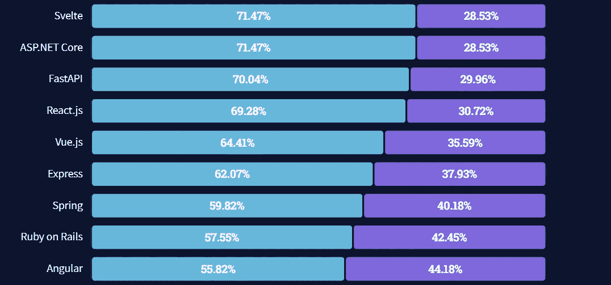
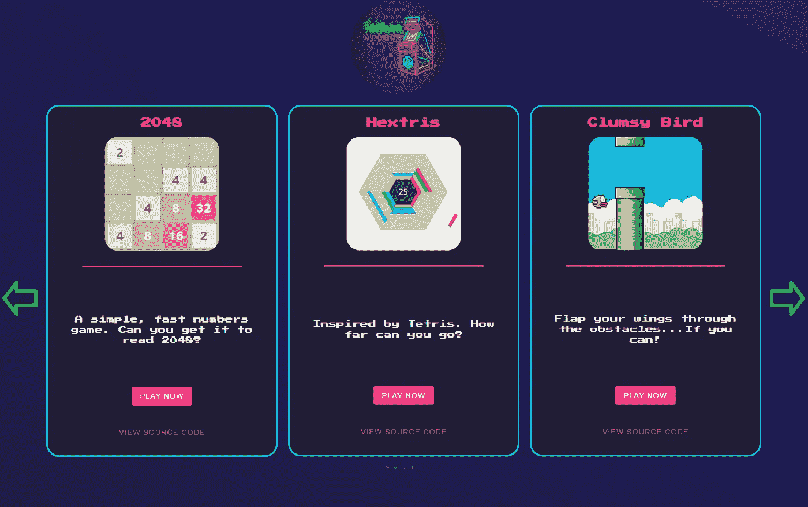
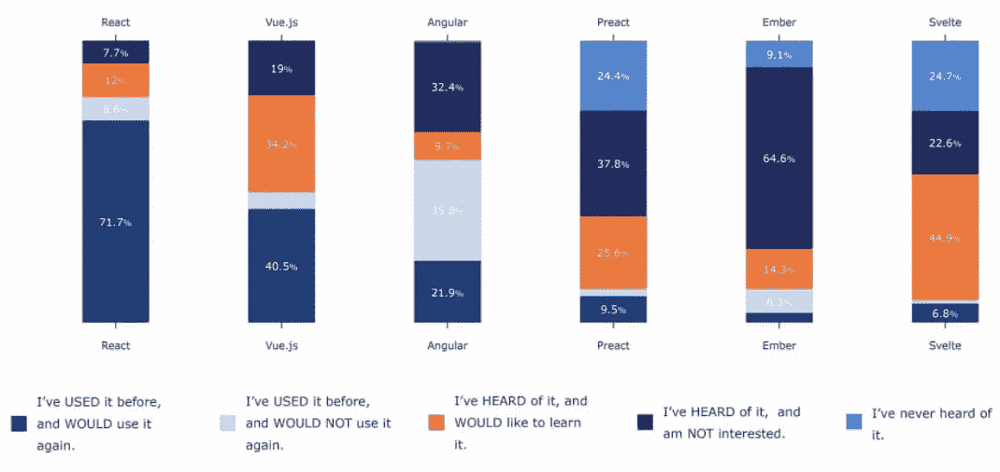

# 为什么一个 React 开发者使用 Svelte 来构建他的在线游戏

> 原文：<https://javascript.plainenglish.io/why-a-react-developer-used-svelte-to-build-his-online-arcade-8b2f69732c1a?source=collection_archive---------16----------------------->

如果你建立网站，你可能有一个喜欢的 JavaScript 框架。

这并不奇怪。一旦你学会了一个特定的框架(或者库，对于 React 来说)，你就知道它的来龙去脉。你学会了如何高效地完成工作。你学会了解决问题的技巧和诀窍。

当然，前端工程师杰克·佩尼亚勒就是这种情况。

现在，当谈到框架时，他可能有点像“万金油”，但是 Jack 也有一个最爱，那就是 React。他[构建的大部分都是用 React](https://www.fathym.com/react) 构建的。然而，这一次我们要求他稍微走出他的舒适区，用苗条来创造一个街机。

但首先，是什么让 React 如此伟大？

React 被认为是世界上最流行的 JavaScript 框架(或库)之一。它自 2011 年以来一直存在，最初由脸书创建，并被网飞、Ubereats 和 AirBnB 等其他大型公司使用。它是最常用的框架，这意味着它还有一个巨大的资源社区。

根据 stack overflow 2021 年的调查，React 是第四大最受欢迎的 JavaScript 框架。就在去年还受到 69.28%用户的喜爱。

然而有趣的是，现场出现了一个穿着苗条的新人[。](https://www.fathym.com/svelte-deployment)

Svelte 于 2016 年由 Rich Harris 发布，并被苹果、Square、Spotify 等一大批大型公司采用。根据 Stackoverflow 的调查，Svelte 现在是最受欢迎的框架[。其实 71.47%的开发者都爱用。](https://www.fathym.com/blog/articles/2022/april/2022-04-13-micro-frontend-popularity)

使 Svelte 和 React 相似的是他们可以建立的精彩互动、令人眼花缭乱的网站。但需要注意的是，使用 Svelte 时，平均应用大小仅为 1.6Kb，而最小的 React 应用大小为 42.2Kb，与 ReactDOM 相同。

简单来说，这意味着什么？

苗条是我们认为的“轻量级”，它帮助使用它的网站运行得非常快。在 React 网站表现强劲的地方，苗条的网站是进入“伟大”类别的又一步。

他使用 Svelte 的原因之一是因为它的高性能能力，如上所述。他想要一个轻量级的选项，可以轻松地在浏览器中运行游戏。

杰克设计了旋转木马风格的显示屏，以及所有游戏的登录页面。

Fathym Arcade 的目的是简单明了地说明我们如何使用微前端。页面是用 Svelte 构建的，但是每个游戏都是用不同的 JavaScript 语言构建的。它们都是开源的，因为我们给了你它们回购的链接，如果你愿意，你可以立即将其中一个游戏添加到你的新网站项目中。

当然，这也是微前端的部分优势:开发者可以使用任何他们想要的框架、库或静态站点生成器来构建网站。

“有了 Fathym micro frontends，无论你的网站是什么页面，你都可以选择你想要的框架，”Penhale 解释道。“如果你想像我在 Svelte 做的那样做一个登陆页面，你可以。然后，您可以使用 Docusaurus 编写文档，并使用 React 启动电子商务商店。自由地做所有这些事情是很好的，尤其是当你在一个团队中工作时，每个开发人员对不同的框架都有偏好。”

Penhale 说:“Svelte 本身很容易被开发者使用和掌握，它基本上只是 HTML、CSS 和 JavaScript。”“与 Angular 和 React 等其他大型框架相比，它在编译时也做了更多的工作。这并不是说它比这两者都好，但它的轻量级和快速始终是一个优势。”

开发人员社区中的许多人对 Svelte 的浅学习曲线以及它的轻量级设计赞不绝口。这就是为什么许多听说过这个框架的人想要尝试使用它的一个重要原因，如下图所示。

当然，由于对他来说这是一个新的框架，使用 Svelte 有一些障碍。

“我发现的一个挑战是何时将我的项目分成更小的部分，”他说。“在我的主文件长达 500 行之前，很容易将所有内容都放在一页上。再次处理这个问题，我会有一个更加基于组件的观点。”

但是，哪里有挑战，强大和广泛的苗条社区帮助他回到正轨。

Penhale 解释说:“Svelte 给我的一个惊喜是它周围的开发社区非常活跃。“我担心没有一个 MUI 组件库，在苗条的材料 UI 中已经有一个了。我的任何问题都可以在文档或 Stackoverflow 上轻松得到解答。”

因此，如果你是一个新的开发人员或经验丰富的老手，Fathym 的微前端架构可以在许多方面帮助你。

首先，这可能是你首次涉足微前端。一旦你尝试了，你可能会爱上同时使用多个框架和静态站点生成器的简单性。

即使你不是第一次使用微前端，你也有机会第一次使用框架，比如 Svelte。Fathym 的 arcade 提供了五种不同风格的 JavaScript，我们鼓励用户立即在自己的网站上使用这些开源游戏。

[立即免费加入 fat hym](https://www.fathym.com/dashboard),届时可升级为付费订阅。

*最初发表于*[T5【https://www.fathym.com】](https://www.fathym.com/blog/articles/2022/may/2022-05-19-why-react-developer-used-svelte)*。*

*更多内容看* [***说白了。报名参加我们的***](https://plainenglish.io/) **[***免费周报***](http://newsletter.plainenglish.io/) *。关注我们关于*[***Twitter***](https://twitter.com/inPlainEngHQ)*和*[***LinkedIn***](https://www.linkedin.com/company/inplainenglish/)*。查看我们的* [***社区不和谐***](https://discord.gg/GtDtUAvyhW) *加入我们的* [***人才集体***](https://inplainenglish.pallet.com/talent/welcome) *。***