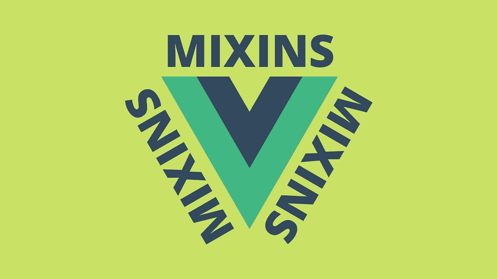

# 为什么以及如何在 Vue.js 中使用 Mixins

> 原文：<https://javascript.plainenglish.io/why-and-how-using-mixins-in-vue-a7219464071a?source=collection_archive---------4----------------------->

## 想知道如何使你的代码更整洁，而不是多次重写相同的函数或数据吗？Mixins 是最好的解决方案。



你有没有遇到过这样的情况，当你在做一个项目的时候，你有一个 ***函数或者数据，你必须在不同的组件*** 中使用它？我想是的。

在本文中，我们将看到 Mixins 在 Vue.js 中的主要用法，以及为什么在您的项目中使用它会如此有趣。

# 有哪些 Mixins？

混合蛋白是。js 格式的文件，可以帮助你 ***存储数据或函数，并将其导入到你想要的任何组件*** 。

当您有一个 ***大型组件*** 并且您希望 ***在一个单独的文件*** 中包含它的一些数据时，这也非常有用。

# 创建 Mixin 文件

为了给 mixin 创建一个文件，最好的方法是为它创建一个单独的 ***文件夹*** ，并将其命名为***【mixins】***(显然:)。

让我们创建我们的第一个 mixin 文件，并将其命名为 ***first.js.***

请注意，所有的 mixin 文件都应该是 ***。js*** 文件。

```
export const userMixin = {
  data() {
    return {
      firstName: 'Alex',
      lastName: 'Smith', 
      color: 'red
     };
  },
  methods: {
    saveUser() {
       console.log('save user')
    }
  }
};
```

我们刚刚创建了 mixin 文件，其中包含一些关于用户的信息和一个保存用户的函数，我们希望在不同的组件中重用这些信息。

***但是结构没有让你想起什么吗？*** 确切地说，它是我们在任何 Vue 组件的脚本中拥有的相同结构。

让我们看看如何在我们的组件中使用它。

# 在组件中使用 Mixin 文件

为了能够使用 mixin，首先，你必须将 ***导入*** 到组件中，其次，你必须将 ***声明*** 到你的脚本部分中。

```
<script>
import userMixin from './mixins/first.js'export default {
  mixins: [userMixin]
}
</script>
```

现在，你有了组件内 mixin 文件中的数据和函数。

这意味着，如果你这样编码:

```
<p>{{ firstName }}</p>
<p>{{ lastName }}</p><button @click="saveUser()">Save here</button>
```

你的屏幕上会有 ***阿莱士·史密斯*** 按钮 ***【点击这里】*** ，它执行 mixin 中的 ***保存用户*** 功能。

> **换句话说:**当你使用 mixins 的时候，你只是把它的内容插入到你的组件中。

# 使用 Mixins 的缺点

即使在了解了下面的所有信息之后，你可能会说 mixins 可能是在你的一些组件中使用的一个很好的实践，t ***这里有一些缺点需要注意*** 。

首先，变量 的 ***名称可能与 mixin 文件中的变量名称冲突。***

例如，您可以在组件“submit”中命名您的函数，在 mixin 中，您有相同的函数。那会造成冲突。

所以最好处理好名字。

此外，当谈到 Vue3 或 Vuex 的用法时，mixins 可能有点 ***过时。最好赋予这些特性特权，但是如果您的项目中没有这些特性，欢迎您使用 mixins。***

# 结论

知道如何使用 mixins 真的可以帮助你使你的代码更干净、更有条理。注意变量名和快乐编码:)

## 感谢阅读！😊

*更多内容看* [***说白了。报名参加我们的***](https://plainenglish.io/) **[***免费周报***](http://newsletter.plainenglish.io/) *。关注我们关于*[***Twitter***](https://twitter.com/inPlainEngHQ)*和*[***LinkedIn***](https://www.linkedin.com/company/inplainenglish/)*。查看我们的* [***社区不和谐***](https://discord.gg/GtDtUAvyhW) *加入我们的* [***人才集体***](https://inplainenglish.pallet.com/talent/welcome) *。***