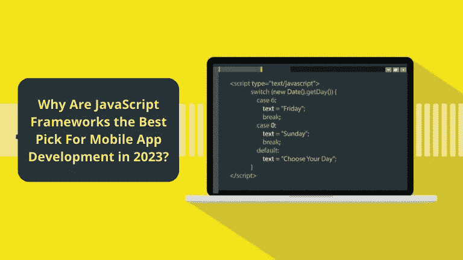
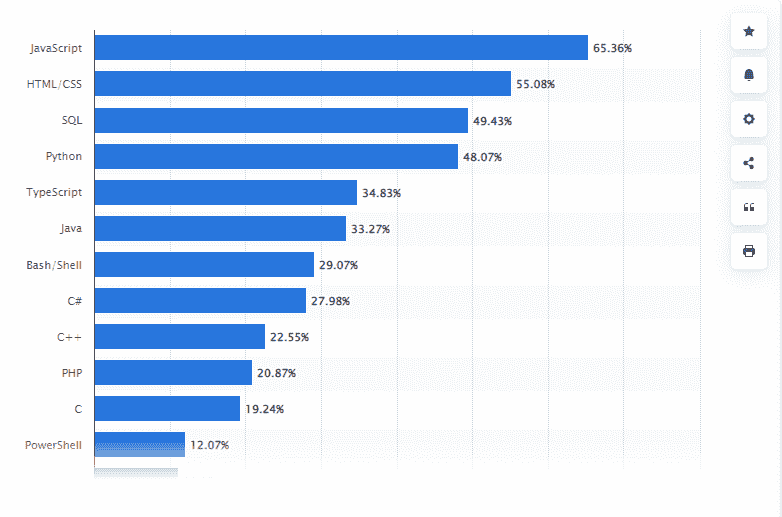
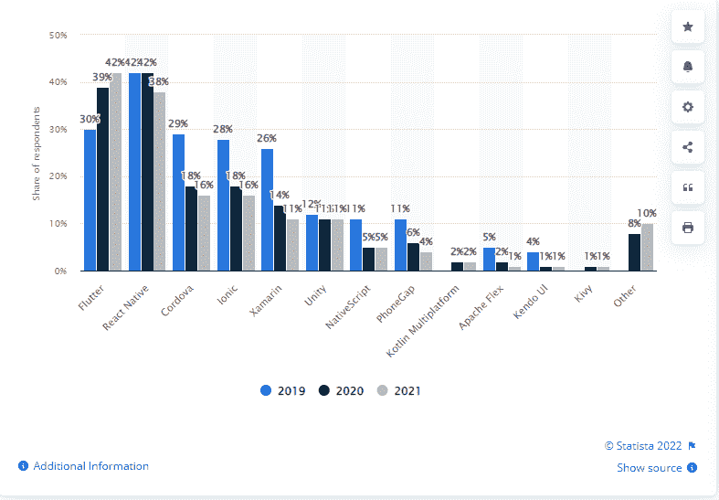

# 为什么 JavaScript 框架是 2023 年移动应用开发的最佳选择？

> 原文：<https://javascript.plainenglish.io/why-are-javascript-frameworks-the-best-pick-for-mobile-app-development-in-2023-1cefb70119e6?source=collection_archive---------10----------------------->

## 1.发展更快，2。多一项前端技术，3。代码可重用性，4。性价比高，& 5。提供卓越的用户体验

移动应用程序开发在过去几年中经历了前所未有的增长，而且其势头没有停止的迹象。

随着越来越多的企业采用移动技术，掌握最新趋势以使您的企业在竞争中获得优势非常重要。但当你进入市场时，决定哪种技术是移动应用开发的最佳选择就变得极具挑战性。

一个这样的趋势是用于移动应用开发的客户端 web 技术(例如 JavaScript ),尤其是使用简化整体开发过程并产生更高效应用的框架。

想知道为什么我们选择了领先的 web 开发编程语言来开发移动应用程序吗？

[根据 Statista 的报告](https://www.statista.com/statistics/793628/worldwide-developer-survey-most-used-languages/)，JavaScript 是 2022 年开发者最常用的编程语言之一。

[Image Source](https://www.statista.com/statistics/793628/worldwide-developer-survey-most-used-languages/)

## **JavaScript 编程语言的背景:**

JavaScript 是一种多功能的编程语言，可用于创建网站、应用程序、游戏等。JavaScript 如此受欢迎的原因之一是它可以用作全栈语言，这意味着它可以用于创建应用程序的前端和后端。

这使得 JavaScript 成为移动应用开发的绝佳选择。有许多 JavaScript 框架和库可以用于移动应用程序开发。为了让你的选择更容易，我们整理了一份清单，列出了你应该考虑使用 JavaScript 框架来构建下一个移动应用的理由。

在您选择下一个移动开发框架之前，看看这些原因，以确定它是否最适合您的项目。

# **为什么 JavaScript 框架是 2023 年移动应用开发的最佳选择？**

如果您仍然怀疑是否应该选择 JavaScript 框架进行移动应用程序开发，那么您需要知道这些有效的理由。

## **1。确保更快的发展**

说到移动应用程序开发，时间是至关重要的。使用 JavaScript 框架，你可以比使用其他编程语言更快地启动并运行你的应用程序。这是因为需要编写的代码更少。

你所需要的就是雇佣一个懂 JavaScript 的移动应用开发者，他们可以找到预先写好的代码片段或者库，只需要几行代码就可以完成你所需要的。

此外，许多框架在设计时都考虑到了移动设备，因此它们会考虑触摸屏和更小的屏幕尺寸等因素。它们还允许开发人员使用 HTML 和 CSS(大多数 web 开发人员都知道这两种语言)，而不是更复杂的编码语言，如 Objective C、Java 或 Swift。除此之外，它们还提供了大量的插件，可以帮助加速这个过程。

## **2。JavaScript 不仅仅是一种前端技术**

*如果我们说，JavaScript 框架已经发展到如此先进的水平，可以为你的移动应用提供离线支持，那会怎么样？*

JavaScript 通常用于移动应用程序开发的前端，但该技术正在发展成为更通用的应用程序。随着手机市场的扩大，移动应用需要迎合更广泛的受众。

对于这些用户来说，移动应用不能总是要求高速互联网。启用 JavaScript，可以提供解决方案。

JavaScript 可以在执行客户端操作时节省带宽，并可用于开发在互联网速度慢或不可用时使用较少带宽的移动应用程序。

此外，JavaScript 应用程序可以用来避免可怕的后端基础设施扩展，这在移动应用程序增长和扩展时至关重要。

*总而言之，说 JavaScript 将驱动无服务器移动应用的未来不会错！*

## **3。JavaScript 框架提供了代码的可重用性**

您应该考虑使用 JavaScript 框架进行移动应用程序开发的第一个原因是，它可以改善用户体验。通过使用框架，你可以创建一个响应更快的应用程序。这是因为框架提供了预先编写的代码，可以用来提高应用程序的性能。

此外，框架还可以帮助您创建跨不同平台的更一致的外观。这意味着你不必花时间为 Android 和 iOS 设备设计不同版本的应用程序。为了让它在网络上工作，你可以选择 [**雇佣更了解它的应用开发者**](https://www.appsdevpro.com/hire-developers.html) 。另外，如果将来有新的设备或平台出现，你也可以使用 JavaScript 框架，而不需要你做任何额外的工作。

如果你正在为你的应用程序设计寻找定制选项，那么 JavaScript 框架可能不适合你，因为它们提供有限的设计选择，并且要求你集成 API。但是，如果您想要的只是能够快速工作的东西，那么这些类型的框架会提供很多其他的好处。

## **4。JavaScript 框架具有成本效益**

说到移动应用程序开发，成本总是一个因素。但是你知道吗，从长远来看，使用 JavaScript 框架实际上可以帮你省钱。

这是如何-

***开发和调试所需时间更少，因为代码更简单:*** 代码更少，复杂程度更低，需要发现的 bug 就更少。世界各地的企业过去常常雇佣专门的开发团队来负责他们的应用程序开发和测试。但是有了 JS 框架，团队的数量可以迅速减少。您的开发人员将在调试过程中花费更少的时间，这意味着他们将能够完成更多的项目并赚更多的钱！

*   ***更高效的开发人员:*** 由于效率的提高，您的开发人员每天将完成更多的工作——这转化为更多的完工项目！
*   ***降低项目失败的风险:*** 调试过程中发现的错误越少，生产过程中出现的错误就越少，这意味着项目失败的几率也就越低。

## **5。提供卓越的用户体验**

在大多数情况下，用户会在下载后几分钟内决定是继续使用还是立即删除。因此，开发人员需要提供交互式应用——JavaScript。这提供了吸引人的功能，如改进的 UI/UX、交互式地图、动画 2D/3D 图形、滚动视频点唱机等。

使用 JavaScript 还可以实现响应式网页设计，它可以自动调整你的应用程序以适应每部智能手机的不同屏幕尺寸。通过 [**雇佣一个网络应用开发者**](https://www.appsdevpro.com/hire-developers/hire-web-app-developers.html) ，组织可以让这项任务变得简单快捷。由于专业人员更了解 JS 框架的亮点，他们可以帮助您集成改进的 UI/UX。这确保了良好的用户体验。

希望这些原因足以理解为什么 JavaScript 框架在移动应用程序开发中受到追捧，以及为什么它们是 2023 年的最佳选择。出于这些原因，你们中的许多人很想知道在移动应用程序开发中使用 JS 框架的最佳选择。

开始了。

# **2023 年移动应用开发的首选 JavaScript 框架**

JavaScript 框架用于以快速简单的方式构建移动应用程序。成熟的组织正在采用 JavaScript 框架来创建他们自己的移动应用程序。JavaScript 框架被认为是设计和构建高效移动应用的理想之选。

由于 JavaScript 高效、成本较低、有一个很好的社区，并且学习曲线较低，它已经成为许多开发人员构建自己的移动应用程序的首选。像这样的框架可以跨 iOS、Android 和 Windows 使用。

全球有各种各样的 JS 框架，每一个都有自己的特点、特别关注的领域和独特的特性。分析每种方法，选择最适合您组织需求的方法。

在这里，我们分享了值得你关注的 JavaScript 框架的首选！

1.  **反应土著**

React Native 是创建原生移动应用的强大工具。尽管在 2015 年推出，但它很快就偷走了开发者的心，并在一段时间内成为了[的领先框架](https://www.statista.com/statistics/869224/worldwide-software-developer-working-hours/)。使用 React Native，您可以使用一个代码库为 iOS 和 Android 创建应用程序。React Native 快速、高效且易于学习。这就是为什么像脸书这样的行业巨头对这个框架有信心。

[Image Source](https://www.statista.com/statistics/869224/worldwide-software-developer-working-hours/)

与其他移动应用程序开发框架相比，它提供了许多好处。

*   **快:**与其他编译 Java 字节码或机器码的框架不同，React Native 编译为设备的原生语言 iOS 上的 native Objective-C，Android 上的 Java。
*   **简单易学:**如果你知道如何用 JavaScript 和 React 构建 web 应用，那么你就知道如何用 React Native 构建 app。
*   **高效:**与使用 Xamarin 或 Cordova 等传统方法开发的应用相比，使用 React Native 构建的应用需要更少的时间和更少的代码行。

它们也只需要一行 Javascript 代码，而不是几行。如果你想让你的应用离线，你可以 [**雇佣一个移动应用开发者**](https://www.appsdevpro.com/hire-developers/hire-mobile-app-developers.html) 来实现合适的服务。使用单一语言和代码库，您可以轻松地为多种设备创建应用程序。

## **2。jQuery**

jQuery 是最流行的 Javascript 框架之一。它是免费和开源的，对许多开发者来说是一个有吸引力的选择。它的学习曲线也比其他框架小，比如 AngularJS 或 EmberJS。如果你正在雇佣一个 web 应用程序开发者来创建高度交互的应用程序，那么 jQuery 将是一个完美的选择，因为它有一些动画功能，你可以将它们包含在你的应用程序中。这些只是您应该考虑在下一个项目中使用 jQuery 的一些原因！

**jQuery 框架快速集锦**

*   jQuery 是一个跨平台的 JavaScript 库，旨在简化 HTML 的客户端脚本。
*   它由 John Resig 于 2006 年发布，目前由 jQuery Foundation 的一个开发团队维护。
*   jQuery 是当今最流行的 JavaScript 库，在 Web 上流量最高的 1000 万个站点中，有 65%安装了 jQuery。
*   jQuery 是免费的开源软件，受到麻省理工学院许可证和 GNU 通用公共许可证的双重许可。
*   使用 jQuery，您可以轻松创建响应迅速、跨浏览器兼容的 web 应用程序和网站。

## **3。离子型**

Ionic 是另一个可用于 HTML5 移动应用开发的框架。它具有特殊的功能，如主屏幕 UI 构建和轻松的跨平台应用程序开发。Ionic 特别适合混合应用程序设计，在单个应用程序包中使用本地代码和 Web 视图。

*   Ionic 是一个开源框架，可用于开发混合移动应用。
*   这是一个用户友好的框架，使开发应用程序变得容易。
*   Ionic 允许你为多个平台使用一个代码库，这样可以节省时间和金钱。
*   Ionic 有一个很大的开发者社区，他们总是愿意帮助你或者回答你的任何问题。
*   该框架不断更新，增加了新的特性和改进。
*   Ionic 提供了广泛的插件和扩展，以进一步改善您的应用程序开发体验。
*   总的来说，使用 Ionic 可以帮助你节省时间和金钱，同时仍然允许你开发高质量的移动应用程序。

JavaScript 框架的列表并没有到此为止，但是这些是目前开发人员最常用的框架。其余的，你可以选择一个最适合你独特的业务需求。

## **总结**

我会用一个词来概括 JavaScript 在移动应用开发中的框架——敏捷。JavaScript 可以快速轻松地适应智能手机新世界的需求。和移动应用程序。当选择哪个框架最适合你的项目时，你可以选择 [**雇佣一个应用开发者**](https://www.appsdevpro.com/hire-developers.html) 来协助你。

如果你问我如何选择一个框架，那么我会说这不是一个简单的任务，因为有这么多的选择。此外，没有放之四海而皆准的解决方案，但是您可以与您的团队讨论一些有用的特性和要求。

如果您在选择合适的移动应用开发公司或合适的 JavaScript 框架时遇到困难，请随时联系我们寻求帮助。我们以前也成功地为其他企业处理过这些问题。

*更多内容请看*[***plain English . io***](https://plainenglish.io/)*。报名参加我们的* [***免费周报***](http://newsletter.plainenglish.io/) *。关注我们关于*[***Twitter***](https://twitter.com/inPlainEngHQ)[***LinkedIn***](https://www.linkedin.com/company/inplainenglish/)*[***YouTube***](https://www.youtube.com/channel/UCtipWUghju290NWcn8jhyAw)*[***不和***](https://discord.gg/GtDtUAvyhW) *。***