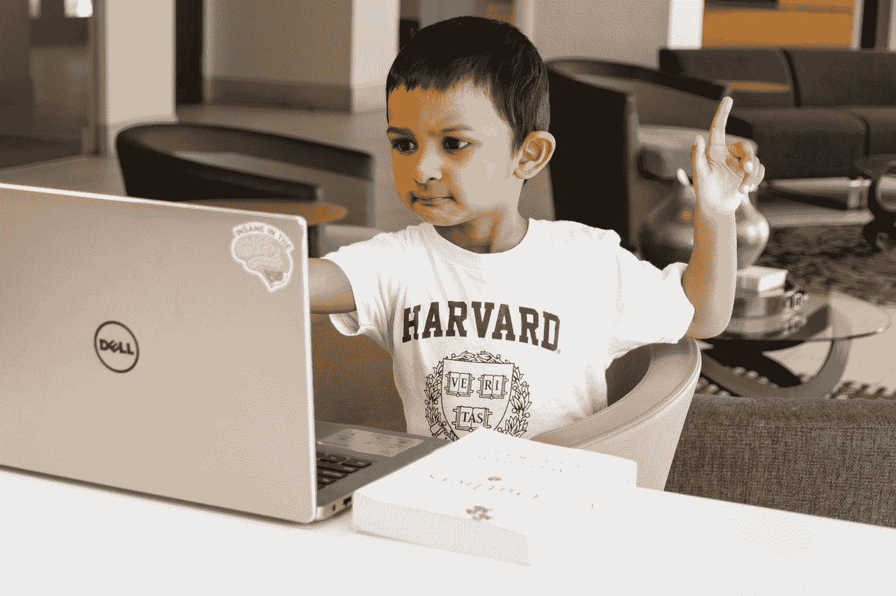

# 为什么那么多程序员执着于教大家怎么编码？

> 原文：<https://javascript.plainenglish.io/why-are-so-many-programmers-obsessed-with-teaching-everyone-how-to-code-59e559a4bd54?source=collection_archive---------5----------------------->

## 是因为编程是未来的工作吗？号码

Photo by [Rohit Farmer](https://unsplash.com/@rohitfarmer?utm_source=medium&utm_medium=referral) on [Unsplash](https://unsplash.com?utm_source=medium&utm_medium=referral)

我和我的程序员朋友喝了几杯啤酒。我们已经有一段时间没有出去玩了，因为他们都忙于他们的日常工作，而且我们不住在同一个街区。还有，我们都带了孩子，所以不会喝那么多。

由于他们的程序员工作，他们都做得很好。但是我问他们，如果他们要教他们的孩子编程，他们会说些什么来鼓励他们？

1.  因为由此产生的逻辑联系在日常生活和每个工作场所都变得越来越普遍。智能手机+应用、家庭自动化、自动驾驶汽车、可穿戴设备、自动停车库等。这让你在找工作时有优势，在使用新技术时有优势，但新技术并不总是对用户友好的。
2.  编程有一个显著的优势。它教授良好的解决问题的技巧。这对以后的生活无疑是有帮助的，不管你以后编程与否。此外，我们的生活越来越科技化。了解事情如何运作将有助于你做出更好的决定。
3.  一切都变得越来越数字化。这方面的机会太多了，以后还会更多。
4.  因为它很有趣，80 年代的第一批游戏机没什么可玩的，但是人们很热情。但这对孩子们来说不算什么。因为在当时，这样一个盒子要花费几千欧元，维护起来很困难。
5.  出于同样的原因，许多人痴迷于尽早教孩子英语、法语或任何其他外语。说到外语，我甚至能部分听懂。儿童学习语言比成人快得多。你越晚开始学习一种语言，就越难不带口音地说话。
6.  给孩子们最好的人生开端。有些事情你需要大量的练习，比如音乐、语言、编程和国际象棋。许多明星、科学家和艺术家在生活中有一个良好的开端和巨大的优势。
7.  最后，因为它很有趣，在 1984 年第一批游戏机上你没什么可做的，但是人们很热情。但这对孩子们来说不算什么。因为在当时，这样一个盒子要花费几千欧元，维护起来很困难。

 [## 我遇到了一个退休的程序员，他给了我改变人生的职业建议

### 帮助你认识到你不会理解的事情的建议。

javascript.plainenglish.io](/i-met-a-retired-programmer-and-he-gave-me-life-changing-career-advice-6d2badc3e0fd)  [## 我的导师建议我投资自己成为一名程序员

### 如果我想让我的事业更上一层楼。

javascript.plainenglish.io](/my-mentor-advised-me-to-invest-in-myself-as-a-programming-f9d31f156b8) 

*更多内容请看*[***plain English . io***](https://plainenglish.io/)*。报名参加我们的* [***免费周报***](http://newsletter.plainenglish.io/) *。关注我们关于*[***Twitter***](https://twitter.com/inPlainEngHQ)*和*[***LinkedIn***](https://www.linkedin.com/company/inplainenglish/)*。加入我们的* [***社区不和谐***](https://discord.gg/GtDtUAvyhW) *。*