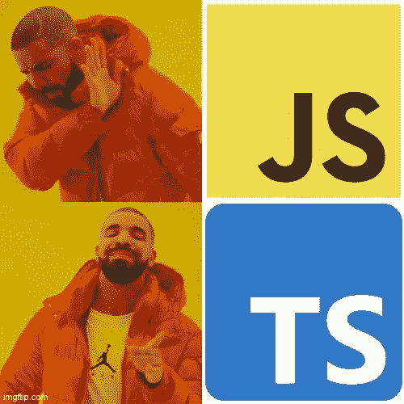

# 你为什么还在写 JavaScript？

> 原文：<https://javascript.plainenglish.io/why-are-you-still-writing-javascript-f66921b3f43e?source=collection_archive---------6----------------------->

## 如果您在 2022 年仍在编写普通的 JavaScript，下面是如何&为什么将 TypeScript 合并到您的项目中

原谅这个煽动性的标题，但是如果你现在还在写普通的 JavaScript 为什么？切换到 [TypeScript](http://typescriptlang.org) 比以往任何时候都更容易，并且在你的代码质量上支付直接和持久的红利。在这里，我将讨论 TypeScript 的优点，并解决人们提出的一些可能阻止他们使用它的问题。



Drake loves static typing. You wanna make Drake happy, right?

# 什么是 TypeScript？

如果您仅仅因为不知道什么是 TypeScript 而仍然在编写 JavaScript，那么公平地说:让我们了解一下它，以及它如何帮助提高您的代码质量。简单地说，TypeScript 是 JavaScript 的静态类型版本。这意味着 TypeScript 编译器在构建时使用关于代码中变量的*类型* *的信息来捕捉错误。*

严格地说，TypeScript 是 JavaScript 的*超集*:类型注释在语法中是完全可选的*,因此任何有效的 JavaScript 程序在语法上也是有效的 TypeScript。让我们快速看一下一个简单的“square”函数，首先用 JavaScript 编写，然后用 TypeScript 编写类型定义:*

```
**// plain JavaScript** function square(n) { 
  return n*n 
}**// TypeScript implementation with types** function square(n: number): number { 
  return n*n 
}square(10)
**// 100**square("ten")
***// <repl>.ts:10:8 - error TS2345: Argument of type 'string' is not assignable to parameter of type 'number'.***
```

在这个例子中，我们的 TypeScript 版本注释了函数的参数和返回类型，如果我们试图用除数字之外的任何东西调用函数，就会给出一个错误。这只是 TypeScript 如何工作的一个非常简单的例子。在现实世界中，您可能会使用复杂的接口和类来处理更复杂的类型。正是在这里，TypeScript 可以真正开始发光，因为它可以确保整个代码库的一致性。

虽然这篇文章只是简单介绍了什么是 TypeScript 以及为什么要使用它，但是我并没有过多地谈论*如何*编写 TypeScript 代码。如果你有兴趣了解更多关于编写类型脚本代码的内容，你可以[阅读手册](https://www.typescriptlang.org/docs/handbook/intro.html)，或者，如果你想深入了解，看看这些[有用的类型脚本备忘单](https://www.typescriptlang.org/cheatsheets)。

# 为什么使用 TypeScript？

那么在 JavaScript 中加入类型有什么好处呢？

## 在编译时而不是运行时捕获错误

这是使用 TypeScript 的核心优势。举一个简单的例子，假设您有一个带有可选邮政编码字符串的`Address`对象，但是您有一个函数对它进行操作而不检查`undefined` : `address.zipCode.substring(0, 5)`。在 JavaScript 中，一个未定义的邮政编码值将导致运行时异常，用户会很难过——根据错误发生的位置和处理方式，部分或全部前端应用程序可能会处于不可用状态。

在 TypeScript 中，您的编译器(在您的构建日志或 IDE 中)会在代码发布之前让您知道它是错误的:

```
error TS2532: Object is possibly 'undefined'.
```

但是比在客户端爆发的 JavaScript 错误更糟糕的是，一些与类型相关的错误甚至不会表现为运行时异常——相反，它们只是以一种不容易发现的方式导致了*错误行为*。让我们考虑一个完全假设的场景，为一个电子商务网站构建一个管理界面。也许我们让用户以美分为单位输入产品的价格，在我们的业务逻辑中，我们计算运费:

```
let total = priceInCents + calculateShipping(zipCode)
let displayPrice = formatPrice(total)
```

假设我们提交了这段代码，并认为一切都很好——没有异常出现！但是几天后，一个客户打电话来问*为什么这个 10.00 美元的产品显示总成本为 10，003.00 美元*。在这个完全虚构的示例中，我们将`priceInCents`视为一个数字，并尝试添加我们的运费值($3.00)。但实际上，我们的`priceInCents`是一个字符串(“1000”)，需要在对其执行任何数学运算之前进行解析。

是的，这是一个人为的例子；是的，这是一个愚蠢的错误，你应该在测试中抓住它；但是，是的， **JavaScript 会很乐意让你在你的代码库中一遍又一遍地犯这些错误**，并且不会帮你找到它！在 TypeScript 中，您甚至不会让这些错误进入您的测试环境。

## 定义清晰的界面

假设您刚刚继承了一个大型代码库，您被要求构建一个与现有接口集成的组件。你更愿意使用哪种代码？

```
**// JavaScript** function setPrefs(user, prefs, sync) ...**// TypeScript** interface User { username: string, id: number }
interface Prefs { drink: "coke" | "pepsi", cheesecake: boolean }
function setPrefs(user: User, prefs: Prefs, sync: boolean) ...
```

在普通的 JavaScript 情况下，您可能需要做更多的阅读，以确定应该向这些函数传递什么值。并且您需要的信息可能不在`setUserPreferences`函数本身中，所以您可能会发现自己费力地通过代码库的其余部分——我们的应用程序支持哪种偏好？

我对修改这段代码的 TypeScript 版本更有信心，因为我了解我正在处理的数据。在 TypeScript 的情况下，类型定义准确地告诉我们函数期望什么样的值，如果我们弄错了，将会给我们一个构建时错误。如果我们将来对`User`或`Prefs`接口做了更改，TypeScript 编译器会让我们知道我们是否在使用的地方做了重大更改*。请注意，类型定义并不能代替*文档—* 在这个例子中，`sync`标志有什么作用？我们可以看到它是一个布尔值，但我们仍然应该添加适当的文档来说明它是做什么的。*

## 自信地重构

如果项目中没有任何类型安全，那么在重构的时候你就有点盲目了。测试覆盖可以帮助解决这个问题，但是静态类型是你的第一道防线。使用 TypeScript 将捕获大多数在执行常见重构操作时发生的错误，如函数和变量重命名、函数签名更改、将代码移动到新的类或模块等。

## 享受整体更好的代码质量和更易读的*代码

当您使用 TypeScript 并准备好类型定义时，您可以确信您的代码总体质量更高，原因如上所述。一般来说，您的代码也更具可读性，因为为您的函数和类型定义了清晰的接口。这意味着对于新开发人员来说，参与项目要简单得多，甚至对于现有开发人员来说，记住如何使用他们几周前编写的代码也简单得多！

我确实在“可读性更好”的代码上加了星号，因为有时复杂的、嵌套的 TypeScript 定义可能非常不可读——但是您将学会在必要时在心里把它们放在一边。如果您在第三方库中遇到这些，不要惊慌！你通常不需要完全理解你的代码在库中涉及的所有复杂类型。如果不需要窥视内部，可以把复杂类型想象成一个黑盒。

# 为什么不使用打字稿——常见的借口

人们不使用 TypeScript 有许多常见的原因。有些是不准确的，有些有一定的道理，但完全可以解决，不应该阻止您完全使用 TypeScript。让我们考虑一些常见的异议。

## "我喜欢没有类型的 JavaScript 的自由和开发速度！"

我也是！但是 TypeScript 并没有真正妨碍我。如果您将项目配置为这样做，您不需要立即编写完美的类型定义—您可以迭代您的代码，直到您的类型稳定，然后添加 TypeScript 注释。

> 您不需要立即编写完美的类型定义—您可以迭代您的代码，直到您的类型稳定，然后添加 TypeScript 注释。

## “我的项目缺少一百万个类型注释，我要花几周时间来迁移”

迁移整个项目可能需要几周时间，这是事实，*但是你不需要一次迁移完*。您可以简单地重命名文件，开始使用 TypeScript 工具，然后在方便的时候添加类型。或者从在您编写的新代码中添加类型定义开始。如果您选择走这条路，请确保相应地配置您的环境(参见 `[noImplicitAny](https://www.typescriptlang.org/tsconfig#noImplicitAny)`上的[文档)。](https://www.typescriptlang.org/tsconfig#noImplicitAny)

从长远来看，只输入部分代码并不理想，但这是现实世界中最完美的迁移策略。这里最好的方法是从添加类型注释开始，它们会产生最大的影响:注释您的数据模型可能是一个好的开始，但是也要寻找错误代价最大的核心业务逻辑。

## “但是打字稿太慢了”

这在某种程度上是准确的——但并非无法解决。运行 TypeScript 编译器实际上比只运行 JavaScript 解释器要慢。在足够大的项目中，在每次更改后编译 TypeScript 确实会减慢编写和测试代码的核心迭代循环，特别是如果您使用热重新加载功能，在这种情况下，每次代码更改都会立即反映在屏幕上。

幸运的是，有办法解决这个问题。最简单的方法是告诉 TypeScript 不要对每一个更改都进行类型检查，而是在后台进行类型检查。为此，您可以告诉 TypeScript 只对*trans file 代码执行*，这意味着它会将 TypeScript 转换为 JavaScript，以便在浏览器或 Node 中运行，但会跳过所有运行缓慢的类型检查。然后，一个单独的进程会在后台出现，执行类型检查，并将结果通知您或您的 IDE。

这听起来可能有点复杂，但是不要担心——有工具可以帮你完成所有这些工作。许多 ide 可以通过适当的插件或配置为您做到这一点，或者查看[fork-ts-checker-webpack-plugin](https://github.com/TypeStrong/fork-ts-checker-webpack-plugin)来了解如何在 web pack 构建过程中做到这一点。

## "流行库中的 TS 类型是对其他类型的难以理解的俄罗斯套娃式的引用！"

好吧，在这一点上我甚至不会不同意你——你是对的！这肯定是使用 TypeScript 的痛点之一，但您不必让它妨碍您。如前所述，您不必为了做正确的事情而完全理解库公开的每个复杂类型。你的 IDE 可以帮助你在需要的时候追踪到正确的类型定义。

## " TypeScript 无法用于我的项目"

这是我看过几次的一句台词，说实话，我不确定我是否理解它的意思。确实，不同的项目有不同的配置，可能需要不同的设置，但是我还没有遇到过真正不能转换成 TypeScript 的项目。

有时人们在这里的意思是“TypeScript 不能与我当前的工具一起工作”，这可能是真的。如果是这样，是时候更新您的工具并引入 TypeScript 了。下面，我将讨论一些将 TypeScript 合并到项目工具中的不同方法。

# 如何在项目中使用 TypeScript

那么，实际上如何在项目中开始使用 TypeScript 呢？有几种方法，这取决于您的项目是如何设置的。

## 使用 ts-node 或`deno`运行 TypeScript

如果您在命令行或 IDE 中用`node`运行 JavaScript，使用 TypeScript 很简单。你可以开始使用`ts-node`来代替！`ts-node`是`node`的一个支持类型脚本的包装器，它实时地对`node`执行的&传输文件代码进行类型检查。

或者，如果你喜欢冒险和前沿，你可以尝试切换到`deno`而不是使用`node`。`deno`是一个更现代的 JavaScript 运行时，它具有原生类型脚本支持和许多其他优秀特性。这值得一试，但确实与 Node.js 有些不兼容，所以用`deno`运行项目可能需要对项目进行其他更改。

## 使用 TypeScript 创建新项目

这无疑是开始使用 TypeScript 的最简单的方法——在新项目中从头开始设置它。这可以帮助您开箱即可正确配置所有工具。如果您使用的是项目生成器，如 [Yeoman](https://yeoman.io) 或 [create-react-app](https://create-react-app.dev) 或任何其他类似的工具，请查看文档，了解如何使用 TypeScript 模板生成项目的详细信息。

## 配置使用 Babel 或 Webpack 的现有项目

如果你使用的 JavaScript 管道涉及到使用 Babel 来传输代码，那么添加类型脚本就很容易了。Webpack 项目通常被配置为使用 Babel 作为管道的一部分，但是如果你碰巧使用不带 Babel 的 Webpack *，你可以使用 [ts-loader](https://webpack.js.org/guides/typescript/) 插件为你传输代码。*

## 迁移现有源

如前所述，如果您有一个要转换为 TypeScript 的大型项目，那么实际上您不可能预先将正确的类型添加到所有项目中。为了解决这个问题，您可以[将 TypeScript](http://typescriptlang.org/tsconfig/) 配置得更加宽松。具体来说，禁用 *noImplicitAny* 设置将让 TypeScript 为未注释的变量分配一个特殊的`any`类型，从而防止 TypeScript 引发与这些值相关的类型错误。这将禁用对任何未显式批注的值的 TypeScript 检查，实际上使类型完全可选。同样，禁用类型检查并不理想，但对于随着时间的推移逐渐迁移项目来说，这是一个很好的策略。

# 没有免费的午餐

正如每一个技术决策一样，总会有折衷——但是使用 TypeScript 的成本很小，而且主要是使您的工具现代化。如果您现在不使用 TypeScript，那么就没有理由不启用它。即使您默认使用最宽松的设置，并保留部分代码库不加注释，您仍然能够开始获得静态类型的好处。

*Jonathan 在大大小小的创业公司中拥有超过 20 年的工程领导经验。在业余时间，他在做一个文档自动化平台，*[*Imagepipe.co*](http://imagepipe.co/)*。*

*更多内容请看*[***plain English . io***](https://plainenglish.io/)*。报名参加我们的* [***免费周报***](http://newsletter.plainenglish.io/) *。关注我们关于*[***Twitter***](https://twitter.com/inPlainEngHQ)*和*[***LinkedIn***](https://www.linkedin.com/company/inplainenglish/)*。查看我们的* [***社区不和谐***](https://discord.gg/GtDtUAvyhW) *加入我们的* [***人才集体***](https://inplainenglish.pallet.com/talent/welcome) *。*