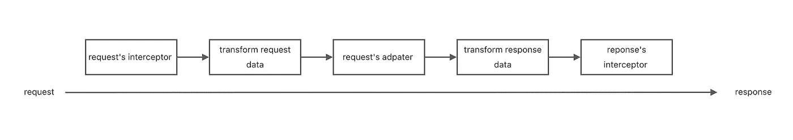

# 为什么 Axios 可以在浏览器和 Node.js 中同时使用

> 原文：<https://javascript.plainenglish.io/why-axios-can-be-used-both-in-browser-and-node-js-5b88206f70f?source=collection_archive---------6----------------------->

## axios 如何兼容两种不同的请求方法


Photo by [Luca Bravo](https://unsplash.com/@lucabravo?utm_source=medium&utm_medium=referral) on [Unsplash](https://unsplash.com?utm_source=medium&utm_medium=referral)

# 前言

Axios 有一个很棒的特性`isomorphic`，这也是我喜欢用 axios 作为 web apps 的请求库的原因之一。`isomorphic`意味着 axios 代码可以在浏览器和 Node.js 中运行。

我们都知道在浏览器中发送请求依赖于 XMLHttpRequest 构造函数或者 Fetch API，在 node.js 中依赖于 node.js 提供的 HTTP 模块，同样的代码库，axios 如何兼容两种不同的请求方式。

# axios 请求的步骤

为了回答这个问题，我们需要了解 axios 的请求步骤。



process of axios request

当我们发送请求时，至少有 7 个步骤:

1.  我们启动一个请求，我们需要提供 URL、参数等。
2.  Axios 将执行请求的拦截器
3.  Axios 将转换请求数据，如序列化参数、添加头等。
4.  Axios 将通过请求的适配器将请求发送到服务器。
5.  Axios 将转换响应数据，比如 transform JSON。
6.  Axios 将执行响应拦截器。
7.  我们终于可以处理回应了。

当我们在浏览器和 node.js 中使用 axios 时，会有不同的适配器。

# axios 的适配器

Axios 对请求使用两个适配器，浏览器使用 XMLHttpRequest，Node.js 使用 HTTP 模块。Axios 将根据允许的环境判断使用哪个适配器:

```
// Code from [axios/index.js at bc733fec78326609e751187c9d453cee9bf1993a · axios/axios (github.com)](https://github.com/axios/axios/blob/bc733fec78326609e751187c9d453cee9bf1993a/lib/defaults/index.js#L19)
function getDefaultAdapter() {
  var adapter;
  if (typeof XMLHttpRequest !== 'undefined') {
    // For browsers use XHR adapter
    adapter = require('../adapters/xhr');
  } else if (typeof process !== 'undefined' && Object.prototype.toString.call(process) === '[object process]') {
    // For node use HTTP adapter
    adapter = require('../adapters/http');
  }
  return adapter;
}
```

当我们在 Node.js 中使用 axios 时，由于 node.js 中没有 XMLHttpRequest，但是有一个 process 对象，axios 会使用由 Node.js HTTP/HTTPS 模块实现的`http`适配器。

当我们在浏览器中使用 axios 时，因为所有浏览器都有 XMLHttpRequest，所以会使用`xhr`的适配器。

如果 web app 是用 webpack 构建的，代码会略有不同。构建后的代码是:

```
// code after webpack's build
function getDefaultAdapter() {
  var adapter;
  if (typeof XMLHttpRequest !== 'undefined') {
    // For browsers use XHR adapter
    adapter = __webpack_require__(448);
  } else if (typeof process !== 'undefined' && Object.prototype.toString.call(process) === '[object process]') {
    // For node use HTTP adapter
    adapter = __webpack_require__(448); // same with XHR
  }
  return adapter;
}
```

可以发现适配器都使用 XHR 适配器。你好奇 webpack 是怎么做到的吗？

在 axios 的 package.json 文件中，浏览器字段配置为:

```
// config from axios [https://github.com/axios/axios/blob/bc733fec78326609e751187c9d453cee9bf1993a/package.json#L70](https://github.com/axios/axios/blob/bc733fec78326609e751187c9d453cee9bf1993a/package.json#L70)"browser": {    
  "./lib/adapters/http.js": "./lib/adapters/xhr.js",      
  "./lib/defaults/env/FormData.js": "./lib/helpers/null.js"  
}
```

使用 webpack 构建 web 应用程序时，将默认使用浏览器配置信息。所以 HTTP 的适配器将被 XHR 取代。

# 结论

在这篇帖子里，我解释了为什么 axios 可以同时在 browser 和 Node.js 中运行，适应不同环境的请求，根据 XMLHttpRequest 判断浏览器环境，通过 process object 判断 Node.js 环境。

最后，希望这篇文章对你有帮助。我期待你能关注我，我会分享更多实用的文章。

*更多内容请看*[***plain English . io***](https://plainenglish.io/)*。报名参加我们的* [***免费周报***](http://newsletter.plainenglish.io/) *。关注我们关于*[***Twitter***](https://twitter.com/inPlainEngHQ)*和*[***LinkedIn***](https://www.linkedin.com/company/inplainenglish/)*。查看我们的* [***社区不和谐***](https://discord.gg/GtDtUAvyhW) *加入我们的* [***人才集体***](https://inplainenglish.pallet.com/talent/welcome) *。*