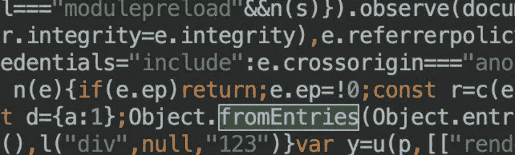

# 为什么 Vite 不能使用新语法？

> 原文：<https://javascript.plainenglish.io/why-cant-vite-use-new-syntax-46b50886a1db?source=collection_archive---------4----------------------->


您是否知道您在 Vite 项目中编写的高级 ECMAScript 语法可能是项目的隐患？

# 背景

该项目是基于 Vite 开发的。在开发过程中，使用 Object.fromeEntries。

在较低版本的浏览器中打开时，出现以下错误:


查一下 vite.config.js，发现没有使用奇怪的插件，先排除配置文件的问题。

秉承工程师追求极致的文化，开始刨根问底。

# 检测问题

在分析原因之前，我们先来看看这个新语法 [Object.fromEntries](https://developer.mozilla.org/en-US/docs/Web/JavaScript/Reference/Global_Objects/Object/fromEntries) 。


这是 ES2019 的新语法，已经是一个稳定的版本。

**浏览器兼容性**


不支持 IE。嗯，时代的眼泪。

但错误不是针对 IE，而是 Chrome。


检查了 Chrome 版本是 69，Object.fromEntries 直到 Chrome 73 才获得支持，导致较低版本的 Chrome 出现错误。

但通常情况下，为了兼容较低版本的浏览器，构建工具会将新的语法转换为较低版本浏览器可识别的语法。

浏览器运行时，代码中确实存在 Object.fromEntries，所以初步推断，在构建 Vite 时没有处理 Object.fromEntries。

在考察产品的时候，也可以发现语法确实被保留了下来。



既然是建筑问题，我马上看了 Vite 的官网，在[建筑章节找到了详细内容。](https://vitejs.dev/guide/build.html#browser-compatibility)


红框里说 Vite 只会做语法翻译，不会包含 poly fill，那么 poly fill 和语法翻译到底是什么？

# 多填充物

Polyfills 通过模拟低版本浏览器中的等效代码来实现高版本语法的行为。

以本文中的 Object.fromEntries 为例，其 polyfill 代码如下:

```
Object.fromEntries = Object.fromEntries ||
 function fromEntries (iterable) {
   return [...iterable].reduce((obj, [key, val]) => {
     obj[key] = val
     return obj
   }, {})
 }
```

在执行项目代码之前，先加载相关的 polyfills 代码，当遇到 Object.fromEntries 时，它才能完美运行。

## 核心-js

主流的 polyfills 库是 [core-js](https://github.com/zloirock/core-js) ，按照版本或类型对最新的 ECMAScript 语法进行分类，以便开发者更好地按需引入。


## @babel/preset-env

另外还有一个基于 core-js 封装的上层插件[@ babel/preset-env](https://babeljs.io/docs/en/babel-preset-env)。


通过在文件(browserslist)并设置最低兼容语法版本来控制聚合填充的代码大小，避免引入过多和不必要的聚合填充。

## polyfill.io

无论是 core-js 还是@babel/preset-env，polyfills 代码都是在构建时生成的，换句话说，它们是以 js 文件的形式存储在本地产品中的。

他们两个都有一个缺点。虽然聚合填充的体积可以在构建时通过配置进行优化，但一旦生成就不能再进行进一步的优化。

例如，当我使用低于 chrome73 的浏览器访问时，它会加载构建时生成的 polyfills 代码。

当使用最新版本的 chrome 访问时，它也会加载相同的代码。但是对于此时的 chrome，由于内核已经支持新的语法，所以不需要这个 polyfill。这时候加载无疑是浪费资源，还可能影响屏幕时间(FP)。

有没有办法在浏览器运行时动态加载 polyfills？答案就是 Vite 官方[网站](https://polyfill.io/v3/)上提到的 polyfill.io。


要使用 polyfill.io，您需要首先设置最高语法版本以获取 URL。


当浏览器访问 URL 时，动态返回适合当前浏览器的 polyfills。

*   低版本浏览器


*   高端浏览器


可以发现，对于同一个 URL，低版本浏览器和高版本浏览器返回的结果是不一样的。请求头用户代理由它后面的服务器识别，并根据需要返回 polyfills。

但是 polyfill.io 也并不完美

需要请求第三方 URL。由于 polyfills 需要在所有业务代码之前执行，如果外网出现波动，后续代码可能会被阻塞，导致白屏时间过长(可以通过私有化部署解决)。

一些浏览器的用户代理可能不准确。

使用哪种聚合填充方法取决于项目，没有所谓的银弹

如果您对产品体积不敏感，请考虑使用预制的聚合填料

如果目标浏览器能够聚合并且能够进行私有部署，请考虑使用 polyfills 的运行时版本

说了这么多 polyfills，让我们来看看 transpilation

# 蒸腾作用

对于某些新语法，不能单独使用多填充，例如

[可选——链接(a？。b )](https://babeljs.io/docs/en/babel-plugin-proposal-optional-chaining)

[零化凝聚算子(a？？10 )](https://babeljs.io/docs/en/babel-plugin-proposal-nullish-coalescing-operator)

[逻辑赋值运算符(a ||= 10 )](https://babeljs.io/docs/en/babel-plugin-proposal-logical-assignment-operators)

类似的新语法，由于依赖于浏览器内核的词法分析，较低版本浏览器无法以补丁的形式解决。

所以这种语法只能通过语法翻译，在构造的时候会返回低版本浏览器可以运行的代码。

```
// source
const a = 0
console.log(a ?? 10)

// dist
var a = 0;
console.log(a !== null && a !== void 0 ? a : 10);
```

现在主流的翻译工具是 [babel](https://babeljs.io/) (没错，除了 polyfills 还支持 transpilation)。通过与构建工具的集成，开发环境可以使用现成的新语法。实现原理如下

1.当构造时，通过词法分析将它解析成抽象语法树


2.然后将抽象语法树转换成与较低版本浏览器兼容的抽象语法树

3.使用新的抽象语法树来生成低级 js 代码

最终产品也不会包含新的语法，所以所有浏览器都可以完美运行

# 差异

那么哪些语法用 polyfill，哪些语法用 transpilation 呢？我总结几点

使用 polyfill，可以在任何版本的浏览器上模拟实现的 API

对于词法方面，比如新关键字(async/const/|>/？？)，使用语法翻译

对可以用 polyfill 实现的所有内容使用 polyfill，对不能实现的内容使用语法翻译

其他几个例子

多填充物

字符串.原型.匹配

号码. isNaN

地图/套件

蒸腾作用

箭头功能

const/let

异步/等待

# Vite 支持聚合填充

我花了很多时间讨论多填充和透明的关系。回到问题本身，官方文件明确提到 Vite 不会添加 polyfills。

并且使用 [vue-cli](https://cli.vuejs.org/guide/browser-compatibility.html#browserslist) 将自动添加聚合填充


对此感到困惑，我问了 Vite 开发者


他说 Vite 是针对现代浏览器的(这个其实不对，他后来补充了，现代浏览器也需要 poly fill)，考虑到产品体积和 esbuild 本身对 poly fill 的支持，没有内置 poly fill。

还有，他推荐了 [@vitejs/plugin-legacy](https://github.com/vitejs/vite/tree/main/packages/plugin-legacy#polyfill-specifiers) 插件，可以为 Vite 添加 polyfills 支持。

或者使用上面提到的运行时聚合填充。选择哪一个，要看分析产品的体积和第一屏的基准，再做决定。

无论如何，问题终于找到了，有了相应的解决方案，任务完成了。

# 总结

默认情况下，Vite 不会添加任何聚合填充。如果没有特殊处理，一定要避免编写需要多填充的新语法，否则会导致低版本浏览器出错。

低配版浏览器不仅是 IE 浏览器，还有低配版 Chrome 浏览器。

为了让所有用户都能正确使用项目中的新语法，建议单独添加聚合填充。

您可以使用 [@vitejs/plugin-legacy](https://github.com/vitejs/vite/tree/main/packages/plugin-legacy#polyfill-specifiers) 或 [polyfill.io](https://polyfill.io/v3/) 为 Vite 项目添加 polyfill。

这篇文章讲了一个 Vite 项目遇到的问题，主流的 polyfills 方法，babel，以及解决问题的方法，对我来说很有收获。

# 参考

[多灌装器和输送器](https://javascript.info/polyfills)

【Polyfilling 和 Transpiling 有什么区别？

*更多内容看* [***说白了。报名参加我们的***](https://plainenglish.io/) **[***免费周报***](http://newsletter.plainenglish.io/) *。关注我们关于*[***Twitter***](https://twitter.com/inPlainEngHQ)*和*[***LinkedIn***](https://www.linkedin.com/company/inplainenglish/)*。加入我们的* [***社区***](https://discord.gg/GtDtUAvyhW) *。***