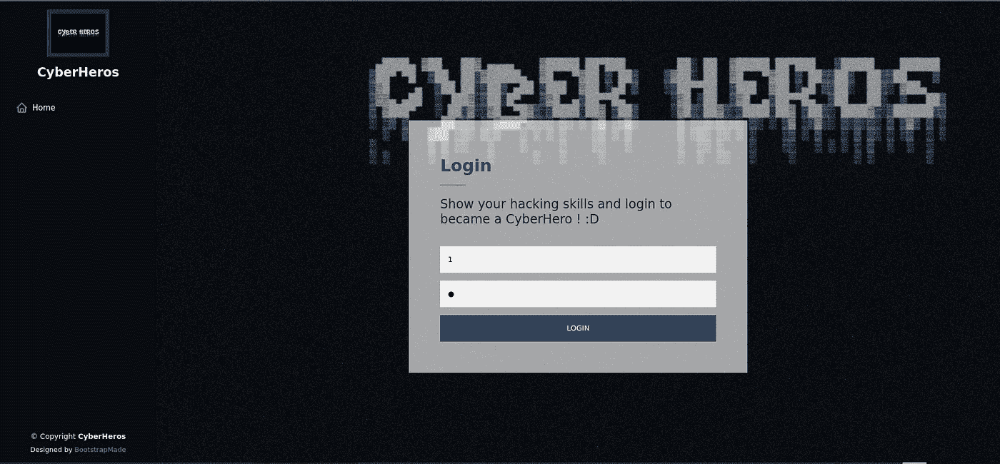
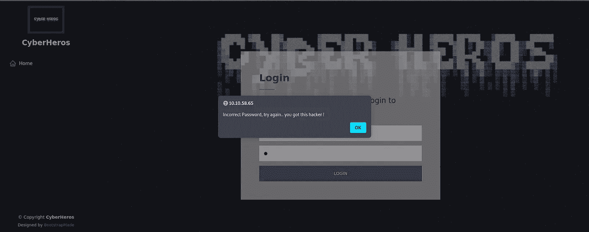
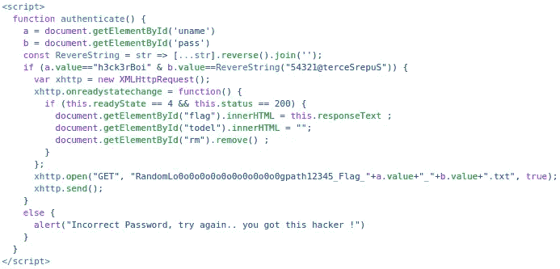

# 为什么客户端认证不好

> 原文：<https://javascript.plainenglish.io/why-client-side-authentication-is-bad-22b745216215?source=collection_archive---------2----------------------->

## 为什么客户端身份验证不是一个好主意的原因。

Photo by [Chris Ried](https://unsplash.com/@cdr6934?utm_source=medium&utm_medium=referral) on [Unsplash](https://unsplash.com?utm_source=medium&utm_medium=referral)

那么什么是真正的客户端认证呢？

简单来说，其实是用户端在做认证，而不是服务器。

现在，身份验证请求被发送到服务器，服务器使用这些信息来验证用户的身份。

# 如何进行客户端身份验证？

很简单，用 JavaScript 就可以了。你可以检查一个变量是否等于另一个变量，然后你就有了一个简单的认证过程。

## 例子

一个例子是来自 TryHackMe 的房间 CyberHeroes，其中在登录页面上有客户端认证。

我们如何检测它是否进行客户端身份验证？

嗯，对我来说，它做了一个警报，通常是客户端的东西。但这并不是**一直**的情况。

检查客户端身份验证最有效的方法是阅读源代码！

We see here it is doing authentication for login.html

所以看 if 语句，它检查`a`的值是否等于 h3ck3rBoi，`b`的值是否等于 reversed 54321@terceSrepuS。

你可以很容易地使用在线反转来反转这个单词，或者只是在代码中使用 JavaScript。

所以现在我们有了一个可以使用的用户和密码

> h3ck3rBoi:SuperSecret@12345

现在，我们可以简单地登录并获得标志！

# 结论

应该不惜代价地避免客户端身份验证，即使您试图尽可能模糊它。默默无闻的安全感没那么管用。拥有客户端认证基本上可以让任何黑客执行白盒测试。

*更多内容看* [***说白了就是***](https://plainenglish.io/) *。报名参加我们的* [***免费周报***](http://newsletter.plainenglish.io/) *。关注我们关于*[***Twitter***](https://twitter.com/inPlainEngHQ)*和*[***LinkedIn***](https://www.linkedin.com/company/inplainenglish/)*。查看我们的* [***社区不和谐***](https://discord.gg/GtDtUAvyhW) *加入我们的* [***人才集体***](https://inplainenglish.pallet.com/talent/welcome) *。*