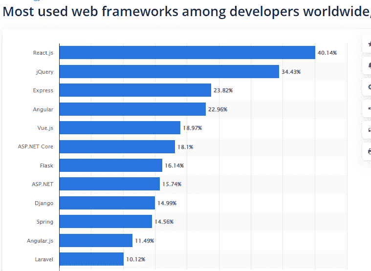

# 为什么要结合 React 和 Node.js 进行全栈 Web App 开发？

> 原文：<https://javascript.plainenglish.io/why-combine-react-with-node-js-for-full-stack-web-app-development-e7c29030f67?source=collection_archive---------6----------------------->

## **结合 React 和 Node.js 进行全栈 Web 应用开发的优势**

[Image Source](https://www.freepik.com/free-photo/close-up-image-programer-working-his-desk-office_5698344.htm#)

当从零开始构建一个全栈 web 应用程序时，很难理解如何以最有效的方式组织代码。如果你曾经使用过像网飞或 Prime Videos 这样的进步的网络应用，那么你肯定知道它们简单的界面是如何被复杂的功能所包裹，并被强大的后端所支持的。

在开发像网飞这样的 web 应用程序时，你的数据库应该做一件事，你的路由系统应该做另一件事，你的业务逻辑应该同时处理应用程序的某些方面——但是这一切是如何结合在一起的呢？

因此，简而言之，开发一个 web 应用程序就是创建一个漂亮的前端，让你的用户与应用程序保持互动。第二件事是开发一个强大的后端，让你的应用程序运行流畅。

在本文中，我们将了解如何使用 React 和 Node 从头构建一个完整的 web 应用程序。js——JavaScript 中的两个强大工具。但是在你开始阅读这篇博客之前，这里有几个问题一直萦绕在你的脑海中:

*   *为什么 React 和 Node.js 是开发前端和后端的热门选择？
    -反应和节点。Js:理解它的基线、优点和用例*
*   *我们可以使用节点。Js 配合 React 进行 Web App 开发？*
*   *正在使用 React and 节点。Js 是创建全栈 Web 应用的致命组合吗？*
*   *这种组合的节点怎么可能。JS 和 React。Js 有利于这样的商家？*
*   *结论:用 React.js 和 Node.js 开发强大的全栈 App*

让我们深入挖掘每一点的细节…

> **为什么 React 和 Node.js 是开发前端和后端的热门选择？**

***结论:*** *JavaScript 库 React，一般用在前端，可以创建有吸引力的用户界面。相比之下，通常在服务器上使用的 Node.js 可以创建可伸缩的应用程序。将 React 和 Node.js 结合起来，对于开发人员构建全栈 web 应用将是极其有益的。*

# 反应和节点。Js:理解它的基线、优点和用例

## **一介绍就反应过来。JS(前端 JS 库)**

ReactJS 是最受欢迎的前端 JavaScript 库之一，它使开发人员能够通过创建可重用的 UI 元素来构建具有数据驱动的动态视图的大型 web 应用程序。此外，它还具有跨多种设备的流畅响应和功能。

[Image Source](https://www.statista.com/statistics/1124699/worldwide-developer-survey-most-used-frameworks-web/)

根据 Statista 的说法，React.js 是最受欢迎但使用最广泛的 web 框架之一，它允许开发人员在不了解复杂框架或编程语言的情况下设计高度可信和可伸缩的 web 应用程序。因为 React.js 受到 WhatsApp、Instagram、网飞、Airbnb 等网站的信任。

> **反应堆的主要亮点**

*   React 是一个 SEO 友好的前端 JS 框架。
*   它附带了详细的文档和教程，帮助初学者快速启动项目。
*   它增强了应用程序的性能，因为它使用了虚拟 DOM。
*   它为构建 web 应用程序的几个组件提供了支持，并增强了动态 web 应用程序开发过程。

> **react . js 的主要特性**

*   它更容易访问和维护
*   确保出色的应用性能
*   提供稳定的代码
*   非常适合开发 web 应用前端

> **react . js 的用例**

*   构建单页面应用程序(spa)
*   创建无缝用户界面
*   网络浏览应用
*   构建大型社交媒体网站的理想选择
*   动态库

要在 web app 开发中综合运用 React.js，值得 [**聘请一位 React 开发者**](https://www.appsdevpro.com/hire-developers/hire-reactjs-developers.html) 就职于领先的 React web 开发公司。利用 React 开发应用程序的专业知识和经验，他们可以帮助您创建成功的 web 应用程序。

## **节点介绍。JS(后端 JS 库)**

Node.js 是用谷歌的 V8 JavaScript 引擎创建的。它是一种开源编程语言，可以在多种平台上运行，并显著减少开发时间。在 Node.js 的帮助下使用 JS 语言和模块时不需要重复。

*[*据统计*](https://webtribunal.net/blog/node-js-stats/#gref) *在美国被查的 63000 多个网站中，有 37000 多个网站在 Node.js 上运行**

*如果你想知道为什么 Node.js 被广泛用于 web 应用程序的后端开发，为什么你应该雇佣一个 Node 应用程序开发人员来开发应用程序？在你相信这些数据之前，我们在这里向你描述 Node.js 的有效理由和优势:*

> ***节点优势。Js***

*   *它可以用于服务器端和客户端应用程序。*
*   *基于 Chrome 的 V8 JS 引擎，Node 可以让你的 app 性能提升 50%。*
*   *非阻塞 I/O 操作支持其运行时环境，因此它支持高效的代码执行。*
*   *Node 提供了比其他 JS 服务器更好的可伸缩性。它支持垂直和水平缩放。*

> ***节点的特性。Js***

*   *无阻塞、异步且依赖于事件发生*
*   *可扩展但非线程化*
*   *最好快速跟踪开发过程。*
*   *与不同设备兼容*
*   *无缓冲的快速数据流*
*   *快速代码开发*
*   *基于 JavaScript*

> ***节点的用例。Js***

*   *实时网络应用*
*   *数据流*
*   *复杂的 spa(单页应用程序)*
*   *服务器上的代理*

*Node.js 是最强大的 JavaScript 库之一，可以帮助您构建强大的后端。你可以 [**在一家优秀的 Node.js web 开发公司雇佣 Node.js 开发人员**](https://www.appsdevpro.com/hire-developers/hire-nodejs-developers.html) 来使用 Node.js 的关键特性和功能。*

## ***有没有可能使用节点。JS 配合 React 进行 Web App 开发？***

*没错。Node.js 有助于创建可伸缩且快速的后端 RESTful APIs。另一方面，React 是一个产生交互式用户界面的前端库。使用这两种工具，您可以毫不费力地创建复杂且可伸缩的 web 应用程序。因此，使用 React.js 和 Node.js 进行全栈 web 应用开发是一个致命的组合。*

*通过 NPM(节点程序包管理器)，您可以使用命令行界面(CLI)安装任何程序包。此外，Node 使用 Webpack 和其他模块从 React 应用程序创建易于编译的单个文件。*

*喜欢有 React.js 的 Node 的请举手！*

## ***正在使用 React and 节点。Js 是创建全栈 Web 应用的致命组合吗？***

*结合 React 和 Node JS 集成的 Web 开发效率更高，节省时间。它还能让企业主从事其他更重要的业务。*

**让我们来看看您可能想要使用全栈 web 开发的原因。**

*   ***提高项目可扩展性***

*当构建复杂的项目时，可伸缩性是企业最关心的问题之一。当使用 Node.js 和 React 通过 [**雇佣一个应用开发者**](https://www.appsdevpro.com/hire-developers.html) 时，他们可以构建交互式的大型数据驱动的 web 应用，这些应用可以在一系列设备上工作。*

*   ***MERN 堆栈组合***

*MERN 堆栈由 MongoDB、Express、React 和 Node.js 组成。没有更好的组合来为网站提供其独特的维度。MERN 堆栈与 Node.js 和 React.js 一起工作，因此 Node 和 React 可以结合起来用于 web 应用程序开发。*

*   ***应用程序中的实时数据管理***

*如果您正在构建流数据应用程序或处理实时数据，Node.js 是一个不错的选择。这种类型的应用程序需要持续的服务器连接，Node.js 为您的应用程序提供持续的支持。*

*   ***发展更快***

*将 React 与 Node 结合起来可以产生很高的投资回报，并节省您的金钱和时间，因为这些技术为构建快速、有效且易于维护的网站提供了一个理想的平台。*

*   ***单页应用(SPA)***

*你正在寻找一个具有异步数据加载的单页应用程序吗？如果是这样的话，那么使用节点后端 React 是一个不错的选择，因为它使您能够构建一个带有回调函数的轻量级后端模型。*

*   ***Web 应用前端和后端开发都使用单一语言***

*有了 Node 和 React 的使用，开发者就不必学习 Python 或 Ruby 等各种复杂的语言。他们只需将 Node 用于服务器端开发，将 React 用于前端。除了节省资源、金钱和时间，这种回收还减少了浪费。*

*   ***过度使用 JavaScript***

*Node with React 为前端和后端都提供了 JavaScript，这为创建网站和 web 应用程序提供了更多的自由和灵活性。开发者可以在整个应用开发过程中使用 JavaScript 作为单一语言。*

**简而言之:如果你决定使用 Node.js 和 React 来构建一个 web 应用程序，你应该雇佣 Node.js 和 React 开发人员。通过这种方式，你将有效地使用这两种技术，从而为你的企业形成优秀的 web 应用。**

## ***这种节点的组合。JS 和 React。Js 有利于这样的商家？***

*为了在当今竞争激烈的市场中生存下来，企业必须瞄准他们的客户，为他们提供能够提供出色用户体验的解决方案。幸运的是，React with Node.js 提供了一个平台，可以让您快速构建强大的 web 应用程序，并在许多设备上保持高水平的性能。*

*对于那些希望构建能够处理大量数据的现代、响应迅速的 web 应用程序的人来说，Node.js 和 React 是很好的选择。为什么不试一试？*

*React 设计模型的简单性允许创建可重用的组件，而 Node.js 的事件驱动架构使得以更快的速度处理大量流量成为可能。*

*总而言之，选择致命的组合来开发全栈 web 应用对企业来说将是一个值得的决定。他们可以使用 Node.js 和 React 组合轻松节省时间和资金，并能够为其业务增加竞争优势。*

## ***结论:用 React 和 Node.js 开发强大的全栈 App***

*在这篇博客的最后，可以说这两种技术可以很好地协同工作。Node.js 是一个服务器端平台，以高效的速度提供数据处理，可用于构建用 JavaScript 编写的 web 服务器。*

*React 是一个前端框架，帮助开发人员使用 Javascript 从组件创建接口。通过 [**雇佣一个 web app 开发者**](https://www.appsdevpro.com/hire-developers/hire-web-app-developers.html) ，你可以将这些 JS 库无缝结合，创建一个强大的网站。*

*这些框架的强大功能可以帮助您构建一个应用程序，而无需使用麻烦且耗时的其他框架。因此，如果你终于方便的想法，并寻找一个专家团队的开发人员，然后在这里你可以放下下面的查询！*

*======================================*

**更多内容请看*[***plain English . io***](https://plainenglish.io/)*。报名参加我们的* [***免费周报***](http://newsletter.plainenglish.io/) *。关注我们关于*[***Twitter***](https://twitter.com/inPlainEngHQ)[***LinkedIn***](https://www.linkedin.com/company/inplainenglish/)*[***YouTube***](https://www.youtube.com/channel/UCtipWUghju290NWcn8jhyAw)*[***不和***](https://discord.gg/GtDtUAvyhW) *。****