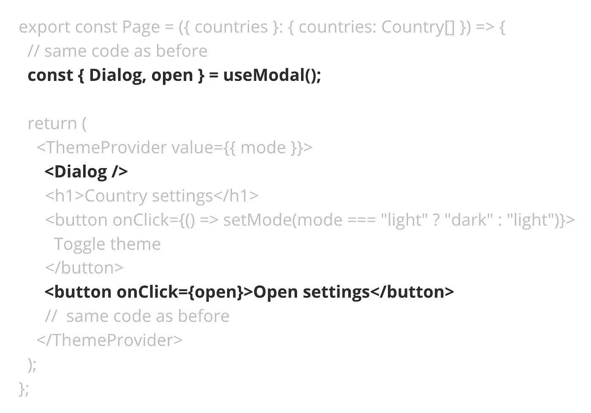
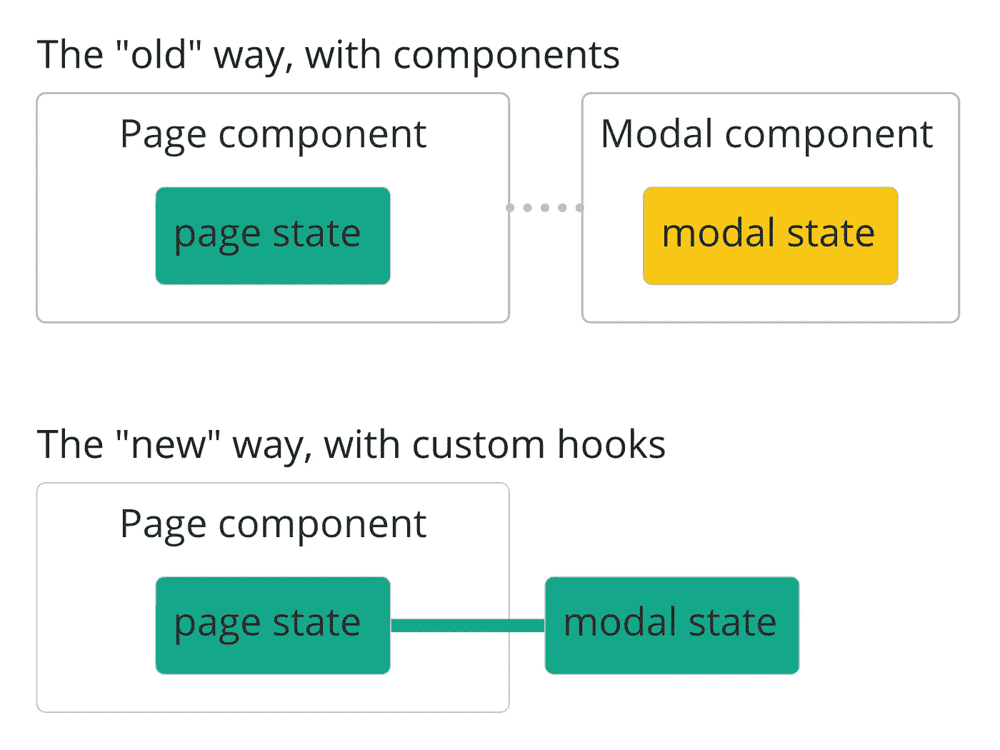
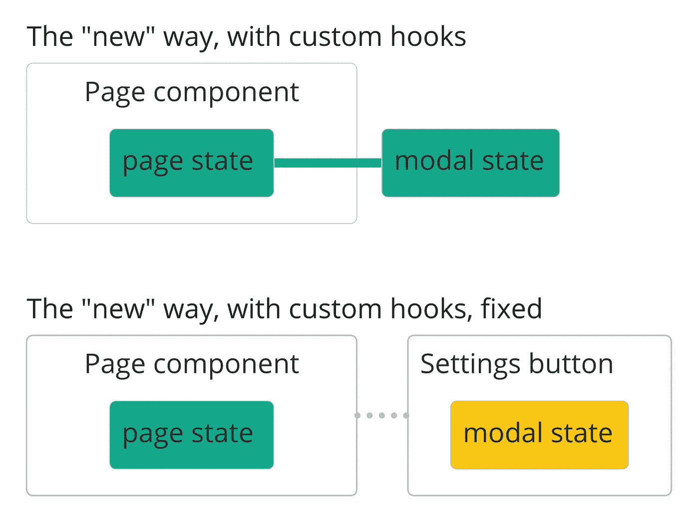

# 为什么自定义的 React 钩子会破坏你的应用程序的性能

> 原文：<https://javascript.plainenglish.io/why-custom-react-hooks-could-destroy-your-app-performance-2fabbcbdff8e?source=collection_archive---------2----------------------->

## 探究为什么 react 自定义挂钩会对 React 性能产生不利影响，以及如何应对。


吓人的标题，不是吗？可悲的是，这是真的:对于性能敏感的应用程序，如果不小心编写和使用，自定义的 React 钩子很容易变成最大的性能杀手。

我不打算在这里解释如何构建和使用钩子，如果你以前从未构建过钩子，React 文档有一个[很好的介绍](https://reactjs.org/docs/hooks-custom.html)。今天我想重点讨论的是它们对复杂应用程序的性能影响。

# 让我们在自定义钩子上构建一个模态对话框

本质上，钩子只是一些高级功能，允许开发人员使用状态和上下文之类的东西，而无需创建新的组件。当您需要在应用程序的不同部分之间共享需要状态的相同逻辑时，它们非常有用。随着钩子的出现，React 开发进入了一个新时代:我们的组件从来没有像钩子一样纤细整洁，不同关注点的分离也像钩子一样容易实现。

例如，让我们实现一个模态对话框。使用定制挂钩，我们可以在这里打造出一件美丽的作品。

首先，让我们实现一个“基础”组件，它没有任何状态，只是在提供了`isOpen` prop 时呈现对话框，并在单击对话框下面的毯子时触发`onClose`回调。

```
*type ModalProps = {
  isOpen: boolean;
  onClosed: () => void;
};

export const ModalBase = ({ isOpen, onClosed }: ModalProps) => {
  return isOpen ? (
    <>
      <div css={modalBlanketCss} onClick={onClosed} />
      <div css={modalBodyCss}>Modal dialog content</div>
    </>
  ) : null;
};*
```

现在转到状态管理，即“打开对话/关闭对话”逻辑。在“旧”的方式中，我们通常会实现它的“智能”版本，它处理状态管理并接受一个组件，该组件应该作为道具触发对话框的打开。大概是这样的:

```
*export const ModalDialog = ({ trigger }) => {
  const [isOpen, setIsOpen] = useState(false);

  return (
    <>
      <div onClick={() => setIsOpen(true)}>{trigger}</div>
      <ModalBase isOpen={isOpen} onClosed={() => setIsOpen(false)} />
    </>
  );
};*
```

它会被这样使用:

```
*<ModalDialog trigger={<button>Click me</button>} />*
```

这不是一个特别好的解决方案，我们将触发器组件包装在一个 div 中，从而打乱了它在模态对话框中的位置和可访问性。更不用说这个不必要的 div 会导致 DOM 变得更大更乱。

现在看魔术。如果我们将“打开/关闭”逻辑提取到一个定制的钩子中，将这个组件**呈现在钩子**中，并公开 API 来控制它作为钩子的返回值，我们就可以两全其美了。在钩子中，我们将有一个“智能”对话框来处理它自己的状态，但不会干扰触发器，也不需要触发器:

```
*const [isOpen, setIsOpen] = useState(false);

  const open = () => setIsOpen(true);
  const close = () => setIsOpen(false);
  const Dialog = () => <ModalBase onClosed={close} isOpen={isOpen} />;

  return { isOpen, Dialog, open, close };
};*
```

在消费者方面，我们将拥有最少的代码，同时完全控制触发对话的内容:

```
*const ConsumerComponent = () => {
  const { Dialog, open } = useModal();

  return (
    <>
      <button onClick={open}>Click me</button>
      <Dialog />
    </>
  );
};*
```

如果这还不是完美，我不知道什么是完美！😍[在 codesandbox](https://codesandbox.io/s/modal-dialog-example1-9ds2c?file=/src/App.tsx) 看到这个美女。只是不要急着马上在你的应用中使用它，直到你读到它的阴暗面😅

# 性能影响

在[上一篇文章](https://www.developerway.com/posts/how-to-write-performant-react-code)中，我详细介绍了导致性能不佳的各种模式，我实现了一个“慢”应用程序:页面上呈现了一个简单的、未经优化的大约 250 个国家的列表。但是每一次交互都会导致整个页面被重新渲染，这可能是最慢的简单列表。[这里是 codesandbox](https://codesandbox.io/s/re-renders-final-bad-4znwe) ，点击列表中不同的国家来明白我的意思(如果你在最新的 Mac 上稍微调节一下你的 CPU 来获得更好的印象)。

> **如何节流 CPU** :在 Chrome 开发者工具中打开“性能”标签，点击右上角的“齿轮”图标——会打开一个附加的小面板，里面有节流选项。

我将在那里使用我们新的完美模态对话框，看看会发生什么。主`Page`组件的代码相对简单，如下所示:

```
*export const Page = ({ countries }: { countries: Country[] }) => {
  const [selectedCountry, setSelectedCountry] = useState<Country>(countries[0]);
  const [savedCountry, setSavedCountry] = useState<Country>(countries[0]);
  const [mode, setMode] = useState<Mode>('light');

  return (
    <ThemeProvider value={{ mode }}>
      <h1>Country settings</h1>
      <button onClick={() => setMode(mode === 'light' ? 'dark' : 'light')}>Toggle theme</button>
      <div className="content">
        <CountriesList countries={countries} onCountryChanged={(c) => setSelectedCountry(c)} savedCountry={savedCountry} />
        <SelectedCountry country={selectedCountry} onCountrySaved={() => setSavedCountry(selectedCountry)} />
      </div>
    </ThemeProvider>
  );
};*
```

现在，我需要一个靠近“切换主题”按钮的按钮，该按钮将打开一个模式对话框，其中包含该页面的一些未来附加设置。幸运的是，现在已经简单得不能再简单了:在顶部添加`useModal`钩子，在需要的地方添加按钮，并将`open`回调传递给按钮。`Page`组件几乎没有变化，仍然非常简单:



你可能已经猜到了结果🙂有史以来最慢的两个空 div 出现😱。[参见 codesandbox。](https://codesandbox.io/s/re-renders-bad-with-dialog-6egnq?file=/src/country-settings/page.tsx)

你看，这里所发生的，就是我们的`useModal`钩使用状态。正如我们所知，状态变化是组件重新呈现自身的原因之一。这也适用于钩子——如果钩子的状态改变,“主机”组件将重新呈现。这完全说得通。如果我们仔细观察`useModal`钩子内部，我们会发现它只是围绕`setState`的一个很好的抽象，它存在于`Dialog`组件的之外的**。本质上，这与直接调用`Page`组件中的`setState`没有什么不同。**

这就是钩子的最大危险:是的，它们帮助我们使 API 变得非常好。但是我们所做的结果是，钩子的方式非常鼓励它，本质上是从它应该在的地方**提升状态。除非你深入到`useModal`实现内部，或者对钩子和重新渲染有丰富的经验，否则这是完全不明显的。我甚至没有在`Page`组件中直接使用状态，从它的角度来看，我所做的只是渲染一个`Dialog`组件，并调用一个命令式 API 来打开它。**

在“旧世界”中，状态会被封装在带有`trigger`道具的略显丑陋的`Modal`对话框中，当按钮被点击时`Page`组件会保持完整。现在点击按钮改变了整个页面组件**的状态**，导致其重新渲染(这对于这个应用程序来说超级慢)。只有在 React 完成了所有重新渲染后，对话框才会出现，因此会有很大的延迟。



那么，我们能做些什么呢？我们可能没有时间和资源来修复`Page`组件的底层性能，因为这通常会发生在“真正的”应用程序上。但至少我们可以确保这个新特性不会增加性能问题，而且它本身很快。这里我们需要做的只是将模态状态“下移”，远离缓慢的`Page`组件:

```
*const SettingsButton = () => {
  const { Dialog, open } = useModal();

  return (
    <>
      <button onClick={open}>Open settings</button>
      <Dialog />
    </>
  );
};*
```

而在`Page`中只是渲染了`SettingsButton`:

```
*export const Page = ({ countries }: { countries: Country[] }) => {
  // same as original page state
  return (
    <ThemeProvider value={{ mode }}>
      // stays the same
      <SettingsButton />
      // stays the same
    </ThemeProvider>
  );
};*
```

现在，当点击按钮时，只有`SettingsButton`组件会重新渲染，慢速的`Page`组件不受影响。本质上，我们在模仿状态模型，就像它在“旧”世界中一样，同时保留了基于钩子的 API。参见 [codesandbox](https://codesandbox.io/s/re-renders-bad-with-dialog-fixed-rrfey?file=/src/country-settings/page.tsx) 中的解决方案。



# 为`useModal`挂钩增加更多功能

让我们的钩子性能对话稍微暗一点🙂。例如，假设您需要跟踪模式内容中的滚动事件。也许你想在用户滚动文本时发送一些分析事件来跟踪阅读。如果我不想在`BaseModal`中引入“智能”功能，而是在`useModal`钩子中实现，会发生什么？

相对容易实现。我们可以在那里引入一个新的状态来跟踪滚动位置，在`useEffect`钩子中添加事件侦听器，并将 ref 传递给`BaseModal`以获取内容元素来附加侦听器。大概是这样的:

```
*export const ModalBase = React.forwardRef(({ isOpen, onClosed }: ModalProps, ref: RefObject<any>) => {
  return isOpen ? (
    <>
      <div css={modalBlanketCss} onClick={onClosed} />
      <div css={modalBodyCss} ref={ref}>
        // add a lot of content here
      </div>
    </>
  ) : null;
});

export const useModal = () => {
  const [isOpen, setIsOpen] = useState(false);
  const ref = useRef<HTMLElement>(null);
  const [scroll, setScroll] = useState(0);

  // same as before

  useEffect(() => {
    const element = ref.current;
    if (!element) return;

    const handleScroll = () => {
      setScroll(element?.scrollTop || 0);
    };

    element.addEventListener('scroll', handleScroll);
    return () => {
      element.removeEventListener('scroll', handleScroll);
    };
  });

  const Dialog = () => <ModalBase onClosed={close} isOpen={isOpen} ref={ref} />;

  return {
    isOpen,
    Dialog,
    open,
    close,
  };
};*
```

现在我们可以对这个状态做任何事情。现在让我们假设前面的性能问题不是什么大问题，并再次在慢速页面组件中直接使用这个钩子。[参见 codesandbox](https://codesandbox.io/s/re-renders-bad-with-dialog-with-scroll-p9wi8?file=/src/country-settings/page.tsx) 。

滚动甚至不能正常工作！😱每次我试图滚动对话框内容时，它都会重置到顶部！

好吧，我们来逻辑思考一下。[我们已经知道](https://www.developerway.com/posts/how-to-write-performant-react-code)，在渲染函数中创建组件是邪恶的，因为 React 会在每次重新渲染时重新创建和挂载它们。我们知道钩子会随着状态的改变而改变。这意味着现在，当我们引入滚动状态时，每次滚动改变我们都在改变状态，这导致钩子重新呈现，这导致`Dialog`组件重新创建自己。完全相同的问题，就像在渲染函数中创建组件一样，有完全相同的解决方法:我们需要将这个组件提取到钩子之外，或者只是将它屏蔽掉。

```
*const Dialog = useMemo(() => {
  return () => <ModalBase onClosed={close} isOpen={isOpen} ref={ref} />;
}, [isOpen]);*
```

焦点行为是固定的，但这里有另一个问题:缓慢的`Page`组件在每次滚动时重新渲染！这一点很难注意到，因为对话内容只是文本。例如，尝试将 CPU 降低 6 倍，滚动，然后立即高亮显示对话框中的文本。浏览器甚至不允许这样做，因为它忙于重新渲染下面的`Page`组件！[参见 codesandbox。](https://codesandbox.io/s/re-renders-bad-with-dialog-with-scroll-fixed-scroll-0s5g3?file=/src/country-settings/page.tsx)滚动几下后，你的笔记本电脑可能会因为 100%的 CPU 负载而试图飞向月球😅

是的，我们肯定需要在发布到生产之前解决这个问题。让我们再来看看我们的组件，尤其是这一部分:

```
*return {
  isOpen,
  Dialog,
  open,
  close,
};*
```

我们在每次重新渲染时都返回一个新的对象，因为我们现在在每次滚动时都重新渲染我们的钩子，这意味着对象在每次滚动时都会改变。但是我们在这里没有使用滚动状态，它完全是在`useModal`钩子内部使用的。难道仅仅记住那个物体就能解决问题吗？

```
*return useMemo(
  () => ({
    isOpen,
    Dialog,
    open,
    close,
  }),
  [isOpen, Dialog],
);*
```

你知道这最精彩(或最恐怖)的部分吗？它没有！😱[参见 codesandbox](https://codesandbox.io/s/re-renders-bad-with-dialog-with-scroll-fixed-scroll-and-memo-35lqx?file=/src/country-settings/modal-dialog.tsx) 。

这是另一个与钩子有关的巨大的性能问题。事实证明，钩子中的状态变化是不是“内部的”并不重要。**钩子的每一次状态变化，无论是否影响其返回值，都会导致“宿主”组件重新渲染。**

当然，链接钩子的情况完全相同:如果钩子的状态发生变化，它将导致它的“主机”钩子也发生变化，这将通过整个钩子链向上传播，直到它到达“主机”组件并重新渲染它(这将导致重新渲染的另一个连锁反应，现在只在下游)，**而不管中间应用的任何记忆**。

将“滚动”功能提取到一个钩子中绝对没有任何区别，缓慢的页面组件将重新呈现😔。

```
*const useScroll = (ref: RefObject) => {
  const [scroll, setScroll] = useState(0);

  useEffect(() => {
    const element = ref.current;
    if (!element) return;

    const handleScroll = () => {
      setScroll(element?.scrollTop || 0);
    };

    element.addEventListener('scroll', handleScroll);
    return () => {
      element.removeEventListener('scroll', handleScroll);
    };
  });

  return scroll;
};

export const useModal = () => {
  const [isOpen, setIsOpen] = useState(false);
  const ref = useRef<HTMLElement>(null);
  const scroll = useScroll(ref);

  const open = useCallback(() => {
    setIsOpen(true);
  }, []);

  const close = useCallback(() => {
    setIsOpen(false);
  }, []);

  const Dialog = useMemo(() => {
    return () => <ModalBase onClosed={close} isOpen={isOpen} ref={ref} />;
  }, [isOpen, close]);

  return useMemo(
    () => ({
      isOpen,
      Dialog,
      open,
      close,
    }),
    [isOpen, Dialog, open, close],
  );
};*
```

[参见 codesandbox](https://codesandbox.io/s/re-renders-bad-with-dialog-with-scroll-extracted-woeer?file=/src/country-settings/modal-dialog.tsx) 。

怎么修？好吧，这里唯一要做的就是将滚动跟踪钩子移到`useModal`钩子之外，并在不会导致重渲染链的地方使用它。可以介绍`ModalBaseWithAnalytics`组件为例:

```
*const ModalBaseWithAnalytics = (props: ModalProps) => {
  const ref = useRef<HTMLElement>(null);
  const scroll = useScroll(ref);

  console.log(scroll);

  return <ModalBase {...props} ref={ref} />;
};*
```

然后用在`useModal`钩上代替`ModalBase`:

```
*export const useModal = () => {
  // the rest is the same as in the original useModal hook

  const Dialog = useMemo(() => {
    return () => <ModalBaseWithAnalytics onClosed={close} isOpen={isOpen} ref={ref} />;
  }, [isOpen, close]);

  return useMemo(
    () => ({
      isOpen,
      Dialog,
      open,
      close,
    }),
    [isOpen, Dialog, open, close],
  );
};*
```

现在，滚动导致的状态变化将局限于`ModalBaseWithAnalytics`组件，不会影响慢速的`Page`组件。[参见 codesandbox。](https://codesandbox.io/s/re-renders-bad-with-dialog-scroll-fixed-for-good-v6ohp?file=/src/country-settings/modal-dialog.tsx)

今天到此为止！希望这篇文章足够让你害怕，帮助你更好地理解定制钩子，以及如何在不影响应用程序性能的情况下编写和使用它们。在离开之前，让我们回顾一下性能挂钩的规则:

*   钩子中的每一个状态变化都会导致它的“主机”组件重新呈现，不管这个状态是否在钩子值中返回，是否被 memoised
*   与链式挂钩相同，挂钩中的每个状态变化都会导致所有“父”挂钩发生变化，直到它到达“主机”组件，这将再次触发重新渲染

以及在编写或使用定制钩子时需要注意的事项:

*   当使用一个定制钩子时，确保这个钩子封装的状态没有在组件方法中没有使用的级别上使用。如有必要，将其“向下”移动到一个较小的组件
*   永远不要在钩子中实现“独立”状态，也不要在独立状态下使用钩子
*   当使用自定义钩子时，确保它不会执行一些独立的状态操作，这些操作不会在其返回值中公开
*   当使用一个自定义钩子时，确保它使用的所有钩子都遵循上面的规则

保持安全，并希望您的应用程序从现在开始快速运行！✌🏼

*最初发表于*[*【https://www.developerway.com】*](https://www.developerway.com)*。网站上有更多这样的文章*😉

[*订阅简讯*](https://www.developerway.com/) 、[*在 LinkedIn*](https://www.linkedin.com/in/adevnadia/) *或* [*上关注 Twitter*](https://twitter.com/adevnadia) *以便在下一篇文章出来时立即获得通知。*

*更多内容请看*[***plain English . io***](http://plainenglish.io/)*。报名参加我们的* [***免费周报***](http://newsletter.plainenglish.io/) *。在我们的* [***社区不和谐***](https://discord.gg/GtDtUAvyhW) *获取独家写作机会和建议。*