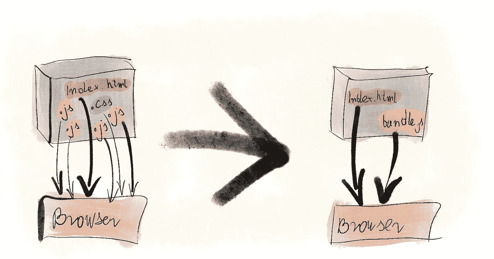
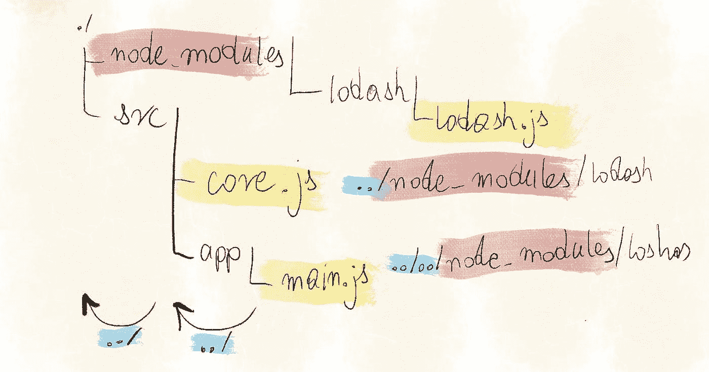
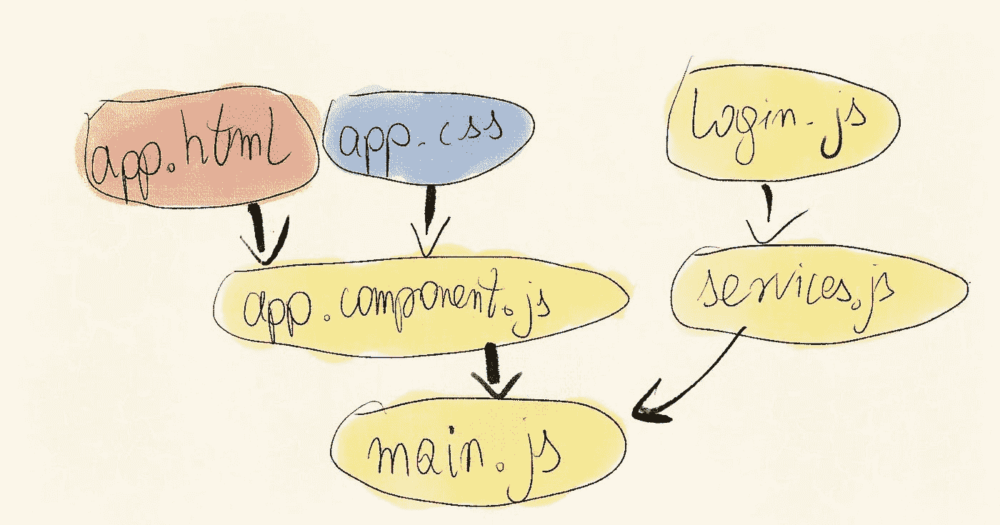
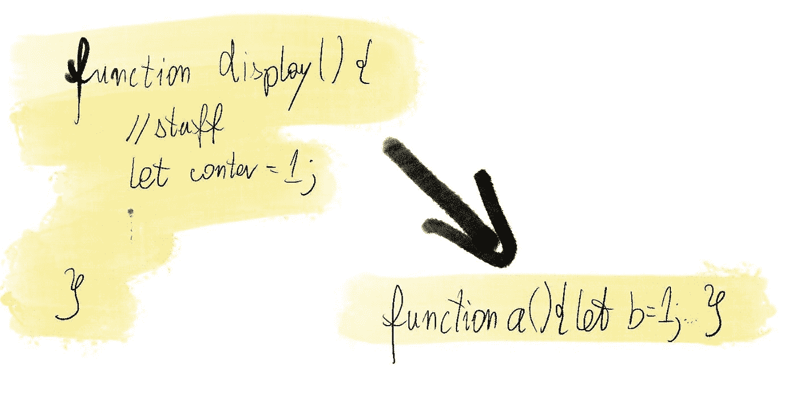
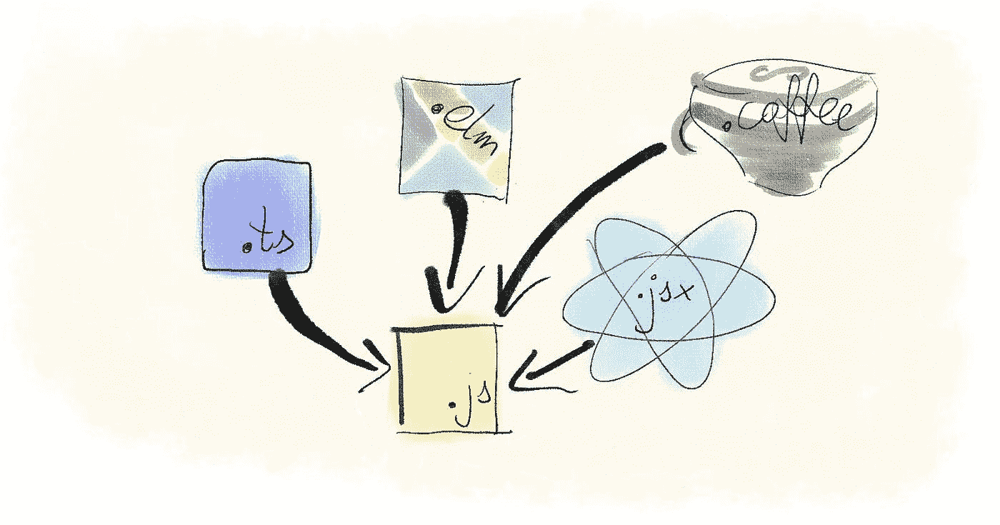

# 为什么我们要使用 JavaScript Bundlers？

> 原文：<https://javascript.plainenglish.io/why-do-we-use-javascript-bundlers-e8935dc362c3?source=collection_archive---------10----------------------->

## 找出使用 JavaScript bundlers 背后的原因。


JavaScript 是一种解释型语言，不需要编译。您的浏览器可以执行您编写的相同代码。那么我们为什么要使用 JavaScript bundlers 呢？

# 更少的 JS 文件

从历史上看，一个网站使用的 JS 文件的数量是至关重要的，因为拥有许多小文件会降低性能。浏览器用单独的 HTTP 请求加载每个文件。每个请求都需要浏览器和服务器之间的连接，而这需要时间来建立。多亏了 HTTP/2，现在文件的数量不再是问题了。尽管如此，将文件捆绑在一起还是有意义的。每个请求都是单独缓存的，因此拥有大量文件使得确保浏览器不会从缓存中获取过时代码变得更加困难。

除此之外，直到 2018 年，很多浏览器都不支持 es 模块。您只是从 HTML 中加载了许多文件，它们都共享相同的全局范围。JavaScript 捆绑器解决了这两个问题，因为它们:

*   允许您将代码库分成许多定义明确的文件
*   将代码打包成大文件进行部署。



# 从`node_modules`轻松导入

Bundlers 为您提供了一种导入依赖项的方式，这比将它们作为 es 模块加载要好得多。要从浏览器使用节点包，您需要:

*   将`node_modules`部署到您的生产服务器上，并且
*   使用从文件到要导入的文件的相对路径

相对路径是一个大问题，因为它迫使您根据文件夹结构的深度编写稍微不同的导入。因此，要使用 Lodash，您需要:

```
var _ = require('../node_modules/lodash/lodash.js'); var _ = require('../../node_modules/lodash/lodash.js');
```

捆绑器允许您简单地书写:



# 导入其他文件类型

你的代码库不仅仅是 JavaScript。当您按组件或路径组织代码时，每个组件或路径都有自己的模板和样式。原生 ES 模块不允许导入 JS 以外的资源类型。这种限制会使您从 HTML 导入 CSS，而组件的其余部分是用 JavaScript 导入的——从而迫使您保持两个不相关的文件同步。JavaScript bundlers 通过让您直接从 JS 文件中管理所有这些依赖关系来解决这个问题:

```
import './core.js'; import './style.css'; const template = require('./view.html');
```



# 传输码

很多 JavaScript 不是简单的 JavaScript；它用 TypeScript 等语言编写，然后编译成 JavaScript。这种代码到代码的编译称为 transpilation。出于几个原因，大部分 JavaScript 都是透明的。

# 代码精简

如果您按照您应该做的那样编写代码，那么您正在做以下事情:

*   给变量起有意义的名字
*   缩进代码
*   给其他开发者留下评论

这对解释者来说毫无意义。缩小是减小有效载荷尺寸的第一步。它会删除对您的应用程序没有影响的所有内容。



# 旧浏览器降级

随着语言接受新的特征，有一个时期

*   开发人员已经想使用它了，而且
*   不是所有的浏览器都支持它。

幸运的是，由于 evergreen 浏览器的出现，这段时间变得非常短，但是仍然需要像 Babel 这样的项目。Babel 允许你在编码时使用最新的语言版本，并将其转换成旧版本浏览器能够理解的版本。

# JavaScript 风格

除了普通的 JavaScript，您还可以使用它的许多风格:

*   以打字打的文件
*   纯脚本
*   榆树
*   咖啡脚本

JavaScript bundlers 甚至可以处理一个项目中不同风格的混合——这听起来是个坏主意，直到您最终使用遗留代码，并且需要很大的灵活性来选择正确的优先级。



# 不同用例的单独构建

一旦你开始用捆绑器编译你的代码，新的可能性就会出现。从一开始，您很可能以一种方式编译代码用于生产，以另一种方式编译用于本地开发。如果你写单元测试，也许你有兴趣知道它们如何覆盖你的代码。有代码覆盖工具可以做到这一点。它们需要一个专门的构建，包括在测试执行期间对每一行代码的访问进行计数的工具。

# 你呢？

你计划在你的下一个项目中使用什么 JavaScript bundler？在[投票](https://strawpoll.com/2gpdcr2g3)中让我知道，这样我就知道哪个应该在这个博客上得到更多关注:

# 下一步是什么？

你可以看看我写的关于使用[本地 ES 模块](https://how-to.dev/how-to-use-native-es-modules)的文章，或者:

*   [我的 esbuild 视频课程](https://bit.ly/esbuild-course)
*   [我的 webpack 视频课程](https://bit.ly/WebpackCourse)

*最初发布于*[*https://how-to . dev*](https://how-to.dev/why-do-we-use-javascript-bundlers)*。*

*更多内容请看* [***说白了就是***](http://plainenglish.io/) *。报名参加我们的**[***免费每周简讯***](http://newsletter.plainenglish.io/) *。在我们的* [***社区***](https://discord.gg/GtDtUAvyhW) *获得独家获得写作机会和建议。**