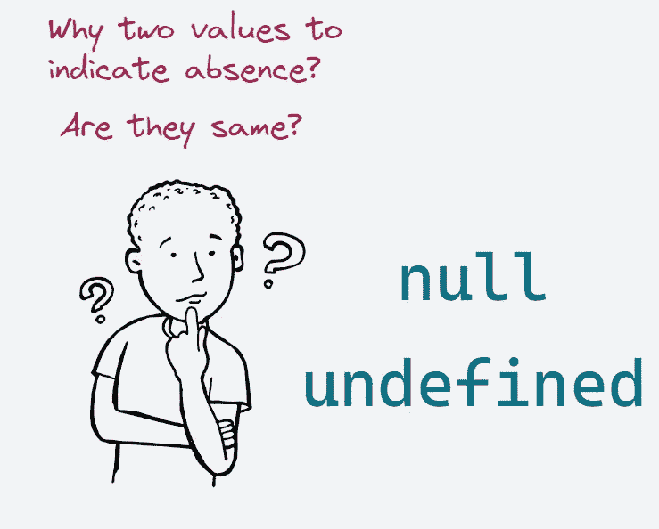
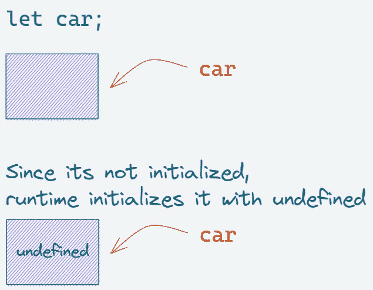
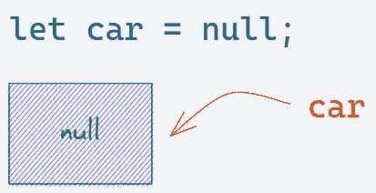

# 为什么 JavaScript 既有 Null 又有 Undefined？

> 原文：<https://javascript.plainenglish.io/why-does-javascript-have-both-null-and-undefined-6a42fcca9301?source=collection_archive---------2----------------------->

## 了解这两者的不同之处，以编写无错误的代码。



大多数编程语言都有一个值来表示缺少某样东西，这个值通常被称为`null`，用来表示一个没有相关值的变量。

但是 JavaScript 不一样。刚开始使用 JavaScript 或来自不同语言的人通常会发现很难理解，为什么有两个值表示缺席:`null`和`undefined`。

此外，由于`null`和`undefined`被强制为一个错误的值，开发人员通常通过将它们视为相同的值来逃避责任。

理解这两者的不同将使您能够编写无错误的代码，而不是依赖猜测。在这篇文章中，让我们试着深入了解它们。

# 不明确的



简单地说，`undefined`意味着一个变量已经被声明，但是还没有被赋值。为了更好地理解这一点，让我们看一下在 Javascript 中赋值`undefined`的某些情况。

1.  当一个变量没有初始化时，javascript 隐式地给它赋值`undefined`。

```
let car;console.log(car) 
//undefined
```

2.当数组或对象中的值没有被赋值时

```
const nums = [1, , 3, 4];
console.log(nums[1]); 
//undefinedconst obj = {name: 'John'}
console.log(obj.age)
//undefined
```

3.当一个函数不返回任何值，而是被赋值给一个变量时。

```
function sum(a, b){
   const sum = a + b;
}const sumVal = sum(3, 4);
console.log(sumVal); 
//undefined
```

所以，每当一个值没有被赋值时，JavaScript 就隐式地赋值`undefined`。

# 空



值`null`是一个赋值值。它可以作为无值的表示赋给变量。

```
let car = null;console.log(car); 
//null
```

`null`用来表示故意没有值。它永远不会被运行时赋值。

# 异同

## 1.数据类型

让我们使用`typeof`操作符来查看`undefined`和`null`的数据类型。

```
console.log(typeof(undefined))
//undefinedconsole.log(typeof(null))
//object
```

正如我们所见，`undefined`是一个类型本身(未定义)，而`null`是一个对象。

但是`null`作为对象的数据类型不成立。事实上，`null`是 JavaScript 中的[原始数据类型](https://developer.mozilla.org/en-US/docs/Glossary/Primitive)之一。

这背后的原因是，在 JavaScript 的初始实现中，JavaScript 值被表示为一个类型标记和一个值。对象的类型标签是`0`。`null`被表示为空指针(在大多数平台中为`0x00`)。因此，`null`有`0`作为类型标签，因此`typeof`返回值“object”。

所以，这被认为是一个 bug，无法修复，因为它会破坏太多的脚本。

## 2.算术运算

在算术运算中使用时，`undefined`在后台被转换为 NaN(不是一个数字)和`null`为 0。

```
console.log(undefined + 1)
//NaNconsole.log(null + 1)
//1
```

## 3.条件表达式

在条件表达式中使用时，`undefined`和`null`都将返回 false。

```
console.log(!!undefined)
//falseconsole.log(!!null)
//false
```

## 4.比较

看看它们如何处理等式操作符是很有趣的。对于松散的等式运算符，结果为`true`。

```
undefined == null
//true
```

这是因为，当您使用松散相等运算符时，对象被转换为相同的类型，然后进行比较。

但是当我们使用检查类型和值的严格相等操作符时，会产生`false`，因为它们属于不同的类型。

```
undefined === null 
//false
```

# 摘要

*   `null`是一个赋值。意思是*没有价值。*
*   `undefined`通常表示变量已经声明但尚未定义。
*   `null`和`undefined`为假值。
*   `null`和`undefined`都是原语。但是由于一个 bug，显示`typeof null = object`。
*   `null == undefined`是`true`，但是`null === undefined`是`false`。

耶，你已经走到尽头了。希望你今天的概念有点清楚了。敬请关注更多此类帖子。

*更多内容请看*[***plain English . io***](https://plainenglish.io/)*。报名参加我们的* [***免费周报***](http://newsletter.plainenglish.io/) *。关注我们关于*[***Twitter***](https://twitter.com/inPlainEngHQ)[***LinkedIn***](https://www.linkedin.com/company/inplainenglish/)*[***YouTube***](https://www.youtube.com/channel/UCtipWUghju290NWcn8jhyAw)*[***不和***](https://discord.gg/GtDtUAvyhW) *。对增长黑客感兴趣？检查* [***电路***](https://circuit.ooo/) *。***