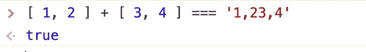
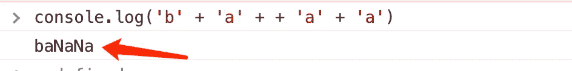

# “编号为什么。MIN_VALUE > 0”在 JavaScript 中返回“true”？

> 原文：<https://javascript.plainenglish.io/why-does-number-min-value-0-return-true-in-javascript-d55124859001?source=collection_archive---------5----------------------->

## JavaScript 中需要知道的 4 件有趣而奇怪的事情。


Photo by [Gabriel Crismariu](https://unsplash.com/@momentsbygabriel?utm_source=medium&utm_medium=referral) on [Unsplash](https://unsplash.com?utm_source=medium&utm_medium=referral)

JavaScript 是一种非常有趣又奇怪的语言，**我已经用它工作了很多年，但有时它就像一个陌生人，我对它一无所知。**

我发现了 4 个古怪的例子，想和你分享，希望你会喜欢。

# 1.号码。MIN_VALUE 大于 0？

朋友们，你们会大吃一惊的。

下面的代码会输出什么？`true`还是`false`？

嗯，让我猜猜，也许我们都认为它会印上`false`，但不幸的是，它竟然是`true`。

我的天啊。我对 JavaScript 一窍不通吗？

**为什么**

(来自 [mdn](https://developer.mozilla.org/en-US/docs/Web/JavaScript/Reference/Global_Objects/Number/MIN_VALUE) )属性`Number.MIN_VALUE` 表示 JavaScript 中可表示的最小正数值。

`Number.MIN_VALUE`是可以在浮点精度内表示的最小正数(不是最大的负数)，换句话说，是最接近 0 的数字。

这是`JavaScript`中的正常行为，只是`Number.MIN_VALUE`让我们认为它应该是最小的负数。我错了，我真的对`JavaScript`一无所知。

# 2.这是一段可以执行的代码。

JavaScript 简单地做所有的事情，你能相信这是一段有效的代码吗？试着把它复制到你的浏览器控制台上，你会很惊讶的。

```
[][(![]+[])[+[]]+(![]+[])[!+[]+!+[]]+(![]+[])[+!+[]]+(!![]+[])[+[]]][([][(![]+[])[+[]]+(![]+[])[!+[]+!+[]]+(![]+[])[+!+[]]+(!![]+[])[+[]]]+[])[!+[]+!+[]+!+[]]+(!![]+[][(![]+[])[+[]]+(![]+[])[!+[]+!+[]]+(![]+[])[+!+[]]+(!![]+[])[+[]]])[+!+[]+[+[]]]+([][[]]+[])[+!+[]]+(![]+[])[!+[]+!+[]+!+[]]+(!![]+[])[+[]]+(!![]+[])[+!+[]]+([][[]]+[])[+[]]+([][(![]+[])[+[]]+(![]+[])[!+[]+!+[]]+(![]+[])[+!+[]]+(!![]+[])[+[]]]+[])[!+[]+!+[]+!+[]]+(!![]+[])[+[]]+(!![]+[][(![]+[])[+[]]+(![]+[])[!+[]+!+[]]+(![]+[])[+!+[]]+(!![]+[])[+[]]])[+!+[]+[+[]]]+(!![]+[])[+!+[]]]([][(![]+[])[+[]]+(![]+[])[!+[]+!+[]]+(![]+[])[+!+[]]+(!![]+[])[+[]]][([][(![]+[])[+[]]+(![]+[])[!+[]+!+[]]+(![]+[])[+!+[]]+(!![]+[])[+[]]]+[])[!+[]+!+[]+!+[]]+(!![]+[][(![]+[])[+[]]+(![]+[])[!+[]+!+[]]+(![]+[])[+!+[]]+(!![]+[])[+[]]])[+!+[]+[+[]]]+([][[]]+[])[+!+[]]+(![]+[])[!+[]+!+[]+!+[]]+(!![]+[])[+[]]+(!![]+[])[+!+[]]+([][[]]+[])[+[]]+([][(![]+[])[+[]]+(![]+[])[!+[]+!+[]]+(![]+[])[+!+[]]+(!![]+[])[+[]]]+[])[!+[]+!+[]+!+[]]+(!![]+[])[+[]]+(!![]+[][(![]+[])[+[]]+(![]+[])[!+[]+!+[]]+(![]+[])[+!+[]]+(!![]+[])[+[]]])[+!+[]+[+[]]]+(!![]+[])[+!+[]]]((!![]+[])[+!+[]]+(!![]+[])[!+[]+!+[]+!+[]]+(!![]+[])[+[]]+([][[]]+[])[+[]]+(!![]+[])[+!+[]]+([][[]]+[])[+!+[]]+([]+[])[(![]+[])[+[]]+(!![]+[][(![]+[])[+[]]+(![]+[])[!+[]+!+[]]+(![]+[])[+!+[]]+(!![]+[])[+[]]])[+!+[]+[+[]]]+([][[]]+[])[+!+[]]+(!![]+[])[+[]]+([][(![]+[])[+[]]+(![]+[])[!+[]+!+[]]+(![]+[])[+!+[]]+(!![]+[])[+[]]]+[])[!+[]+!+[]+!+[]]+(!![]+[][(![]+[])[+[]]+(![]+[])[!+[]+!+[]]+(![]+[])[+!+[]]+(!![]+[])[+[]]])[+!+[]+[+[]]]+(![]+[])[!+[]+!+[]]+(!![]+[][(![]+[])[+[]]+(![]+[])[!+[]+!+[]]+(![]+[])[+!+[]]+(!![]+[])[+[]]])[+!+[]+[+[]]]+(!![]+[])[+!+[]]]()[+!+[]+[!+[]+!+[]]]+((![]+[])[+!+[]]+(![]+[])[!+[]+!+[]]+(!![]+[])[!+[]+!+[]+!+[]]+(!![]+[])[+!+[]]+(!![]+[])[+[]]+[+!+[]]+[!+[]+!+[]+!+[]+!+[]+!+[]+!+[]]+[!+[]+!+[]+!+[]+!+[]]+(!![]+[])[+[]]+[!+[]+!+[]+!+[]+!+[]+!+[]]+[+[]]+(!![]+[])[+[]]+[!+[]+!+[]+!+[]+!+[]]+[!+[]+!+[]+!+[]+!+[]+!+[]+!+[]+!+[]]+(![]+[])[+[]]+(!![]+[])[+[]]+[!+[]+!+[]+!+[]+!+[]+!+[]]+[!+[]+!+[]]+(!![]+[])[+[]]+[!+[]+!+[]+!+[]+!+[]+!+[]]+[!+[]+!+[]]+(!![]+[])[+[]]+[+!+[]]+[!+[]+!+[]+!+[]+!+[]+!+[]]+[!+[]+!+[]+!+[]]+(!![]+[])[+[]]+[!+[]+!+[]+!+[]+!+[]]+[+[]]+(!![]+[])[+[]]+[+!+[]]+[+!+[]]+[!+[]+!+[]]+(!![]+[])[+[]]+[+!+[]]+[!+[]+!+[]]+[!+[]+!+[]+!+[]]+(!![]+[])[+[]]+[!+[]+!+[]+!+[]+!+[]]+[!+[]+!+[]+!+[]+!+[]+!+[]+!+[]+!+[]]+(!![]+[])[+[]]+[!+[]+!+[]+!+[]+!+[]+!+[]]+[+!+[]])[(![]+[])[!+[]+!+[]+!+[]]+(+(!+[]+!+[]+[+!+[]]+[+!+[]]))[(!![]+[])[+[]]+(!![]+[][(![]+[])[+[]]+(![]+[])[!+[]+!+[]]+(![]+[])[+!+[]]+(!![]+[])[+[]]])[+!+[]+[+[]]]+([]+[])[([][(![]+[])[+[]]+(![]+[])[!+[]+!+[]]+(![]+[])[+!+[]]+(!![]+[])[+[]]]+[])[!+[]+!+[]+!+[]]+(!![]+[][(![]+[])[+[]]+(![]+[])[!+[]+!+[]]+(![]+[])[+!+[]]+(!![]+[])[+[]]])[+!+[]+[+[]]]+([][[]]+[])[+!+[]]+(![]+[])[!+[]+!+[]+!+[]]+(!![]+[])[+[]]+(!![]+[])[+!+[]]+([][[]]+[])[+[]]+([][(![]+[])[+[]]+(![]+[])[!+[]+!+[]]+(![]+[])[+!+[]]+(!![]+[])[+[]]]+[])[!+[]+!+[]+!+[]]+(!![]+[])[+[]]+(!![]+[][(![]+[])[+[]]+(![]+[])[!+[]+!+[]]+(![]+[])[+!+[]]+(!![]+[])[+[]]])[+!+[]+[+[]]]+(!![]+[])[+!+[]]][([][[]]+[])[+!+[]]+(![]+[])[+!+[]]+((+[])[([][(![]+[])[+[]]+(![]+[])[!+[]+!+[]]+(![]+[])[+!+[]]+(!![]+[])[+[]]]+[])[!+[]+!+[]+!+[]]+(!![]+[][(![]+[])[+[]]+(![]+[])[!+[]+!+[]]+(![]+[])[+!+[]]+(!![]+[])[+[]]])[+!+[]+[+[]]]+([][[]]+[])[+!+[]]+(![]+[])[!+[]+!+[]+!+[]]+(!![]+[])[+[]]+(!![]+[])[+!+[]]+([][[]]+[])[+[]]+([][(![]+[])[+[]]+(![]+[])[!+[]+!+[]]+(![]+[])[+!+[]]+(!![]+[])[+[]]]+[])[!+[]+!+[]+!+[]]+(!![]+[])[+[]]+(!![]+[][(![]+[])[+[]]+(![]+[])[!+[]+!+[]]+(![]+[])[+!+[]]+(!![]+[])[+[]]])[+!+[]+[+[]]]+(!![]+[])[+!+[]]]+[])[+!+[]+[+!+[]]]+(!![]+[])[!+[]+!+[]+!+[]]]](!+[]+!+[]+!+[]+[+!+[]])[+!+[]]+(![]+[])[!+[]+!+[]]+([![]]+[][[]])[+!+[]+[+[]]]+(!![]+[])[+[]]]((!![]+[])[+[]])[([][(!![]+[])[!+[]+!+[]+!+[]]+([][[]]+[])[+!+[]]+(!![]+[])[+[]]+(!![]+[])[+!+[]]+([![]]+[][[]])[+!+[]+[+[]]]+(!![]+[])[!+[]+!+[]+!+[]]+(![]+[])[!+[]+!+[]+!+[]]]()+[])[!+[]+!+[]+!+[]]+(!![]+[][(![]+[])[+[]]+(![]+[])[!+[]+!+[]]+(![]+[])[+!+[]]+(!![]+[])[+[]]])[+!+[]+[+[]]]+([![]]+[][[]])[+!+[]+[+[]]]+([][[]]+[])[+!+[]]](([][(![]+[])[+[]]+(![]+[])[!+[]+!+[]]+(![]+[])[+!+[]]+(!![]+[])[+[]]][([][(![]+[])[+[]]+(![]+[])[!+[]+!+[]]+(![]+[])[+!+[]]+(!![]+[])[+[]]]+[])[!+[]+!+[]+!+[]]+(!![]+[][(![]+[])[+[]]+(![]+[])[!+[]+!+[]]+(![]+[])[+!+[]]+(!![]+[])[+[]]])[+!+[]+[+[]]]+([][[]]+[])[+!+[]]+(![]+[])[!+[]+!+[]+!+[]]+(!![]+[])[+[]]+(!![]+[])[+!+[]]+([][[]]+[])[+[]]+([][(![]+[])[+[]]+(![]+[])[!+[]+!+[]]+(![]+[])[+!+[]]+(!![]+[])[+[]]]+[])[!+[]+!+[]+!+[]]+(!![]+[])[+[]]+(!![]+[][(![]+[])[+[]]+(![]+[])[!+[]+!+[]]+(![]+[])[+!+[]]+(!![]+[])[+[]]])[+!+[]+[+[]]]+(!![]+[])[+!+[]]]((!![]+[])[+!+[]]+(!![]+[])[!+[]+!+[]+!+[]]+(!![]+[])[+[]]+([][[]]+[])[+[]]+(!![]+[])[+!+[]]+([][[]]+[])[+!+[]]+(![]+[+[]])[([![]]+[][[]])[+!+[]+[+[]]]+(!![]+[])[+[]]+(![]+[])[+!+[]]+(![]+[])[!+[]+!+[]]+([![]]+[][[]])[+!+[]+[+[]]]+([][(![]+[])[+[]]+(![]+[])[!+[]+!+[]]+(![]+[])[+!+[]]+(!![]+[])[+[]]]+[])[!+[]+!+[]+!+[]]+(![]+[])[!+[]+!+[]+!+[]]]()[+!+[]+[+[]]]+![]+(![]+[+[]])[([![]]+[][[]])[+!+[]+[+[]]]+(!![]+[])[+[]]+(![]+[])[+!+[]]+(![]+[])[!+[]+!+[]]+([![]]+[][[]])[+!+[]+[+[]]]+([][(![]+[])[+[]]+(![]+[])[!+[]+!+[]]+(![]+[])[+!+[]]+(!![]+[])[+[]]]+[])[!+[]+!+[]+!+[]]+(![]+[])[!+[]+!+[]+!+[]]]()[+!+[]+[+[]]])()[([][(![]+[])[+[]]+(![]+[])[!+[]+!+[]]+(![]+[])[+!+[]]+(!![]+[])[+[]]]+[])[!+[]+!+[]+!+[]]+(!![]+[][(![]+[])[+[]]+(![]+[])[!+[]+!+[]]+(![]+[])[+!+[]]+(!![]+[])[+[]]])[+!+[]+[+[]]]+([][[]]+[])[+!+[]]+(![]+[])[!+[]+!+[]+!+[]]+(!![]+[])[+[]]+(!![]+[])[+!+[]]+([][[]]+[])[+[]]+([][(![]+[])[+[]]+(![]+[])[!+[]+!+[]]+(![]+[])[+!+[]]+(!![]+[])[+[]]]+[])[!+[]+!+[]+!+[]]+(!![]+[])[+[]]+(!![]+[][(![]+[])[+[]]+(![]+[])[!+[]+!+[]]+(![]+[])[+!+[]]+(!![]+[])[+[]]])[+!+[]+[+[]]]+(!![]+[])[+!+[]]]((![]+[+[]])[([![]]+[][[]])[+!+[]+[+[]]]+(!![]+[])[+[]]+(![]+[])[+!+[]]+(![]+[])[!+[]+!+[]]+([![]]+[][[]])[+!+[]+[+[]]]+([][(![]+[])[+[]]+(![]+[])[!+[]+!+[]]+(![]+[])[+!+[]]+(!![]+[])[+[]]]+[])[!+[]+!+[]+!+[]]+(![]+[])[!+[]+!+[]+!+[]]]()[+!+[]+[+[]]])+[])[+!+[]])+([]+[])[(![]+[])[+[]]+(!![]+[][(![]+[])[+[]]+(![]+[])[!+[]+!+[]]+(![]+[])[+!+[]]+(!![]+[])[+[]]])[+!+[]+[+[]]]+([][[]]+[])[+!+[]]+(!![]+[])[+[]]+([][(![]+[])[+[]]+(![]+[])[!+[]+!+[]]+(![]+[])[+!+[]]+(!![]+[])[+[]]]+[])[!+[]+!+[]+!+[]]+(!![]+[][(![]+[])[+[]]+(![]+[])[!+[]+!+[]]+(![]+[])[+!+[]]+(!![]+[])[+[]]])[+!+[]+[+[]]]+(![]+[])[!+[]+!+[]]+(!![]+[][(![]+[])[+[]]+(![]+[])[!+[]+!+[]]+(![]+[])[+!+[]]+(!![]+[])[+[]]])[+!+[]+[+[]]]+(!![]+[])[+!+[]]]()[+!+[]+[!+[]+!+[]]])())()
```

**为什么**

事实上，这是完全有可能实现的，我专门为此写了一篇文章，你可以点击这里看到详细内容。

[](/i-almost-got-fired-just-because-of-alert-crap-35c487bba860) [## 我差点被解雇，仅仅因为“警告(‘废话！’)"

### JavaScript 是魔鬼，小心它。

javascript.plainenglish.io](/i-almost-got-fired-just-because-of-alert-crap-35c487bba860) 

# 3\. [ 1, 2 ] + [ 3, 4 ] === ‘1,23,4’?



虽然我们不会加两个数组因为没有太大意义。

刚开始学的时候，下面这段代码真的让我很困惑。是的，它会输出“真”。

**为什么？**

`[ 1, 2 ] + [ 3, 4 ]`怎么了？它将经历以下步骤。

# 4.香蕉？

哇，我太爱香蕉了，不小心在代码里打印出来了。



**为什么**

但是为什么会发生这么奇怪的事情呢？是的，它会经历这些步骤。

# 最后

**感谢阅读。我期待着您的关注和阅读更多高质量的文章。**

[](/i-lost-a-job-opportunity-just-because-of-promise-all-be396f6efe87) [## “我失去了一个工作机会，只是因为承诺。所有”

### 一次让我好难过的面试经历。

javascript.plainenglish.io](/i-lost-a-job-opportunity-just-because-of-promise-all-be396f6efe87) [](/interviewer-what-happened-to-npm-run-xxx-cdcb37dbaf44) [## 采访者:“npm 跑 xxx”怎么了？

### 一个大多数人都不知道的秘密。

javascript.plainenglish.io](/interviewer-what-happened-to-npm-run-xxx-cdcb37dbaf44) [](/interviewer-can-x-x-return-true-in-javascript-7e1d1fa7b5cd) [## 面试官:可以“x！== x "在 JavaScript 中返回 True？

### 你可能不知道的五个神奇的 JavaScript 知识点！

javascript.plainenglish.io](/interviewer-can-x-x-return-true-in-javascript-7e1d1fa7b5cd) [](/its-2022-don-t-abuse-the-arrow-function-anymore-905862a9c668) [## 现在是 2022 年，不要再滥用箭头功能了

### 不应该使用箭头函数的 4 种情况。

javascript.plainenglish.io](/its-2022-don-t-abuse-the-arrow-function-anymore-905862a9c668) 

*更多内容请看*[***plain English . io***](https://plainenglish.io/)*。报名参加我们的* [***免费周报***](http://newsletter.plainenglish.io/) *。关注我们关于*[***Twitter***](https://twitter.com/inPlainEngHQ)[***LinkedIn***](https://www.linkedin.com/company/inplainenglish/)*[***YouTube***](https://www.youtube.com/channel/UCtipWUghju290NWcn8jhyAw)*[***不和***](https://discord.gg/GtDtUAvyhW) *。对增长黑客感兴趣？检查* [***电路***](https://circuit.ooo/) *。***