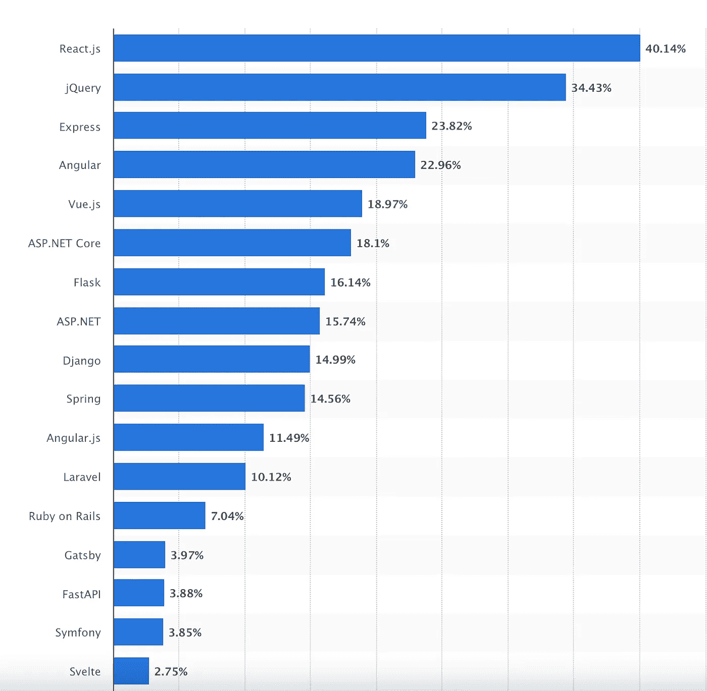
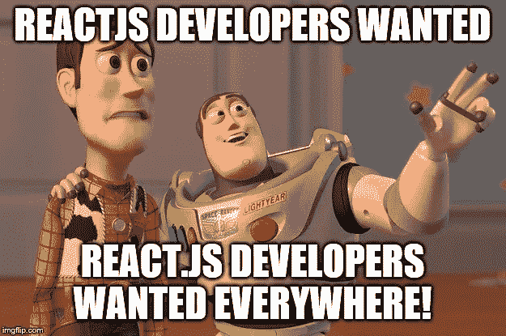

# 为什么不用其他框架代替 React 呢？

> 原文：<https://javascript.plainenglish.io/why-dont-we-use-other-frameworks-instead-of-react-3fcfaec5604b?source=collection_archive---------5----------------------->

## React 到底为什么这么受欢迎？

Photo by [Jon Tyson](https://unsplash.com/@jontyson?utm_source=medium&utm_medium=referral) on [Unsplash](https://unsplash.com?utm_source=medium&utm_medium=referral)

最近，相当多的公司来到我的大学校园进行实习，它们都有一个共同点:对工作要求做出反应。

我们都听说过 Vue.js、Angular、Svelte 和其他类似的框架，我们中的一些人甚至已经用它们创建了一些项目。

但是我们中的大部分人仍然使用 React 进行大型、严肃的项目，或者我们被迫在工作中使用它。这并不是说其他框架只是为了娱乐。

像 9gag 和 Behance 这样的流行网站使用 Vue.js 作为他们的前端，Gitlab 也是如此。

这些只是一些知名公司使用 Vue.js 的例子，然而大多数开发者从 React 开始，并最终坚持了很长时间。

这种做法没有错，React 无疑是一个极好的框架。

Most used web frameworks among developers worldwide, as of 2021\. [Source](https://www.statista.com/statistics/1124699/worldwide-developer-survey-most-used-frameworks-web/).

上面的图像帮助我更清楚地提出我的观点。React 占据了大约 40%的市场份额，而 Flask、Vue 和 Django 等框架接近 15%。

> *这一切尽管人们对脸书又爱又恨，如果你不知道，脸书创造了什么反应。*

差异是巨大的，在这篇博客中，我们将讨论为什么会这样。

## 1.发布时间

React 于 2013 年推出，是一个免费的开源库(现在仍然是),当时还没有 Vue 或 Angular。

React 提供给开发者的是一个前端解决方案，这个领域几乎没有竞争，不像今天。

它不是作为 MVC 框架引入的，而是被打上了“用于构建可组合用户界面的库”的烙印。

它通过将前端分解成*组件*，使得前端具有可伸缩性，这个术语对于习惯使用 HTML 模板的开发者来说相对较新。

它将 HTML 和 JavaScript 结合在一个文件中，使得反应式更新变得非常简单明了。

## 2.虚拟 DOM

这些天我们都习惯了虚拟的 DOMs。它是实际 DOM 的轻量级表示。

Source: [Rethinking Best Practices](https://www.youtube.com/watch?v=x7cQ3mrcKaY) at JSConfEU 2013

即使虚拟 DOM 的性能不时受到质疑，但它极大地简化了前端开发。

即使 Angular 不使用虚拟 DOM，并且有自己的实现来做同样的事情，许多新兴的框架已经注意到并实现了虚拟 DOM。

React 当时承诺的不仅仅是更简单、更容易理解的 DOM 操作，而且它们同样快速，开发人员不必担心进行调整来提高性能。

在接下来的一年左右，脸书开展了许多活动，如#reactjsworldtour。

他们随后发布了一个改变游戏规则的插件， [React Hot Loader，这个插件后来成为了行业标准。](https://github.com/gaearon/react-hot-loader)

## **3。强大的社区支持**

先发优势加上真正、快速的解决方案帮助 React 获得了市场认可，而在 2013 年，还看不到类似的框架。

越来越多的开发者开始使用 React，仅仅两年后，脸书推出了 React Native。它允许开发者在不学习 Java 或 Objective-C 的情况下编写移动应用。

他们可以使用与 React 相同的语法为 Android 和 iOS 编写代码。

就我个人而言，我是从 Vue.js 开始的，因为我是 web 开发领域的新手，自然我有很多问题，而且我找到的大多数资源都是为 React 设计的。

此外，每次我问一个有经验的 web 开发人员我应该从哪个框架开始，React 似乎是显而易见的答案。

这迫使我最终转而做出反应。

## 4.工作机会

[Source](https://www.digitechsearch.com/digitech-community/blog/a-technical-recruiter-s-point-of-view-reactjs.htm).

正如我在这篇博客的开篇所述，最近有不少公司来到我的大学校园进行招聘，它们都有一个共同点:对工作要求做出反应。

我很惊讶地看到，对于后端，有相当多的选项，如 Node 和 Laravel，但对于前端，React 是唯一的要求，当然还有 CSS 和 JavaScript。

这不仅仅是我住的地方。我在大约两年前[报道过这个话题](https://medium.com/@anuragkanoria/react-js-or-vue-js-in-2020-which-to-pick-80e155a2a5ab)。

回到 2020 年，我写道，“这种受欢迎的趋势在就业市场上也很明显。React 在 indeed.com 有 6 万多个工作岗位，而 Vue 只有 4000 个。”而且这种情况即使过了 2 年似乎也没有太大改善。

需要 React 的工作数量仍然比除 Angular 之外的任何其他框架高 8-10 倍。

这是开发人员使用 React 的另一个重要原因。大多数大学新生会按照一般的工作要求来学习，如果有反应，他们会学习并坚持下去。

## 5.完全控制和可定制

React 不应该与成熟的框架混淆，因为它不是。

这是一个库，React 的创建者已经反复强调了这一点。

虽然 Vue.js 给自己贴上了“[渐进式 JavaScript 框架](https://vuejs.org/)”&Angular 也是如此“ [Angular 是一个平台和框架](https://angular.io/guide/architecture#:~:text=Angular%20is%20a%20platform%20and,you%20import%20into%20your%20applications.)”。

使用 React 作为一个库，您可以根据您的应用程序需求将它与 Redux、React Router 等其他库捆绑在一起。

这为开发人员提供了一个试验和选择最适合他们的空间。

对于初学者来说，他们可以在 React 上获得详细的指南和课程，这些指南和课程使用像 Redux 这样的行业标准库，同时他们知道他们仍然可以灵活地用自己选择的库交换库。

尽管 Redux 和 React 路由器几乎已经成为 React 开发的同义词，但它们并不是由脸书维护的。

React 推出已经快十年了，我们仍然不难发现，关于与 React 在状态管理、路由、UI 等方面配合得很好的包，存在着健康的争论。

## 最后的想法…

以上讨论的所有要点都在一定程度上解释了 React 巨大的市场份额。

这绝不意味着其他较少使用的框架制作得很差。我绝对喜欢 Vue，我很高兴今年能尝试苗条的身材。

然而，市场似乎已经选择了他们最喜欢的，似乎在不久的将来不会回头。

最近，我在几乎所有的项目中使用 Next.js，不仅因为它为我提供了多样化的 React 包和社区支持，还因为它支持开箱即用的简单导航和服务器端呈现。

如果你喜欢读这篇文章，考虑使用[我的推荐链接](https://medium.com/@anuragkanoria/membership)，这样你就可以通过点击[这里](https://medium.com/@anuragkanoria/membership)无限制地访问我的博客以及其他作者的博客。

另外，请查看我最近关于使用 CSS 的博客。

 [## 为什么我在 React 中停止使用 CSS

### 从而提高了可读性，大大减少了工作量。

javascript.plainenglish.io](/why-i-stopped-using-css-in-react-ad3d159ced47) 

*更多内容看* [***说白了就是***](http://plainenglish.io/) *。报名参加我们的* [***免费周报***](http://newsletter.plainenglish.io/) *。在我们的* [***社区获得独家访问写作机会和建议***](https://discord.gg/GtDtUAvyhW) *。*