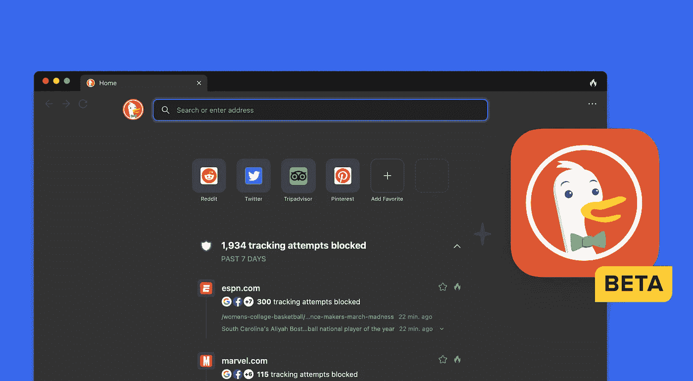

# 为什么 DuckDuckGo 选择现在推出网络浏览器

> 原文：<https://javascript.plainenglish.io/why-duckduckgo-is-choosing-now-to-launch-a-web-browser-9d2758ebdd49?source=collection_archive---------6----------------------->

## 谷歌和 Brave 最近的隐私丑闻给了 DuckDuckGo 发布新浏览器的完美风暴吗？

Image provided by DuckDuckGo at [https://spreadprivacy.com/introducing-duckduckgo-for-mac/](https://spreadprivacy.com/introducing-duckduckgo-for-mac/?s=pr-hp)

你们中的一些人可能最近知道 DuckDuckGo 宣布了一个新的网络浏览器，一周前在 Mac 上发布了私人测试版。他们呼吁的竞争优势是:

*   默认隐私。
*   它真的很快！
*   它是为了安全而建造的。

今天我想花些时间来看看他们为什么现在这样做，以及这对整个网络行业意味着什么。

# 市场状况

目前，网络浏览器领域有多家公司，其中一些最受欢迎的公司(超过 2%的市场份额)是:

*   谷歌浏览器——64.9%的市场份额
*   Firefox——3.4%的市场份额
*   微软 Edge — 4.05%的市场份额
*   safari——18.84%的市场份额
*   三星互联网— 2.82%的市场份额
*   Opera — 2.22%的市场份额

除此之外，还有无数基于 Chromium 的浏览器，包括 Brave、UC 浏览器和许多其他浏览器，这表明 DuckDuckGo 正在进入一个竞争非常激烈的领域。

# 那么 DuckDuckGo 为什么要加入这个拥挤的空间呢？

自 2017 年底以来，DuckDuckGo 是专注于隐私的浏览器 Brave ( [引文](https://brave.com/brave-and-duckduckgo-partner-to-improve-privacy-on-the-web/))的推荐搜索引擎。作为唯一一个专注于隐私的可行搜索引擎，这被视为 Brave 的完美匹配，合作最初是成功的。

直到 2021 年 6 月，Brave 宣布他们将推出自己的搜索引擎，直接针对每天使用 DuckDuckGo 的相同用户([引文](https://therecord.media/brave-launches-search-engine-that-doesnt-track-users-and-searches/))。最终，这导致了推荐给 Brave 的搜索引擎不再是 DuckDuckGo，很可能导致 DuckDuckGo 搜索引擎的流量减少。我预计 DuckDuckGo 浏览器的推出至少部分是出于这个原因。

除了简单地将推出浏览器作为一种生存策略之外，最近有多起流行浏览器侵犯用户隐私和期望的事件。最近的例子是:

*   谷歌浏览器被发现跟踪用户，即使在隐姓埋名的模式下
*   Brave 最近被发现 [*自动完成 URL 到它从*](https://www.zdnet.com/article/privacy-browser-brave-busted-for-autocompleting-urls-to-versions-it-profits-from/) 中获利的版本，并开始从广告收入中获利。
*   微软 Edge 已经开始在 Edge 上增加先买后付的融资选项

这可能会在市场上留下一个真正重视隐私、不会因为把用户放在第一位而被指责的浏览器的空白(苹果一直试图关注隐私，但经常被指责为反竞争)。

# 浏览器表现如何？

该浏览器有私人测试版，但是您可以使用移动 DuckDuckGo 移动应用程序选择加入私人等候名单。

1.  下载 DuckDuckGo 手机 app。
2.  打开“设置”，滚动到“更多来自 DuckDuckGo”部分，然后轻按“桌面的 DuckDuckGo”。
3.  点击“加入私人等候名单”
4.  当您获得访问权限时，您将收到来自应用程序的通知。这将带您进入一个邀请代码和一个下载页面的链接，您需要在 Mac 上打开该页面。

虽然这是一种有点不寻常的获得私人测试版的方式，但我认为他们要么是为了让更多的用户也下载他们的移动浏览器，要么是他们希望只有他们的移动浏览器用户会想尝试这个测试版。

不幸的是，我仍然在等待测试自己的浏览器，但是 DuckDuckGo 在他们自己的帖子中分享了这个推文，来自一个提前使用它的人。

我计划在最终获得基准测试后更新这篇文章。

# 这对开发者意味着什么？

作为开发者，现在这可能意味着很少，因为我们不太可能从这个浏览器获得足够的流量来证明花费额外的时间测试你的网站是正确的。

也就是说，新的 DuckDuckGo 浏览器是基于 Webkit 的，所以可能会呈现出与 Safari 非常相似的效果，我认为大多数 web 开发人员正在测试 Safari。

# 概括起来

总的来说，DuckDuckGo 浏览器的发布时机选择得很好，以利用其他浏览器的行为。最近关于 Brave 和谷歌 Chrome 的新闻肯定会导致一些人选择使用这种新浏览器。

也就是说，我不认为 DuckDuckGo 浏览器会获得显著的浏览器份额，因为它的品牌认知度不如谷歌和苹果。我将期待完整的公开发布，并推荐给朋友和家人。

*更多内容请看*[***plain English . io***](https://plainenglish.io/)*。报名参加我们的* [***免费周报***](http://newsletter.plainenglish.io/) *。关注我们关于*[***Twitter***](https://twitter.com/inPlainEngHQ)*和*[***LinkedIn***](https://www.linkedin.com/company/inplainenglish/)*。加入我们的* [***社区不和谐***](https://discord.gg/GtDtUAvyhW) *。*