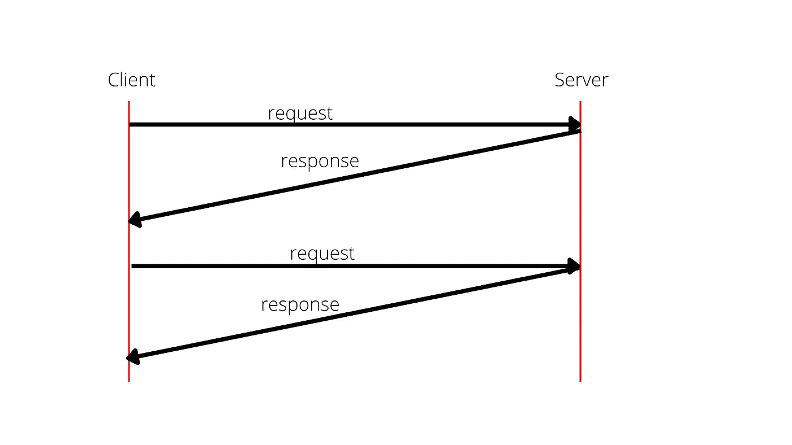
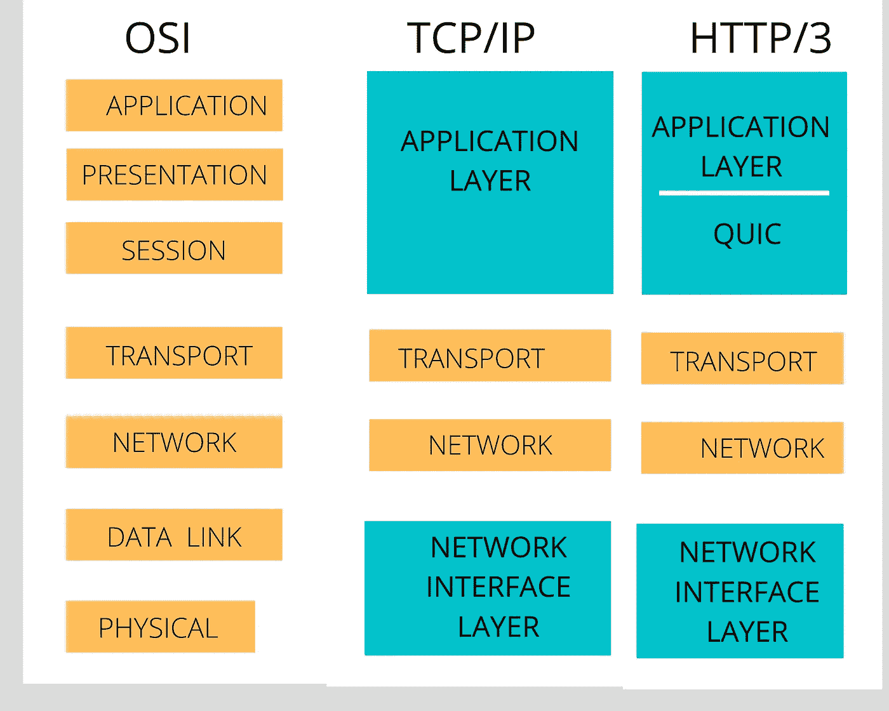

# HTTP 为什么放弃 TCP 而采用 UDP

> 原文：<https://javascript.plainenglish.io/why-http-dropped-tcp-and-adopted-udp-7a1c49b24c68?source=collection_archive---------0----------------------->

HTTP/1.1 vs . HTTP/2 vs . HTTP/3

Image by [Simon](https://pixabay.com/users/simon-3/?utm_source=link-attribution&amp;utm_medium=referral&amp;utm_campaign=image&amp;utm_content=76517) from Pixabay

超文本传输协议或 HTTP 用于在我们称之为万维网或互联网上交换数据。

从一开始，HTTP 总是和它旁边的一个数字联系在一起，表示版本。最常用的版本是 1.1，然后是 2.0，但拥有显著速度和性能改进的最新版本是 HTTP/3。在本文中，我们将探讨一些与 HTTP 的出现以及后来的改进相关的话题。

## 涵盖的主题

1.  什么是 HTTP/1.1？是 HTTP 的第一个版本吗？
2.  HTTP/2 做了哪些改变？
3.  HTTP/3 会有哪些变化？

在上一篇文章中，我们讨论了 [HTTP 和 TCP/IP 模型](/how-to-learn-complex-technologies-using-a-simple-mind-shift-12b9bc22fd1b)的基础。这是一篇简短而有趣的读物，可以快速地温习 HTTP 基础知识。

## 什么是 HTTP/1.1？是 HTTP 的第一个版本吗？

1.1 并不是 HTTP 的第一个发布版本，尽管它是适应性最强的版本。HTTP 0.9 和 1.0 是在 1.1 之前发布的，构成了严重的挑战。为通信建立的连接将在响应发送回客户端后立即终止。

当连接对于多个请求和响应保持活动时，这个问题后来在 1.1 中得到修复。因此，可以通过 HTTP 向服务器发送多个请求。

HTTP/1.1 面临的最大挑战仍然是行首阻塞问题。

**什么是队列头阻塞问题？**

HTTP 1.1 要求按顺序响应。

HTTP 1.1 head of line blocking

如果请求 1 正在等待延迟或丢失的响应，那么请求 2 将被阻塞。这是一个行首阻塞问题。

## HTTP/2 做了哪些改变？

HTTP/2 通过在同一个 TCP 连接上多路复用请求，解决了上面提到的阻塞问题。请记住，HTTP 是应用层协议，位于 OSI 和 TCP/IP 模型的传输层之上。

HTTP/2 为解决行首阻塞问题而提供的解决方案是在应用层引入的。结果，线路头问题没有完全解决，因为 TCP 在传输层执行错误检查，如果一个数据包被延迟或丢失，这可能再次导致拥塞。

HTTP/2 的另一个功能是可以使用一个 TCP 连接发出大量请求。在以前的版本中，只能进行有限数量的连接。

通过要求所有连接都使用 TLS，安全性也被嵌入到 HTTP/2 中。

## HTTP/3 会有哪些变化？

HTTP/1.1 和 HTTP/2 都遵循 TCP/IP 模型，但不是 HTTP/3。

为了解决使用 TCP 协议引入的行首阻塞，HTTP/3 采用了 UDP。

UDP 是一种无连接的协议，这使得它成为一种“一劳永逸”的协议。与需要握手来建立连接并确认收到的数据的 TCP 不同，UDP 将数据包发送到目的地，然后忘记它。这解决了以前的 HTTP 版本中普遍存在的速度问题。

如果只使用 UDP，我们将会失去 TCP 提供的最大优势——容错。由于大多数应用需要可靠的数据传输，所以容错是通信中的一个必需特性。

为了解决这个问题，HTTP/3 模型通过在应用层引入 QUIC 来改变现有的 TCP/IP 和 OSI 模型。

OSI vs TCP/IP vs HTTP/3 model

QUIC 为 HTTP 提供了 UDP 无法提供的容错能力。因此，UDP / QUIC 组合提供了互联网通信所需的速度和容错能力。

回到最初的问题 HTTP 为什么放弃了 TCP？因为需要速度。UDP 提供了 TCP 无法提供的速度，而 QUIC 确保了 UDP 无法提供的容错能力。

## 结论

到目前为止，所有主流浏览器都支持 HTTP/3，但是服务器端的采用还没有加快。脸书和谷歌服务器是 HTTP/3 协议的早期采用者。预计未来几年将有更多的服务器采用这种协议。

*更多内容请看*[***plain English . io***](https://plainenglish.io/)*。报名参加我们的* [***免费周报***](http://newsletter.plainenglish.io/) *。关注我们关于*[***Twitter***](https://twitter.com/inPlainEngHQ)*和*[***LinkedIn***](https://www.linkedin.com/company/inplainenglish/)*。查看我们的* [***社区不和谐***](https://discord.gg/GtDtUAvyhW) *加入我们的* [***人才集体***](https://inplainenglish.pallet.com/talent/welcome) *。*