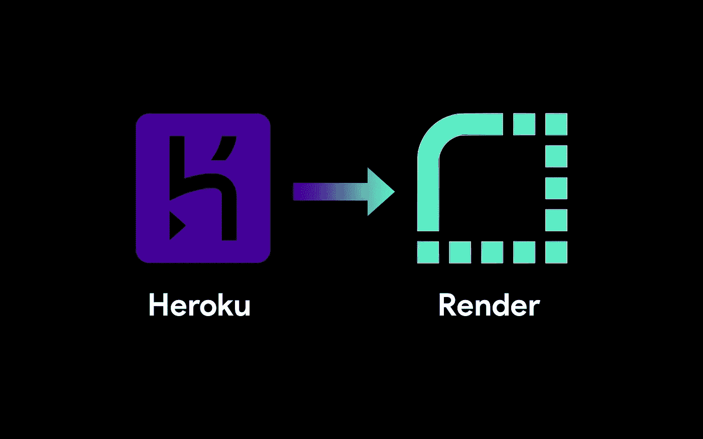

# 为什么我放弃了 Heroku，现在使用渲染

> 原文：<https://javascript.plainenglish.io/why-i-ditched-heroku-and-now-use-render-d70bd387edc0?source=collection_archive---------0----------------------->

## 我使用 Render 而不是 Heroku 的 10 个原因

因此，您希望使用 NodeJS、Ruby、Python 或 Java 创建一个简单的网站或在线服务。你知道如何使用大多数 AWS 产品，但你不需要任何花哨的东西。即使你有十万活跃用户，AWS 的工作量也太大了。

您想要一个简单的解决方案来托管您的站点，但是 AWS 需要太多的设置和基础设施。在这一点上，大多数人会求助于 Heroku。设置和集成 GitHub 很容易，并且您的代码会通过 pull 请求自动部署到您的`main`或`master`分支。Heroku 很容易，简单，没有废话…当你需要它时，它可以毫不费力地扩大规模。

**如果 Heroku 如此简单，那么开发者为什么还要使用其他东西呢？** Heroku 并不是唯一易于使用的托管服务。Render 是一个相对较新的主机提供商，于 2019 年 4 月问世。它应该是最容易访问的主机提供商，然而它却拥有如此强大的功能。

以下是我从 Heroku 搬来的十个原因。

# 惊人的用户界面/UX

当涉及到开发人员的工具时，用户界面和用户体验经常被忽略——毕竟，我们是开发人员，应该只关心功能。我认为这种心态是错误的。用户界面和体验在你*是否希望*使用该软件中扮演着重要角色。

AWS 挺丑但是很先进。Heroku 没有 AWS 复杂，但用户体验比 AWS 好得多。但是移动渲染让我更想用。你得到一个漂亮的用户界面，用户体验令人印象深刻，任何应用程序的设置只需要两分钟。

每个按钮和部分都有很好的衬垫，非常容易看。我们经常忘记开发者也是用户，当有更直接的选择时，我们不应该处理丑陋的 ui 或难以使用的软件。

# HTTP 请求超时

有时应用程序需要很长时间才能得到响应。例如，我正在积极开发一个抓取网页的工具。当用户输入一个查询时，它会在搜索引擎结果页面(SERP)中搜索 20 多个不同的搜索引擎，抓取每个结果，并将其存储在数据库中，然后返回一个响应。对于 50000 个唯一的结果，这个过程需要 4 到 5 分钟。

Heroku 将硬响应超时设置为 30 秒。如果服务器在这段时间内没有响应，它将自动关闭连接—这不能在您的服务设置中配置(即使您为 Dynos 付费)。

另一方面，Render 允许在 100 分钟内自动关闭连接。任何响应都不会花费 100 分钟来完成，因此这是一个更合理的响应超时上限。

根据您的应用程序，请求超时的上限可能是一个障碍，这使得 Render 成为一个更好的选择。

# 不变数据

假设您有一个完整的后端设置，包括服务器和数据库。如果您正在编写一个 NodeJS 应用程序，您的服务器将使用 NodeJS 运行，但是您的数据库将运行 MongoDB。

在 Heroku 上，不能运行 MongoDB 实例，因为数据在两次部署之间不会持久化。*这是什么意思？*每当您重新部署应用程序时，Heroku 都会擦除驱动器，提取新代码，构建新代码，然后运行它。所有保存的文件都将被删除，所有缓存都将被移除，在新部署中唯一能找到的是源代码和构建文件。

但是，在渲染时，数据可以在部署之间保持不变。因此，如果您将任何文件保存到文件系统，当您重新部署时，它们将会在那里。如果您有一个正在运行的 MongoDB 或 MySQL 实例，它仍然会在那里。

这对你有什么好处？你不需要注册第三方数据库提供商。你不需要付钱给任何人来托管你的数据库。它包含在渲染计划的存储空间中。

将数据库托管在运行服务器的同一平台上的另一个好处是，网络调用留在网络内，而不必到互联网上。这加快了在数据库中插入或更新文档的时间以及数据检索时间。

# 你想怎么建就怎么建

Heroku 对应用程序的构建和运行有严格的规则。以 NodeJS 为例。在 Heroku 上部署 NodeJS 应用程序时，您**必须**提供 npm `build`脚本。

如果您正在编写一个纯 JavaScript 服务器，不需要构建，因此 npm `build`脚本没有用处。你还需要提供一个`.Procfile`或者一个 npm `start`脚本。

Render 允许你以任何你想要的方式构建，无论是一个 shell 脚本，一个 JavaScript 文件，`mvn`，或者根本不构建。

# HTTPS 和 HTTP/2(和 HTTP/3)

Heroku 在传输协议方面已经过时了。各大浏览器( [Chrome、Firefox、Safari 及其衍生](https://medium.com/@thesoggywaffle/the-interesting-history-of-web-browsers-29c37604923b))从 2015 年开始支持 [HTTP/2](https://www.wikiwand.com/en/HTTP/2) 。Heroku 的落后之处在于只支持 **HTTP/1.1。**

Render 在 HTTP/2 上提供内容，并尽可能在 HTTP/3 上提供。但是这有什么关系呢？HTTP/2 要快得多。它使用二进制而不是明文，这使得它比以前的 HTTP 版本更安全、更快。

另一点是 HTTPS。Heroku 允许你用你的网络服务器配置 HTTPS，但是有一个主要的缺点:你必须配置它。使用 Render，默认情况下，所有站点都在 HTTPS 服务器上运行；不需要任何配置。如果您想添加您的 SSL 证书，您可以这样做。你想做的配置和定制的数量在你的手中。

# 高级 DDoS 保护

DDoS(分布式拒绝服务)攻击是黑客入侵网站最常见和最容易的方法。本质上，一堆计算机向同一个服务器发送许多请求。它占用带宽，强迫服务器毫无理由地执行一堆代码；这会导致服务器崩溃。

Heroku 有一个原始的 DDoS 保护设置。然而，他们的文档建议使用第三方 DDoS 保护来应对复杂的攻击。

大部分 Heroku 用户会使用 Cloudflare 进行 DDoS 防护；Cloudflare 很优秀，Render 用了。Cloudflare 的高级 DDoS 保护可保护 Render 上托管的所有网站。这可以保护您的服务器免受最复杂的 DDoS 攻击。Render 在其平台上的所有服务器上都启用了该功能，无需任何设置。

# 负载平衡

负载平衡是高级托管平台和计划中的一项功能。在某一点上，您的应用程序将有太多的用户，任何一台服务器都无法处理。这是可伸缩性的问题。

负载平衡器将所有用户分组，并使用不同的服务器为其他组提供服务。集团通常按地区(美国东部、美国西部、东欧等)定义。)，而且每个组都有专门的服务器。

这使得您的应用程序可以扩展以处理更大的用户池。用 Heroku 设置负载平衡是一件痛苦的事情——用 AWS 设置甚至是一件痛苦的事情。自动渲染负载平衡您的应用程序。

Render 的负载平衡器也对 HTTP 响应使用高端加密。这增加了加载时间，并改善了用户在移动和慢速互联网连接上的体验。

# 零停机部署

对于大多数应用而言，零停机时间至关重要。零停机时间意味着服务器将一直不间断地运行。这一点很重要，因为用户会日夜不停地使用你的应用程序。

Heroku 每 24 小时重启一次你的服务器。这意味着内存状态被清除。所有变量、数据库连接和 WebSockets 都将被重置。这会影响应用程序的稳定性和用户体验。你必须付出高昂的代价来阻止 Heroku 自动重启。

渲染永远不会重新启动或关闭您的应用程序，除非您选择手动这样做。

# 健康检查

Heroku 不为**提供**健康检查。每个托管平台都应该自动检查服务器是否正常运行。

Render 允许您定义一个自定义路径，该路径应该总是返回一个 HTTP `200`成功代码。如果此路径没有提供成功代码，Render 会识别健康检查失败，并将自动重新启动应用程序。

# 定价

许多人会在 Render 上使用 Heroku *和*的免费计划来托管他们的应用程序。我对大多数申请都这样做，直到我认真对待它们。如果您想要更多的内存或存储空间并使用更多的功能，您将需要一个高级计划。

Pricing comparison from Render’s website

Heroku 的定价高得离谱，尤其是当你扩大应用规模的时候。你可能最终为 100，000 个每日活跃用户每月支付超过一万美元。

*更多内容尽在* [***说白了. io***](https://plainenglish.io/) *。报名参加我们的* [***免费周报***](http://newsletter.plainenglish.io/) *。关注我们关于* [***推特***](https://twitter.com/inPlainEngHQ) *和*[***LinkedIn***](https://www.linkedin.com/company/inplainenglish/)*。查看我们的* [***社区不和谐***](https://discord.gg/GtDtUAvyhW) *加入我们的* [***人才集体***](https://inplainenglish.pallet.com/talent/welcome) *。*