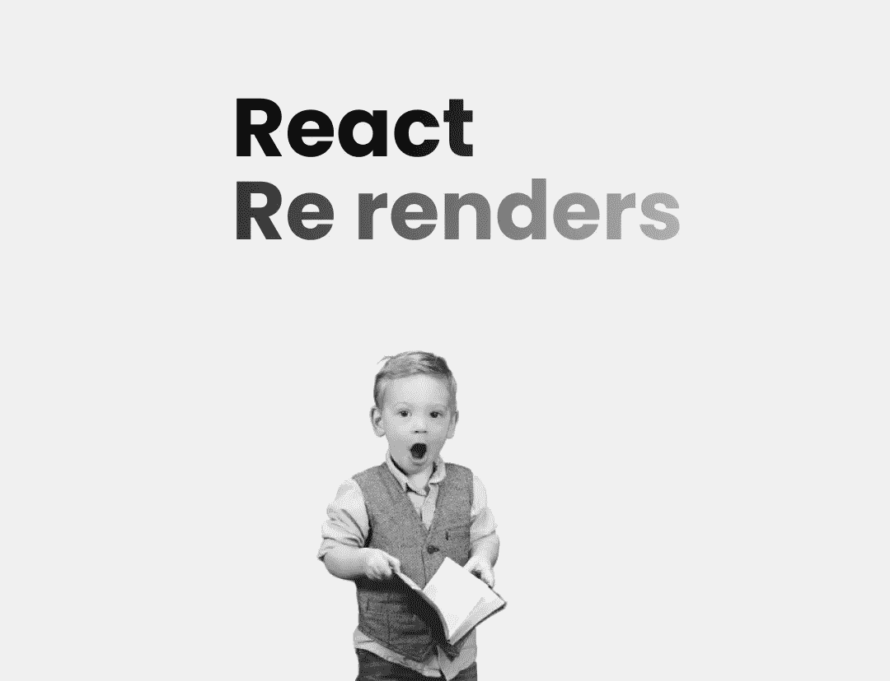

# 为什么我花了 3 个小时试图修复一个反应重新渲染的问题

> 原文：<https://javascript.plainenglish.io/why-i-spent-3-hours-trying-to-fix-a-react-re-render-issue-f5d3645c754a?source=collection_archive---------7----------------------->

## 以及如何防止这种情况发生。

Image by author + [Ben](https://unsplash.com/@benwhitephotography) at unsplash

这是一个普通的编码之夜，我有一个很好的流程，一切都很好，很容易，直到它没有。

我正在构建一个高度动态和可扩展的验证表单，因此您可以添加一个新的输入字段作为配置文件的对象，添加占位符、标签、验证、状态引用等等。

然后我遍历表单对象，并为 config 对象中指定的每个输入传递输入组件属性。

因为它有相当多的数据和嵌套的对象、函数等等，而且它是一个普通的对象，所以我需要做一些数据处理，把它变成一个能够很好地循环的形式。

所以我这个自作聪明的家伙认为在`useEffect`做这件事是个好主意，因为我已经有了一个很好的流程，并且已经有了一个打印一些数据的`useEffect`设置。于是我去调用了其中的一个函数，它做了一些事情，并返回了一个漂亮的可循环数组，其中包含了每个输入字段的对象。

**现在到了关键时刻……**

还记得这个函数给了我一个漂亮的可循环数组吗？你需要把它放在你知道的地方。所以我把它存放在`useState️`🤦‍♂️.

我们都知道 React 组件中的状态更新会发生什么:重新呈现！因此，因为我在状态本身中存储了对状态的引用，并且在每个`change`输入得到时，组件被重新呈现，状态被重置，因为它没有被任何东西绑定，不仅如此，你失去了输入的焦点，这让我抓狂。

这有时很难发现，就我而言，它并不完全清楚，正如你所知道的，我在这上面花了一些时间。

**那么** `**you**` **如何防止这种情况发生呢？**

嗯，这很容易，总是使用一个独特的`key`的项目，你循环通过；如果没有，你可能会在未来花很多时间试图找出你已经有一段时间没有接触过的庞大的代码库有什么问题。

第二，*仅*将您必须存储的内容存储在状态中，这意味着如果您希望组件在您的数据更改时重新呈现，请将其存储在状态中。但是举个例子，如果它是一个不变的变量，我不会把它存储在 state 中。

例如，我存储了一个变量`name`，并在组件中呈现该名称，在组件呈现后，我调用一个函数来更改变量值，然后它不会反映在 UI 中，React 不会重新呈现该组件，因此它在 UI 中仍具有旧值。

在我的例子中，基本上是这样的，我存储了一些不需要改变的东西，它保存了重要的数据，一旦 config 对象的状态引用改变，整个对象也改变了，它丢失了数据，为什么会发生这种情况还不太清楚。在某些情况下，你可能不认为它会在重新渲染时丢失任何数据，但记住，每次状态改变时，默认情况下组件都会重新渲染。

如果你喜欢这件作品，我希望你也会喜欢:

 [## 停止从糟糕的 React 教程中学习

### 不受欢迎的观点

javascript.plainenglish.io](/stop-learning-from-react-tutorials-that-suck-5e2031d9bdc7)  [## 关于国家预防机制的 3 节微课

### 你会喜欢第三条。

javascript.plainenglish.io](/3-micro-lessons-about-npm-47759d85f18c)  [## 回调 vs .承诺 vs .异步 Await:逐步指南

### 引擎盖下也有点。

better 编程. pub](https://betterprogramming.pub/callbacks-vs-promises-vs-async-await-a-step-by-step-guide-f93d13447604)  [## 深入研究 JavaScript 闭包:分步教程

### 从理论和实践的角度理解闭包。

javascript.plainenglish.io](/deep-dive-into-javascript-closures-a-step-by-step-tutorial-89cf0731a4c5) 

*更多内容请看*[***plain English . io***](https://plainenglish.io/)*。报名参加我们的* [***免费周报***](http://newsletter.plainenglish.io/) *。关注我们关于*[***Twitter***](https://twitter.com/inPlainEngHQ)*和*[***LinkedIn***](https://www.linkedin.com/company/inplainenglish/)*。加入我们的* [***社区不和谐***](https://discord.gg/GtDtUAvyhW) *。*