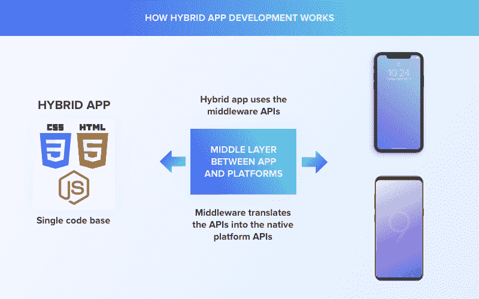
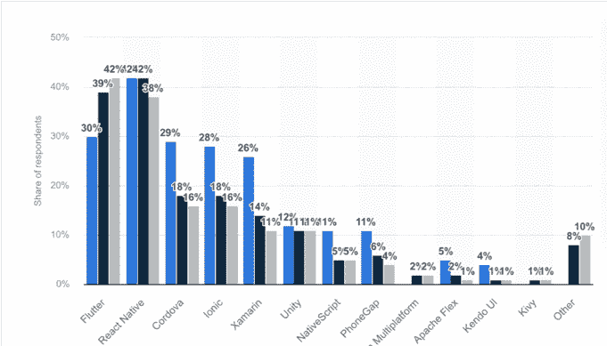

# 为什么混合方法是移动应用程序开发的好选择？

> 原文：<https://javascript.plainenglish.io/why-is-hybrid-approach-a-good-choice-for-mobile-app-development-8c6fc19e299?source=collection_archive---------12----------------------->

## 为什么混合方法是移动应用程序开发的好选择。

混合移动应用程序开发是指使用本地和基于 web 的技术来创建应用程序的用户界面(UI)的实践。虽然混合应用程序是使用 web 技术构建的，但为了有效，它们必须有一个感觉上像是专门为每个平台制作的界面。

这可能是一个耗时且困难的过程，但是有开发人员的专家团队在您身边，您应该会看到值得骄傲的结果。

如果您希望降低成本，同时确保您的用户在他们的设备上有直观的体验，混合移动应用程序开发可能是一个不错的选择。

在本文中，我们将探讨混合移动应用程序开发需要什么，以及它与其他类型的应用程序开发过程(如本地或 web 应用程序开发)相比如何。

我们还将考察何时您可能想要使用混合移动应用程序开发，以及何时您应该选择另一个选项。我们开始吧！

*   混合应用程序是如何工作的？

混合应用融合了本地和移动网络技术。它们比移动网站复杂，但没有原生应用复杂，这使它们成为许多公司的最佳解决方案。

[Image Source](https://www.mobileappdaily.com/hybrid-vs-native-better-for-enterprise)

混合应用将 web 视图与原生包装结合起来，为用户提供对本地设备功能的访问，如 GPS、摄像头、通知和推送消息(如果你需要的话)。

由于它们基于使用 web 标准的开源框架，混合应用开发者不需要掌握任何新的语言或技术；他们可以重用他们已经知道的 HTML5、CSS3 和 JavaScript。这使得这类应用程序比从零开始开发本地应用程序要容易得多。

混合应用通常基于移动网络框架，因此尽管它们不能在应用商店中本地运行，但它们看起来像本地应用。

混合应用程序的开发时间也比完全原生的移动应用程序快得多，并且包括所有原生平台都没有的功能(如浏览器、共享、通知等)。

出于这些原因，混合应用程序开发对于创建上市速度和用户体验一致性至关重要的产品特别有用。

[Image Source](https://www.mobileappdaily.com/hybrid-vs-native-better-for-enterprise)

此外，如果你计划在国际上做生意，重要的是要考虑开发混合应用程序可以拓展你的潜在范围；即，单个混合应用程序可以跨多个平台和语言部署，而不需要任何改变。

# **拥有混合移动应用的 5 大优势**

混合应用程序是利用两个世界优势的完美方式，但是许多企业和专业人士并没有意识到混合应用程序的益处。

*让我们来探索拥有混合移动应用程序的五大好处，这样你就能明白为什么如此多的企业和个人转向这种类型的应用程序来简化他们的生活。*

*   **更便宜的开发成本**

在决定选择哪条应用开发路线时，考虑开发成本和持续运营成本非常重要。几乎在所有情况下，使用原生编码进行开发都更便宜。

一旦你开始支付混合应用程序所需的托管费和支持服务，一次性开发成本节省下来的钱将会多次使用。

当然，选择混合模式也有好处:快速开发时间和与多个平台的兼容性是其中的主要优势。

如果你不需要一个应用程序在不同的操作系统上工作，或者不想每次你想改变什么的时候都付钱给别人，那么混合应用程序可能是你最好的选择。

*   **更容易扩展**

因为你正在为 Android 和 iOS 编写代码库，所以更容易扩展。如果您有一个非常受欢迎的应用程序，但仍然没有赚到足够的钱来证明为另一个平台重新开发是正确的，您可以简单地使用您的单一代码库作为中间媒介来瞄准您的下一个平台。这将减少开发时间，同时仍然最大限度地提高利润。

*   **更容易维护**

混合应用程序由 web 代码支持，允许开发人员比原生应用程序更快地进行更新和修复错误。使用 HTML 进行更新的便利性意味着你不必像在应用商店那样经历那么多的审批过程。

这也使得维护更加容易，因为更新应用程序可以实时完成，而不需要用户更新他们自己的副本。

*   **更快的构建时间**

一般来说，混合应用程序比原生应用程序编译得更快，这意味着你可以更快地将你的应用程序呈现在用户面前。如果你正在为 iOS 或 Android(或两者)开发，那么你应该强烈考虑构建混合移动应用。

混合应用不仅性能更佳，还能为您的企业提供卓越的终端用户体验。

例如，想象一下，如果你每次从亚马逊订购东西，都要花 30 秒钟来加载。你会停止在亚马逊购物，开始在其他地方购物…很快！然而，有了手机；每一秒都比桌面更重要，因为人们已经习惯了手机上的即时响应，因此他们对桌面网站的期望比桌面网站更高。

*   **离线可用性**

混合应用相对于同时为 Android 和 iOS 构建的应用的关键优势在于其离线可用性。与需要 Wi-Fi 或蜂窝数据才能运行的应用程序相比，混合应用程序甚至可以在没有活跃的互联网连接时使用。

这意味着当您的数据套餐用完时，您仍然可以发送电子邮件和短信，访问您周围的信息，使用 GPS 导航，以及拨打电话，而无需支付额外的漫游费。

# **你应该看看的 5 款最受欢迎的混合应用开发工具**

如果你对自己开发混合应用程序有一点兴趣，那么你一定要看看这 5 个最受欢迎的混合应用程序开发工具，它们会让你的生活更轻松，并帮助你快速开始自己的应用程序开发项目。当你在印度雇佣 Xamarin 应用程序开发人员时，确保他们拥有这些工具的专业知识。

***Image: Top Cross-platform app platform for 2022, Source: Statista***

## **1)反应土著**

当你决定用 React Native 创建一个混合应用程序开发时，你唯一的限制就是 JavaScript 和你的想象力。虽然谷歌 Android 原生开发工具可能是在该平台上部署应用程序所必需的，但在 iOS 部署中却不需要。

这意味着您可以使用任何 IDE(集成开发环境)或其他您熟悉的工具，而不必学习和使用 Xcode。

使用 React Native，您可以访问所有您喜欢的 web 开发工具:热重装、代码共享、ES6 模块等。当你 [**雇佣 react 原生开发者**](https://www.appsdevpro.com/hire-developers/hire-react-native-developers.html) 时，你可以毫不费力地将一个现有的网络应用移植到一个原生移动应用中。

## **2)颤振**

Flutter 是谷歌的一流开发解决方案，用于使用现代代码库构建移动应用。它允许您在 Android 和 iOS 上快速设计、开发和部署高质量的应用程序，使用它们的许多预制应用程序模板中的一个，或者从头开始创建自己的应用程序。

Flutter 的流行源于其可靠的基础设施、优秀的工具系统、简单的开发周期以及与原生 UI 元素令人印象深刻的兼容性。

更不用说它是为数不多的可用解决方案之一，为 Flutter 移动应用程序开发者提供了同时为 Android 和 iOS 开发的机会——这是大多数流行框架所不允许的。

## **3)离子框架**

Ionic 是一个开源的混合移动应用开发框架。它支持使用 HTML、CSS 和 JavaScript 等 web 技术构建混合移动应用程序。Ionic Framework 使用 Apache Cordova 通过 API 从 JavaScript 访问本机设备功能，如摄像头或加速度计。

尽管它是基于 web 技术的，但它有一个独特的外观，用户可能不会联想到传统的 web 应用程序，因为它使用 AngularJS 作为模板。

Ionic 背后的团队表示，他们创建 Ionic 的主要目标之一是通过节省开发人员在标签、菜单、列表和导航面板等常见用户界面元素上的时间，使开发人员更容易开发混合应用程序。

## 4) Xamarin

Xamarin 是一个允许开发人员使用 C#和。NET 库为 Android、iOS、Windows、macOS 和 watchOS 构建原生应用。当你在印度 [**雇佣 Xamarin 开发者**](https://www.appsdevpro.com/hire-developers/hire-xamarin-developers.html) 时，他们可以跨不同平台重用高达 96%的代码。

Xamarin 被小型企业和企业公司等使用，并已成为混合应用程序开发的最受欢迎的选项之一。

微软还在 2016 年收购了 Xamarin，作为其移动应用开发战略的一部分。目前，它被全球超过 120，000 家公司使用，并支持 46 种编程语言。

## **5) PhoneGap**

PhoneGap 是一个开源框架，允许开发人员使用 HTML、CSS 和 JavaScript 编写应用程序。虽然这可能是开发混合应用程序的好方法，但 PhoneGap 在支持多种设备和屏幕尺寸方面有一定的限制。

由于它非常轻量级，使用 PhoneGap 构建的应用程序往往也是资源友好的。事实上，你甚至可以将一个现有的网站转换成不同平台的应用程序，而不会有太多的麻烦。

**费用是多少？**

混合移动应用程序开发的成本根据应用程序的类型和平台的不同而有很大差异。混合移动应用程序开发的成本与原生应用程序开发的成本并不相同。

很难比较混合和原生应用程序开发的价格。这是因为在开发移动应用程序时，有太多的变量在起作用——功能的数量、平台兼容性、设备兼容性等。 ***看看混合移动 app 开发的大概成本和时间:***

# **结论**

app 类型不同，导致开发方面的需求也不同。在某些情况下，跨平台开发效果最佳。混合应用程序将响应式 web 设计与本地元素和代码结合在一起。

当您寻求跨平台兼容性，但不想投入大量时间或金钱从头开发应用程序时，混合移动应用程序是一个很好的选择。不管你想创建什么类型的应用，选择一个能帮助你实现梦想的团队是很重要的。

你的目标应该是 [**雇佣以前做过的混合应用程序开发人员**](https://www.appsdevpro.com/hire-developers/hire-cross-platform-app-developers.html) ，这样他们就知道什么最适合你的项目和时间表。这样做将确保您的企业在预算内按时获得完美的产品。

======================================

*更多内容看* [*说白了。报名参加我们的*](https://plainenglish.io/) [*免费周报*](http://newsletter.plainenglish.io/) *。关注我们的* [*推特*](https://twitter.com/inPlainEngHQ) *和* [*领英*](https://www.linkedin.com/company/inplainenglish/) *。查看我们的* [*社区不和谐*](https://discord.gg/GtDtUAvyhW) *加入我们的* [*人才集体*](https://inplainenglish.pallet.com/talent/welcome) *。*