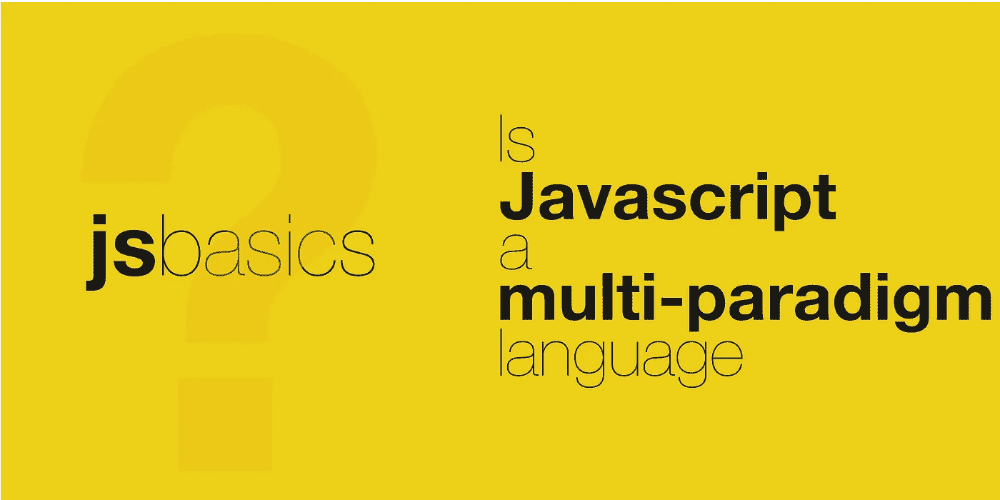

# 为什么 JavaScript 是一种多范式语言？

> 原文：<https://javascript.plainenglish.io/why-is-javascript-a-multi-paradigm-language-3b6cc22fee94?source=collection_archive---------7----------------------->



范式可以被定义为解决问题的方法。编程范式是使用编程语言解决问题的一种方式。

如你所知，每个问题都需要特定的方法来解决。所以，对于不同的问题，我们会有一套范例。由于编程语言是使用代码解决问题的一种方式，它们将提供对这些范例的支持。

因此，任何提供多种编程范例的编程语言都被称为**多范例编程语言**。

下面提到一些众所周知的范例。

## 命令式编程范式

在这种方法中，解决方案被设计为一系列明确定义的指令或程序。

采用这种方法的编程语言将拥有一系列命令代码，这些命令指定计算机必须做什么，如何做，何时必须做才能得到解决方案。包含这一点的一些语言有 C、C++、C#、Java、Fortran 等。

## 声明式编程范例

在这种方法中，解决方案被设计为一组期望(需要完成什么)，而没有指定需要如何完成。

采用这种方法的编程语言将具有包含一系列命令的代码，这些命令陈述了期望的结果，而没有指定需要如何实现它。一个很好的例子是 SQL 查询，其中开发人员声明他需要特定表中的行，但没有提到如何获取它们。

## 面向对象编程范例

在这种方法中，解决方案是围绕对象或类之间的通信来设计的，这些对象或类保存数据和对数据进行操作的方法。

采用这种方法的编程语言将具有包含一系列操作的代码，这些操作涉及定义类以及在相关方法的帮助下这些类之间的交互。支持这种范式的一些语言有 C++、Java、C#、JavaScript 等。

## 函数式编程范式

这是一种声明式方法，解决方案是围绕应用和组合函数来设计的。

采用这种方法的编程语言将有一系列的函数调用和函数组合，其中每个函数都接受一个输入状态，并独立于程序状态返回一致的输出值。支持这种范式的一些语言有 Haskell、JavaScript 等。

我建议您探索其他编程范例以获得更广泛的理解。

从 JavaScript 的 MDN 文档中可以清楚地看到，JavaScript 提供了对

*   **命令式编程**

```
/* Example : Get clone of given array
 * Imperative where solution is 
 * sequence of well defined instructions
 */const arr = [1,2,3,4,5]
let clonedArr=[]
for(let i=0;i<arr.length;i++){
   clonedArr[i] = arr[i]; // specifying the 'how' part explicittly
}
```

*   **声明式编程**

```
/* Declarative where solution is 
 * set of required solution without the how part
 * /
const arr = [1,2,3,4,5]
let clonedArr = cloneArray(arr);//specified what is needed
```

*   **面向对象编程**

```
/* Solution is based around Classes */
class Person {
 constructor(firstName, lastName, age){
  this.firstName = firstName;
  this.lastName = lastName;
  this.age = age;
 }
 getName(){
   return this.firstName+' '+ this.lastName;
 }
 getAge(){
  return this.age;
 }
}const p1 = new Person('foo','bar');
console.log(p1.getName());/* logs 'foo bar'*/
```

如简单示例所示，JavaScript 提供了多种方法来解决给定的问题，使其成为一种**多范例**编程语言。

希望这有助于你理解 JavaScript 中的多范例支持。请分享你的想法。

要了解更多细节，我推荐 MDN 文档。

关注我，获取更多关于 JavaScript Web 开发的有趣帖子。另外，请给一个 [*跟随*](https://twitter.com/jsbasics_dev) *上推特。*

*更多内容请看*[*plain English . io*](http://plainenglish.io/)*。报名参加我们的* [*免费周报*](http://newsletter.plainenglish.io/) *。在我们的* [*社区*](https://discord.gg/GtDtUAvyhW) *获得独家的写作机会和建议。*