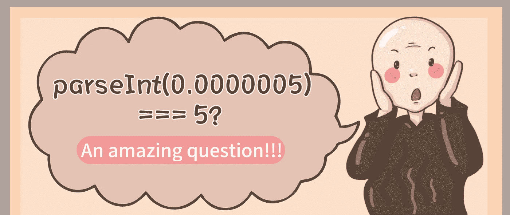

# JavaScript 的 parseInt(0.0000005)为什么打印“5”？

> 原文：<https://javascript.plainenglish.io/why-is-javascripts-parseint-0-0000005-5-eb9e2432f1b0?source=collection_archive---------1----------------------->

## JavaScript 中 parseInt(0.0000005)为什么打印 5？一个很神奇的问题！



# 前言

最近我在开发一个项目的时候遇到了一个奇怪的问题，`parseInt (0.0000005) === 5`😱。正常情况下，输出 0 是正确的，但为什么是 5 呢？让我们一起来探讨这个问题。

# 1.什么时候使用 parseInt？

首先，你一般什么时候用`parseInt`？大多数时候，我们用它来解析一个**字符串**并返回它的**整数部分**。带着这个问题，我们来看看 parseInt 方法。

# 2.关于 parseInt 的一些事情

根据 MDN [文档](https://developer.mozilla.org/en-US/docs/Web/JavaScript/Reference/Global_Objects/parseInt)，*“parse int(string，radix)函数解析一个字符串参数并返回一个指定基数(数学数系中的基数)的整数。”*

**语法**

```
parseInt(string)
parseInt(string, radix)
```

**示例**

```
parseInt('0.5') *// 0*
parseInt('0.5') *// 0*
parseInt('0.05') *// 0*
parseInt('0.005') *// 0*
parseInt('0.0005') *// 0*
parseInt('0.00005') *// 0*
parseInt('0.000005') *// 0*
parseInt('015') *// 15*
parseInt('015', 8) *// 13*
parseInt('15px', 10) *// 15*
```

# 3.parseInt 如何转换数字？

当 parseInt 的第一个参数是一个数字时，如何解析？

`parseInt(0.0000005) === 5`的真相也在这里...

# 3.1.第一步？将数字转换为字符串。

让我们使用字符串函数检查基于字符串的值，看看每个值的输出是什么:

```
String(0.5);      *// => '0.5'*
String(0.05);     *// => '0.05'*
String(0.005);    *// => '0.005'*
String(0.0005);   *// => '0.0005'* 
String(0.00005);  *// => '0.00005'*
String(0.000005); *// => '0.000005'* String(0.0000005); *// => '5e-7' pay attention here*
```

# 3.2.第二步，做舍入运算。

正如用户 [SeyyedKhandon](https://stackoverflow.com/users/12666332/seyyedkhandon) 在他的堆栈溢出[回答](https://stackoverflow.com/questions/69613606/why-does-javascripts-parseint0-0000005-print-5)中解释的:

“当我们使用`parseInt(0.0000005)`时，它等于`parseInt('5e-7')`，根据定义:

> parseInt 可能只将字符串的前导部分解释为整数值；它忽略任何不能被解释为整数符号的一部分的代码单元，并且没有给出任何这样的代码单元被忽略的指示。

```
parseInt(0.0000005)parseInt('5e-7') *// 5*
```

**最后，答案将只返回 5，因为它是在非字符 e 之前唯一的数字字符，所以它的其余部分 e-7 将被丢弃。”**

# 4.如何安全获取浮点数的整数部分？

建议使用以下 Math.floor()函数:

```
Math.floor(0.5);      *// => 0*
Math.floor(0.05);     *// => 0*
Math.floor(0.005);    *// => 0*
Math.floor(0.0005);   *// => 0*
Math.floor(0.00005);  *// => 0*
Math.floor(0.000005); *// => 0* Math.floor(0.0000005); *// => 0*
```

# 5.类比学习

现在，你能解释为什么`parseInt(99999999999999999999999999)`等于 1 吗？

**感谢您的阅读。**

*更多内容请看*[***plain English . io***](https://plainenglish.io/)*。报名参加我们的* [***免费周报***](http://newsletter.plainenglish.io/) *。关注我们关于*[***Twitter***](https://twitter.com/inPlainEngHQ)*和*[***LinkedIn***](https://www.linkedin.com/company/inplainenglish/)*。加入我们的* [***社区不和谐***](https://discord.gg/GtDtUAvyhW) *。*