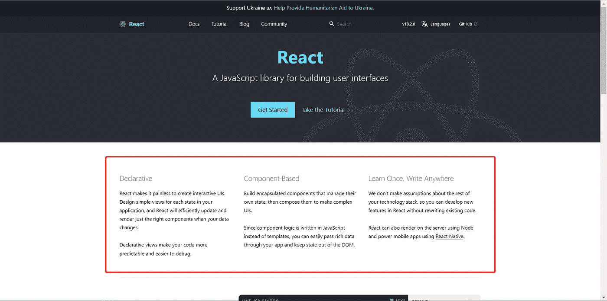
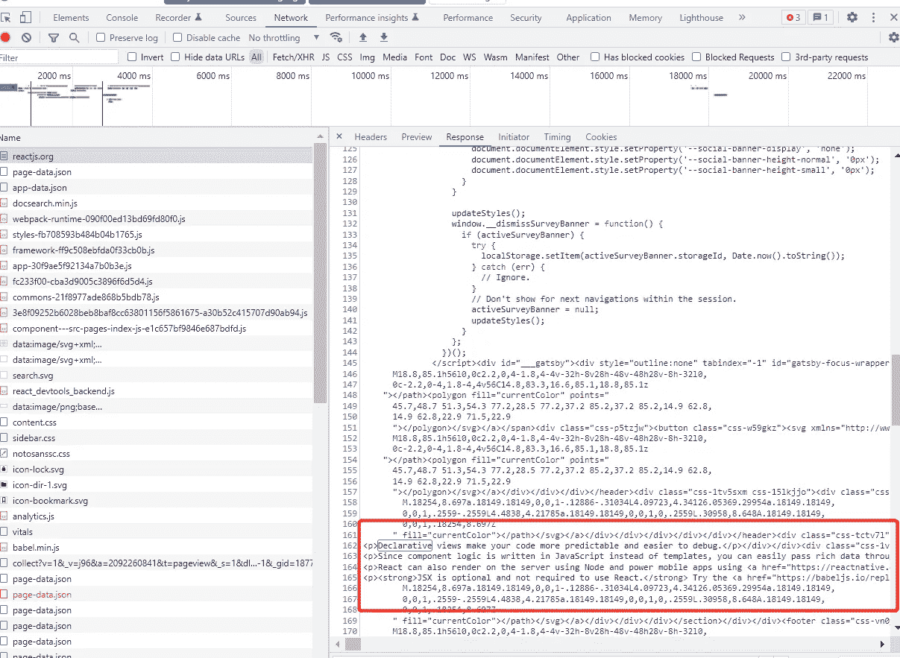
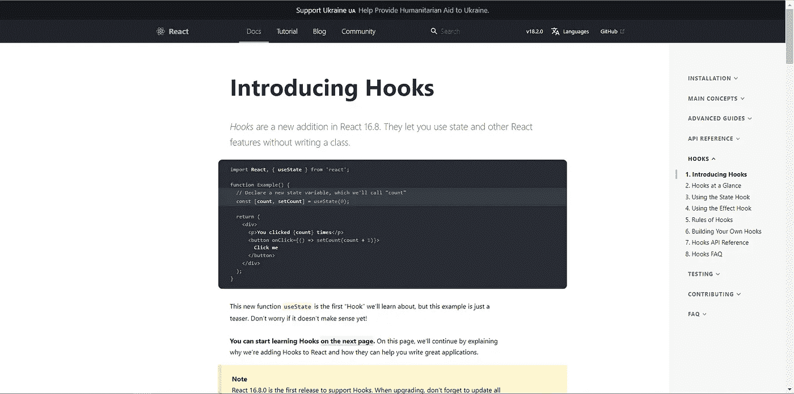
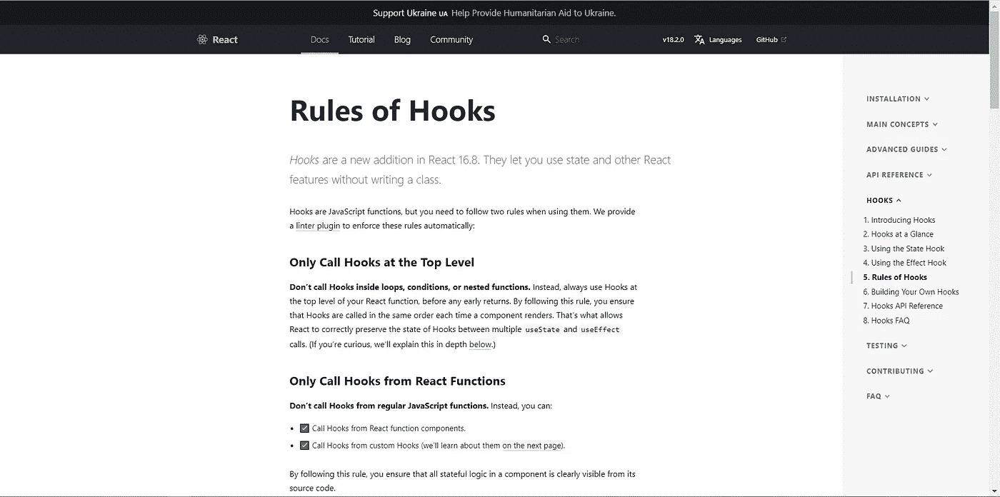
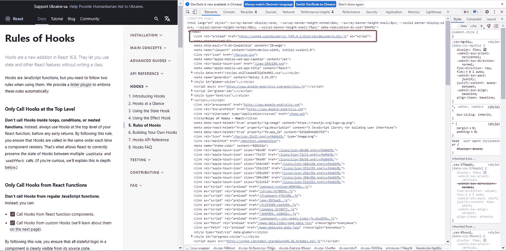
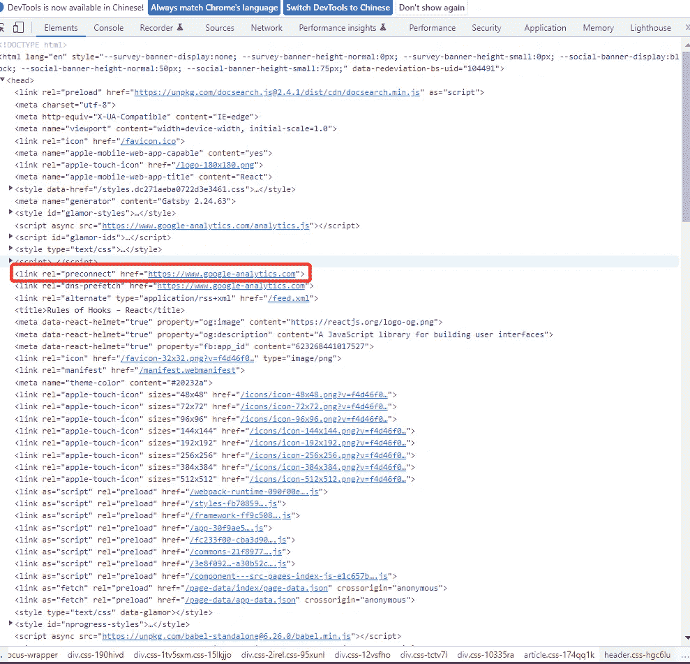
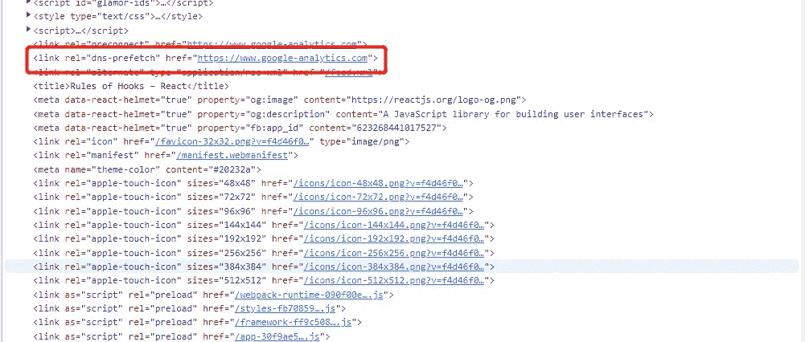
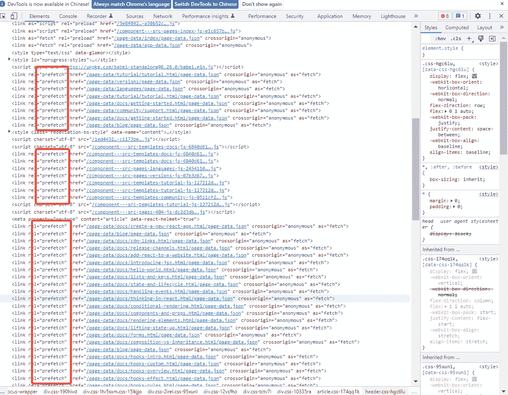
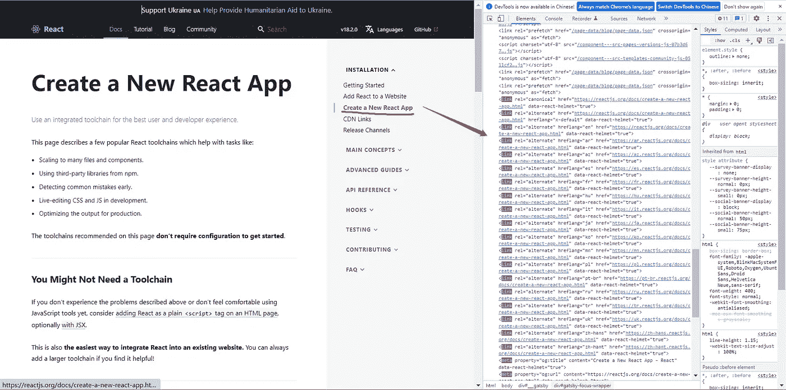

# React 官网为什么这么快？

> 原文：<https://javascript.plainenglish.io/why-is-the-react-official-website-so-fast-bf90a2168e62?source=collection_archive---------3----------------------->

## 我们来看看 React 官网上有哪些优化工具。

Photo by [Bence Halmosi](https://unsplash.com/@bencehalmosi?utm_source=medium&utm_medium=referral) on [Unsplash](https://unsplash.com?utm_source=medium&utm_medium=referral)

当我们打开 React 网站时，发现从在浏览器上输入网址到显示页面首屏所用的时间非常短，点击页面中的链接切换路线的操作非常流畅。

页面很容易达到“秒切”的效果，没有延迟和等待。所以，带着“React 网站到底是做什么的？”铭记，这个探索开始了，发现主要使用了以下优化手段。

## SSG

以下是 React 官方文档主页截图。你会注意到下面的红色区域，这将在后面用作推理的理由。

当我们打开控制台，点击 network，选择 DOC document request，我们会发现一个 GET 请求，请求路径为[https://reactjs.org/,](https://zh-hans.reactjs.org/,)，响应结果是一个 HTML 文档，在这个文档中我们正好可以找到上图中红色区域的文本对应的文本。这也证实了对应的 HTML 文档就是 React 官方主页，页面的渲染方式只有两种:一种是服务器端渲染 SSR，另一种是静态站点生成 SSG——这和 React 官网上使用的技术是一样的，和 SSR 一样的是对应的服务器端也是直接将合并后的 HTML 文档返回给客户端，所以客户端仍然不需要下载 JavaScript 文件来渲染整个页面。

如果你对这两种渲染方式不是很清楚，可以看[本文末尾的另一篇文章](/front-end-csr-ssr-ssg-can-you-really-tell-the-difference-8ddedc9c05d6)专门介绍三种前端渲染方式。

## 问题已回答:现在我们可以回答为什么 React 网站使用 SSG 技术来做到这一点

因为与客户端渲染相反，服务器端渲染和静态点生成是浏览器请求 URL 后带有数据的 HTML 文本，而不是空的 HTML 外壳。浏览器只需要解析 HTML 并直接构建 DOM 树。而客户端渲染则需要先获取一个空的 HTML 页面，这个时候页面已经进入白屏，之后需要经历加载执行 JavaScript、请求后端服务器获取数据、JavaScript 渲染页面几个过程才能看到最终页面。尤其是在复杂的应用中，由于需要加载 JavaScript 脚本，所以应用越复杂，需要加载的 JavaScript 脚本越多，越大，导致应用首屏加载时间非常长，降低了体验。

至于 SSR 和 SSG 的选择，还得从应用场景说起——用户是在服务器端为每个请求重新组装一个 HTML 文档，还是在项目构建时生成一个唯一的 HTML 文档？

React 团队成员在开发官网的时候一定也想到了这个问题。既然是官网，权限肯定没有区别，所有进入网站的人看到的内容应该都是一样的，那么对于每个请求，在服务器端组装一模一样的 HTML 有什么意义呢？为什么不在服务器端提前渲染并发送给大家，让 N 次渲染变成 1 次渲染，大大减少客户端和服务器的通信时间，从而提高用户体验？

## 预加载/预处理资源的一些方法

研究完首屏渲染，再来看路由跳转后的内容切换。经常阅读 React 文档的人可能已经注意到，路由跳转非常平滑，感觉就像一个静态页面，没有发送网络请求的痕迹。举个例子，我在钩子介绍部分，当我点击钩子规则目录时。

发现页面瞬间秒切，内容立刻显示，没有一点滞后，用户体验直接提升。这最后是怎么做到的？

让我们一点一点地分析它的每个优化工具:

## 事先装好

> `<link>`元素的`rel`属性的`preload`值允许您在 HTML 的`<head>`中声明获取请求，指定您的页面将很快需要的资源，您希望在页面生命周期的早期，在浏览器的主要呈现机制启动之前开始加载这些资源。这确保它们更早可用，并且不太可能阻塞页面的呈现，从而提高性能。尽管名称中包含术语 *load* ，但它并不加载和执行脚本，而只是调度它以更高的优先级下载和缓存。点击[此处](https://developer.mozilla.org/en-US/docs/Web/HTML/Link_types/preload)了解更多信息。

关键字 preload 是元素<link>的属性 rel 的值，表示用户很可能需要在当前浏览器中加载目标资源，因此浏览器必须预取并缓存相应的资源。这样做的好处是允许在当前页面上可以访问的资源被更早地加载，而不会阻塞页面的初始呈现，从而提高性能。

下面是 React 文档中 preload 关键字的用法，它告诉浏览器它可能需要资源等。，并希望尽快下载。

可以预加载的资源有很多。现在浏览器支持的主要有

*   音频:音频文件，通常用于音频标签。
*   文档:HTML 文档旨在通过框架或
*   嵌入:嵌入元素中要嵌入的资源
*   fetch:通过 fetch 或 XHR 请求访问的资源，例如
*   ArrayBuffer 或 JSON 文件。
*   字体:字体文件
*   图像:图像文件
*   object:要嵌入到 object 元素中的资源
*   脚本:JavaScript 文件
*   样式:CSS 样式表
*   轨道:WebVTT 文件
*   worker:JavaScript web worker 或共享 worker
*   视频:视频文件通常用在视频标签中。

## 预连接

> `[<link>](https://developer.mozilla.org/en-US/docs/Web/HTML/Element/link)`元素的`[rel](https://developer.mozilla.org/en-US/docs/Web/HTML/Element/link#attr-rel)`属性的`preconnect`关键字是对浏览器的一个提示，用户可能需要来自目标资源源的资源，因此浏览器可以通过抢先启动到该源的连接来改善用户体验。点击[此处](https://developer.mozilla.org/en-US/docs/Web/HTML/Link_types/preconnect)了解更多信息。

简单来说，你可以提前告诉浏览器，你可能会在后面的 JS 代码中请求这个域下的相应资源，这样你就可以先行一步，建立好网络连接，然后发送相应的请求会更快。

## dns 预取

> `[<link>](https://developer.mozilla.org/en-US/docs/Web/HTML/Element/link)`元素的`[rel](https://developer.mozilla.org/en-US/docs/Web/HTML/Element/link#attr-rel)`属性的`dns-prefetch`关键字是对浏览器的一个暗示，即用户可能需要来自目标资源来源的资源，因此浏览器可能通过抢先执行该来源的 DNS 解析来改善用户体验。点击[此处](https://developer.mozilla.org/en-US/docs/Web/HTML/Link_types/dns-prefetch)了解更多信息。

那么我们为什么需要做域名预解析呢？这里实际上涉及到一些网络请求的东西，下面简要描述一下。

当浏览器向(第三方)服务器请求资源时，必须首先将跨域域名解析为 IP 地址，然后浏览器才能发出请求。这个过程称为 DNS 解析。DNS 缓存有助于减少这种延迟，而 DNS 解析会导致请求显著增加延迟。对于连接到许多开放的第三方的站点，这种延迟会显著降低加载性能。预先解析域名旨在减少实际发出请求时的延迟，从而在一定程度上提高性能。

通俗地说，dns-prefetch 的作用就是告诉浏览器在向第三方服务器发送请求之前先做指定域名的解析，而这种优化方法通常是和上面的 preconnect 一起使用的，都是一些性能优化的手段，我们也可以在自己的项目中适当的使用。

## 预取

> 预取是指在后台下载内容，这是基于内容可能会被请求的假设，如果用户请求内容，就可以立即加载内容。该内容被下载并缓存以供预期的未来使用，而无需用户对其做出明确的请求。点击[此处](https://developer.mozilla.org/en-US/docs/Glossary/Prefetch)了解更多。

您可以看到 React 文档大量使用预取来优化项目

那么我们什么时候使用预取比较合适呢？

像 React 文档中一样，当您的页面有可能跳转到其他页面的路由链接时，您可以使用 prefetch 来预先请求相应页面的资源。但是如果一个页面上有很多这样的路由链接呢？那会发送很多网络请求，即使现在流量很便宜，你也不能那样玩！(Doge)

React 当然考虑到了这一点，但是由于其文档中包含了大量的路由链接，不可能发送所有的请求，不利于性能优化，那么 React 是如何做到的呢？

通过监听 link 元素，并在 HTML 文档出现在可视区域时动态插入一个带有预取属性值的 Link 标签，从而预加载相应路由页面的一些资源，这样当用户点击路由链接跳转时，页面会因为资源已经被请求而加载得特别快。

比如不点击红线目录时，页面上没有对应的标签，因为其子目录没有暴露在查看窗口中；但是当目录被点击时，它的子目录会显示在视图窗口中，React 会通过预取自动请求预先暴露的路由对应的数据，这样当用户点击一个子目录时，由于已经有了对应的数据，就可以直接取出内容进行显示。我们能感觉到用这种方法速度不是更快吗？

## 补充的

**React 网站其实并不完全是 React 框架开发的，上面提到的性能优化之所以能做到，多亏了 Gatsby 库。**

> Gatsby 是一个基于 React 的免费开源框架，帮助开发人员构建速度极快的网站和应用程序。它将动态呈现站点的控制和可伸缩性与静态站点生成的速度结合起来，创造了一个全新的可能性网络。

它在打包的时候会生成页面对应的所有 HTML 文件和数据文件，这样当你访问一个页面的时候，服务器可以直接返回 HTML。另一方面，当有页面使用 Link 时，会提前加载这个页面对应的数据，这样在点击跳转后页面加载速度会非常快。所以实现上述优化需要盖茨比。感兴趣的朋友可以去它的官网详细了解一下。

**至于监听链接元素是如何实现的？**

这是使用交叉点观察器实现的。

 [## 前端 CSR、SSR、SSG——你真的能区分它们吗？

### 许多人无法区分客户端渲染(CSR)、服务器端渲染(SSR)和静态站点…

javascript.plainenglish.io](/front-end-csr-ssr-ssg-can-you-really-tell-the-difference-8ddedc9c05d6) 

***欢迎关注我上***[***Twitter***](https://twitter.com/yanghui0324)*[***LinkedIn***](https://www.linkedin.com/in/hui-yang-075076245/)***，以及***[***GitHub***](https://github.com/guchen-yh)***！****

*写作一直是我的激情所在，它给了我帮助和激励他人的快乐。如果您有任何问题，请随时联系我们！*

**更多内容请看*[***plain English . io***](https://plainenglish.io/)*。报名参加我们的* [***免费周报***](http://newsletter.plainenglish.io/) *。关注我们关于*[***Twitter***](https://twitter.com/inPlainEngHQ)[***LinkedIn***](https://www.linkedin.com/company/inplainenglish/)*[***YouTube***](https://www.youtube.com/channel/UCtipWUghju290NWcn8jhyAw)*[***不和***](https://discord.gg/GtDtUAvyhW) *。****