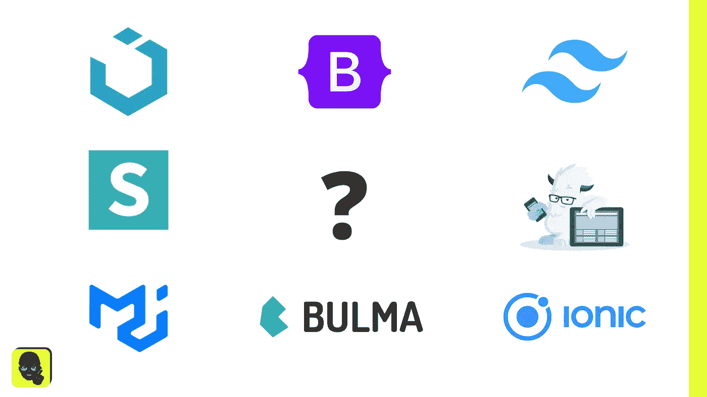

# 为什么只依赖 CSS 框架作为前端开发是个坏主意

> 原文：<https://javascript.plainenglish.io/why-its-a-bad-idea-to-always-rely-on-css-frameworks-as-front-end-devs-51602dad8315?source=collection_archive---------1----------------------->

在处理一大堆不同复杂程度和不同规模的不同项目时，有一点是不变的，那就是选择“最好的”、“最简单的”、“最流行的”框架来使用和适应。有了这次经历，我意识到总是[将你自举的新想法](https://baseweb.design/)建立在 CSS 框架上来建立价值百万美元的商业想法的[基础](https://get.foundation/)只是为了看着它[实现](https://mui.com/)成你自己定制的 [UI 套件](https://getuikit.com/)可能会非常难以管理……[BULMA](https://bulma.io/)！(好吧，最后一个有点过火了，我会帮助你抓住要点)。

# CSS 框架的好处

CSS 框架的好处因框架而异，因为它们都有自己独特的卖点，说明为什么它们是最好的，但本质上，CSS 框架是一组基于可重用工件(组件)的风格，具有不同的变化和功能，以减少每个项目从头构建通用组件的需要。

令人惊讶的是，我接触的第一个 CSS 框架是 [UI Kit](https://getuikit.com/) ，我认为这是世界上最神奇的东西。我当时把它安装到我的一个网站上，一切都如我所愿，但它更像是一个框架的框架，让我可以设置基本样式并从那里开始构建。它给了我从 CSS 框架中想要的一切，因为我在那个项目之后的每个项目中都使用它，我在一次又一次地做同样的事情时变得更快更有效。这是 CSS 框架真正闪光的地方。

# CSS 框架的缺点

> 请理解，尽管 CSS 框架有很多优点，但它们也有一些非常明显的缺点。

## 养成坏习惯

CSS 框架的最大好处之一是，每次使用它都会变得越来越容易。当你一遍又一遍地做同样的事情时，你就养成了习惯，在 CSS 的世界里这是一件好事，但是当你使用一个框架时，它可能会成为你下一个不使用该框架的项目的障碍。你将不得不忘记框架教给你的东西，否则你将试图复制给定 CSS 框架的相同代码风格和基本原理。

一个很好的例子是 [Tailwind](https://tailwindcss.com/) ，它正在席卷开发世界，因为它们为所有的样式都内置了类，所以你再也不用打开另一个样式表了。向给定的元素或组件中添加的类越多，它就越有内联样式的感觉。对于您的下一个项目，您可能习惯于从不打开样式表，而更喜欢内联样式，这在我看来是一个糟糕的习惯和做法。(我对这个有点反感…哈哈)。

## 维护

其中一个主要缺点是，您现在必须管理来自代码库之外的任何更改。当 [Bootstrap](https://getbootstrap.com/) 发布 5.0 版时，有突破性的变化，为了保持最新，我不得不重构许多依赖于特定 Bootstrap 风格和组件的代码库。

## 失去唯一的身份

有很多开发人员不喜欢 CSS 或这方面的设计。所有开发人员关心的是实现惊人的逻辑和可重用的功能，他们可以跨数百万个页面和组件使用这些功能，而样式则被推到了一边。作为一个有着[设计和品牌](https://www.thekirkconcept.com/what-we-do/branding?campaign=medium_cssframework)背景的开发人员，不可能忽视设计或者仅仅让 CSS 框架来支配设计。

> 我去的大多数开发人员的网站，我都可以浏览 20 秒钟，知道他们使用的是哪个 css 框架，因为开发团队不想做任何改变。

如果一个品牌有一个特殊的外观和感觉，这是坚持，开发人员将只是扔在网站上的标志，并使用材料用户界面。所以它看起来像拉里的机修工店的标志使用谷歌的网站模板。拉里在商店里想知道为什么他的网站看起来不像他的品牌创建时为他创建的[品牌代理](https://thekirkconcept.com/?campaign=medium_cssframework)的惊人模型，这都是因为一个开发者“喜欢”材料。

# 最后

所有这些令人惊叹的 CSS 框架的存在都是有原因的，本文不应该阻止您使用它们，但是您应该在对您正在处理的每个现有项目使用相同的框架之前小心谨慎。我会鼓励你创造你自己的，但当你这样做的时候，要记住所有这些点。不要成为问题的一部分，找到改进过程的方法，这样这些问题就不会阻碍未来的开发！

如果你正在为你的创业想法或现有业务寻找定制品牌，请不要犹豫，联系或前往[thekirkconcept.com](http://thekirkconcept.com)，这是我的业务，我在这里为各种规模的企业处理品牌创建、网络开发和网络应用。此外，如果你需要帮助建立你的惊人的想法，特别是在用户界面/UX 空间，我沉迷于创造新的想法和看到他们实现的过程，不管是谁提出的想法，我不需要任何信贷！

*更多内容看* [***说白了。报名参加我们的***](https://plainenglish.io/) **[***免费周报***](http://newsletter.plainenglish.io/) *。关注我们关于*[***Twitter***](https://twitter.com/inPlainEngHQ)*和*[***LinkedIn***](https://www.linkedin.com/company/inplainenglish/)*。查看我们的* [***社区不和谐***](https://discord.gg/GtDtUAvyhW) *，加入我们的* [***人才集体***](https://inplainenglish.pallet.com/talent/welcome) *。***