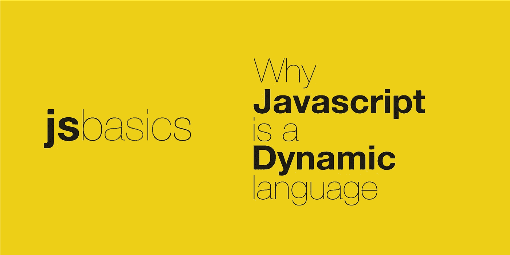

# 为什么 JavaScript 是一种动态语言？

> 原文：<https://javascript.plainenglish.io/why-javascript-is-a-dynamic-language-ff4e849406f0?source=collection_archive---------15----------------------->

## JavaScript 的特性使其成为一种动态编程语言。



根据定义，动态编程语言是一种高级编程语言，它在运行时执行静态编程语言在编译期间执行的许多常见编程行为，这些行为可以是添加新代码、修改类型系统或扩展对象。

使其动态的一些 JavaScript 特性如下:

*   JavaScript 是一种动态类型化的语言
*   JavaScript 是一种**松散类型的**语言

## 动态类型语言

如果变量的“类型”只在运行时检查，而不是在静态类型语言的编译时检查，那么这种语言就称为动态类型语言。有了这种支持，开发人员在编写代码时不需要指定任何变量的数据类型。

```
/* variables can be assigned value of any type */
let foo=123; 
let bar="testValue";
let testObj = {
   foo: 'bar'
}
```

它还支持在运行时改变变量的数据类型。

JavaScript 等语言中缺少编译步骤，这使得我们可以在构建时跳过“类型”验证。

## 弱类型语言

如果一种语言支持不相关类型的隐式转换，则称为弱类型语言。

```
let foo=123;
/* datatype can be changed at runtime */
foo = {
  testValue:'bar'
}
```

希望这能帮助你理解 JavaScript 的动态本质。请分享你的想法。

[*在 Twitter 上关注*](https://twitter.com/jsbasics_dev) *me，获取更多关于 JavaScript & Web 开发的有趣帖子。*

要了解更多细节，我推荐 MDN 文档。

*更多内容看* [***说白了。报名参加我们的***](http://plainenglish.io/) **[***免费周报***](http://newsletter.plainenglish.io/) *。在我们的* [***社区不和谐***](https://discord.gg/GtDtUAvyhW) *获得独家获取写作机会和建议。***