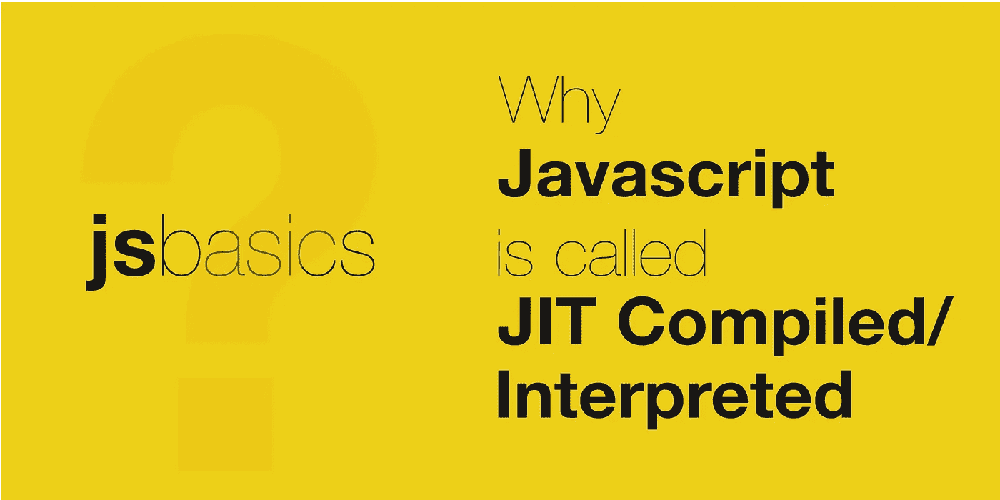

# 为什么 JavaScript 被称为解释的或 JIT(即时)编译的

> 原文：<https://javascript.plainenglish.io/why-javascript-is-called-interpreted-or-jit-just-in-time-compiled-c8cc490682bd?source=collection_archive---------2----------------------->

## 了解 JavaScript 为什么被解释或 JIT 编译，以及这意味着什么。

按照 MDN 的定义，

> JavaScript 是一种轻量级的、解释的或即时编译的编程语言。

Javascript 因其许多优点、特性而在开发人员中很有名。因此，本系列将列出并解释这种编程语言的每个特性。

所以在这篇文章中，让我们来看看为什么 JavaScript 是解释的，JIT(即时)编译的&这意味着什么？

# 什么是编译

**编译**是在执行之前，将程序源代码转换成机器可读的二进制代码的过程。大多数现代编程语言都采用这种模型来发布应用程序包，以便在最终用户的机器上执行。这有助于提高应用程序的性能，因为编译器针对最终用户的平台对代码进行了优化。

但是，在这种模式下，由于 CPU 指令集的底层变化，每个程序在不同的平台上需要不同的编译过程。您可能已经注意到，当您想要为您的机器安装一个应用程序时，您需要寻找一个特定于您的操作系统、硬件等的可安装程序。

# 什么是口译员

**解释器**是一个程序，它执行程序指令，而不需要将它们预编译成机器可读的格式。
解释方法可以选择以下方法之一:

*   解析源代码以执行行为，
*   将代码翻译成中间优化表示并执行它
*   选择执行预编译的字节码(来自编译器)以及适当的解释器 VM。

随着代码的不断解释，可以立即开始执行。因为代码是动态编译的，所以它不需要专门针对任何平台、指令来构建&这使它成为开发人员的一个很好的交付体验。

因为代码没有被编译，所以在执行代码之前，被解释的代码不会进行任何优化。

# JavaScript 是一种解释的、JIT 编译的

正如我们所观察到的，编译确保编译后的代码为更快的执行而优化&解释器确保代码执行可以立即确保更快的启动。

因此，JavaScript 引擎的设计充分利用了这两种方法的优点&开发了即时(JIT)编译模型。JavaScript 可以被描述为编译和解释语言，但是实际的实现对于每个引擎是不同的。

下面列出了一些流行的引擎:

*   谷歌的 V8:最受欢迎的一个。启用 Node.js，Chrome &其他基于 Chrome 的浏览器。
*   SpiderMonkey :启用 Firefox &的 fork 实现
*   [JavaScriptCore](https://en.wikipedia.org/wiki/WebKit#JavaScriptCore) :启用 Safari &其他基于 WebKit 的浏览器。

执行 Javascript 的一些主要步骤如下，

*   代码被解析以生成中间格式，例如 AST(抽象语法树),该格式可用于优化。
*   解释器将中间格式翻译成机器可读的代码，以快速启动执行。
*   对生成的代码的执行是连续监控的&任何具有优化范围的代码单元都要经过编译步骤，为其生成优化的代码。
*   一旦生成了优化的代码，它就会代替解释器生成的代码。
*   从而确保性能逐渐提高。

希望它能帮助你理解为什么 Javascript 被称为解释的或 JIT 编译的。请分享你的想法。

*关注我，获取更多关于 JavaScript & Web 开发的有趣帖子。另外，请给一个* [*跟着*](https://twitter.com/jsbasics_dev) *上推特。*

*更多内容请看*[*plain English . io*](http://plainenglish.io/)*。报名参加我们的* [*免费每周简讯*](http://newsletter.plainenglish.io/) *。在我们的* [*社区不和谐*](https://discord.gg/GtDtUAvyhW) *获取独家写作机会和建议。*