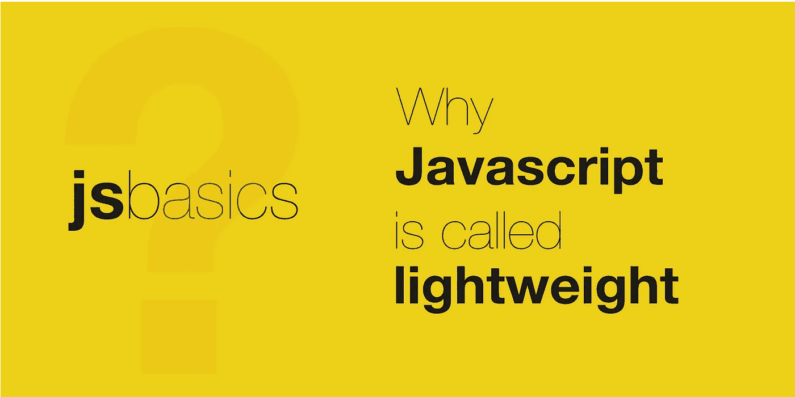

# JavaScript 为什么叫轻量级？

> 原文：<https://javascript.plainenglish.io/why-javascript-is-called-lightweight-5a1996db9ef6?source=collection_archive---------16----------------------->

## 理解 JavaScript 的“轻量级”特性意味着什么。

按照 MDN 的定义，

> JavaScript 是一种轻量级、解释型或即时编译的编程语言。

JavaScript 因其许多优点、特性而在开发人员中很有名。因此，本系列将列出并解释这种编程语言的每个特性。所以我们将从 JavaScript 的一个主要特性开始，它是一种轻量级编程语言。那么这意味着什么呢？

轻量级编程语言是那些被设计成:

*   在其代码或应用程序运行时消耗最少的内存资源。
*   简化跨平台的实施，如 web、移动、桌面等。,
*   要有极简、简单的语法、语义来帮助快速学习。

那么，JavaScript 如何适应这个法案呢？

JavaScript 是单线程语言&遵循代码的异步执行。它使得应用程序比其他语言实现消耗更少的资源。它运行在浏览器上，没有任何依赖性，这可以证明该语言的效率有多高。随着 ECMAScript(一种旨在确保跨浏览器的网页互操作性的 JavaScript 标准)的每一个新标准，新的功能都被融入到语言中，因此用户不需要编写任何新的代码，使其更加依赖资源。

JavaScript 不管运行在哪个平台上都不需要对代码做任何修改。相同的应用程序可以在浏览器、移动平台、桌面和许多其他系统上执行。这使得 JavaScript 成为全世界开发者构建应用程序的首选。

JavasScript 有一个最小的语言结构集，可以用来处理给定应用程序的任何需求。它使用动态类型，在运行时根据变量的值分配变量的类型。在 JavaScript 中，一切都是对象，所以通过声明每个变量，可以使用许多内置选项和操作。有了这么多的东西，开发人员只需要花最少的精力学习语言，就可以把更多的精力放在构建应用程序上。

希望它能帮助你理解为什么 JavaScript 是轻量级的。请分享你的想法。

关注我，获取更多关于 JavaScript 和 Web 开发的有趣帖子。另外，请在 Twitter 上关注。

*更多内容看* [*说白了. io*](http://plainenglish.io/) *。报名参加我们的* [*免费每周简讯*](http://newsletter.plainenglish.io/) *。在我们的* [*社区*](https://discord.gg/GtDtUAvyhW) *获得独家写作机会和建议。*