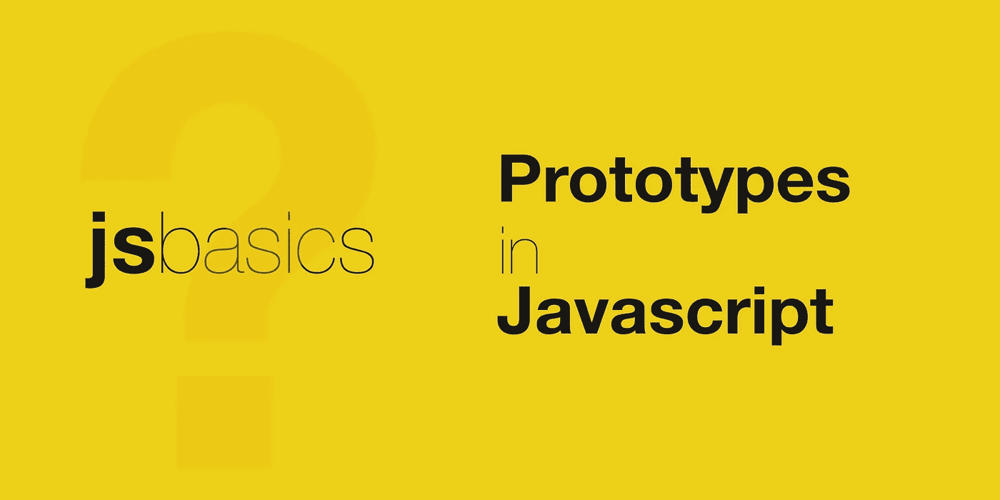

# JavaScript 为什么叫基于原型？

> 原文：<https://javascript.plainenglish.io/why-javascript-is-called-prototype-based-e9326562bf43?source=collection_archive---------8----------------------->

## 什么是基于原型的编程？



**基于原型的编程**是一种面向对象的编程风格，与显式使用基于类的继承相比，通过重用现有对象的属性和方法来实现逻辑或行为的重用。

行为被重用的对象被称为**原型。逻辑的重用可以通过克隆基本对象或从原型创建新对象来实现，这同样适用于扩展或添加新行为。**

JavaScript 是一种支持基于原型的继承模型的编程语言。这种模型鼓励开发人员首先关注应用程序的行为，然后再考虑将这些对象分组到更正式的分类系统中，比如类。JavaScript 也允许在运行时修改原型。

如您所知，JavaScript 中的一切都是对象&当涉及到继承时，它使用 Object 作为唯一的构造。每个对象都有一个私有属性，叫做**原型**，包含对其基本对象类型的引用。这个原型对象又可以有自己的原型对象&等等，直到它到达原型为空的点，这是最后的链接。这在 JavaScript 中被称为**原型链**。

根据 ES2015，读取对象原型的 API 如下:

```
Object.getPrototypeOf();
Object.setPrototypeOf();
```

一些例子:

```
const foo = {fooProp:true}
const bar = {barProp: true}/* logs the prototype of 'foo' */
console.log(foo.__proto__);
console.log(Object.getPrototypeOf());/* try to access 'foo.barProp'
 * returns 'undefined' 
 * as 'barProp' is not a defined inside 'foo' 
 */
console.log(foo.barProp);/* lets change the prototype of 'foo' */
Object.setPrototypeOf(foo, bar);/* Now, lets check again 
 * it will return 'true'
 */
console.log(foo.barProp);
```

上面的例子是如何打印出`foo.barProp`的值的？当从对象中访问属性时，首先在对象中查找，如果在对象中没有找到，则在对象的原型及其原型中扩展查找，依此类推，直到原型为`null`。甚至方法也可以以同样的方式重用和扩展，因为 JavaScript 中没有类方法原则，方法就像是对象的另一个属性。从而在没有基于类的继承的情况下实现行为或逻辑重用。

当执行继承的函数时，`this`值将指向继承的对象&，而不是定义函数的原型对象。

顺便提一下，ES2015 还提供了一些类&如果需要的话也可以使用。但只是语法糖&依赖于基于原型的继承

希望它能帮助你理解 JavaScript 中基于原型的继承。请分享你的想法。

要了解更多详细信息，推荐 MDN 文档。

*关注我，获取更多关于 JavaScript & Web 开发的有趣帖子。还有，请给个* [*跟着*](https://twitter.com/jsbasics_dev) *上推特。*

*更多内容看* [*说白了. io*](http://plainenglish.io/) *。报名参加我们的* [*免费每周简讯*](http://newsletter.plainenglish.io/) *。在我们的* [*社区*](https://discord.gg/GtDtUAvyhW) *获得独家写作机会和建议。*