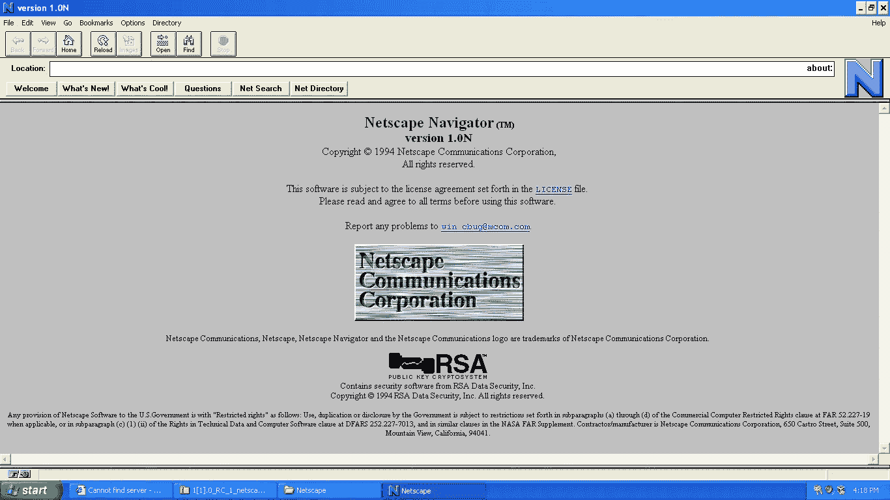

# JavaScript 如此怪异的原因

> 原文：<https://javascript.plainenglish.io/why-javascript-is-weird-eff1b4953579?source=collection_archive---------5----------------------->

## JavaScript 和 ECMAScript 的奇特历史

JavaScript 可能是世界上最广泛使用的**编程语言**，尤其是在网络和云端。几乎每个网站都包含 JavaScript，没有这种编程语言的网站是难以想象的。

然而，JavaScript 在许多开发者中**不是很受欢迎**，这是由于一方面**根本性的误解**，另一方面是令人困惑且有时相当**奇怪的版本历史**。

# **1995 年**

整个 JavaScript 故事始于 1995 年 5 月。要知道，杰夫·贝索斯创立亚马逊 10 个月后，谷歌 3 年后成立，Windows 95 即将发布。Internet Explorer 也还不存在，因为它是在 Windows 95 中首次推出的。

那时网站是非常静态的。唯一真正的交互只能通过表单完成，表单向服务器发送 POST 请求。然而，这是缓慢的，因此也是昂贵的，因为在当时的大多数国家，访问互联网是以时间来衡量的。

因为人们仍然希望有更多的交互性，所以他们的想法是为互联网开发一种专用的编程语言，既可以在服务器上运行，也可以在 web 浏览器上运行。

# **网络编程语言**

不，在这种情况下，我们说的不是 JavaScript 而是 Java。而且不，你没有看错。为了在网络浏览器中运行 Java，为当时最流行的网络浏览器 Netscape Navigator 开发了一个插件。

在网络浏览器中运行的 Java 应用程序被称为 **Java 小程序**。以便 Java 可以与相应的网站通信，即交换数据。然而，网景公司对这种方法并不满意，所以他们决定**开发另一种编程语言**，这种语言可以直接在网络浏览器中使用，不需要任何插件。

这就是他们开始寻找一种编程语言的原因，这种语言一方面要有尽可能少的语法，另一方面又能做更多的事情。

然后他们在名为 **Scheme** 的编程语言中找到了他们想要的东西。然而，由于 Scheme 与 Java 和 C 之类的编程语言相比差别太大，所以决定**将 Scheme** 的概念与 Java 的**语法结合起来。**

这是个好主意吗？大概不会。

Netscape Navigator 1

# 你有 10 天时间

为了开发编程语言和运行时环境，Netscape 正在寻找开发人员，并找到了 Brendan Eich ( [BrendanEich](https://medium.com/u/bcf2eaa79e8c?source=post_page-----eff1b4953579--------------------------------) )。由于他们想在 Netscape Navigator 2 的测试版中包含这个特性，Brendan Eich 只有 10 天的时间……不是开玩笑。

这种编程语言的第一个名字是 Mocha。对于 Netscape Navigator 2 的测试版，Mocha 被重命名为 LiveScript。不久之后，这种编程语言最终被称为 **JavaScript** 。

但是除了名字，JavaScript 和 Java 在语法上只有一些相似之处，至少在 1995 年是这样的。

# **从 JavaScript 到 ECMAScript**

JavaScript 的最终版本于 1995 年 12 月发布。1996 年 11 月，**网景公司将 JavaScript 提交给 ECMA** (欧洲计算机制造商协会)进行标准化。

ECMA 负责处理欧洲的技术标准，但多年来，它已成为一个全球性的活跃组织。顺便说一下，这个标准说的是 ECMAScript，而不是 JavaScript。这是因为 JavaScript 名称是 Oracle 的注册商标。

> ***JavaScript 和 ECMAScript 有什么区别？***
> 
> *JavaScript 是编程语言。EcmaScript 描述了语言标准及其版本。*

# ECMAScript 的兴起

提交后大约一年，ECMAScript 于 1997 年夏天发布。一年后，第二个版本出现了，但几乎没有任何新内容。ECMAScript 在 1999 年 12 月的版本 3 中经历了真正的扩展。例如，switch 语句、do-while 循环、try-catch、正则表达式、对字符串的改进支持等。被介绍了。

JavaScript 慢慢发展成为一种编程语言，人们可以合理地使用它。

但同时发生了其他事情，因为所谓的第一次浏览器战争正慢慢接近尾声。多年来，微软的 Internet Explorer 越来越受欢迎，因为与 Netscape Navigator 不同，Internet Explorer 是免费的。

是的，你没看错。Internet Explorer 兴起之前使用最广泛的 web 浏览器并不是免费的。

微软咄咄逼人的市场行为导致了包括网景公司在内的众多竞争对手的诉讼。尽管微软不得不向网景支付 7 . 5 亿美元，但这并没有阻止网景网络浏览器的衰落。

Photo by [Cherrydeck](https://unsplash.com/@cherrydeck?utm_source=medium&utm_medium=referral) on [Unsplash](https://unsplash.com?utm_source=medium&utm_medium=referral)

# EcmaScript 4 的垮台

ECMAScript 的第四版应该会非常大。计划中的几个特性应该可以使用复杂的应用程序。所以他们致力于静态类型系统、类、接口、名称空间、模块系统等等。

然而，对于 ECMAScript 应该有多复杂,**和**不同党派**有不同意见**。由于之前的浏览器大战，很难定义一个统一的标准。

2003 年的最后一个草案仍在讨论中，但最终未能达成一致，ECMAScript 4 于 2008 年夏天正式停产。大概也是因为除了 ie 浏览器之外，没有其他的浏览器有相对的市场份额，所以微软争取一个标准的野心不是很大。

Photo by [Kai Wenzel](https://unsplash.com/@kai_wenzel?utm_source=medium&utm_medium=referral) on [Unsplash](https://unsplash.com?utm_source=medium&utm_medium=referral)

# 谷歌的 V8 编译器

另外，Mozilla Firefox 的第一个版本也于 2004 年发布。这是基于 Netscape 网络浏览器，该浏览器已经作为开源软件发布。四年后的 2008 年，谷歌终于发布了名为**谷歌浏览器**。

谷歌的这一步对于 JavaScript 的历史非常重要，因为谷歌是第一个认识到 JavaScript 的高性能执行对于 web 应用的成功有多么重要的人，这就是为什么 Chrome 从一开始就包含了快速 JIT(即时)编译器。

这个 JavaScript 编译器叫做 V8。这就是为什么 Chrome 能够以比当时任何其他网络浏览器都快得多的速度运行带有 JavaScript 的网络应用。

# 2009 年:ECMAScript 5

ECMAScript 4 的大计划仍然存在，这就是为什么 ECMAScript 试图处理更小的功能，如**严格模式**以使 JavaScript 在运行时开发中的一些功能更加严格。另外，很多存在了 10 年的 bug 也终于修复了。

# EcmaScript 2015

ECMAScript 2015(或 ECMAScript 6)的代号为 **Harmony** ，应该是表达了所有浏览器厂商重新走到一起，都在努力推动 ECMAScript 向前发展。毕竟，尽管微软也准备好了再次谈判，因为微软的 ie 浏览器人气大减。

2015 年 6 月， **ECMAScript 2015 发布，**该版本不仅包含许多新特性，还包含许多最初为 ECMAScript 4 讨论的特性，例如**类**和**模块系统**。

不幸的是，仍然没有静态类型系统，但微软最终能够用 **TypeScript** 来补救这一点。但是，ECMAScript 2015 仍然是一个很好的重要更新，是向前迈出的一大步。

此外，还决定每年发布 ECMAScript **的**新版本**。因此，版本控制方案已经改变，每个新版本都标记了发布年份。**

Photo by [Hannah Busing](https://unsplash.com/@hannahbusing?utm_source=medium&utm_medium=referral) on [Unsplash](https://unsplash.com?utm_source=medium&utm_medium=referral)

# 每年都有新版本

从那以后，每年都会发布 ECMAScript 的新版本。根据新特性开发进度的快慢，这些版本会更小或更大，但总的来说，新版本方案已经证明了自己。它提供了更多的透明度、清晰度和可靠性。

JavaScript 的进一步开发原则上由 ECMA 的一组成员负责，即所谓的 **TC39** (技术委员会 39)。这些成员通常为谷歌或微软等相关网络浏览器制造商工作，但也有一些成员为脸书或推特等公司工作。

你可能听说过这个委员会，因为我在[微软如何改变 JavaScript 和 TypeScript](https://betterprogramming.pub/how-microsoft-wants-to-destroy-typescript-1f1a53b18de6) 文章中提到过他们。

然而，该委员会在 ECMAScript 2016 中引入了一个名为“ **TC39 流程”**的新流程，其理念是新功能必须经过 5 个阶段才能包含在新版本的 ECMAScript 中。

整个范围从阶段 0，它被称为“斯特劳珀森”，其中一个想法是第一次讨论；到阶段 4，在该阶段中完成特征的标准化，然后由相关的网络浏览器实现。

# 向后兼容性

这也非常重要，因为像 15 年或 20 年前那样，每个网络浏览器的工作方式都略有不同的情况是你不想再遇到的。互联网对于日常生活已经变得太重要了，太多的事情依赖于它，这也是 JavaScript 向后兼容的原因。

理论上，从 JavaScript 中删除不再需要的特性以支持新特性是很容易的，但这将是一个突破性的变化，这正是你想要不惜一切代价避免的！

然后简单地添加新特性，例如“let”和“const ”,它们与关键字“var”一起存在。或者新的特性只在新的上下文中可用，比如关键字“await”，只有当一个函数已经被定义为“async”时才能使用。

# 结论

如你所见，与其他编程语言相比，JavaScript 的历史非常疯狂，而且 JavaScript 的目的也随着时间的推移而改变。JavaScript 在一开始是一种只有前端的编程语言。如今，它也大量用于服务器事务。

还有，很多人和很多公司都参与了 JavaScript 和 ECMAScript 的开发。将这些公司联合起来改进 JavaScript 并不容易。所有这些因素使得 JavaScript 如此怪异。

干杯！

# 接下来阅读

 [## TypeScript 优于 JavaScript 的 3 个原因

### 是时候停止在 TypeScript 上使用 JavaScript 了

javascript.plainenglish.io](/3-reasons-why-typescript-is-better-than-javascript-76443330f248)  [## 带有 gRPC、API 网关和身份验证的 TypeScript 中的微服务

### 带有 gRPC、API 网关、身份验证和验证的 TypeScript 中的微服务

levelup.gitconnected.com](https://levelup.gitconnected.com/nestjs-microservices-with-grpc-api-gateway-and-authentication-part-1-2-650009c03686)  [## 如何领导技术团队的 5 个技巧

### 从软件开发人员的角度来看

javascript.plainenglish.io](/5-tips-on-how-to-lead-a-tech-team-dffa080c0183) 

*更多内容请看*[***plain English . io***](https://plainenglish.io/)*。报名参加我们的* [***免费周报***](http://newsletter.plainenglish.io/) *。关注我们关于*[***Twitter***](https://twitter.com/inPlainEngHQ)*和*[***LinkedIn***](https://www.linkedin.com/company/inplainenglish/)*。加入我们的* [***社区不和谐***](https://discord.gg/GtDtUAvyhW) *。*