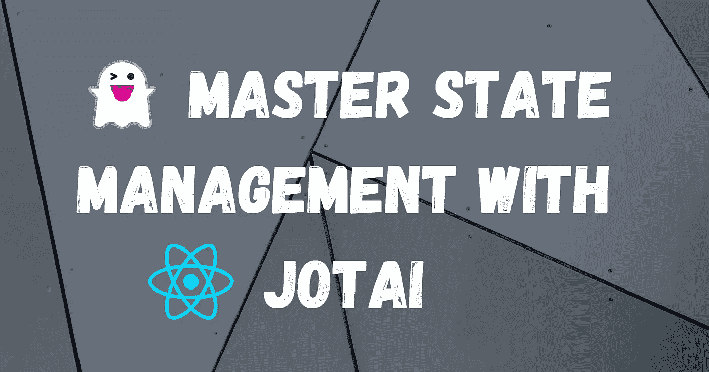

# 为什么 Jotai 是 React 中更好的状态管理的关键

> 原文：<https://javascript.plainenglish.io/why-jotai-is-the-key-to-better-state-management-in-react-b44796327cc7?source=collection_archive---------6----------------------->



Cover image from author, made with Canva

如果我开始用 React 和你讨论状态管理，首先想到的可能是`Context`。或者也许是`react-redux`。在似乎漫长的时间里，React 的`Context`和 Redux 被用作提供应用程序中许多组件使用的数据的主要解决方案。

React 的内置状态解决方案可能看起来是短期内最可行的解决方案，但最终会导致维护问题和性能问题。让我解释一下。

# 反应上下文 API

首先，我们将看看如何使用`Context`这个简单的黑暗模式切换。

所以，让我们从创造一个环境开始。

```
import React from "react";

export type Theme = "light" | "dark";

export const ThemeContext = React.createContext<{
    theme: Theme;
    setTheme: React.Dispatch<React.SetStateAction<Theme>>;
}>({ theme: "light", setTheme: () => {} });
```

这个导出的`ThemeContext`稍后用于初始化上下文值，以及在其他组件中检索它的值。

注意，React 没有为我们提供更新上下文数据的直接方法。这就是为什么我们还必须有`setTheme`来更新上下文中的值。

例如，让我们创建一个按钮来切换主题。

# 消费语境

在 React 函数组件中，使用`useContext`钩子来消耗上下文。类组件通过设置`MyClass.contextType = ThemeContext`(例如)达到同样的效果。

```
import React, { useContext } from "react";
import { ThemeContext } from "./store";
import "./ThemeToggle.css";
import { Sun, Moon } from "react-feather";

export default function ThemeToggle() {
    const context = useContext(ThemeContext);

    const onToggle = () => {
        const newTheme = context.theme === "dark" ? "light" : "dark";
        context.setTheme(newTheme);
    };

    return (
        <button type="button" className={context.theme} onClick={onToggle}>
            {context.theme === "dark" ? (
                <Sun className="toggle sun" />
            ) : (
                <Moon className="toggle moon" />
            )}
        </button>
    );
}
```

天黑的时候，我们要让太阳知道，按一下按钮，屏幕就亮了。当它是亮的时候，我们显示当点击时月亮移动到黑暗面。

# 提供上下文数据

最后，当从上下文传递数据时，我们用一个`Provider`包装组件。通常，上下文提供程序中使用的值来自状态变量。

```
import { useState } from "react";
import "./App.css";
import ThemeToggle from "./ThemeToggle";
import { Theme, ThemeContext } from "./store";
import ThemeStatus from "./ThemeStatus";

function App() {
    const [theme, setTheme] = useState<Theme>("light");

    return (
        <ThemeContext.Provider value={{ theme, setTheme }}>
            <div className={`App ${theme}`}>
                <h1>Theme Mode Demo</h1>
                <ThemeToggle />
                <ThemeStatus />
            </div>
        </ThemeContext.Provider>
    );
}

export default App;
```

那就是。

# 概观

现在，我们已经看到了在 React 项目中实现上下文是多么容易。看起来很简单，对吧？对于不需要太多状态的小型应用程序，这种解决方案很好。

当你的应用程序变得越来越复杂时，问题就出现了。假设您正在构建一个多用户聊天应用程序。现在，除了黑暗模式切换之外，您还必须管理当前经过身份验证的用户、将站点内容翻译到的语言环境、用户的站点外观首选项等等。

解决这个问题的一种方法是只使用一个全局上下文来存储所有内容。这样，在应用程序中只创建一个上下文提供者。但是，如果许多组件依赖于相同的上下文，对该值的任何更改都会触发每个组件重新呈现。如前所述，随着应用程序的不断增长，这可能会导致重大的性能问题。

另一种方法是为不同的目的创建多个上下文。例如，存储用户数据的上下文、存储语言代码的上下文、存储用户外观设置的上下文等等。更不用说我们是否想在`localStorage`中保存任何变量。现在的问题是，我们创建了所有这些不同的上下文，所有这些都需要初始化，所有这些都需要稍微不同的代码来消费。我们最初想要的是黑暗模式。

这也使得独立的单元测试更加困难。我们现在必须弄清楚我们测试的组件所消耗的上下文，并确保它们被正确模拟。

如你所见，React `Context` API 可以最低限度地使用，但仍然有许多不可持续的使用方法。理想情况下，我们应该尽量不依赖全局状态，相反，如果数据不需要传递得太深，我们应该尽量避免使用全局状态。

现在，如果有一种方法，我们可以获得简单易用的 API 的好处，同时避免不必要的重新渲染，会怎么样？如果有一个库被设计成使状态管理既灵活又简单，同时避免了上述问题并集成了额外的功能，如存储持久性和状态派生，会怎么样？

见见乔泰。

# 约泰

Jotai 解决了我们所有的问题，同时仍然可以扩展到大型和小型项目。用`npm i jotai`安装它，让我们进入另一个例子。

这一次，我们将构建一个简单的单词计数器，如下所示。

# 什么是原子？

Jotai 中的每个状态称为一个“原子”。就像 React `Context`一样，我们导出原子的配置用于其他地方。

```
import { atom } from "jotai";

// Initialise the value to an empty string
export const textAtom = atom("");
```

注意，默认情况下，所有原子都是全局可用的，所以我们甚至不需要在示例中包含一个`Provider`。

Jotai 也使派生状态变得容易。例如，我们可以创建一个新的 atom，它派生出`textAtom`来计算文本的字符数。回调中传递的`get`函数允许我们读取 atom 值，同时跟踪作为依赖项的新 atom。

```
export const charactersAtom = atom((get) => {
    return get(textAtom).length;
});
```

# 行动

# 动作原子

现在我们已经学习了如何创建可读的派生原子，让我们来谈谈动作原子。

动作原子也是以类似的模式创建的，但它们的存在只是为了向原子写入值。在我们示例的上下文中，我们可以创建一个 action 原子来将输入的文本转换成可读的大小写。

```
export const sentenceCaseAtom = atom(null, (_get, set) => {
    set(textAtom, (prev) => {
        // Converts the previous value of the atom into sentence case.
        return prev.split(" ").map(word => {
            return word[0].toUpperCase() + word.slice(1);
        }).join(" ")
    })
});
```

# 可重置原子

Jotai 的另一个很酷的特性(特别是 Jotai 的实用工具包)是可以重置值的原子。因此，您可以使用`useResetAtom`来提供一个仅执行重置的函数，而不必使用`useSetAtom`和一个确定的默认值。

```
import { atomWithReset } from "jotai/utils";
export const textAtom = atomWithReset("");
```

# 使用

```
import React from "react";
import { useResetAtom } from "jotai/utils";
import { useSetAtom } from "jotai";
import { sentenceCaseAtom, textAtom } from "./store";
import "./TextActions.css";

export default function TextReset() {
    const resetText = useResetAtom(textAtom);
    const toSentenceCase = useSetAtom(sentenceCaseAtom);

    return <div className="actions">
        <button type="button" onClick={resetText}>Reset</button>
        <button type="button" onClick={toSentenceCase}>Format case</button>
    </div>
}
```

# 摘要

正如您所看到的，Jotai 是 React 的一个非常棒的极简状态管理解决方案。目前，我在几乎所有新的 React 项目中使用它，而不是使用`useContext`或 Redux 等其他工具。我认为你应该考虑在未来的项目中也这样做。

尽管核心 API 过于简单，但 Jotai 的实用程序提供了比 React 更多的特性。此外，它们的原子驱动状态的原始性质比上下文更容易维护，因为它避免了许多带有许多状态变量的`Provider`，这最终变得难以阅读，因此难以测试。

只有一点需要注意:确保通过将相关的原子保存在同一个文件中，用 Jotai 将原子配置分开。

如果你喜欢阅读这篇文章，请继续关注。

*原载于*[*https://cs 310 . hash node . dev*](https://cs310.hashnode.dev/why-jotai-is-the-key-to-better-state-management-in-react)*。*

*更多内容看* [***说白了。报名参加我们的***](https://plainenglish.io/) **[***免费周报***](http://newsletter.plainenglish.io/) *。关注我们关于* [***推特***](https://twitter.com/inPlainEngHQ) ，[***LinkedIn***](https://www.linkedin.com/company/inplainenglish/)*，*[***YouTube***](https://www.youtube.com/channel/UCtipWUghju290NWcn8jhyAw)*，以及* [***不和***](https://discord.gg/GtDtUAvyhW) ***。*****

***有兴趣缩放你的软件启动*** *？检查出* [***电路***](https://circuit.ooo/?utm=publication-post-cta) *。*