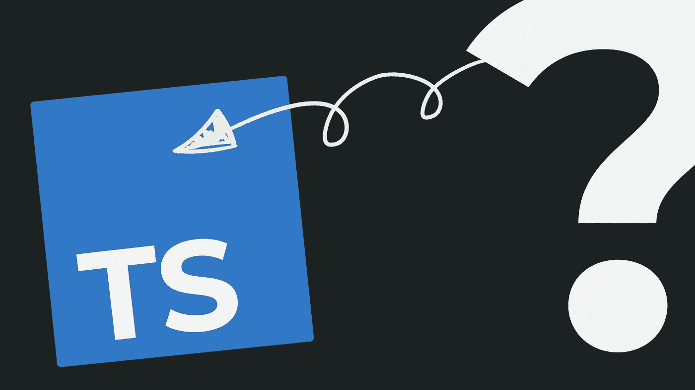

# 为什么要学 TypeScript？

> 原文：<https://javascript.plainenglish.io/why-learn-typescript-19d71dfb12a5?source=collection_archive---------10----------------------->

## 还有为什么比 JavaScript 好玩？

你想知道 TypeScript 有什么大惊小怪的吗？以及是否值得投入时间和精力？或者是否在你的项目中使用？如果是这样，你来对地方了。

让我告诉你我的故事。几年前，我试图学习 JavaScript。

我已经用 C 和 C++、LUA、ActionScript 和 Python 写了代码…所以我并没有真正开始我的编码之旅。但我换了工作，部分代码是 JavaScript，我试图了解错误来自哪里，所以我开始试图了解发生了什么。

尝试学习 JavaScript 时，我很沮丧。我试过了，失败了。进入一个现有的代码库，试图跟踪一行又一行记录不良的代码中发生的事情…是令人沮丧的。但最终，我还是学会了 JavaScript……通过首先学习 TypeScript。我发现使用**打字稿比 JavaScript 有趣多了。**

在某种程度上，这就是*的奇怪之处*。

因为 TypeScript 在某种意义上是约束的**负载。它限制了你能做的事情。它迫使你遵循 JavaScript 之上添加的规则。然而对我来说，TypeScript 很有趣……在某种程度上，JavaScript 却不是。**

为什么？

是什么让 TypeScript 成为一种令人愉快的体验？不仅仅是在我看来，在成千上万回答 Stack Overflow 开发者调查并将 TypeScript 评为第三受欢迎语言的开发者看来也是如此。(顺便说一句，它对我们的大脑以及它们如何工作有什么看法？)

这违反直觉。但是我们要一起探索。

*   第一:什么是 TypeScript，它*有用*做什么？
*   第二:为什么打字稿*好玩*？是什么让 JavaScript 变得有趣，至少对我来说不是？
*   第三:我如何通过 Typescript 学习 TypeScript 和 JavaScript，以及为什么 TypeScript 是学习的好选择

# 什么是 TypeScript？

TypeScript 是 JavaScript 的超集。它是 JavaScript 语法之上的 1/附加语法，2/向下转换到 JavaScript，3/预测 JavaScript 的更新。

这是什么意思？

首先，任何有效的 JavaScript 语法都是有效的 TypeScript 语法。如果您有一页 JavaScript 代码，请将文件扩展名从。js 到。ts 和“瞧！”:有效的类型脚本代码！(除了一些偶然的例外/错误，如。数组上的函数)

第二，将类型脚本转换成 JavaScript。那是什么意思？基本上，这意味着最终，TypeScript 代码将通过编译器，并作为 JavaScript 代码输出。这就是正在执行的。

这意味着**JavaScript 可以做的任何事情(JavaScript 可以做很多事情*)，TypeScript 也可以做****。*

*在另一个更高的层面上，所有这些意味着 **TypeScript 不是 JavaScript 的竞争对手**。您不能在浏览器中直接执行 TypeScript，只有 JavaScript 可以做到这一点。TypeScript 是一个产生有效 JavaScript 的**工具**，甚至可能比我们自己产生的代码质量更高。*

*从这个意义上说，TypeScript 的存在只是为了改善用 JavaScript 编码的*体验*。我不知道这是否是初衷，但考虑到开发者的高满意度，这肯定是最终结果。*

*这当然是我亲身经历的一件事。*

*TypeScript 是如何做到的？嗯，这才是根本问题，不是吗！TypeScript 提供的更好的开发体验的组成部分是什么？是什么让 TypeScript 变得有趣？*

# *是什么让 TypeScript 变得有趣？(为什么不直接用 JavaScript？)*

*TypeScript 从两个方面改善了 JavaScript 的开发体验。*

*首先，最基本的，TypeScript 是关于在 JavaScript 之上添加 _documentation_ 的。如果您正确地配置了您的项目，它会迫使您这样做。当然，不仅仅是你自己，还有参与项目的其他开发人员。并且该文档是部分的—它并不打算覆盖文档应该提供的所有信息。但是它确实提供了一个非常具体的信息:那就是变量应该包含的*类型*的信息。*

*JavaScript 会很乐意将 true 返回给语句号零等于空字符串。但是字符串和数字是两回事。他们是两种不同的类型。JavaScript 是弱类型的，甚至是无类型的。在 JavaScript 中，您可以在任何时候将任何类型的值赋给任何变量。*

*TypeScript 将**类型**添加到 JavaScript 代码中。(名字里有线索)。*

*类型检查只在编译时进行，而不是在代码运行时进行。如果你把一个变量说成了某种类型，然后又以不同的方式使用它，类型检查就会报错。这意味着 TypeScript 使你成为(稍微)更好的编码者。它还使您的开发工具成为更好的开发工具:添加约束有助于您的工具更好地猜测您正在尝试做什么，从而帮助您更快地到达那里。*

*越快越好。这样更好。*

*Gao、Bird 和 Barr 研究了类型注释如何检测 JavaScript 中的 bug，发现平均值为 15% 。在与许多松散类型的语言(最著名的是 LUA、Python 和 JavaScript)打交道超过 15 年后，我认为 15%似乎被低估了。*

*TypeScript 消除麻烦并使事情变得更有趣的第二种方式是，它预测未来的 JavaScript 语法，并允许您以过去的 JavaScript 语法为目标。多年来，JavaScript 已经改进了很多，但是当我开始使用它的时候，没有胖箭头，没有承诺，也没有扩展操作符。当然，这些功能正在开发中，但是因为浏览器不支持而无法使用。*

*TypeScript 允许我使用更好、更干净的语法，而不用担心兼容性，因为我可以将代码转换回旧语法，并选择我希望 TypeScript 编译器输出的兼容性级别。*

*当你花了很多时间来解决 JavaScript 兼容性问题时，这是很好的，令人耳目一新的。*

*当然，现在情况有所改善，因为那些时髦的新特性已经融入了 JavaScript。但是有一天，一个新的闪亮的特性将会为 JavaScript 语言提出……而 TypeScript 将会首先拥有它。*

*因为 TypeScript 必然比 JavaScript 采用得更快。这也是 TypeScript 成为学习的好选择的部分原因。*

# *是什么让 TypeScript 成为使用和学习的好选择？*

*JavaScript 很奇怪。*

*事实上，有一个专门研究 JavaScript 古怪之处的网站，叫做 [JavaScript WTF](https://javascriptwtf.com/) 。这种怪异很大程度上是由于 JavaScript 管理类型的方式。当学习 JavaScript 时，这种怪异会导致很多*的挫败感。**

*当你学习 JavaScript 时，TypeScript 给你**训练轮子**。它让你远离许多会引起困惑的陷阱。*

*就个人而言，我通过 TypeScript 学习 JavaScript 要快得多。因为 **TypeScript 的心智模型对我来说更清晰**。因为我的 IDE 会给我指明正确的方向，帮助我更快地完成任务。它会指出我的错误。*

*现在我不想在这里挑起任何战火。事实上，考虑到 StackOverflow 的结果，我并没有说什么革命性的东西。*

*但是如果你想学习 JavaScript，我建议你使用 TypeScript。*

**更多内容请看*[***plain English . io***](https://plainenglish.io/)*。报名参加我们的* [***免费周报***](http://newsletter.plainenglish.io/) *。关注我们关于*[***Twitter***](https://twitter.com/inPlainEngHQ)*和*[***LinkedIn***](https://www.linkedin.com/company/inplainenglish/)*。查看我们的* [***社区不和谐***](https://discord.gg/GtDtUAvyhW) *加入我们的* [***人才集体***](https://inplainenglish.pallet.com/talent/welcome) *。**