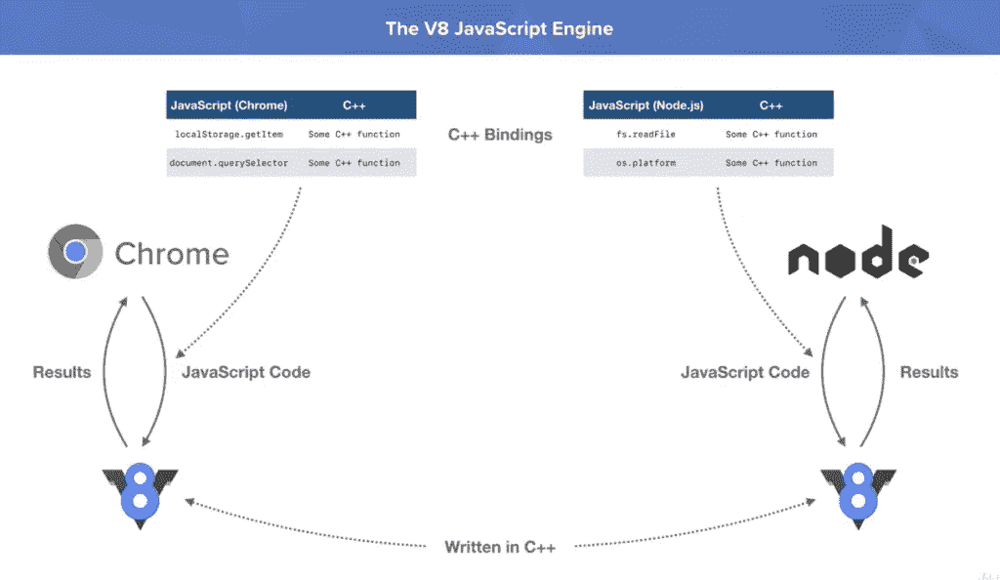

# 为什么 MERN 堆栈变得流行？我们来详细看看

> 原文：<https://javascript.plainenglish.io/why-mern-stack-is-becoming-popular-lets-see-in-detail-8825fd3fd5ee?source=collection_archive---------13----------------------->

如果您是一名 web 开发人员，您应该听说过 MERN 堆栈。它是使用 JavaScript 构建的，最近被广泛使用。但是为什么会这样呢？它有哪些不同于传统 PHP 或 Django 框架的特性？我们来详细看看。

# 什么是 MERN·斯塔克？

先问一个问题，只用一种语言开发一个全栈应用好还是用多种语言做前端和后端好？MERN 基本上是一种开发 web 应用程序的面向全栈 JavaScript 的方法。您也可以只使用 JavaScript 来开发一个具有数据库管理功能的成熟应用程序。 **MERN 基本意思是 MongoDB，Express，React，Node.js** 。这些是掌握 MERN 堆栈需要了解的技术。

上述 4 种技术可以单独使用，也可以与其他功能一起使用，但像这样结合使用会使它更强大。主要特点和优势在于所使用的技术。让我们更清楚地看到它们中的每一个。

# M => MongoDB

Mongo 不同于 MySQL 和 Oracle 等数据库，因为它是一个 NoSQL 数据库。它不是以表和模式的形式保存数据，而是以键值对的形式存储数据。我们也可以说它是以 Python 中的字典的形式存储的，或者是以 JSON 这样的**格式存储的。作为一个 NoSQL 数据库，操作的功能和速度都增加了。如果您了解模式，那么您也会知道数据库中使用的表由于固定的列数而不能水平扩展，但是在垂直方向上可以很好地工作。这种类型的数据库具有高度的灵活性和可伸缩性，可以纵向和横向扩展。**

NoSQL 数据库**没有预定义的模式**；它们本质上是动态的。由于它们不存储在表中，复杂的查询可以以更快的速度执行。MongoDB 的好处是，如果你想使用它创建一个应用程序，它提供了一个免费的集群来存储互联网上的数据，并且可以通过制作 API 来访问。因此，我们可以通过在 Atlas-mongo 中创建一个免费帐户，直接开始使用 MongoDB 构建应用程序。

该程序的步骤如下:[文档。Atlas.MongoDB](https://draft.blogger.com/blog/post/edit/3504568035593819778/8595296453639201332#)

# E = >快递

Express 是一个 JavaScript 框架，它在 web 应用程序的后端帮助你。它使用 Node.js。使用这个框架可以处理许多功能，如制作路线、页面和 API。让我们清楚地理解这一点，这项技术的主要任务是处理 **HTTP 请求，如 GET、POST 等**。但是它们是什么呢？。每当您需要一个 web 页面时，GET 请求将被发送到 web 服务器，web 服务器将使用适当的响应对其进行响应。如果你想发送一些数据，你做一个 POST 请求，数据被服务器接收。这就是客户机-服务器体系结构中处理请求的方式。

你可以使用 Express 和 redirect 制作 URL 模式，或者根据请求做一些微服务。如果你正在创建一个更大的应用程序，你也可以使用**模板引擎**，或者甚至使用 **Redux** 。模板引擎基本上是像 HTML 和 CSS 一样处理你的页面。

在这里获取更多关于 Express 的细节和信息:——[Express](https://draft.blogger.com/blog/post/edit/3504568035593819778/8595296453639201332#)

# R = >反应

React 有时被认为是 MERN 堆栈的核心部分，因为大多数功能都是 React 提供的。它是一个由脸书开发的 JavaScript 库(不是一个框架)，也用于开发脸书。它在**上运行，以组件**的形式开发应用程序。React 中的所有东西都是一个组件，数据从上到下在组件之间流动。组件是什么意思？如果你看到一个网页，你可以观察到不同的东西。例如，以脸书为例。有不同的东西，如评论区，搜索栏，在线人数，信使等。所有这些不同的组件共同构成了整个页面。

作为一个库使它更加灵活，用户可以用自己的结构和方式开发 web 应用程序。基于组件的方法确实给它增加了许多特性。如果我们还想在个人资料页面中添加一个评论部分，我们可以只在该页面中导入组件，而不是编辑整个 HTML 和 CSS。名字 React 是因为**是声明性的**。实际上**根据用户动作**塑造自己，而不是重新加载页面，更像一个动态网页。

在这里获得更多关于 React 的细节和文档:- [React](https://draft.blogger.com/blog/post/edit/3504568035593819778/8595296453639201332#)

# N => Node.js

Node.js 是支持使用所有其他技术的技术。因为起初，JavaScript 只在前端使用，因为只有浏览器理解它。但是 Node.js 使您能够像真正的传统编程语言一样在前端和后端使用 JavaScript。Node.js 是使用 Chrome 的 V8 引擎和 C 语言开发的。

像任何其他语言一样，JavaScript 的受欢迎程度也随着 Node.js 的出现而增加。关于 Node 还有一件更重要的事情:它附带了一个名为 NPM 的**包管理器，这也为开发人员减轻了许多负担。您可以使用这个包管理器下载任何节点模块，所有模块的信息都存储在一个 **Package.json 文件中。要将您的应用程序发送给其他人，没有必要发送所有的模块，因为您可以只发送主文件。其他人可以使用 NPM 和 package.json 文件安装应用程序所需的模块。****

在这里获得更多关于 Node.js 的细节和文档:- [Node.js](https://draft.blogger.com/blog/post/edit/3504568035593819778/8595296453639201332#)

欲了解更多信息，请访问:

[https://www . mayhemcode . com/2022/01/why-mern-stack-is-being-popular-lets . html](https://www.mayhemcode.com/2022/01/why-mern-stack-is-becoming-popular-lets.html)

*原载于 2022 年 1 月 14 日 https://www.mayhemcode.com***。**

**更多内容看* [***说白了。报名参加我们的***](http://plainenglish.io/) **[***免费每周简讯***](http://newsletter.plainenglish.io/) *。在我们的* [***社区不和谐***](https://discord.gg/GtDtUAvyhW) *获得独家获得写作机会和建议。****