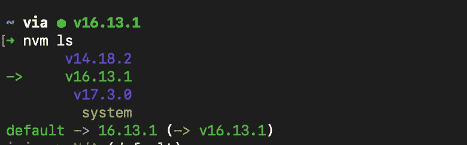
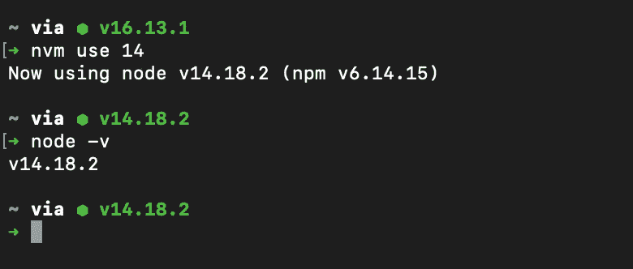
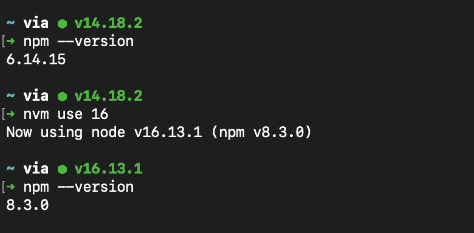

# 为什么 NVM 对 Web 开发人员非常有帮助

> 原文：<https://javascript.plainenglish.io/why-nvm-is-tremendously-helpful-for-web-developers-5d55935018d8?source=collection_archive---------5----------------------->

## 让我们来看看如何在 3 分钟内有效利用它！


Photo by [Mikhail Nilov](https://www.pexels.com/@mikhail-nilov?utm_content=attributionCopyText&utm_medium=referral&utm_source=pexels) from [Pexels](https://www.pexels.com/photo/man-person-people-woman-7988667/?utm_content=attributionCopyText&utm_medium=referral&utm_source=pexels)

如果你正在开发 Node.js 生态系统，那么你可能听说过**节点版本管理器**或 **NVM** 。

今天我们将看到为什么这存在，为什么你应该关心学习它。

# NVM 是什么？

根据[官方文件](https://github.com/nvm-sh/nvm)，

`*nvm*` *允许您通过命令行快速安装和使用不同版本的 Node.js。*

除此之外，它还让你远离许多错误。

## 眼前的问题

当你试图安装某个全局 npm 包时遇到过`EACCESS`错误吗？

```
npm install -g some-package
```

我打赌你有！但是有什么解决办法呢？一些 StackOverflow 答案会建议你使用`sudo`。这是一个非常非常糟糕的想法，会给你带来更多的问题。

官方的 [npm 文档](https://docs.npmjs.com/resolving-eacces-permissions-errors-when-installing-packages-globally)建议我们使用`node version manager (nvm)`来解决这个问题。

# 安装 NVM

如果您使用的是 Linux，请运行以下命令:

```
curl -o- https://raw.githubusercontent.com/nvm-sh/nvm/v0.39.1/install.sh | bash
```

如果成功，您可以检查版本:

```
command -v nvm
```

您可能需要关闭终端，然后重新打开。

# 安装 Node.js 的最新版本

如果我们想要安装最新版本的节点，我们可以运行以下命令:

```
nvm install node
```

在撰写本文时，Node.js 的最新版本是`v17.3.0`。

# 安装 Node.js 的特定版本

在写这篇文章的时候，Node.js 的最新版本是`16.13.1`。如果我们想安装这个特定版本:

```
nvm install 16.13.1
```

# 检查安装的版本

如果您想查看计算机上安装的版本列表，请运行以下命令:

```
nvm ls
```

这将显示您机器上的版本。



result of npm ls

# 使用特定版本的节点

现在，假设您的机器上安装了该节点的多个版本。你想在它们之间转换。也许你想开发一个使用 Node.js 14 的遗留应用程序。

你只需运行:

```
nvm use 14
```

您可以通过运行以下命令来检查节点的版本:

```
node -v
```

现在您正在使用节点 14。



version switch of node

# 安装最新版本的 npm

您可以安装 npm 的最新版本，针对该版本运行以下命令:

```
nvm install-latest-npm
```

并检查版本:

```
npm --version
```

所以本质上，现在您的机器上可以有多个版本的 npm！



多酷啊。

# 最终注释

这些工具让我们的生活变得更加轻松。让我们充分利用它们。

希望你今天学到了新东西。祝您愉快！

*更多内容请看*[***plain English . io***](https://plainenglish.io/)*。报名参加我们的* [***免费周报***](http://newsletter.plainenglish.io/) *。关注我们关于*[***Twitter***](https://twitter.com/inPlainEngHQ)*和*[***LinkedIn***](https://www.linkedin.com/company/inplainenglish/)*。查看我们的* [***社区不和谐***](https://discord.gg/GtDtUAvyhW) *加入我们的* [***人才集体***](https://inplainenglish.pallet.com/talent/welcome) *。*