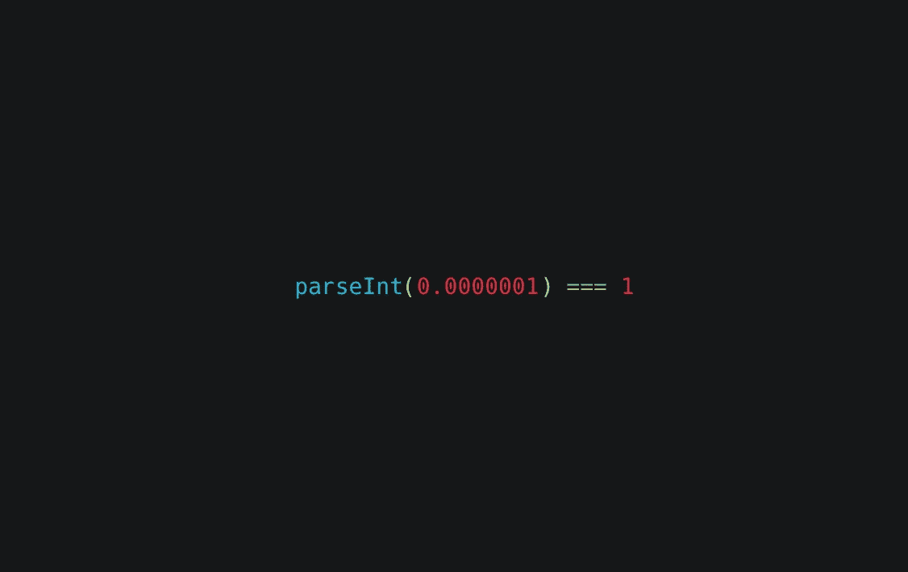
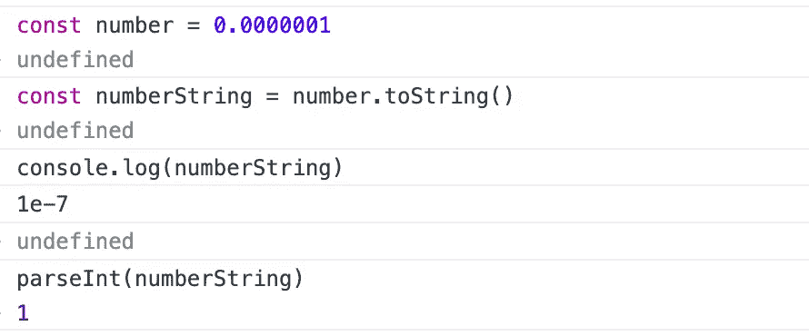

# 为什么 parseInt(0.0000001)！== 0?

> 原文：<https://javascript.plainenglish.io/why-parseint-0-0000001-0-8fe1aec15d8b?source=collection_archive---------12----------------------->

## JavaScript 隐式类型转换和科学符号。



# 前言

开发项目时出现了一个特殊的错误。后端给出的数据字段由字符串类型改为数字类型。在某些极端情况下，前端显示会出现问题。

前面的数据是`‘0.0000001’`，我们用`parseInt`来取整数。

```
parseInt('0.0000001') // equal 0, right.
```

当字段类型改变时，我们得到`0.0000001`，有问题:

```
parseInt(0.0000001) // expect 0, but equal 1
```

# 为什么 parseInt(0.0000001) === 1？

为了解决这个问题，我们首先需要了解 [parseInt](https://developer.mozilla.org/en-US/docs/Web/JavaScript/Reference/Global_Objects/parseInt) 的用法。parseInt 的语法:

```
parseInt(string)
parseInt(string, radix)
```

`parseInt`接受字符串参数，如果参数不是字符串，将使用 toString 将其转换为字符串。

所以当使用 parseInt 解析一个数字时，它首先把数字转换成字符串，然后再解析成数字。

```
parseInt(number) === parseInt(number.toString());
```

`parseInt(0.0000001)`的脚步:

1.  使用 Number.prototype.toString 将`0.0000001`转换成一个字符串
2.  将字符串解析为数字



The steps of `parseInt(0.0000001)`

问题好像比较复杂，`(0.0000001).toString()`不是`'0.0000001'`？

# 为什么`(0.0000001).toString()` === '1e-7 '？

`1e-7`是数字的一种[科学符号](https://en.wikipedia.org/wiki/Scientific_notation)。默认情况下，JavaScript 会将任何至少有六个尾随零的浮点值转换为注释。

```
// six trailing zero or more
console.log(0.0000001) // 1e-7
console.log(0.00000000001) // 1e-11// less then six trailing zero
console.log(0.000001) // 0.000001 
```

如果你想得到一个数字的科学符号，你可以使用[来表示](https://developer.mozilla.org/en-US/docs/Web/JavaScript/Reference/Global_Objects/Number/toExponential):

```
(0.000001).toExponential() // 1e-6
```

# 如何使 parseInt(0.0000001) === 0

我们知道，在 JavaScript 中，至少有六个尾随零的浮点值被转换为科学记数法。使得 parseInt 的行为不符合预期，如何才能得到正确的答案？

幸运的是，JavaScript 提供了 [toFixed](https://developer.mozilla.org/en-US/docs/Web/JavaScript/Reference/Global_Objects/Number/toFixed) API 来获取一串数字，默认情况下不会将数字转换成科学符号。

```
(0.0000001).toFixed(7) // '0.0000001'
```

但是我们必须在小数点后提供一个参数`digits`。为了得到正确的`digits`，我们可以通过黑客攻击来使用 toExponential。

```
function getStringOfFloat(number) {
    const notation = number.toExponential();
    const [ base, exp] = notation.split('e-');
    return number.toFixed(Math.max(base.length - 1, exp));
}// test it 
getStringOfFloat(0.0000001) // '0.0000001'
getStringOfFloat(0.000000000001) // '0.000000000001'
getStringOfFloat(0.100000000001) // '0.100000000001'
```

如果 parseInt 的参数是一个数字，我们可以用下面的方法得到正确的答案:

```
parseInt(getStringOfFloat(0.0000001)) // 0
```

# 最后

感谢阅读，希望对你有所帮助。我希望你跟着我，我会提供更多有用的提示。

*更多内容请看*[***plain English . io***](https://plainenglish.io/)*。报名参加我们的* [***免费周报***](http://newsletter.plainenglish.io/) *。关注我们关于*[***Twitter***](https://twitter.com/inPlainEngHQ)**和*[***LinkedIn***](https://www.linkedin.com/company/inplainenglish/)*。查看我们的* [***社区不和谐***](https://discord.gg/GtDtUAvyhW) *加入我们的* [***人才集体***](https://inplainenglish.pallet.com/talent/welcome) *。**