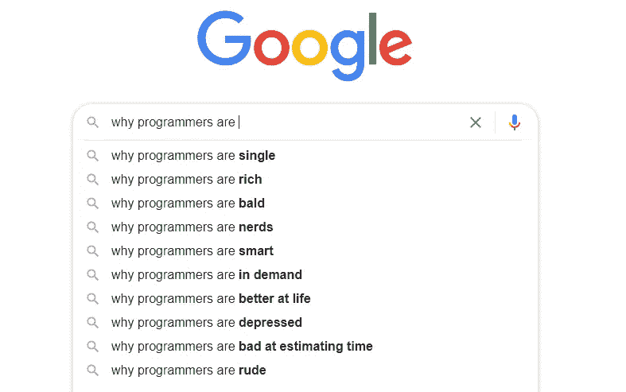

# 为什么程序员更有吸引力

> 原文：<https://javascript.plainenglish.io/why-programmers-tend-to-be-attractive-fb42bcf6f8fc?source=collection_archive---------0----------------------->

## 是什么让软件开发人员有吸引力

Photo by [Sarah Brown](https://unsplash.com/@sweetpagesco?utm_source=medium&utm_medium=referral) on [Unsplash](https://unsplash.com?utm_source=medium&utm_medium=referral)

毫无疑问，当有人问“*你是做什么工作的”时，介绍自己是“*软件开发员*”听起来非常酷。*”。

我见过许多非技术专业人士将程序员称为大量使用大脑的人，这是真的，编程需要使用大量的逻辑和良好的解决问题的技能。

根据*统计报告*，目前全球有 2700 万程序员，这是一个相当大的数字。

看到谷歌搜索栏是如何描述程序员的，我很开心

Image from the [author](https://aniketz.medium.com/)

为什么会有人去搜索程序员秃顶的原因*？这只是全球人们的搜索框。*

*程序员为什么单身的简单答案？是因为这是他们的选择，与他们的职业无关。程序员确实倾向于更专注于他们的职业，这也可能是为什么他们倾向于错过一些社交时间的简单解释。但是完全是因人而异。*

## 吸引力和程序员

程序员是这个星球上你能找到的最聪明的物种。甚至有人在 google 上搜索过*为什么程序员都是书呆子？*因为他们对自己所做的事超级投入。

专注的人往往更有魅力。

聪明的人往往很有吸引力，只是因为人们觉得他们聪明，他们强烈的观点会吸引更多的人。

根据**进行的研究，许多人认为聪明的人无论从长期还是短期来看都更有吸引力。**

**是的，程序员很聪明，他们超级聪明，人们觉得聪明很有吸引力。**

**关于程序员为什么有钱的又一个搜索结果的答案？因为根据一份统计报告，软件开发人员的平均收入在 7 万到 9 万美元之间。对于一个职业来说，这简直是一大笔钱。**

**学习编程需要一致性，谁不觉得一致性的人有吸引力。是的，程序员往往很有吸引力，这也取决于他们如何表达自己的观点。**

**关于我——我是*科技*和*自我提升* [*的顶级作家点击这里*](https://aniketz.medium.com/) *阅读更多我的文章。***

**就这样，这是文章的结尾。希望它对你有价值。如果你喜欢这篇文章，点击这里订阅我的邮件列表。我会通过电子邮件给您发送技术相关的文章。**

**[**通过电子邮件获取我的文章点击这里**](https://aniketz.medium.com/subscribe) **|** [**购买 5 美元的中等会员资格**](https://aniketz.medium.com/membership)**

**[如果你觉得这篇文章有价值，那么点击这里阅读更多我的技术文章](https://aniketz.medium.com/)**

** [## 通过我的推荐链接加入 Medium-Aniket

### 作为一个媒体会员，你的会员费的一部分会给你阅读的作家，你可以完全接触到每一个故事…

aniketz.medium.com](https://aniketz.medium.com/membership) 

*更多内容看* [***说白了。报名参加我们的***](http://plainenglish.io/) **[***免费周报***](http://newsletter.plainenglish.io/) *。在我们的* [***社区不和谐***](https://discord.gg/GtDtUAvyhW) *获得独家获取写作机会和建议。*****