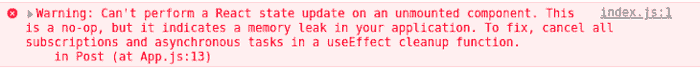

# 使用 React 的 useEffect 挂钩中的清理功能避免内存泄漏并提高性能

> 原文：<https://javascript.plainenglish.io/why-should-you-use-cleanup-functions-in-reacts-useeffect-hook-bdff48bd9b3?source=collection_archive---------5----------------------->

## 副作用——用例子解释。


Photo by [Towfiqu barbhuiya](https://unsplash.com/@towfiqu999999?utm_source=medium&utm_medium=referral) on [Unsplash](https://unsplash.com/?utm_source=medium&utm_medium=referral)

如果您刚开始学习 React 或者已经有一段时间在使用这个库，那么您肯定会遇到一些与异步函数相关的错误或警告，尤其是在使用钩子`useEffect`的时候。

当我学习这个钩子的功能时，我不明白为什么要在这个函数中使用 return，因为在大多数情况下没有必要使用它，React 没有它也能很好地工作。

随着我越来越熟悉 React 的工作方式和组件的生命周期，我开始注意到，在很多情况下，在钩子`useEffect`中使用 return 太重要了，尤其是在副作用方面。

# 有什么副作用？

副作用可能是从远程服务器获取数据、读写本地存储、设置事件侦听器或设置订阅。当单击按钮、提交表单或安装和卸载组件时，会出现这些副作用。

React 的`[useEffect](https://reactjs.org/docs/hooks-reference.html#useeffect)`钩子允许功能组件在一个组件被挂载或者一些属性或状态改变时做一些事情。这个钩子还允许在组件被卸载时进行清理。

# 为什么要清理副作用？

在 React 中处理副作用是一项中等复杂程度的任务。但是，有时您可能会在组件生命周期(初始渲染、组装、使用、拆卸)和副作用生命周期(开始、进行中、完成)的交叉点遇到困难。

其中一个困难是当副作用完成并试图更新已经分解的组件的状态时。

这将导致如下反应警告:



React 应用程序中的内存泄漏主要是由于在卸载组件之前没有取消组件安装时所做的订阅。

它们会导致许多问题，包括:

*   通过减少可用内存量来影响项目的性能。
*   降低了应用程序的速度。
*   系统崩溃。

因此，有必要消除内存泄漏问题。

# 什么是 useEffect 清理功能？

这是`useEffect`钩子的一个功能，它允许我们在卸载组件之前停止不再需要执行的副作用。

`useEffect`是以这样一种方式构建的，我们可以在它里面返回一个函数，这个返回函数就是清理发生的地方。

例如，组件 A 请求 API 获取产品列表，但是在发出异步请求时，组件 A 被从 DOM 中移除(它是卸载的)。不需要完成那个异步请求。

因此，作为一种改进应用程序的清理方法，您可以清理(取消)异步请求，使其不完成。

`[useEffect](https://reactjs.org/docs/hooks-effect.html#effects-without-cleanup)`的清理功能:

```
useEffect(() => {
  // Your effect
  return () => {
    // Cleanup
  }
}, [input])
```

# 清理效果

## 取消提取请求

取消 fetch 请求调用有不同的方法，我们可以使用 fetch `[AbortController](https://javascript.info/fetch-abort#:~:text=To%20be%20able%20to%20cancel,how%20to%20work%20with%20AbortController%20.)`或者 Axios `[AbortController](https://axios-http.com/docs/cancellation).`

要使用`AbortController`，我们必须使用`AbortController()`构造函数创建一个控制器。然后，当我们的获取请求启动时，我们将`AbortSignal`作为请求的`options`对象中的一个选项进行传递。

这将控制器和信号与获取请求相关联，并允许我们随时使用`AbortController.abort()`取消它:

Fetch: Abort

Axios: Abort

## 清除超时

当使用`[setTimeout](https://developer.mozilla.org/en-US/docs/Web/API/setTimeout)(callback, time)`定时器函数时，我们可以通过使用特殊的`clearTimeout(timerId)`函数在卸载时清除它们。

Cleaning up Timeouts

## 清理间隔

像超时一样，`[setIntervals](https://developer.mozilla.org/en-US/docs/Web/API/setInterval)(callback, time)`有一个特殊的功能，用`clearInterval(intervalId)`函数来清除它们。

Cleaning up Intervals

## 清理事件侦听器

清理监听器通过`[window.removeEventListener](https://developer.mozilla.org/es/docs/Web/API/EventTarget/removeEventListener)`进行。`removeEventListener`调用必须引用`removeEventListener`调用中的*相同的*函数，以正确移除监听器。

Cleaning up Event Listeners

## 清理 Web 套接字

当你创建一个 [WebSocket](https://developer.mozilla.org/en-US/docs/Web/API/WebSocket) 连接时，你可以在清理`socket.close()`函数中关闭它。

Cleaning up Web Sockets

# 结论

我们已经知道，一些副作用需要清理，以避免内存泄漏和不必要的和不想要的行为。我们必须了解何时以及如何使用`useEffect`钩子的清理功能来避免这些问题并优化应用程序。

我建议在卸载组件时清理异步效应。此外，如果异步副作用依赖于属性或状态值，那么考虑在组件更新时也清除它们。

我希望这篇文章对您有用，并且您现在可以正确地使用清理功能了。

**阅读更多**

[](https://blog.bitsrc.io/build-a-blog-with-react-and-markdown-files-30d969ce62d5) [## 用 React 和 Markdown 文件创建一个博客

### 创建一个带有代码语法突出显示，黑暗模式和复制到剪贴板的教程博客

blog.bitsrc.io](https://blog.bitsrc.io/build-a-blog-with-react-and-markdown-files-30d969ce62d5) [](https://betterprogramming.pub/developing-a-crud-app-in-react-js-with-a-fake-api-rest-9f401bad5f04) [## 用假的 API Rest 在 React JS 中开发 CRUD 应用

### 用 JSON 服务器添加 CRUD 功能

better 编程. pub](https://betterprogramming.pub/developing-a-crud-app-in-react-js-with-a-fake-api-rest-9f401bad5f04) 

```
**Want to Connect?** Love connecting with friends all around the world on [Twitter](https://twitter.com/ljaviertovar).
```

*更多内容看* [***说白了就是 io***](https://plainenglish.io/) *。报名参加我们的* [***免费周报***](http://newsletter.plainenglish.io/) *。关注我们关于*[***Twitter***](https://twitter.com/inPlainEngHQ)**和*[***LinkedIn***](https://www.linkedin.com/company/inplainenglish/)*。查看我们的**[***社区不和谐***](https://discord.gg/GtDtUAvyhW) *加入我们的* [***人才集体***](https://inplainenglish.pallet.com/talent/welcome) *。***