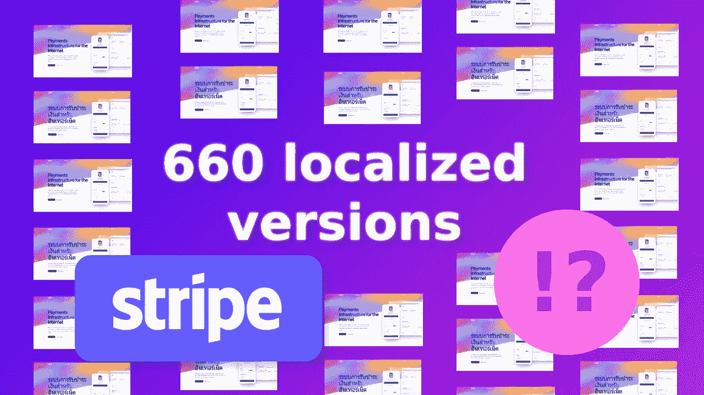
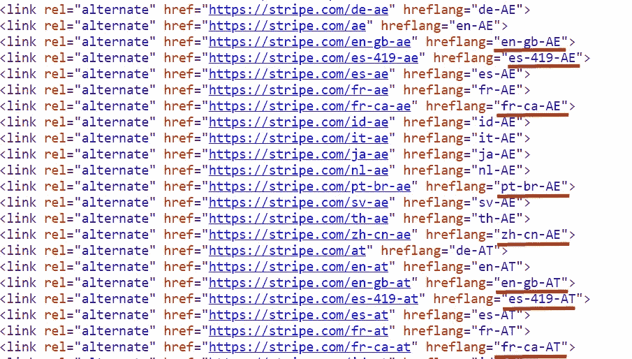
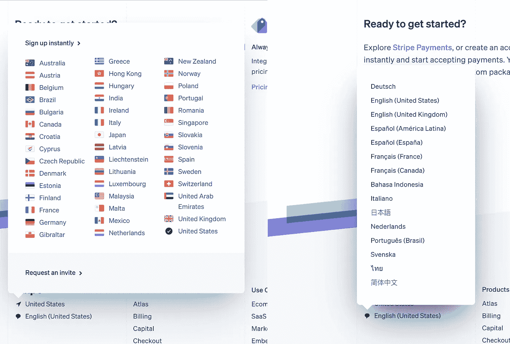
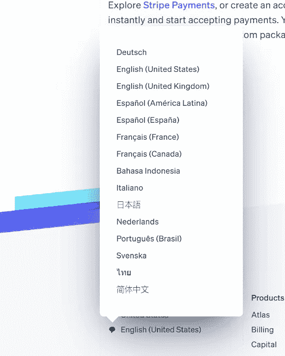
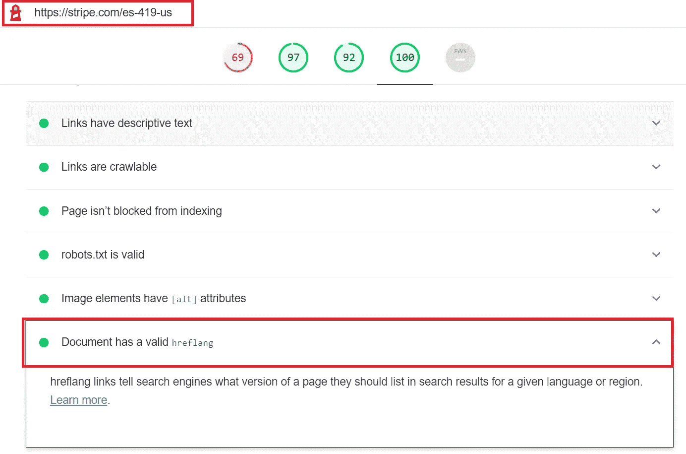
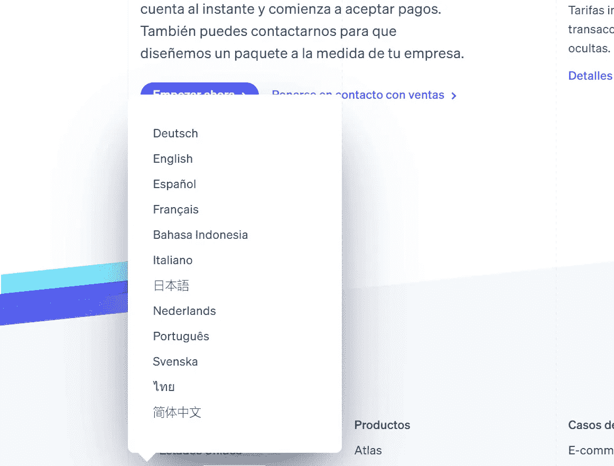
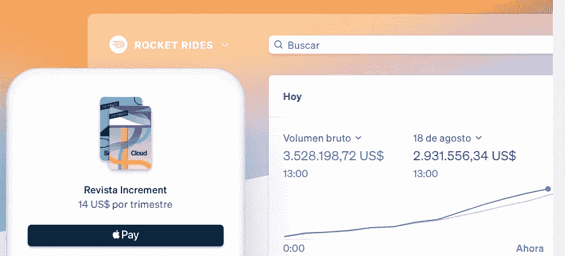
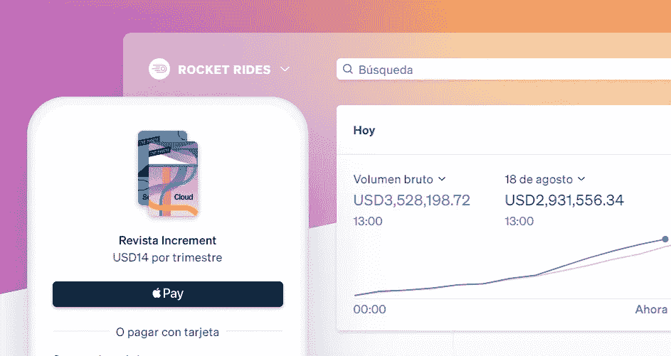

# Stripe 如何管理其营销网站的 650 多个本地化版本

> 原文：<https://javascript.plainenglish.io/why-stripe-uses-invalid-alternate-seo-tags-on-their-website-237368405b60?source=collection_archive---------1----------------------->

> 凯文·巴塞特是 [Progressier](https://progressier.com) 的创始人，这是一个由 5000 多个应用程序用来将自己从应用程序商店中解放出来的软件工具包。

我在 LinkedIn[和 Twitter](https://www.linkedin.com/posts/adityaaman_seo-hreflang-internationalseo-activity-6966377876782743553-n1CA?utm_source=linkedin_share&utm_medium=member_desktop_web)[上看到一个帖子，指出 Stripe 使用无效的`hreflang`标签来指定他们网站的其他语言版本。](https://twitter.com/yvoschaap/status/1458093647350616071)

这让我很好奇，所以我决定调查一下。

我掉进了一个兔子洞。

事实证明……做事情的*错误的方式*有时候*是* *正确的决定。*

# 无效的 hreflangs？

32% of Stripe’s 600+ alternate tags are technically invalid

替代标签的作用是告诉搜索引擎这个页面有不同的版本，更适合不同的语言/国家。因此，当浏览器设置为`pt-BR`的人试图访问以美元结算的英文页面时，谷歌会尽最大努力推荐以葡萄牙语结算的巴西雷亚尔页面。

[谷歌的指导方针](https://developers.google.com/search/docs/advanced/crawling/localized-versions#language-codes)规定`hreflang`属性应该包含一个 [ISO 639-1](https://en.wikipedia.org/wiki/List_of_ISO_639-1_codes) 格式的语言代码(例如`fr`代表法语)，以及一个 [ISO 3166-1 阿尔法 2](https://en.wikipedia.org/wiki/ISO_3166-1_alpha-2) 格式的可选区域(例如`CA`代表加拿大)。当你把它们组合在一起，你就得到了`fr-CA`(加拿大说法语的人)。

您可以使用任何语言和区域组合来实现这一点。塞浦路斯说泰语的人大概不多，但是`th-CY`还是有效的`hreflang`。而 Stripe 有专门为他们准备的页面:[https://stripe.com/th-cy](https://stripe.com/th-cy)

但是带有两个区域标识符的`hreflang`如`en-gb-BG`无效。`GB`是英国的地区标识符，而`BG`是保加利亚的地区标识符。

那么 Stripe 为什么要这么做呢？他们应该更清楚，不是吗？

# Stripe 如何生成语言标签

如果你滚动到 Stripe 网站的底部，你会看到他们支持 44 个国家和 15 种语言。

Stripe 有两个列表，一个包含语言，另一个包含国家。他们只是将两者结合起来生成每个标签。

他们获取每种语言代码，然后在其后面附加每个可能的国家代码。例如:

*   https://stripe.com/de-ca(`de`)+加拿大(`CA`)=
*   意大利语(`it` ) +罗马尼亚语(`RO`)=[https://stripe.com/it-ro](https://stripe.com/it-ro)
*   法语(`fr` ) +日语(`JP`)=【https://stripe.com/fr-jp】T21

当你访问 Stripe 网站时，他们的服务器有一个功能，可以自动创建这些 meta 标签，并将它们附加到返回给浏览器的 HTML 的`<head>`中。

这不可能是手动完成的。当 Stripe 增加对一种新语言和/或国家的支持时，它会自动创建网站的一大堆新版本。最好的程序化搜索引擎优化。

目前，这个网站有好几个版本。44 个国家* 15 种语言= 660 个本地化版本的 Stripe 网站。

# 根本原因

问题是列表中的一些语言已经是完整的语言代码了。英语(英国)是`en-GB`，法语(加拿大)是`fr-CA`。

因此，当您将它们与国家列表中的每个国家组合在一起时，您会得到新的看起来很奇怪的代码:

*   英语(英国)(`en-GB)` +德语(`de`)=[https://stripe.com/en-gb-de](https://stripe.com/en-gb-de)
*   葡萄牙语(巴西)(`pt-BR` ) +奥地利(`AT`)=[https://stripe.com/pt-br-at](https://stripe.com/pt-br-at)
*   西班牙语(拉丁美洲)(`en-419` ) +塞浦路斯(CY)=[https://stripe.com/es-419-cy](https://stripe.com/es-419-cy)

这最后三个在技术上是无效的…但只是从 SEO `hreflang`的角度来看。没有什么可以阻止 Stripe 为目前在奥地利的巴西葡萄牙语使用者提供他们的网站版本。

事实上，我认为这是一个非常好的实现。许多网站将语言/货币/国家捆绑在一个单一的选择菜单中。作为一个住在台湾以法语为母语的人，我个人很讨厌这样。我想看看在 TWD 的金额，因为在这里呆了十年之后，那是我最习惯的货币。但是我真的不能很好地阅读中文，所以我宁愿看英文或我的母语法语的内容。

Stripe 让你选择*任何货币*(通过选择一个国家)并结合任何*语言*。没有那么多非电商网站做这个的。这太棒了。

# 无效…那又怎样？

不管怎么说，即使 Stripe 网站上所有带两个连字符的`hreflang`都是无效的，这也回避了一个问题……为什么有关系？

我不是 100%确定 SEO 方面的后果是什么。但是如果要我猜的话，我会说搜索引擎可能会忽略掉每一个含有被认为无效的`hreflang`参数的替代链接。

有趣的是，如果你在其中一个页面上运行 Lighthouse，它确实通过了“*文档具有有效的* `*hreflang*`”测试。

因此，即使它们在技术上是无效的，看起来谷歌还是理解它们。我认为他们可能以两种方式处理它们:

*   通过修剪它们(因此`en-gb-AE`被解释为仅仅是`en-GB`或者可能是`en-AE`)
*   或者通过将位于阿联酋的浏览器设置为“*英语(英国)*”的用户正确地将`en-gb-AE`解释为备选项

聪明的谷歌。

# 为什么 Stripe 不解决这个问题？

看似简单的解决办法是清理语言列表，使它们只包含简单的语言代码(`en`、`fr`等)，而不是语言+国家代码(`en-GB`、`fr-CA`等)。这是当时的样子:

然后将这些语言与国家代码结合起来，并消除所有无效的`hreflang`标签。

但是 Stripe 已经有了很多页面，还有很多我不知道的依赖项。这不仅仅是改变`hreflang`属性的问题。你必须改变一个有几千个页面的网站的整个结构。

这不是一个简单的解决办法。

鉴于目前的情况，当前的策略似乎不会产生任何负面影响，Stripe 很可能认为这没有很好地利用他们工程师的时间。

很公平。

# 但是…这真的是一个问题吗？

与直觉相反，这样做实际上是有正当理由的。这与数字格式有关。检查这两页:

[https://stripe.com/es-419-us](https://stripe.com/es-419-us)(西班牙语(拉丁美洲)+美国)
[https://stripe.com/es-us](https://stripe.com/es-us)(西班牙语(西班牙)+美国)

两者都有`us`作为地区指示符，所以货币是 USD。但是第一部分告诉你数字应该如何格式化:

In Spanish from Spain, the currency symbol comes after the number, the decimal separator is a comma, and the thousands separator is a period.

In Spanish from Latin America, the currency symbol comes before the number, the decimal separator is a period, and the thousands separator is a comma.

这是应该做的。数字格式基于所使用的语言而非货币或国家进行更改。

你不能用完全有效的`hreflang`标签做到这一点。使用`es-US`，您将如何决定是应该以西班牙还是拉丁美洲的方式格式化货币？

当然，我猜你可以决定`es-US`遵循西班牙的方式，然后有`es-CL`(智利)和`es-PE`(秘鲁)，其余的南美代码遵循拉丁美洲的方式。

或者你可以决定`es-US`应该遵循拉丁美洲的方式，因为这与北美的方式相同，而且从统计数据来看，在美国，中南美洲人比西班牙人多。

注意它在两种情况下都做了什么？这需要做决定。它增加了复杂性。*固执己见*复杂。这只是一个例子。

除了数字格式之外，很可能两个页面上使用的措辞也有所不同。但我不会说西班牙语，所以我会让别人来解决这个问题。

# 结论

如果你只看 Stripe 网站主页的 HTML，它可能看起来像是 Stripe 的一个疏忽。

如果你真的深入挖掘，你会意识到事实并非如此。事实上，它根本不是一个“bug”。我敢打赌 Stripe 是故意使用这种方法的。

Stripe 的本地化策略是我在网上见过的最好的策略之一。无效的`hreflang`属性只是为此付出的小小代价。

了解规则很重要。

知道何时打破规则是关键。

*更多内容请看*[***plain English . io***](https://plainenglish.io/)*。报名参加我们的* [***免费周报***](http://newsletter.plainenglish.io/) *。关注我们关于*[***Twitter***](https://twitter.com/inPlainEngHQ)[***LinkedIn***](https://www.linkedin.com/company/inplainenglish/)*[***YouTube***](https://www.youtube.com/channel/UCtipWUghju290NWcn8jhyAw)*[***不和***](https://discord.gg/GtDtUAvyhW) *。***