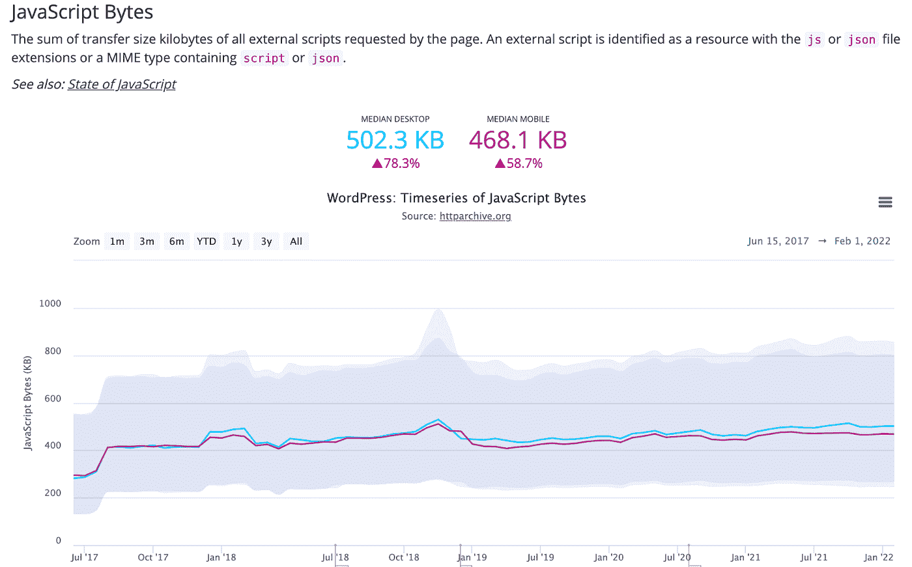
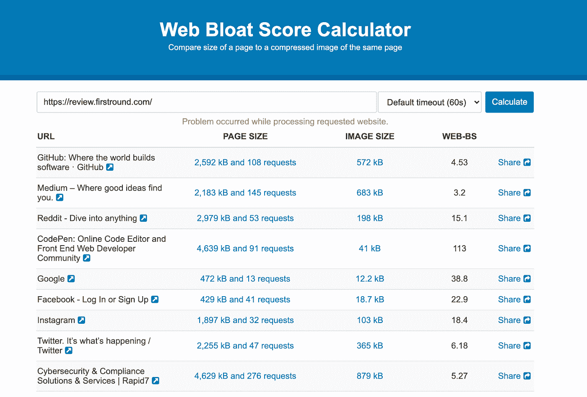

# Javascript 膨胀正在减慢互联网的速度

> 原文：<https://javascript.plainenglish.io/why-the-internet-is-getting-slower-and-what-you-can-do-about-it-3fde0f1f2d47?source=collection_archive---------8----------------------->

> 最初发表于[www.builtin.com](https://builtin.com/software-engineering-perspectives/fix-javascript-bloat)

互联网上到处都是 JavaScript。它几乎涉及到我们在网上所做的每一个方面。当我们使用脸书、YouTube 或谷歌时，我们依靠 JavaScript 代码给我们带来交互的感觉，这正是我们期望从今天的互联网中得到的。Javascript 为我们提供了加载微调器、浏览器警告和页面转换等基本功能，更不用说网页游戏、3d 渲染和交互式地图等高级功能了。

但是，所有这些互动的一个很少被讨论的极具影响力的负面影响威胁着我们的浏览体验和网络本身的未来:

> JavaScript 膨胀。

Photo by [Nick Abrams](https://unsplash.com/@nbabrams) on [Unsplash](https://unsplash.com/@nbabrams)

这个术语 *Javascript 膨胀*指的是一个网站过度依赖 Javascript 以达到最高速度和容量。作为一名专业的 web 开发人员或互联网企业所有者，保持您的网站以最高容量运行对您的底线至关重要，因此理解和解决 Javascript 膨胀是极其重要的。

# 这真的是个问题吗？

JS Bytes historical data from 2017 — present

在过去的 10 年里，无论从哪方面来看，JavaScript 在网站上的使用都在大幅增长。自 2017 年以来，桌面网站的 JavaScript 文件大小[增加了 78%，而 JS 请求数量增加了 17%。](https://httparchive.org/reports/page-weight?lens=wordpress&start=2017_06_15&end=latest&view=list#reqJs)这种增长在一定程度上可以归因于过去五年来普通网站变得越来越复杂。然而，大部分是由于糟糕的实践、不完整的集成或不必要的代码。不管是什么原因，所有的膨胀都使得每个人使用互联网的速度变慢。

> 如果你不熟悉如何通过你的网络浏览器下载 Javascript，我推荐[这篇介绍性文章](https://www.html5rocks.com/en/tutorials/internals/howbrowserswork/#Resources)来解释基础知识。每次使用你的浏览器(Chrome，Firefox 等。)要访问一个网页，你需要下载一些指令，通常是 [HTML](https://www.w3.org/TR/2011/WD-html5-20110405/) 、 [JavaScript](https://tc39.es/ecma262/) 和 [CSS](https://www.w3.org/Style/CSS/specs.en.html) ，这些指令告诉你的浏览器如何组装网站，准备好供你使用。

# 膨胀是什么样子的？

臃肿的网站是相对于其内容而言有太多 JavaScript 的网站。例如，一个功能丰富、复杂的网站自然会有更多的 JavaScript，这没关系。当一个简单的网站有大量用户必须下载的 JavaScript 时，问题就出现了。

Fig 1\. [Web bloat score calculator](https://www.webbloatscore.com/), example data

[上面的计算器](https://www.webbloatscore.com/)提供了标准的、广泛使用的算法来确定 JavaScript 膨胀。使用有问题的网站的截图作为网站整体复杂性的代理，它将该复杂性与下载的 JavaScript 的大小以及 JS 请求的数量进行比较。

JavaScript 膨胀的原因有很多，但网站通常会因为以下四个原因之一而膨胀。

# 压缩不良

糟糕的压缩是在你的网站上创建 JavaScript 膨胀的一个简单方法。您可能有一个 200KB 的脚本，可以缩小到 100KB，然后压缩到只有 15KB，这意味着最终的脚本大小只有原始脚本大小的 7.5%。如果你不配置你的服务器来应用正确的压缩规则到每一个 JS 和 CSS 文件，那么你将会失败。

为了解决这个问题，**使用适当的压缩和缩小。**您应该能够配置您的服务器，对所有传出文件使用您选择的压缩算法，通常是 brotli 压缩或 gzip。Chris Coyier 的这篇文章解释了两者之间的区别，并给出了一些方法来确保你正确地应用这两个过程。

# 复杂框架代码

像 Angular 和 React 这样的库给今天的公司和开发者带来了巨大的好处。然而，当您选择使用一个框架时，当涉及到将要使用的总 JS 时，您会接受一些相当大的开销，对于全功能或企业级框架更是如此。如果当你有一个简单的用例时，你选择使用一个复杂的框架，你保证你将运行一个臃肿的站点。

Photo for [Procoders.com](https://procoders.tech/blog/popular-react-js-websites-examples/)

补救方法或过程是**仅在必要时使用框架。框架提供了许多优势——你可以用最新的模板、复杂的样式工具和插件网络来编写代码，从而快速获得高级结果。但是你仍然应该为大多数项目编写基本的 JavaScript 和模板化的 HTML，并且只将框架应用于更复杂的页面或应用程序。**

# 默认情况下是 jQuery

Credit: [https://www.tutorialrepublic.com/jquery-tutorial/](https://www.tutorialrepublic.com/jquery-tutorial/)

jQuery 是一个 DOM 操作库，是世界上近 90%的网站的依赖。如果你能够摆脱这种依赖，你就能够摆脱 [80KB 的迷你 JS](https://mathiasbynens.be/demo/jquery-size) 。

这个问题的解决方案是**戒掉 jQuery 瘾**。jQuery 是一个非常好的、节省时间的便利工具，但是它被过度使用了。对于今天的浏览器来说，使用它来完成简单的任务通常是不必要的，因为这类任务有健壮的本机实现，可以自己执行 jQuery 风格的功能。因此，再次强调，尽可能坚持使用原生 JavaScript。

# 臃肿的第三方脚本。

每当你添加一个第三方脚本到你的网站，你有责任跟踪这个脚本的大小，并确保代码尽可能的精简。第三方脚本通常有两种风格:像谷歌分析那样动态加载，或者用你的应用程序代码编译，像 [NPM 模块](https://www.npmjs.com/)。这两个软件包都会给你的网站增加不必要的负担。动态加载的脚本有额外的危害，有时会通过[渲染阻塞](https://gtmetrix.com/eliminate-render-blocking-resources.html#:~:text=Render%2Dblocking%20resources%20are%20scripts,images)%20for%20the%20first%20time.)降低你的网站速度，本质上是让你的网站在你自己的网站加载之前等待谷歌服务器的响应。

Photo for [DevRant.com](https://devrant.com/rants/1558252/can-someone-explain-the-node-modules-joke-to-me-please-ive-seen-it-quite-a-bit-n)

为了减少这种膨胀，**限制监视脚本的使用，并密切监视您的 NPM 包**。第三方跟踪代码是互联网上 JS 权重增加的主要原因。网络用户仍然经常被网站挟持，这些网站坚持在页面可用之前加载大量跟踪 cookie 的广告代码。留意那些导致你的网站向广告追踪者发出许多请求的脚本，因为这些脚本可以将你网站的速度交到谷歌手中。当谈到 NPM 包裹，跟踪你的依赖和他们的重量。在你添加一个新的依赖项到你的应用程序之前，使用一个类似于[this](https://cost-of-modules.herokuapp.com/result?p=angular@1.8.2)的站点来测试它的大小。您不需要以这种方式过分地跟踪您的依赖项，但是作为一个经验法则，如果您向您的站点添加了超过 100KB 的精简 JS，那么您应该更深入地了解为什么该脚本需要这么多行。

# 结论

JavaScript 膨胀的问题普遍存在，作为 IT 专业人员，管理和控制是我们的职责。按照上面的简单步骤，你应该有一个蓝图来正确地选择你的网站所需要的脚本，并且正确地优化那些你选择使用的脚本。

> 感谢阅读。如果你喜欢我的故事，想支持我，请考虑成为[中的成员](https://tinycode.medium.com/membership)。每月 5 美元，你可以无限制地访问媒体内容。如果你通过[我的链接](https://tinycode.medium.com/membership)注册，我会得到一点佣金。
> 
> 还有，这里还有几个类似的故事，你可能会喜欢！

 [## 你需要重新学习 HTML

### 最初发布于 2022 年 8 月 23 日。Builtin.com

tinycode.medium.com](https://tinycode.medium.com/you-need-to-relearn-html-43509084e987)  [## 如何阅读 HTML 规范

### 网页开发者指南

medium.com](https://medium.com/weekly-webtips/how-to-read-the-html-spec-da54ca73513a)  [## 5 个最重要的 HTTP 头

### 作为一名 web 开发人员，您需要认识到这一点，以便与远程 API 进行流畅的通信。

tinycode.medium.com](https://tinycode.medium.com/the-5-most-important-http-headers-d9e9f94bb1f6) 

*更多内容看* [***说白了就是***](https://plainenglish.io/) *。报名参加我们的* [***免费周报***](http://newsletter.plainenglish.io/) *。关注我们关于* [***推特***](https://twitter.com/inPlainEngHQ) ， [***领英***](https://www.linkedin.com/company/inplainenglish/) ***，***[***YouTube***](https://www.youtube.com/channel/UCtipWUghju290NWcn8jhyAw)***，以及****[***不和***](https://discord.gg/GtDtUAvyhW) *对成长黑客感兴趣？检查出* [***电路***](https://circuit.ooo/) ***。****