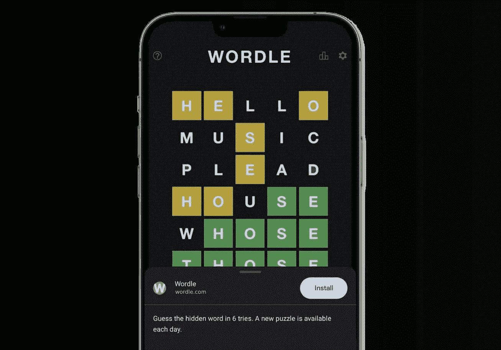
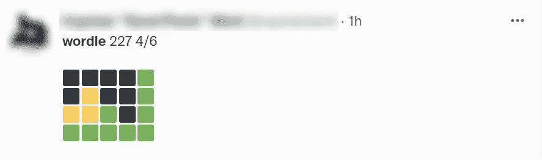
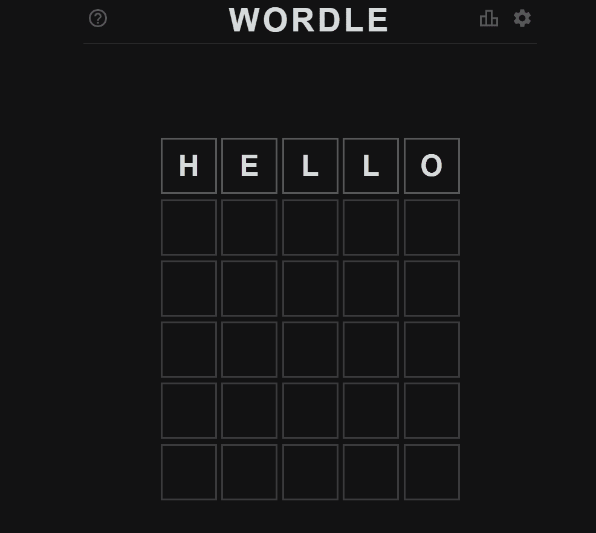
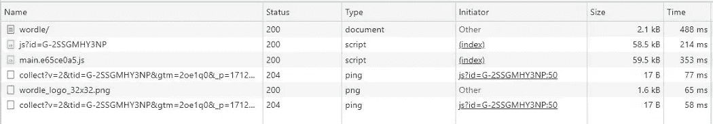
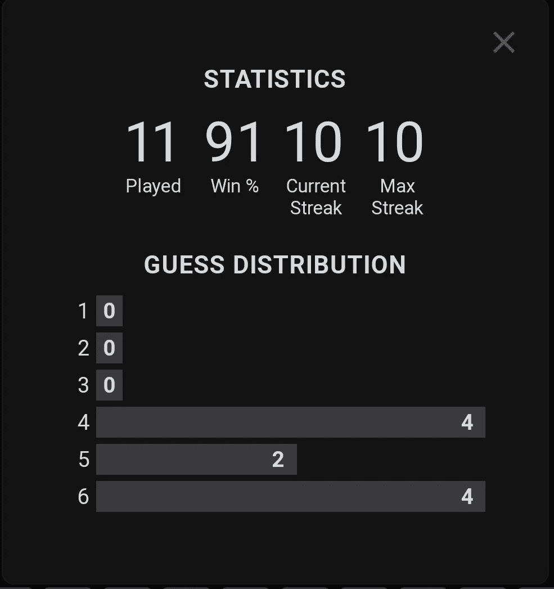
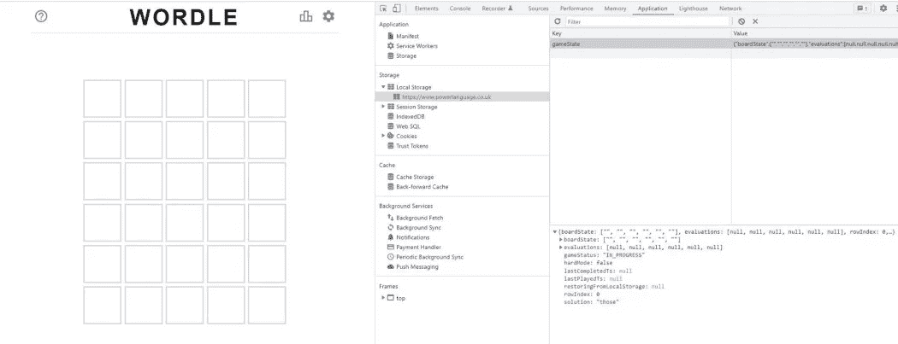
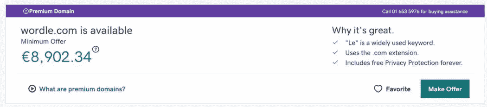

# 为什么收购 Wordle 对互联网来说是个好消息

> 原文：<https://javascript.plainenglish.io/why-the-wordle-acquisition-is-great-news-for-the-web-fe3d19fbb5f4?source=collection_archive---------5----------------------->

作为 [Progressier](https://progressier.com/) 的制作者，我觉得我绝对有必要写一下 [Wordle](https://www.powerlanguage.co.uk/wordle/) 。在过去的 30 天里，这款基于网络的小游戏受到了媒体极大的关注，这是前所未有的。

在 [Wordle 病毒式传播](https://www.theguardian.com/games/2021/dec/23/what-is-wordle-the-new-viral-word-game-delighting-the-internet)、[无良开发者无耻地指望这个想法](https://www.ign.com/articles/wordle-copycat-app-store-twitter)、 [Twitter 机器人破坏游戏](https://www.nbcnews.com/pop-culture/viral/twitter-suspends-wordle-spoiler-bot-rcna13666)、[应用商店禁止模仿者](https://www.techradar.com/news/dodgy-wordle-copycats-are-already-banned-from-apples-app-store-but-theres-more-work-to-do)和[无数替代品出现在左右](https://phandroid.com/2022/01/30/5-best-wordle-alternatives/)之间，你现在不可能没有听说过它。

今天，事情发生了意想不到的变化,《纽约时报》宣布他们以“低七位数”的价格收购了 Wordle。

那么这个简单的文字游戏怎么会变成这样的现象呢？《纽约时报》为什么要买？这次收购对游戏和网络的未来意味着什么？

# 少即是多

如果 Wordle 如此受欢迎，首先是因为它是一个伟大的游戏。在 2022 年，用如此简单的机制制作如此引人注目的游戏绝非易事。简单很难。

大多数游戏都是为了让你上瘾。你玩的时间越长，你看到的广告就越多，或者你进行的应用内购买就越多。使用 Wordle，你一天只能玩 5 到 10 分钟。一旦你猜对了单词，这一天就结束了。太美了。

稀缺产生预期。期待创造乐趣。不管这是一个深思熟虑的选择还是一个愉快的意外，Wordle 的成功很大程度上归功于其屏幕时间限制机制。有趣的是，我试过玩提供无限玩法的克隆游戏——可以说它们比原版少了很多乐趣。

 [## 每日文字游戏

### 猜 6 次隐藏的单词。每天都有新的谜题。

www.powerlanguage.co.uk](https://www.powerlanguage.co.uk/wordle/) 

# 内置病毒

有了 Wordle，每个人都可以同时玩同一个单词。这很棒，因为它把一个单独的游戏变成了一个可分享的一起玩的体验。社交媒体当然喜欢这样。

哦，难道[乔希·沃德尔](https://www.powerlanguage.co.uk/)真的知道如何利用社交媒体的力量。如果你考虑到他曾经在 Reddit 工作，并在 2015 年创造了[按钮](https://www.nbcnews.com/tech/internet/reddit-button-n357841)和 2017 年创造了[位置](https://www.newsweek.com/reddit-place-internet-experiment-579049)，这并不奇怪，这是另外两个内置病毒的在线实验。

These cryptic tweets have surely helped make Wordle popular

这些神秘的推文肯定有助于 Wordle 的流行

让我们花一点时间来欣赏这些神秘的推文有多精彩。它们是如此神秘，以至于当你看到你所有的朋友分享它们时，你会想知道到底发生了什么。然而，它们并不那么暴露，不会破坏其他人的兴致。简直太棒了。

# 当网络做得好的时候

Wordle 也是一个完美的例子，展示了如果做得好，网络可以提供什么:没有下载，没有广告，没有跟踪，一个简单的界面，一个本地应用程序的感觉，以及一个可以在任何浏览器和设备上工作的应用程序。

Wordle animations make you forget the whole thing is actually a website — not a native app.

Wordle 动画简单但切中要害。它们会让你忘记整个东西实际上是一个网站，而不是一个本地应用。

它的碳足迹也非常低。看看下面这个应用的网络请求量。整个游戏几乎没有重量。在一个 94%的网站包含第三方库的世界里，这是令人耳目一新的。

Wordle is an HTML file, a logo, two small JavaScript files, and Google Analytics, weighting less than 150Kb total

Wordle 是一个 HTML 文件、一个徽标、两个小 JavaScript 文件和 Google Analytics，总重量不到 150Kb。

我看到有人评论说，乔什·沃德尔出售游戏是因为他无法管理它的流量。抱歉，但我不认为这是正在发生的事情。就像这样，托管整个应用程序及其数十万(数百万？)的日常用户可能每月花费不到 100 美元。

一切都发生在浏览器中。这无需太多工作就可以无限扩展。

但是让我们想象一下，他决定将单词列表存储在数据库中，而不是硬编码在客户端代码中。

然后，每当有人输入一个单词，应用程序就需要调用它的服务器来验证它。这意味着每个用户每月要调用数百次 API。对于 AWS 或 GCP 来说，这可能会很快变得昂贵。

现在，游戏下载一次后，浏览器会缓存 JavaScript 文件。在随后的游戏中，开发者的成本基本上是 0 美元。

任何熟悉 web 开发的人都知道，你不会在浏览器中存储任何重要的东西。[默默无闻的安全感](https://en.wikipedia.org/wiki/Security_through_obscurity)不起作用。但考虑到这只是一场赌注小、野心小的简单游戏，这可能是正确的决定。无论如何，这也不能阻止机器人破坏这种乐趣——它们只是找到了毁掉今天的单词而不是明天的单词的方法。

# 沃尔多的下一步是什么？

首先，我担心 Wordle 受欢迎的原因(无广告、无追踪、无应用内购买、每天只玩一次)可能会在这次收购中丢失。尽管《纽约时报》提到最初会让《T2》免费玩，但它肯定不会永远这样。

Wordle 最终将被纳入《T4》的《纽约时报》游戏订阅——他们显然在打赌 Wordle 的加入将增加他们的 MRR。《纽约时报》在 2019 年的营收为 19 亿美元，因此无论这次收购是否实现这一目标，“低七位数的价格”都使其成为一个小风险的小赌注。没什么大不了的。

另外，祝贺乔希·沃德尔卖出了他的游戏！虽然我不认为按现状管理它在金钱上特别困难，但在未来将其货币化可能会被证明是困难的。人们玩它是因为它是免费的，有趣的。把*【免费】*从等式中去掉，你可能也会把*乐趣*去掉。

在这方面，我认为纽约时报是游戏的最佳主场。他们知道如何在不贴广告的情况下从游戏中赚钱。虽然他们没有提到这次收购会给游戏带来什么，但是可以合理的预期他们会很快发布一系列新功能。

很可能只要你喜欢，你仍然可以继续玩这个游戏。但是新的未来功能将是他们订阅计划的一部分。以下是我预测很快会出现的一些付费功能:

*   玩四个、六个或七个字母的单词
*   播放所有过去的单词
*   多人模式

Streaks and stats keep you playing every day

我也很好奇他们将如何管理这一转变——特别是他们将如何允许用户保留他们的连胜纪录和统计数据，这是 Wordle 吸引力的另一个重要组成部分。

照现在这样，它们都存储在浏览器 [localStorage](https://developer.mozilla.org/fr/docs/Web/API/Window/localStorage) 中。那里的所有东西都与一个特定的领域有关。所以没有办法自动将用户设置和用户条纹从*powerlanguage.co.uk*转移到*whatever-domain-nyt-will-be-using.com。*

All of Wordle’s logic only exists in the browser

他们将有在下次用户访问 powerlanguage.co.uk*时，在数据库中创建具有这些客户端设置的用户配置文件，将用户 ID 返回给浏览器，从那时起，根据该用户 ID 在服务器端保存所有条纹和设置，而不是在本地保存。在某个时候，纽约时报的域名将使用同一个数据库。*

# *《纽约时报》将会改进这个游戏*

*我认为,《纽约时报》很有可能会真正将游戏提升到一个新的水平——改善一切做得不太好的地方。*

*首先，Wordle 绝对值得拥有自己的领域。*

**

*Fun fact, wordle.com is currently for sale on GoDaddy. If you feel like making a quick buck, buy it and sell it back to the New York Times in a few weeks.*

*有趣的是，wordle.com 目前正在 GoDaddy 上出售。如果你想赚快钱，就买下来，几周后再卖回给纽约时报。*

*在我看来，Wordle 无愧于“*进步网络应用*”的称号。但从技术角度来说，并不是。它没有[服务人员](https://developer.mozilla.org/fr/docs/Web/API/Service_Worker_API)。对于一个服务人员来说，让游戏完全脱机运行是微不足道的。它也可以安装在桌面上。*

*记者写文章[解释添加到主屏幕的功能](https://www.laptopmag.com/how-to/how-to-install-wordle-on-an-iphone-or-android-phone)真是太好了。但是如果开发者真的费心在应用中推广这个选项，那就没有必要了。希望《纽约时报》能纠正这一点！*

*谷歌和苹果已经让我们相信应用程序必须从应用商店下载，否则它们“不是真正的应用程序”。事实是网站可以是应用程序。Wordle 实际上是一个真正的应用程序。*

*在 2022 年，这种应用格式可以安装在一个人的设备上——就像任何其他应用一样。事实上，你甚至可以说 pwa 更好，因为它们可以安装在 Mac OS、Windows、Chrome OS、Android 和 iOS 上。*通用*可用性——是不是很棒？*

*尽管经营着一家名为 [Progressier](https://progressier.com/) 的公司，但我一直不喜欢“PWA”这个缩写。我希望我们能把这种应用程序格式重新命名为“*通用应用程序*”或其他能突出其优势的术语。更隐晦的" *progressive* "一词实际上只谈到了它的技术方面——也就是说，你可以*逐步*增强你的网络应用程序的功能，而不是一次添加所有功能。在我看来，这不是很好的营销。*

*但是……你的应用商店的制造商也是你的浏览器的制造商。所以他们没有什么动力去推广通用应用。尽管——值得称赞的是——谷歌确实推动了这个概念，超出了人们的合理预期。为此向他们致敬。*

*最后，乔希·沃德尔帮助将网络民主化，成为托管应用程序的可行媒介，这值得称赞。Wordle 是一个完美的证明，一个伟大的产品——尤其是一个内置病毒的产品——可以受到用户的喜爱，而不管它的外形或出处。*

*如果一个 2 个月前的项目托管在一个像 powerlanguage.co.uk*这样毫无吸引力的域名的子目录中，却能带来百万美元的回报*，*，那么你就有一个很好的理由不把你的应用上传到 Google Play 和 App Store。取而代之的是，简单地将你的注意力集中在构建一个伟大的产品上。**

**web 3/NTF/元宇宙/{插入今日流行语} —网络上充斥着 [*风格胜过*](https://academic.oup.com/camqtly/article-abstract/48/3/295/5573301?redirectedFrom=fulltext) *实质的例子。***

**让我们欣赏这一次，物质取得了胜利。**

***更多内容看* [***说白了就是***](http://plainenglish.io/) *。报名参加我们的* [***免费周报***](http://newsletter.plainenglish.io/) *。在我们的* [***社区不和谐***](https://discord.gg/GtDtUAvyhW) *获得独家获取写作机会和建议。***