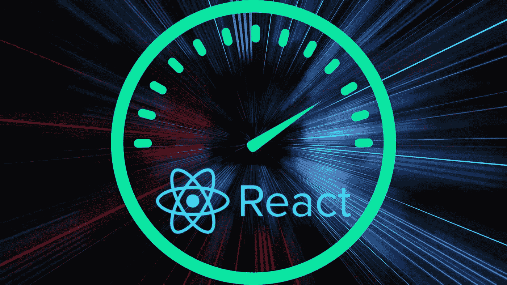

# 为什么使用 React？

> 原文：<https://javascript.plainenglish.io/why-use-react-2a0947a12b70?source=collection_archive---------11----------------------->


# 什么是反应？

React 是一个基于 JavaScript 的前端库。该图书馆由脸书创建，由脸书和一个大型社区维护！目前有超过 740 万个网站在使用该库，并且预计还会继续增加！

React 应用程序由组件组成，每个组件呈现一个小的可重用的 HTML 片段。这使得一个组件可以在多个地方使用，而不必一遍又一遍地编写相同的代码！

React 主要用于单页面应用程序，但如果配置得当，也可以用于大规模应用程序。

创建 React 应用程序就像编写代码一样简单:

```
npx create-react-app myapp
```

这将生成一个样板模板，您可以开始了！



Source: freeCodeCamp

# React 的利弊

有很多原因可以解释你为什么想使用 React，为什么不想使用 React。老实说，这取决于您创建的应用程序的类型以及应用程序的需求。

下面是一些优点和缺点的列表。

# 专业的

**性能增强**

React 带来了许多性能增强。这是因为 JavaScript 加载到网页的速度很快

**可复用组件**

组件允许在应用程序中重用代码。这使得管理代码中的元素更加容易。这些组件也可以在它们自己的文件中，使得开发人员管理代码更加容易。

**轻松创建动态网络应用**

使用 React 创建动态页面非常容易，因为内容可以通过 JavaScript 更改，然后重新呈现到页面上。此外，发生这种情况不需要重新加载页面。

# 骗局

**学习曲线(如果你是 JavaScript 新手，可能会很难)**

对于几乎没有 HTML 或 JavaScript 经验的新开发人员来说，学习 JSX 可能很困难。

**文档质量差**

一些开发人员说 React 文档质量很差，很难理解。

**需要其他技术**

要完成在其他语言和库中可能很容易完成的任务，需要大量的依赖项。

有更多的利弊以上是许多原因中的一部分！我建议在决定为您的项目使用什么库之前，先做自己的研究。

希望这有帮助！

*更多内容请看*[***plain English . io***](https://plainenglish.io/)*。报名参加我们的* [***免费周报***](http://newsletter.plainenglish.io/) *。关注我们关于*[***Twitter***](https://twitter.com/inPlainEngHQ)[***LinkedIn***](https://www.linkedin.com/company/inplainenglish/)*[***YouTube***](https://www.youtube.com/channel/UCtipWUghju290NWcn8jhyAw)*[***不和***](https://discord.gg/GtDtUAvyhW) ***。*****

*****对缩放您的软件启动感兴趣*** *？检查* [***电路***](https://circuit.ooo?utm=publication-post-cta) *。***