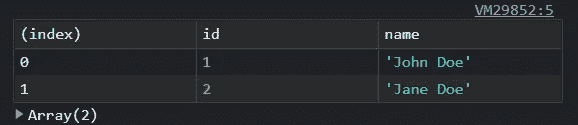
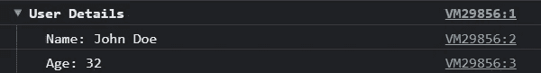
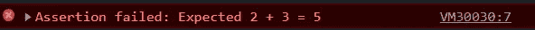
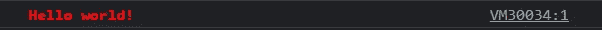
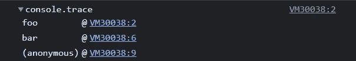
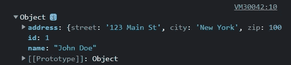
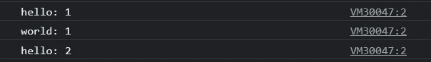
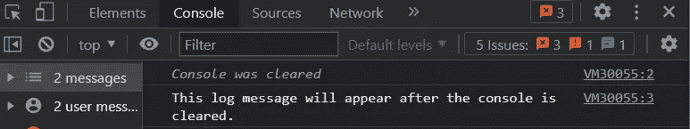
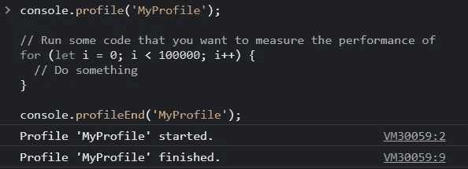

# 为什么在 2023 年只使用 console.log 是一大禁忌🚀

> 原文：<https://javascript.plainenglish.io/why-using-just-console-log-in-2023-is-a-big-no-no-ef99f1940901?source=collection_archive---------1----------------------->

## 这里有 10 个必须知道的控制台对象方法和技巧！


2023 年你还在用`console.log`满足你所有的 JavaScript 调试需求吗？

是时候**升级您的技能**并发现 JavaScript 控制台对象的全部功能了。

从`console.table`到`console.time`，这些先进的方法和技巧将帮助你**提高你的调试输出的质量和可读性**，并使你更容易在你的代码中查找和修复问题。

那么，为什么不在 2023 年加入 JavaScript 忍者调试器的行列，学习这些基本技术呢？**你的代码会感谢你。**

# 😞问题是

只使用`console.log`的最大问题之一是它会弄乱你的代码，而**会让你难以阅读**。此外，它本身并不能提供很多信息。它只是输出您传递给它的值，没有任何上下文或附加信息。

考虑到这一点，这里有十个 JavaScript 控制台对象方法和技巧**你应该了解一下** ( *并尝试一下；我知道 console.log 更快，但它可以让您的调试体验更好，为了您的未来，您自己去做吧！*)。

# 1️⃣控制台.表格

这种方法允许您**以易读易懂的格式**输出表格数据。不仅仅是记录一个数组或对象，`console.table`会以表格的形式显示数据，这样更容易浏览和理解。

```
// Output an array of objects as a table
const users = [
  { id: 1, name: 'John Doe' },
  { id: 2, name: 'Jane Doe' }
];
console.table(users);
```

这将以表格格式输出`users`数组，每个对象的属性作为列，对象作为行。



# 2️⃣console.group

`console.group`和`console.groupEnd.`这些方法允许你在控制台中创建一个嵌套的、可折叠的组。这对于组织和构建你的调试输出很有用，所以你可以很容易地看到在你代码的不同层次发生了什么。

```
console.group('User Details');
console.log('Name: John Doe');
console.log('Age: 32');
console.groupEnd();
```

这将在控制台中创建一个嵌套的可折叠组，标题为“用户详细信息”组**中的日志消息将被缩进并分组在一起。**



# 3️⃣console.time

`console.time`和`console.timeEnd.`这些方法允许你测量**一段代码执行**所花费的时间。这对于识别代码中的性能瓶颈并优化它们非常有用。

```
console.time('Fetching data');
fetch('https://reqres.in/api/users')
  .then(response => response.json())
  .then(data => {
    console.timeEnd('Fetching data');
    // Process the data
  });
```

这将测量从指定的 URL 获取数据和解析 JSON 响应所花费的时间。经过的时间将在控制台中输出。


# 4️⃣console.assert

此方法允许您在代码中编写断言，即应该始终为真的语句。如果断言失败，`console.assert`将在控制台中输出错误消息。**这对于捕捉 bug 和确保代码按预期运行很有用。**

```
function add(a, b) {
  return a + b;
}

// Test the add function
const result = add(2, 3);
console.assert(result === 5, 'Expected 2 + 3 = 5');
```

当给定输入 2 和 3 时，如果`add`函数没有返回预期的结果 5，这将在控制台中输出一条错误消息。



# 5️⃣Style 你的日志

使用`console`对象输出样式和颜色。`console`对象**允许您输出不同颜色和样式的文本**，使您的调试输出更具可读性，更容易理解。

您可以在您的`console.log`语句中使用`%c`占位符来指定输出文本的 CSS 样式。

```
console.log('%cHello world!', 'color: red; font-weight: bold;');
```

这将输出文本“Hello world！”使用指定的 CSS 样式以红色和粗体显示。



顺便说一下，如果您想要更好的日志，您可能想要使用一个专门的日志库，它提供了更多的设置。在我写的这篇文章中，我添加了一个非常好的例子:

[](/5-small-and-hidden-react-libraries-you-should-already-be-using-49c8725c492f) [## 你应该已经在使用的 5 个小型和隐藏的 React 库

### 如果你和我一样，喜欢在 NPM 目录中寻找小宝石来改进你的开发过程，今天是你的幸运日…

javascript.plainenglish.io](/5-small-and-hidden-react-libraries-you-should-already-be-using-49c8725c492f) 

# 6️⃣console.trace

使用`console.trace`方法输出堆栈跟踪。这对于理解代码中的执行流程和识别特定日志消息来自的**非常有用。**

```
function foo() {
  console.trace();
}

function bar() {
  foo();
}

bar();
```

这将在控制台中输出一个堆栈跟踪，显示导致`console.trace`调用的函数调用序列。输出将如下所示:



# 7️⃣console.dir

使用`console.dir`方法以分层格式输出对象的属性。这对于探索一个对象的结构和查看它的所有属性和方法是很有用的。

```
const obj = {
  id: 1,
  name: 'John Doe',
  address: {
    street: '123 Main St',
    city: 'New York',
    zip: 10001
  }
};
console.dir(obj);
```

这将以分层格式输出`obj`对象的属性，允许您查看对象的结构及其所有属性和值。



# 8️⃣console.count

使用`console.count`方法计算特定日志消息输出的次数。这对于**跟踪一个特定的代码路径被执行了多少次**以及识别代码中的热点很有用。

```
function foo(x) {
  console.count(x);
}

foo('hello');
foo('world');
foo('hello');
```

这将在控制台中输出字符串“hello ”,后跟数字 1。然后，它将在控制台中输出字符串“world ”,后跟数字 1。最后，它将再次输出字符串“hello”，后跟数字 2(因为它已经被调用了两次)。



# 9️⃣console.clear

使用`console.clear`方法清除控制台输出。这对于保持您的调试输出**有条理和整洁**以及更容易关注您感兴趣的信息非常有用。

```
console.log('Hello world!');
console.clear();
console.log('This log message will appear after the console is cleared.');
```

这将输出字符串“Hello world！”在控制台中，后跟一个空行(因为控制台被清除)。然后，它将输出字符串“该日志消息将在控制台被清除后出现。”



# 1️⃣0️⃣console.profile

使用`console.profile`和`console.profileEnd`方法来测量代码块的性能。这对于**识别性能瓶颈和优化代码**的速度和效率非常有用。

```
console.profile('MyProfile');

// Run some code that you want to measure the performance of
for (let i = 0; i < 100000; i++) {
  // Do something
}

console.profileEnd('MyProfile');
```

这将开始分析`console.profile`和`console.profileEnd`调用之间的代码块，并在执行`console.profileEnd`调用时在控制台中输出结果。输出将包括执行代码所用时间的详细信息以及任何其他与性能相关的信息。



# 💭一些最后的想法

2023 年，不要仅仅满足于`console.log`——JavaScript 控制台对象中有许多**更强大、更有价值的工具和技术。**

从`console.table`到`console.time`，这些方法和技巧将帮助您提高调试输出的质量和可读性，并使代码中的问题更容易排查和修复。

所以为什么不在 2023 年提升你的调试技能，尝试一下这些技术呢？你的代码(*和你的理智*)会感谢你的。

哦，还有…

# 🌎我们连线吧！

*   [推特:@thenaubit](https://twitter.com/thenaubit)

*更多内容看* [***说白了就是***](https://plainenglish.io/) *。*

*报名参加我们的* [***免费周报***](http://newsletter.plainenglish.io/) *。关注我们关于*[***Twitter***](https://twitter.com/inPlainEngHQ)，[***LinkedIn***](https://www.linkedin.com/company/inplainenglish/)*，*[***YouTube***](https://www.youtube.com/channel/UCtipWUghju290NWcn8jhyAw)*，以及* [***不和***](https://discord.gg/GtDtUAvyhW) ***。***

***有兴趣缩放你的软件启动*** *？检查* [***电路***](https://circuit.ooo?utm=publication-post-cta) *。*