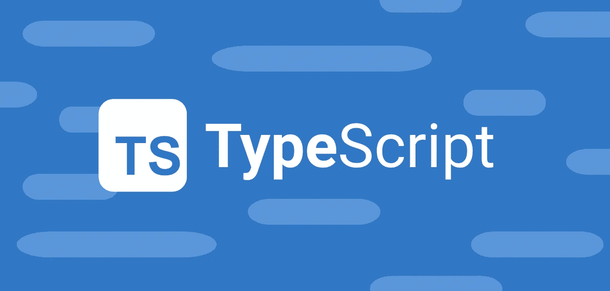
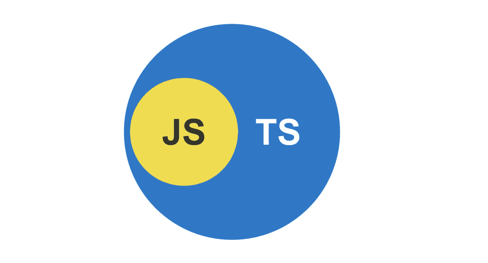
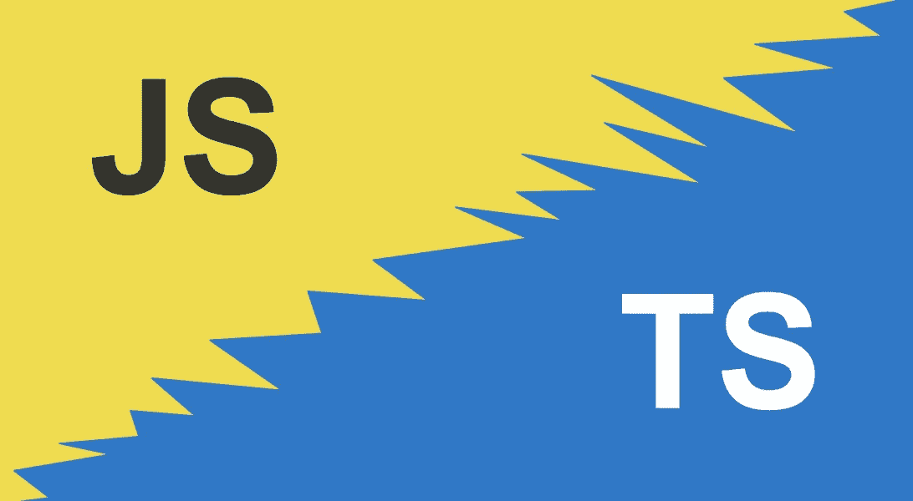

# 为什么现在需要学习 TypeScript

> 原文：<https://javascript.plainenglish.io/why-you-need-to-learn-typescript-now-1f087d38fb4?source=collection_archive---------9----------------------->

## 使用 TypeScript 的好处以及如何从现在开始迭代地采用它。

最近发布的 [**ECMAScript 提案**](https://github.com/tc39/proposal-type-annotations) 计划在 JavaScript 中引入类型语法，这是受微软在 TypeScript 方面的工作的启发。类型已经存在，如果你还没有使用 TypeScript，现在是时候**学习它了**。

我最初对 TypeScript 持怀疑态度，让我告诉你:这太不可思议了。这不仅是有益的，是你简历上的一项很好的技能，而且它也正在迅速成长为网络开发的标准——尤其是帮助扩展大型项目的代码库。

在 [2022](https://survey.stackoverflow.co/2022/#programming-scripting-and-markup-languages) StackOverflow 调查中，TypeScript 被列为第五大最流行的编程语言**——仅次于 JavaScript、HTML/CSS、SQL 和 Python。**

当我第一次了解 TypeScript 时，我认为它是 JavaScript 的完全替代品。如果我想使用它，我必须立即将我的整个代码库转换成`.ts`文件。但我很快发现事实并非如此。

TypeScript 是 JavaScript 语言的**强类型超集**——这意味着您可以使用您已经知道并喜欢的相同 JavaScript。你不需要先一头扎进去。相反，当你和你的团队得到提升时，你可以迭代地引入它。

# 为什么使用 TypeScript

TypeScript 不会解决你所有的问题，但是它可以帮助你更快地写出更好的代码，并且对你的改变更有信心。然而，没有什么是免费的，并且有与 TypeScript 相关联的成本——但是您会意识到好处远远超过缺点。

**好处:**

*   在编译时捕捉类型错误。
*   发展的速度和信心。
*   保护 API 接口。
*   防范潜在的错误。

**弊端:**

*   陡峭的学习曲线。
*   臃肿的代码库。
*   不是“真正的”静态类型。
*   额外的编译步骤。

# 静态打字

JavaScript 是一种**动态类型语言**，这意味着当应用程序运行时，会在运行时检查数据类型错误。

另一方面，TypeScript 使用*可选的*静态类型，它将在运行应用程序之前在编译时捕捉数据类型错误。

这为你的开发人员提供了一个更便宜、更快速的反馈回路，因为它有助于捕捉由于意外错误使用现有代码而引入的错误。此外，在自动化测试中，在编译时而不是运行时捕捉错误有助于“左移”您的开发。

请记住，这是**可选的**类型——这意味着当你将它引入一个新项目时，你不必立即完全实施它。相反，您可以慢慢地开始将它融入到整个项目中，并反复地使实施更加严格。

# 发展的速度和信心

使用静态类型的代码，您可以体验到开发的生产力和信心的提升。这以下列形式出现:

*   **智能感知**:ide 可以在你编写代码时提供提示和警告，帮助你更快地使用特定的代码。
*   **可读性**:当你阅读 TypeScript 时，借助类型定义，你将能够更快地理解代码在做什么。这使得代码更易于维护和扩展，同时也使它能够自文档化。
*   **可预测性**:在 JavaScript 中，您可以将变量重新分配给不同的数据类型——将字符串转换为对象，再转换为数字。大多数开发人员都知道要小心，但 TypeScript 通过对代码强制执行严格的类型化并使每个人对它的使用都是可预测的，使这一点变得不可能。
*   **重构**:有了类型检查的信心，你就可以放心，你做的任何重构都不会导致其他代码崩溃。如果你引入了突破性的改变，TypeScript 会让你知道。这极大地增强了您的信心，并在对代码库进行重大更改时缩短了反馈循环。

# 保护 API 接口

如果在 npm 模块中包含类型定义，TypeScript 会强制您遵守代码和外部代码中的接口。这有助于确保您不会意外地误用函数或 API。

想象一下，如果你有一个用 TypeScript 编写的运行在 Node.js 上的 REST API 您可以在 REST API 和前端代码之间共享类型，确保任何更改都遵循相同的模式。并且在编译时自动完成！

# 防范潜在的错误

虽然并不完美，但研究表明 TypeScript 可以帮助减少开源项目中 15%的 bug。

开发人员可以在任何语言中引入 bug，所以不要逐字逐句地接受这个分析，也不要把它当成一个承诺。但是 TypeScript 确实提供了一些帮助。有趣的是，它迫使我更加批判性地思考数据是如何在我的应用程序中传递的，这让我更加意识到这些错误。

TypeScript is a superset of JavaScript.

# 陡峭的学习曲线

TypeScript 的基础非常类似于您今天已经在使用的 JavaScript。因此，任何阅读 TypeScript 代码的 JavaScript 开发人员都应该能够阅读并理解正在发生的事情。基本类型结构很容易掌握。

然而，在现实世界的应用程序中使用 TypeScript 需要一个学习过程。TypeScript 中的许多细微差别、陷阱和高级模式都非常特别。因此，如果您处理复杂的代码，您将会遇到许多棘手的情况。

好的一面是，一旦你理解了 TypeScript 是如何工作的，在谷歌搜索的帮助下，这些情况就相当简单了。但是掌握 TypeScript 是需要时间的。

幸运的是**你不必一下子跳进水里**。您不需要立即在“严格”模式下运行 TypeScript，您可以从只在最重要的地方引入 TypeScript 开始。这应该有助于减轻你和你的队友学习的痛苦。

我建议你花时间学习基础知识。这对你未来的职业生涯会有巨大的回报。遵循一些教程、视频或在线课程，并通过示例亲自动手。

# 膨胀的代码库

有些人可能会说，使用 TypeScript 会通过添加类型定义来扩大代码库，使每个代码文件都变得更大。

这无疑是对的，但是我认为“膨胀”来自于引入增加代码可读性和可预测性的类型。更少的代码行不一定会让你的代码库更干净或更好。相反，更详细的代码可以让每个人更容易理解，从而有助于长期的可维护性。

如果你使用一个现代的 IDE，你也将从你的智能感知中获得许多生产力的提高。

# 不是“真正的”静态类型

TypeScript 不像 C++、C 或 Java 那样使用“真正的”静态类型。

在编译时，TypeScript 向下编译成普通的 JavaScript。不幸的是，在这个过程中所有的类型定义都被丢弃了，因为它们不是 JavaScript 的原生类型。因此，总是有轻微的边缘情况错误的风险。

通过良好的 CI/CD 设计和全面的自动化测试，您可以将这种风险降至最低。

# 额外的编译步骤

TypeScript 必须编译成 JavaScript 才能在大多数浏览器或 Node.js 环境中运行。这个额外的步骤增加了应用程序的总体构建时间。

一些工具可以帮助您减轻这种情况，例如`[fork-ts-checker-webpack-plugin](https://www.npmjs.com/package/fork-ts-checker-webpack-plugin)`允许您在独立于主要 Webpack 构建步骤的进程中运行 TypeScript 验证。这大大增加了整个 Webpack 的构建时间。

*注意:如果你只使用 Babel 将你的类型脚本转换成 JavaScript，要小心，因为它不会运行类型验证，错误会被忽略。*

You can use TypeScript and JavaScript side by side.

# 迭代引入 TypeScript

引入 TypeScript 不一定是一个痛苦的过程。无论您是 TypeScript 新手，需要时间来学习它所提供的一切，还是像大多数开发人员一样，在尚未使用 TypeScript 的现有代码库中工作，您都可以迭代地开始**。**

**第一步是在编译中添加对 TypeScript 的支持。大多数编译器和捆绑器都有插件和工具来编译你的 JavaScript 和 TypeScript。比如对于 Webpack，可以使用`ts-loader`或者`fork-ts-checker-webpack-plugin`。**

**一旦你做到了这一点，你就可以开始慢慢地引入`.ts`文件，而不需要删除任何现有的`.js`文件。**

***注意:为公共代码创建类型的基础层将花费时间和精力来实现跨代码库的类型的生产力优势。***

**我建议从你的应用程序最核心的代码开始。像通用工具、REST API 处理程序、共享组件之类的东西——任何能最快帮助大多数开发者的东西。**

**最终，一旦你掌握了 TypeScript 并准备好完全投入，考虑以`strict`模式运行它，以帮助所有开发人员避免使用一些常见的拐杖，如`any`类型。**

**为了在整个过程中获得帮助，我强烈建议使用官方的打字稿文档:[https://www.typescriptlang.org/docs/](https://www.typescriptlang.org/docs/)。**

# **打字稿的未来**

**微软在 2012 年发布了 TypeScript 自那时以来，它走过了漫长的道路。**静态类型检查**已经在 JavaScript 社区中找到了一席之地，并且它的受欢迎程度还在不断增加。**

**早在 2012 年，引入一些需要新编译步骤的东西是有意义的，因为每个人都已经在使用捆绑器和编译器来解决浏览器兼容性问题。但是 ECMAScript 标准已经发展了很多。**

**因此，微软相信我们可能很快就会看到这样一个世界:我们不再需要编译就能把应用程序传送到浏览器上。所以他们最近引入了一个 [stage-0 提案](https://github.com/tc39/proposal-type-annotations)，以 JSDoc 类注释的形式向 JavaScript 添加可选类型。请放心，这不是 TypeScript 的替代品，将静态类型检查原生添加到 JavaScript 将是一场漫长的艰苦战斗。但那是我很想看到的**的未来。****

**在这里了解更多:[https://dev blogs . Microsoft . com/typescript/a-proposal-for-type-syntax-in-JavaScript/](https://devblogs.microsoft.com/typescript/a-proposal-for-type-syntax-in-javascript/)。**

# **最后的想法**

**TypeScript 带来了一些成本，但是正如您所看到的，它可以极大地有利于您的项目。它可以帮助扩展您的代码库，提高生产率，让每个人的生活更轻松。今天学习它将为你的职业生涯带来好处。**

**你觉得 TypeScript 怎么样？你对试一试持观望态度吗？那么，去做吧——你不会后悔的！**

**请在评论中告诉我你的想法。**

***最初发布于*[*https://oskari . io*](https://oskari.io/blog/why-typescript/)*。***

***更多内容请看* [***说白了就是***](https://plainenglish.io/) *。报名参加我们的* [***免费每周简讯***](http://newsletter.plainenglish.io/) *。关注我们* [***推特***](https://twitter.com/inPlainEngHQ) *和*[***LinkedIn***](https://www.linkedin.com/company/inplainenglish/)*。查看我们的* [***社区不和谐***](https://discord.gg/GtDtUAvyhW) *加入我们的* [***人才集体***](https://inplainenglish.pallet.com/talent/welcome) *。***