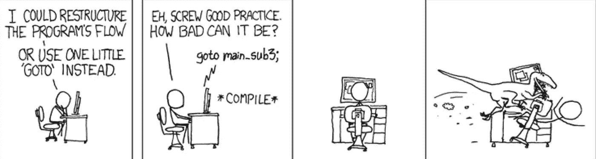
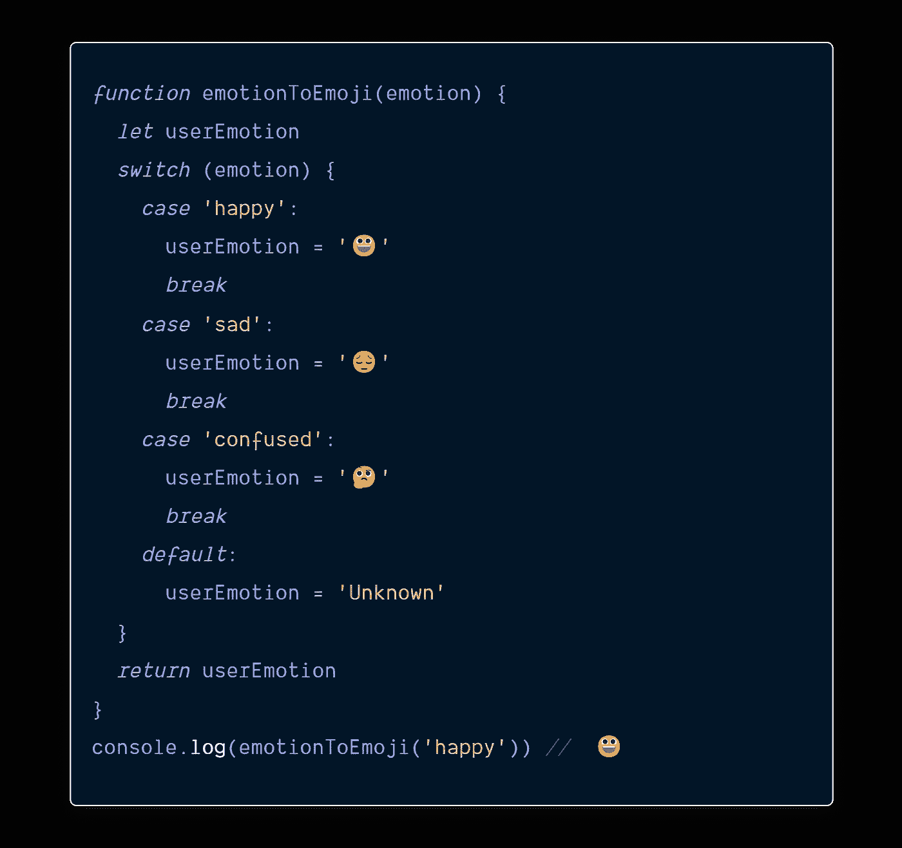
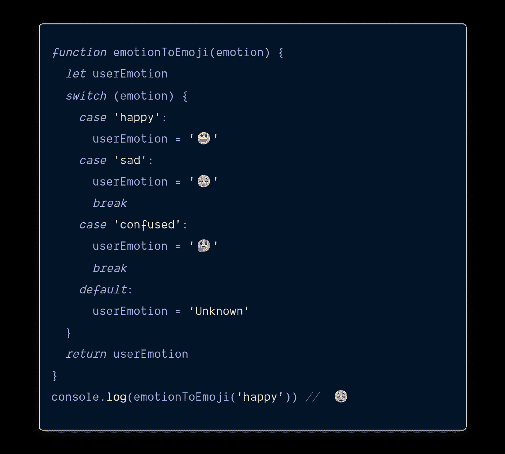
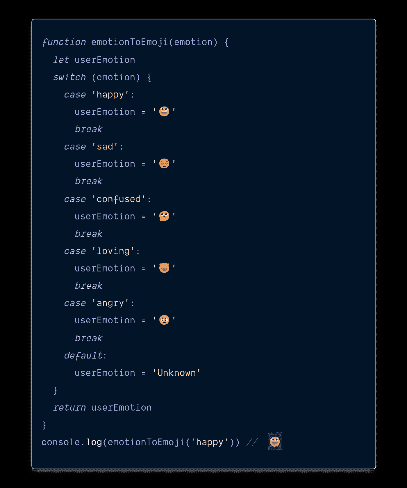
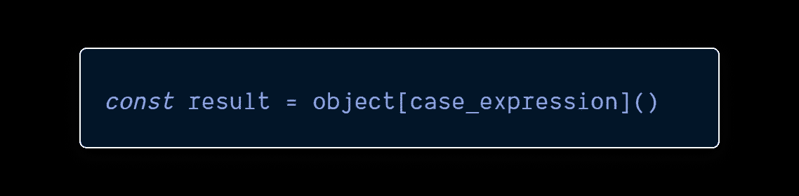
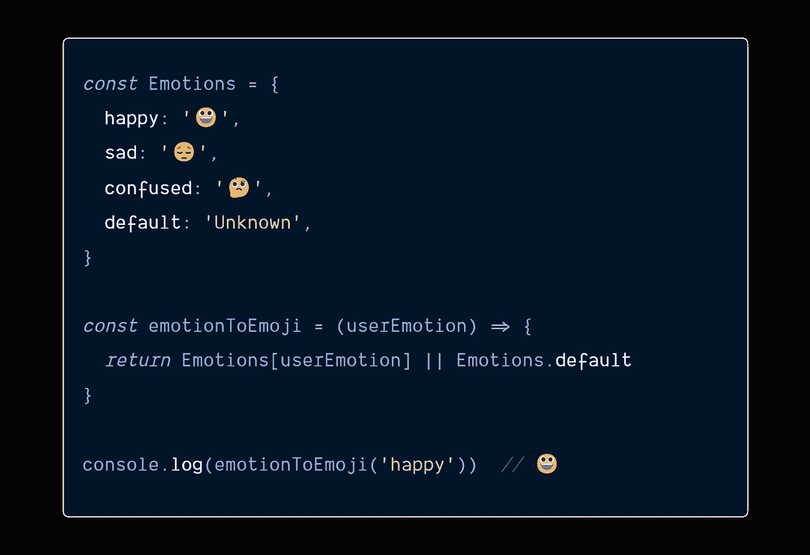
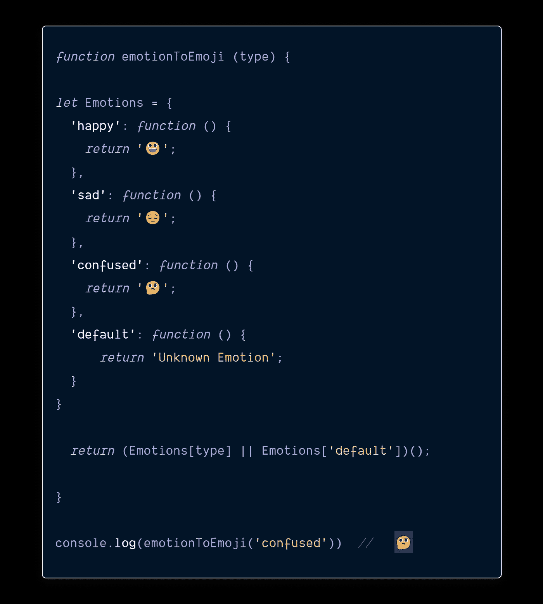
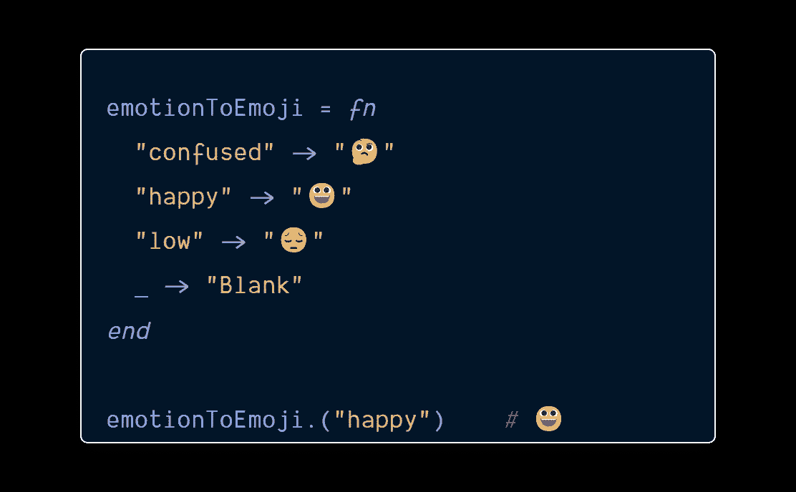

# 这就是为什么在 JavaScript 中使用 Switch 不是一个好主意

> 原文：<https://javascript.plainenglish.io/why-you-should-avoid-switch-statements-in-javascript-ce07d5b60da4?source=collection_archive---------1----------------------->

## Switch 语句隐藏的问题(以及如何解决它们)

[📷](https://www.pexels.com/@gracerussmann?utm_content=attributionCopyText&utm_medium=referral&utm_source=pexels)

我们在编程中做的最重要的事情之一就是做决策——你做得越好，你的代码设计就越好。

JavaScript 有两个分支语句，`if` 和`switch`，不是一个多就是两个多。

`switch`是 C. A. R .霍尔的`**case**`语句和 FORTRAN 的 computed `GO-TO`语句的拙劣混合体。

作为`GO-TO`语句的近亲(计算机科学家们争论了 20 年要从现代编程语言中根除它)，也带来了相当多的问题。

[xkcd](https://xkcd.com/292/)

几乎在我看到 switch 使用的所有地方，我都看到它被误用。 *(Redux 是个例外)。*

# 问题，问题，问题

> *“智慧说我们一无是处。爱说我们是一切。我们的生命在这两者之间流动。”*
> 
> *–杰克·康菲尔德*

JavaScript 有相当标准的控制流语句，这些语句使用花括号定义的块。

`switch` 语句有一个例外。

`switch`语句提供了一个隐式的开关变量，但是有可能导致错误和不良实践。

关于`switch`的怪异之处在于`break`必须包含在每个案例的末尾，以防止控制传递到下一个案例。

除非你明确告诉它不要用`break`，否则控制会自动 ***转到或通过*** 转到下一个案例。这允许我们同时运行多个案例。

生活中的事情并不总是像我们希望的那样发展——这很伤人。

我们都经历过！

你肯定会在不该犯错的地方犯错。

就像可选的分号和花括号一样，在应该使用`break`的时候也有可能忘记使用。在这种情况下，错误很难定位，因为代码看起来是正确的。

每次我们撰写`switch`声明时，我们都必须极其谨慎。

当你不得不格外小心时，写代码的乐趣就减少了——这就是问题所在。

> *“Switch 让编码失去了乐趣。我们没有专注于解决问题，而是陷入了语法问题。”*

违反高内聚和关注点分离(SoC)原则的交换机实现太常见了。

As the switch statement grows in size, it adds to the cognitive load.

不仅如此，还有样式的问题:*一个* ***case*** *应该与* `switch` *对齐还是缩进？—* 似乎没有正确的答案。

一些变通方法可以减轻必须记住放置 break 语句的压力，但是它们是否值得我们花时间去考虑。

# 通过解决问题来逃避你的问题。

> 没有什么是完全独立存在的。一切都与其他一切相关。”
> 
> *–乔达摩，佛陀*

对象可以用作 switch 语句的替代语句。

使用 Object 可以实现键控方法查找。

我发现 switch 比 if…else 更好，但是随着时间的推移，我自然倾向于方法查找。

对象更容易阅读和维护。我们不需要手动打破每个“案例”它们对新的 JavaScript 开发人员也非常友好。

您为方法查找创建的对象称为 ***动作*** 对象——它用于许多软件设计模式中。

在许多情况下，它用较少的样板文件提供了相同的功能。

方法查找鼓励组织良好的代码，而 switch 鼓励意大利面条式的代码。

我们可以在一个函数中包含同样的东西，甚至做更复杂的事情。

You can move the Emotions outside the emotionToEmoji() — like the previous one. So, that we are not paying a construction cost on every invocation

我们已经用实现每种情况的行为的函数填充了对象——对应于 ***情况*** 变量的值是关键。

有些人会使用 Map 对象，因为它更具性能。

因为 Map 对象是可枚举的，所以它不适合某些安全模式。我更喜欢 WeakMap，因为它不是。

当我开始使用 Object/WeakMap 查找时，我想我终于找到了一个完美的替代品来代替 *switch … case。*

不幸的是，这种形式也带来了一个问题:绑定“ ***这个*** ”。

JavaScript 中的所有其他符号都是静态绑定的，但是' ***this*** '是动态绑定的，这使得' ***this*** '成为混乱的根源。

困惑是错误的来源→错误导致不安全感。

我觉得我们可以做得更好。

# 模式匹配——一种更好的方法

模式匹配是从函数式编程语言借用的一种技术，它允许您基于值的结构以声明方式编写条件代码分支。

> *开关是两个前轮，拼花是整辆车。*

模式匹配比命令式替代(if/else/switch 语句)更强大，也更简洁。

Written in Elixir

当对复杂的数据结构或多个值进行分支时，模式匹配的真正威力就显现出来了。

尽管有人提议将模式匹配添加到 ECMAScript 规范中，但它仍处于早期阶段，不太可能很快实现。

幸运的是，模式匹配可以在用户空间中实现。

*   patcom
*   [match-iz](https://github.com/shuckster/match-iz)
*   [ts 模式](https://github.com/gvergnaud/ts-pattern)
*   [选装件](https://github.com/OliverBrotchie/optionals)
*   [巴别-插件-提议-模式匹配](https://github.com/iptop/babel-plugin-proposal-pattern-matching)

使用以上任何一个库，您都可以体验 JavaScript 中的模式匹配实现。

# Redux —一个例外

> 简单是最复杂的
> 
> *——达芬奇*

*“我用 Redux。我从未遇到任何问题”* —事实上，我喜欢它！

我知道，我也喜欢。

Redux 如此受欢迎是有原因的。

这与它简化事物的能力有很大关系。

简化事情的能力包括移除不必要的*以便让必要的*说话。

在我开始使用 Redux 之后，我写了很多`switch`语句。

Redux 通过了测试，因为它避免了`switch`语句的两个主要问题:

*   ***每个案例都返回*** ，不存在因遗漏 break 语句而导致案例落空的风险。
*   ***reducer 编写起来很简单***——案例膨胀的风险很小(这是交换机管理庞大应用流控制的常见问题)。

只要您遵循简单的规则(保持开关小且集中，并且从每个案例返回它自己的主体)，*开关*语句就可以了。除了在 Redux 中，我已经好几年没有在我的代码中使用过*开关*语句。

我一点也不怀念。

如果您发现自己正在编写 switch 语句，请暂停并考虑以下内容:

*   您是否正在尝试使用 fall-through 特性对相关的输入进行分组，以便它们可以共享代码？
*   你是用数字来指代你的案例吗，比如案例:1，案例:2 等等？
*   将来您需要添加更多案例吗？
*   能够在运行时改变案例列表有用吗？
*   记录执行的案例有用吗？

如果你对其中一个陈述的回答是肯定的，你最好避免在你的代码中使用`switch`或者它有缺陷的失败特性。

# 结论

写这篇文章的目的不是改变您的编码风格或者让您停止使用 switch 语句。

这篇文章的目的是提高认识，以及打开你的心灵，迎接新的可能性。

学习是一个没有重量的宝藏，你可以随时轻松携带。我已经分享了一些方法，但是还有更多——去探索它们吧。

# 感谢信

我想利用这最后的机会说声谢谢。

感谢您的光临！如果没有像你这样的人跟随并带着信念阅读我的帖子，我将无法做我所做的事情。

我希望你能 [***加入我的***](https://polymathsomnath.medium.com/subscribe)[**我未来的博客文章**](https://polymathsomnath.medium.com/subscribe) 并留下来，因为我们这里有很棒的东西。

我希望在未来的许多年里，我能在你的职业生涯中帮助你！

下次见。再见！

*更多内容请看**[***说白了. io***](https://plainenglish.io/) *。报名参加我们的* [***免费周报***](http://newsletter.plainenglish.io/) *。关注我们* [***推特***](https://twitter.com/inPlainEngHQ) *和*[***LinkedIn***](https://www.linkedin.com/company/inplainenglish/)*。加入我们的* [***社区不和谐***](https://discord.gg/GtDtUAvyhW) *。**