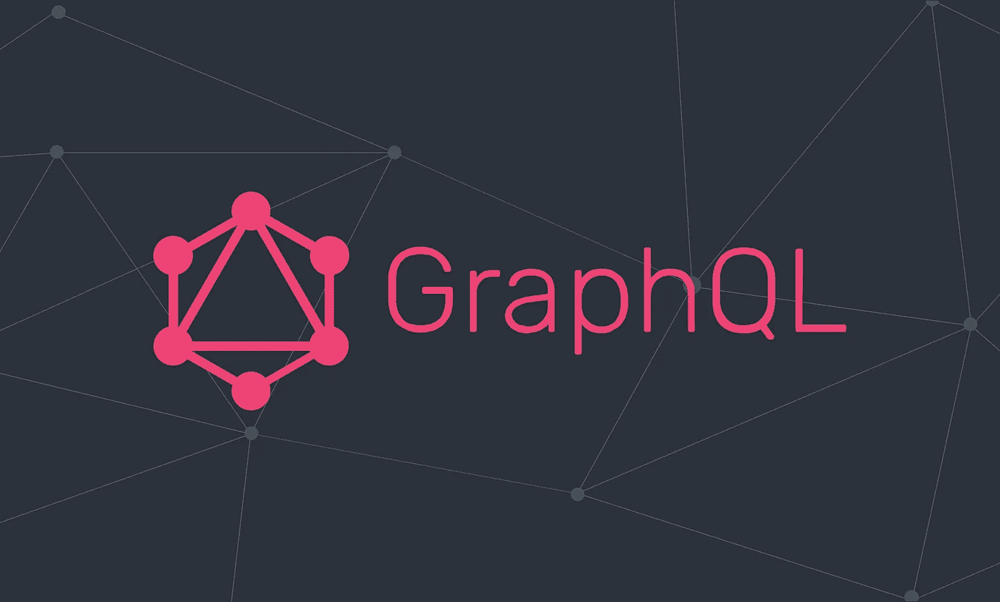

# 为什么应该使用 GraphQL(如果您还没有)

> 原文：<https://javascript.plainenglish.io/why-you-should-be-using-graphql-if-you-arent-already-7f5deb4333a8?source=collection_archive---------6----------------------->

Source: [https://codersociety.com/blog/articles/graphql-reasons](https://codersociety.com/blog/articles/graphql-reasons)

我们都知道在我们的应用程序中管理数据通常是一件苦差事，因为它需要:

*   独立的前端客户端管理各种平台，如 Web、移动(iOS、Android 等。)，而且这些客户端通常需要不同的数据集
*   一个后端系统，可能从各种存储入口点(如 PostgreSQL、Redis、Firebase 等)获取数据。
*   堆栈两端(前端和后端)的复杂状态和缓存管理
*   查询的单独文档

幸运的是，有一种更现代的方式来管理这些琐事，这就是 GraphQL。

所以，你可能会问， **GraphQL** 到底是什么？好吧，我们就直接进入这个话题。

*本文原载* [***此处***](https://upmostly.com/web-development/benefits-of-adopting-graphql) *。*

# GraphQL 是什么？

**GraphQL** 最初是作为一个 **API 机制**出现的，用于在**脸书处理**复杂的查询任务**。**

它是在考虑到**易用性**和**开发速度**的情况下构思出来的，旨在打造严重依赖**各种系统之间的数据和通信**的新产品。

*因此在面向服务的**&****微服务*** ***架构中使用非常普遍。***

脸书用例的一个很好的例子是它的移动应用，比如脸书和 Instagram。

所以，在其核心， **GraphQL 是一种查询语言**，为前端和后端提供发送和检索数据的双向指令。

这意味着它允许前端开发人员 ***从可访问的数据条目池中请求他们需要的确切数据。***

这比每次客户需要新的特定数据批次来解决经典的 ***欠查询*** 和 ***过查询*** **问题**时定义新的端点要方便得多。

# GraphQL 是如何工作的？

Several REST endpoint requests can be replaced with a single GraphQL query. Source: Poirier-Ginter 2019.

**GraphQL** 充当客户端和服务器之间连接的**包装器，因此，它为您的客户端提供了一个**单一端点**来访问来自服务器的数据池，并**挑选他们可能需要的任何东西**。**

不仅如此，它还为数据的进入提供了多个入口点，因此我们可能能够**访问来自不同来源的数据**，这非常方便！

根据 GraphQL 使用的抽象，我们将引用 GraphQL 将数据点/模型解释为 ***节点*** ，而这些节点之间的关系将被引用为 ***边*** 。

因此，数据被表示为互连对象/数据点的 ***图*** ，而不是我们通过 RESTful 端点访问的资源。整个图就是我们所说的 ***应用数据图*** 。

# GraphQL 与 RESTful APIs

# 使用 GraphQL 相对于 REST 的优势:

## 1.表演

GraphQL 比任何其他通信 API 都要快，因为它迫使您通过只选择您想要查询的特定字段来减少请求查询，这解决了上面提到的**欠查询**和**过查询**的问题。

## 2.最适合复杂系统

它最适合于复杂的系统，比如那些实现 **SOA** 或**微服务**架构的系统，因为它允许将系统的所有服务合并到一个保护伞下。

这意味着数据在整个系统中更容易访问，正如前面提到的，这非常方便。

## 3.层次结构方法

**GraphQL** 遵循分层结构，其中对象之间的关系在图形结构中定义。

在 **GraphQL** 中，每个对象类型代表一个**组件**，从一个对象类型到另一个对象类型的每个关系字段代表一个组件包装另一个组件。

## 4.为客户塑造数据

将形状添加到数据中。当我们向服务器请求 GraphQL 查询时，服务器以简单、安全和可预测的形式返回响应。因此，它便于您根据自己的需求编写特定的查询。

***这让 GraphQL 真的很好学很好用。***

## 5.客户端/服务器不可知

由于 GraphQL 是一种协议，它不关心您在应用程序的前端或后端使用什么技术。

只要支持实现一个 GraphQL 客户端来处理协议实现，GraphQL 这边就没问题。

你可以想到 JavaScript 的 [Apollo](https://www.apollographql.com) ，C#/的[热巧克力](https://chillicream.com/docs/hotchocolate)。网等。

# 使用 GraphQL 优于 REST 的缺点

## 1.查询复杂性

当我们必须在一个查询中访问多个字段时，不管是通过 **RESTfully** 请求还是通过 **GraphQL** 请求，各种资源和字段仍然必须从**数据源**中检索，因此当**客户端同时请求太多嵌套字段数据**时，也会出现同样的问题。

因此，必须有一种类似于**最大查询深度**、**查询复杂度加权**、**避免递归**或**持久查询的机制来阻止来自客户端的低效和中断请求**。

## 2.贮藏

用 **GraphQL** 实现一个简化的缓存比用 **REST** 实现要复杂得多。

当使用 RESTful API 时，我们通过 URL 访问资源，然后我们可以在资源级别缓存它们，因为我们有资源 URL 作为标识符。

另一方面，在 **GraphQL** 中，它非常复杂，因为每个查询都可能不同，即使它操作的是同一个实体。但是大多数构建在 GraphQL 之上的库都提供了有效的缓存机制。

# GraphQL 常用术语词汇表

*   **查询**:从 GraphQL 服务获取数据的只读操作。
*   **突变**:虽然可以将查询设计为进行数据写入，但不建议这样做。建议进行明确的突变。
*   **字段**:我们可以获取的数据的基本单位。事实上，GraphQL 是关于在对象上选择字段的。您可以将字段视为您希望查询或变更的数据模型的属性。
*   **片段**:可以跨多个查询重用的一组字段。
*   **参数**:每个字段和嵌套对象都可以有一个参数，从而使我们能够过滤或定制结果。参数基本上是关键:我们可以用来过滤数据的值对。
*   **别名**:为了避免结果中的命名冲突，别名很有帮助。例如，我们可以用不同的参数查询同一个对象，并用不同的别名得到结果。
*   **指令**:这个可以附加在一个字段或者片段上，动态影响数据的形状。强制指令是`@include`和`@skip`，根据条件包括或跳过一个字段。指令通常用于分页。

# 一锤定音

我相信 GraphQL 是管理更复杂系统的一种优秀方式，在处理更复杂的应用程序时可能会遇到这种情况。

> ***假设您遇到了这样一种情况，您正试图协调各种前端客户端或多个后端数据输入源之间的关系；在这种情况下，GraphQL 可能很适合您的用例。***

你可以在这里 查看这篇文章 [**，看看我们将如何**用 Node.js & Express** 建立一个 GraphQL 服务器。**](http://upmostly.com/web-development/how-to-set-up-a-graphql-server-with-node-js)

如果您想了解我们如何在 React 应用程序中通过 Apollo 客户端**实现 GraphQL 并与 GraphQL 服务器交互，您可以查看这篇** 文章。

如果你觉得我错过了什么，或者你想进一步讨论我在这篇文章中提到的任何东西，请随时留下评论，这样我们就可以继续讨论。非常感谢。

干杯！

*更多内容请看*[***plain English . io***](https://plainenglish.io/)*。报名参加我们的* [***免费周报***](http://newsletter.plainenglish.io/) *。关注我们上*[***Twitter***](https://twitter.com/inPlainEngHQ)[***LinkedIn***](https://www.linkedin.com/company/inplainenglish/)*[***YouTube***](https://www.youtube.com/channel/UCtipWUghju290NWcn8jhyAw)**和* [***不和***](https://discord.gg/GtDtUAvyhW) *对成长黑客感兴趣？检查* [***电路***](https://circuit.ooo/) ***。*****