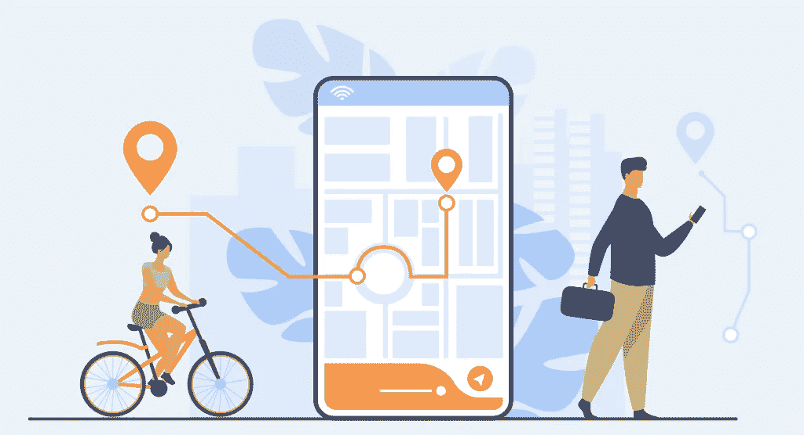
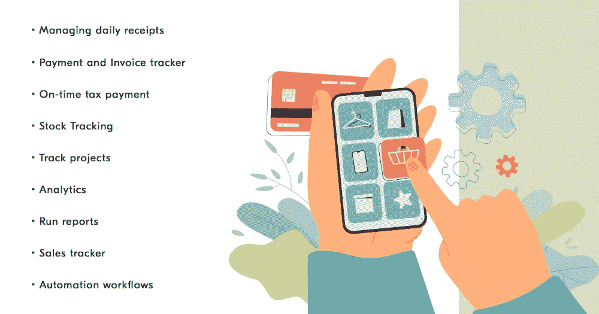

# 为什么你应该开发一个费用跟踪应用程序

> 原文：<https://javascript.plainenglish.io/why-you-should-develop-an-expense-tracking-app-56a1fcd23aca?source=collection_archive---------23----------------------->

Expense Tracking

在这个互联网和科技的时代，一切都变得更容易了。然而，独自处理你的财务是一件费时的事情。因此，最好下载一个应用程序并完成您的要求。如今，应用程序正在席卷我们的世界，移动应用程序开发也为金融业务带来了重大进展。

跟踪支出是个人预算管理的一个重要部分，支出监控应用程序可能会使它变得简单。这些应用程序可以让你对你的支出进行分类，这样你就可以更好地了解你的支出习惯，并生成成本报告。

但是等等，在你选择跟踪应用程序开发服务之前，你应该很好地掌握费用跟踪应用程序所需的功能，以及这些功能如何帮助用户的日常生活。

## **为什么你应该开发一款费用跟踪应用**

定期记录预算是至关重要的，尤其是因为商务人士的收入每月都在波动。

使用开发的[费用跟踪应用](https://www.peppyocean.com/)，完全安全地测量收据、管理收入记录、编制预算、管理税收、监控收入与费用、连接卡等。开发费用监控应用程序是当今最流行的趋势之一，许多人已经在使用它们了。开发一个费用跟踪应用程序有很多原因；下面列出了其中的一些:

*   它提供了对有关利润和损失的事实和统计数据的准确分析。通过应用程序分析数据要比依赖人工干预容易得多。
*   在纸张和 Excel 电子表格上记录现金支付和在线交易的日子早已一去不复返。纸张不便于管理，而且会对环境造成风险。使用费用跟踪应用程序管理文档变得很容易。
*   不断检查商业现金和数字支付是一项挑战，这可能是一个巨大的问题。这就是为什么为了顺利交易和跟踪付款和投资，应该使用商业财务跟踪工具。
*   说到预算和财务管理，我们不能犯错误。另一方面，人类可能由于误解、粗心或无知而犯错误。通过使用费用管理工具，您可以最大限度地减少以及防止因疏忽而产生的任何错误。

除此之外，费用追踪应用程序还有其他优点，人们可以利用它们。让我们来讨论一些可以帮助你日常生活的重要功能，以及一些你必须包含在费用跟踪应用程序中的基本功能。

## **费用追踪应用的关键特性**

expense tracking app features

1.  **管理每日收据**

如果您忘记了某项费用或忘记了某些交易数据，收据跟踪和管理工具将帮助您纠正这种情况。当您进行或接收现金或在线支付时，您所要做的就是拍下收据。把它归入适当的类别，费用跟踪器会提醒你。您不会丢失信息，因为它保存在云中。此外，收据是精简和有组织的，以便您可以随时收集它们。

**2。付款和发票跟踪系统**

费用跟踪软件支持银行转账、借记卡、信用卡和网上银行交易。因此，当用户使用支出跟踪工具时，他们可以在应用程序中跟踪他们的账户和信用卡账单的状态。

**3。按时纳税**

一个费用追踪软件也可以帮助用户掌握税收优惠，并提醒他们按时纳税。你现在要做的就是把你的税务文件上传到应用程序。通过将你的纳税申报支出归类到适当的类别，成本跟踪应用程序将对其进行检查，并及时提醒用户。

**4。股票跟踪**

你不需要一个花哨的应用程序来跟踪你的库存。这项任务将由成本监控软件监督，该软件将跟踪物品和费用，并在库存水平较低时提醒用户。此外，用户可以看到哪些产品受欢迎，哪些不受欢迎。

**5。跟踪项目**

最好的预算应用程序允许你在一个地方跟踪所有项目的活动。您还可以跟踪项目的不同元素所占用的资源。有了成本计算系统，你可以记录经营成本、工资和费用。因此，只需看一眼仪表板，就可以确定项目的盈利能力。

**6。分析**

这是成本跟踪软件的一个重要功能，因为它可以帮助您获得详细的报告，包括适当的图表、统计数据等。这一功能有助于您收集大量的数据，并加深您对任何特定主题的理解。

**7。运行报告**

您可以使用该程序来创建和运行损益、收入、支出和资产负债表报表。您还可以创建定制的报告，以便更深入地了解您的特定业务需求。
如有需要，可提供高级报告，如预算和库存报告。

**8。销售跟踪系统**

你也可以用支出跟踪应用程序来迎合电子商务领域。通过同步移动读卡器的功能，你可以批准信用卡，甚至与流行的应用程序进行交互。连接到您首选的电子商务 API。应用程序会立即在您的发票上计算税款。

**9。自动化工作流程**

在创建和评估报告时，这个工具可以为您节省大量时间。根据您公司解决方案的需要，您将在日常任务中定期收到提醒。这些自动提醒也改善了现金流、客户关系和销售。它基本上自动化了整个任务，消除了人为错误的机会。

## **决定 App 追踪 App 成本的因素**

既然已经解决和描述了基本要素，现在是时候看看开发一个具有强大功能集的费用跟踪应用程序的[成本了。开发费用跟踪应用程序的成本取决于各种功能和开发考虑因素。最重要的成本因素如下所示。](https://www.peppyocean.com/how-much-does-it-cost-to-develop-an-app-like-airtasker/)

*   额外的定制功能。
*   开发人员的每小时成本。
*   开发公司的位置，以及集成第三方 API 和服务的成本。
*   支持和维护成本等。

除此之外，开发一个费用跟踪软件的成本受多种因素的影响。目标移动操作系统平台、多点触摸手势、UI 和 UX 设计质量、操作等等也会影响费用跟踪应用的整体应用开发成本。

# 结论

本文涵盖了大多数支出监控应用程序中常见的所有功能。但是，如果您的业务有特定要求，您可以创建一个与您的应用程序同步并满足您需求的自定义应用程序。您可以利用跟踪应用程序开发服务来获得更好的结果。

*更多内容请看*[***plain English . io***](https://plainenglish.io/)*。报名参加我们的* [***免费周报***](http://newsletter.plainenglish.io/) *。关注我们关于*[***Twitter***](https://twitter.com/inPlainEngHQ)*和*[***LinkedIn***](https://www.linkedin.com/company/inplainenglish/)*。加入我们的* [***社区不和谐***](https://discord.gg/GtDtUAvyhW) *。*