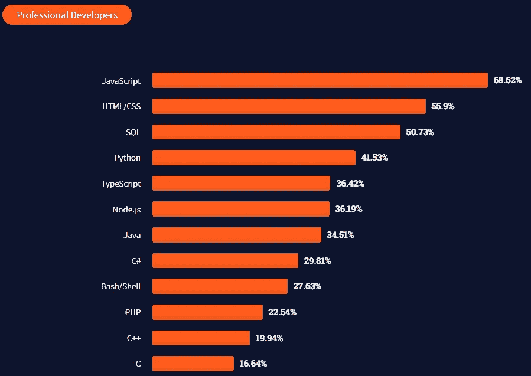
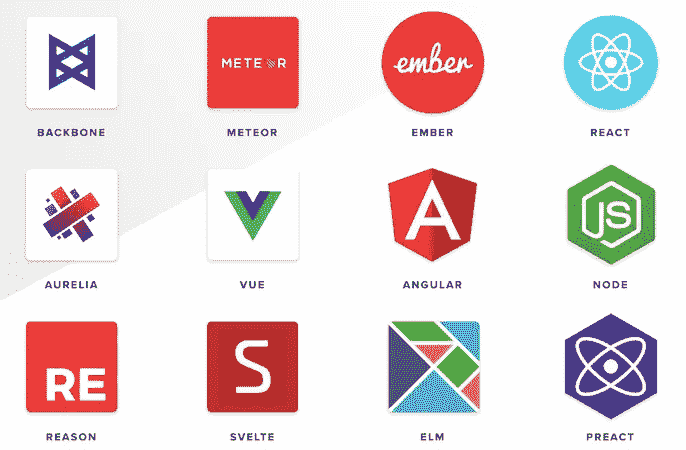

# 为什么即使在 2022 年你也应该学习 JavaScript

> 原文：<https://javascript.plainenglish.io/why-you-should-learn-javascript-even-in-2022-482d91a45be3?source=collection_archive---------11----------------------->

Photo by [Juanjo Jaramillo](https://unsplash.com/@juanjodev02?utm_source=medium&utm_medium=referral) on [Unsplash](https://unsplash.com?utm_source=medium&utm_medium=referral)

想做前端开发？学习 JavaScript。想做后端 dev？学习 JavaScript。想做全栈 dev？学习 JavaScript。想成为 Jamstack dev 吗？学习 JavaScript。想成为 Web3 dev？学习 Javascript。

看，JavaScript 无处不在。那么我们为什么不应该学习 JavaScript 呢？曾几何时，JavaScript 被视为一种玩具语言，但如今，它已经成为编程世界的一个重要特征。在本文中，我们将看到一些我们应该学习 JavaScript 的理由。

## 1.JavaScript 让你成为一个动态的程序员

如果你知道如何用 JavaScript 编码，那么编程是没有限制的。如果只用 JS 就能构建一个完整的软件会怎么样？🤔神奇的是。2022 年，JavaScript 仍然是这里的主谋。你可以构建一个完整的软件，包括前端和后端，只用一种语言——JavaScript💪。所以，你几乎可以在任何地方使用 JavaScript。💖

JavaScript 仍然处于首位。所以，没有困惑，你可以学习 JavaScript，即使是在 2022 年。👌

Source: [2021 Developer Survey](https://insights.stackoverflow.com/survey/2021#most-popular-technologies-language-prof)

## 2.**常青树和最受欢迎的技术**

你好，JavaScript。你几岁了？“我都 25 多岁了。”没错，JavaScript 已经超过 25 年了，依然常青。全球有 18 亿个网站在运行，其中 95%由 JavaScript 驱动。JavaScript 的流行程度现在相当稳定。曾经，JavaScript 只能在浏览器中运行。现在吗？它也可以在浏览器之外工作。甚至 JavaScript 的性能也在逐年提高。那么为什么即使在 2022 年也不应该学习 JavaScript 呢？🤔🤷‍♀️

## **3。很多工具和框架**

Javascript 有各种各样的工具、扩展、框架和库来加速开发过程，这是它的主要优势之一。比如 React，Vue.js，Angular 都是最好的前端框架。你可以不加思索地选择其中任何一个作为你早期职业生涯的参考。

image link: [https://www.deepcrawl.com/wp-content/uploads/2019/07/JavaScript-frameworks.png](https://www.deepcrawl.com/wp-content/uploads/2019/07/javascript-frameworks.png)

## 4.大社区

JavaScript 只是一种拥有庞大程序员群体的编程语言。比如在 StackOverflow 上。目前在 StackOverflow 上有 **2，323，228** (+-)个问题，这些问题意义重大，您将更快获得帮助。作为一个程序员新手，你可以从 JavaScript 获得比其他语言更多的帮助。

JavaScript 的大社区有一个合理的理由；因为它在网络上几乎无处不在。

## 5.许多许多事物的语言

JavaScript 最初只用于前端，但是现在，它无处不在。

Node.js 赋予了 JavaScript 额外的力量。现在，您可以用 JavaScript 编写服务代码。💖我们可以构建**移动应用、API 集成、**并使用 JavaScript 做很多事情。

那么，如果你仅仅通过学习一门语言就获得了这么多的特性，那么为什么你会在 2022 年对是否应该学习 JavaScript 感到困惑呢？

*更多内容请看*[***plain English . io***](http://plainenglish.io/)*。报名参加我们的* [***免费周报***](http://newsletter.plainenglish.io/) *。在我们的* [***社区***](https://discord.gg/GtDtUAvyhW) *获得独家获得写作机会和建议。*